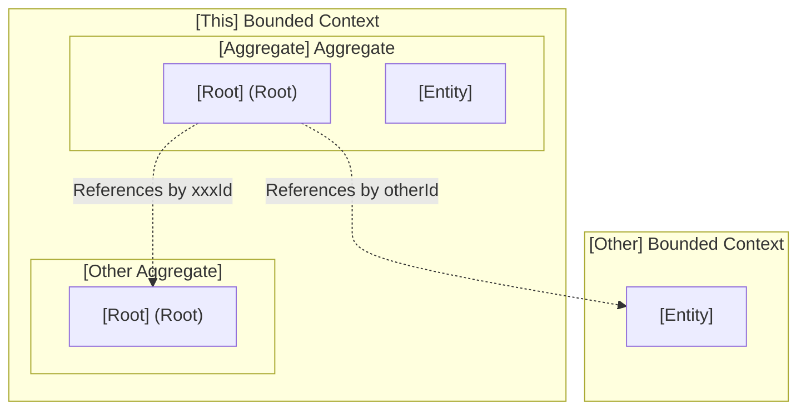
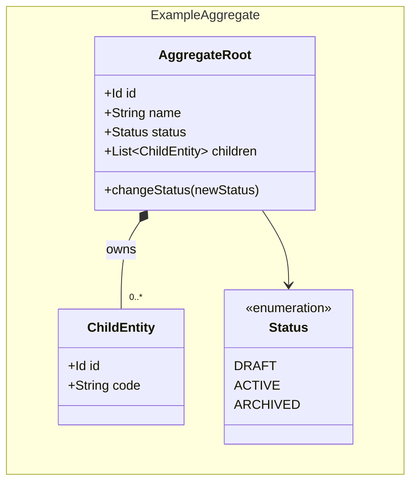
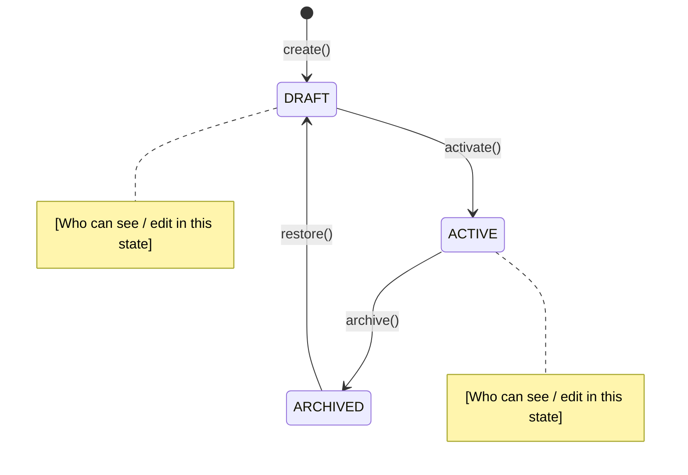
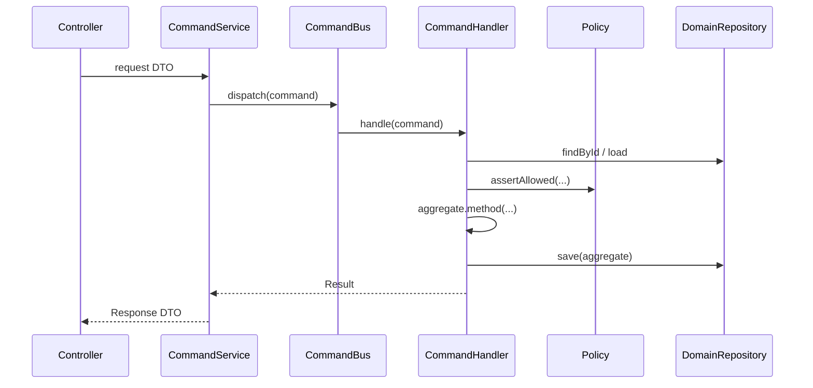

You are a senior software architect writing an Architectural Decision Record (ADR).

The ADR MUST have two parts under Visual Overview:

1. **Domain Bounded Context** — responsibility, boundary, ubiquitous language, context map, aggregate model, relationships, why each property exists, invariants/policies, and lifecycles.
2. **Application Architectural Design** — CQRS layers, command/query flow, and integration (events, named interfaces, outbox).

Do not skip Part 1. A reader must understand the business domain and DDD structure without reading code.

**Author rules:**
- State the boundary in plain language (“owns X / does not own Y”) before diagrams.
- Every attribute shown on the class diagram MUST appear in **Why Each Property Exists** with a business reason (not “needed for persistence”).
- Make relationships explicit: composition inside an aggregate vs ID reference across aggregates or bounded contexts.
- Name invariants in business language and point each to the aggregate method or domain/application policy that enforces it.
- Use Mermaid for diagrams. Replace every placeholder before merging.

Reference quality example: `docs/catalog/architecture/ADR_002-Product_bounded_context_architecture.md`

---

# [Title]

> Title only — no ADR number in the H1. Filename carries the number (`ADR_NNN-Short_Name.md`).

---

## 1. The Problem

**What's not working?**  
[Describe the current gap, pain point, or risk in 1–2 sentences.]

**What's at stake?**  
[Why this decision matters now. What fails if we do nothing?]

---

## 2. What We Decided

**The core approach:**  
[One clear sentence summarizing the overall decision.]

**Key changes:**
- [Change 1]
- [Change 2]
- [Change 3]

**What stays the same:**  
[Major systems or processes this decision does not change.]

---

## 2.1. Visual Overview

> Diagrams and tables so a newcomer can learn the domain and application design at a glance.

### Part 1 — Domain Bounded Context

#### Responsibility & Boundary

**This bounded context owns:**
- [Capability / aggregate / data this module is source of truth for]

**This bounded context does not own:**
- [Related concerns that belong elsewhere — name the other BC if known]

**Primary use cases:**
- [Use case 1]
- [Use case 2]

#### Ubiquitous Language

| Business term | Domain type / value | Meaning |
|---------------|---------------------|---------|
| [e.g. Product] | `Product` (aggregate root) | [What users/ops mean by this term] |
| [e.g. Live listing] | `ProductStatus.ACTIVE` | [Business meaning of this state] |
| [e.g. Merchant] | `merchantId` (Id ref) | [Referenced from Merchant BC; not loaded here] |

#### Context Map

> Show this BC, its aggregates, and ID-only references to other BCs. No cross-aggregate navigation across roots.

#### Aggregate Domain Model

> One class diagram (or one per aggregate if large). Show fields, key methods, enums, and ownership (`*--`).

#### Relationships

| From | To | Kind | Notes |
|------|----|------|-------|
| `[Root]` | `[Child]` | owns / contains | [Consistency boundary; mutated only via root] |
| `[Root]` | `[OtherRoot]` | references-by-id | [Same BC; no object navigation] |
| `[Root]` | `[Foreign]` | cross-BC by id | [Other module owns the data] |

#### Why Each Property Exists

> Every property on the diagram must appear here. Business reason only.

| Property | Owner type | Type | Business reason |
|----------|------------|------|-----------------|
| `name` | `[Root]` | String | [Why the business needs this field] |
| `status` | `[Root]` | Status | [What visibility/lifecycle it controls] |
| `xxxId` | `[Root]` | Id | [What foreign concept it links and why by ID only] |
| `code` | `[Child]` | String | [Why the child carries this attribute] |

#### Invariants & Policies

> Business rules that must always hold. Point to the aggregate method or policy that enforces them (R10 / R19).

| Rule (business language) | Enforced by | When |
|--------------------------|-------------|------|
| [e.g. A product always has at least one variant] | `[Root].create(...)` / auto-materialize | Create |
| [e.g. Only ACTIVE products appear on storefront] | query filter / `[Root].changeStatus` | Read / transition |
| [e.g. Actor may only mutate own merchant] | `XxxAccessPolicy` | Command |

#### Lifecycle

> One state diagram per status-bearing aggregate or entity. Annotate transitions with method names.

---

### Part 2 — Application Architectural Design

#### Components & Layers

> Follow project CQRS layout: Controller → Command/Query Service → Mapper → Bus → Handler → Repository / Policy. Handlers own transactions; no business rules in controllers/services.

| Layer | Responsibility | Example types |
|-------|----------------|---------------|
| Controller | HTTP in/out, HATEOAS | `[Entity]Controller` |
| Command / Query Service | Map DTO ↔ command/query, dispatch bus | `[Entity]CommandService` |
| Mapper | DTO ↔ Command/Query/Result | `[Action][Entity]RequestMapper` |
| Handler | Transaction, load aggregate, invoke policy/methods, persist | `[Action][Entity]CommandHandler` |
| Domain | Aggregates, VOs, domain policies | `{module}-domain` |
| Infrastructure | JPA, mappers, query repos | `{module}-infrastructure` |

#### Data / Command Flow

#### Integration

**Publishes (events / outbox):**
- `[EventName]` — when / why consumers care

**Consumes:**
- `[ForeignEvent]` — reaction (via CommandBus; no direct handler→handler)

**Named interfaces / API links:**
- Exposes: `[module]::events` / `[module]::api` — [what]
- Depends on: `[other]::events` / `[other]::api` — [what]

---

## 3. Why This Approach

**Primary reasons:**
1. [Reason 1 — tie to business need]
2. [Reason 2 — tie to consistency / decoupling]
3. [Reason 3]

---

## 4. Trade-offs

| Pros | Cons |
|------|------|
| [Benefit 1] | [Drawback 1] |
| [Benefit 2] | [Drawback 2] |
| [Benefit 3] | [Drawback 3] |

---

## 5. What Needs to Change

**New components/modules to build:**
- [New domain types, handlers, APIs, tables]

**Changes to existing systems:**
- [Migrations, deprecations, consumer updates]

---

## 6. Implementation Plan

- **Phase 1:** [Immediate first steps]
- **Phase 2:** [Next steps]
- **Phase 3:** [Rollout / cutover]

---

## 7. Related Documents

- PRD: `docs/{module}/product-requirements/PRD_NNN-….md`
- Feature specs: `docs/features/…` or `docs/{module}/features/…`
- Code: `{module}-domain/…`, `store/…/{module}/internal/…`
- Platform BRD: `docs/Commerce_Platform.md`

Do not link to non-existent paths such as `docs/BRD/`, `ADR_SKILLS.md`, or `PRD_SKILLS.md`.

**Rollback strategy:**  
[How do we revert this safely if something goes wrong?]

---

## 7. Related Documents

- [Link to PRD / BRD]
- [Link to related ADR]
- [Link to technical specifications]