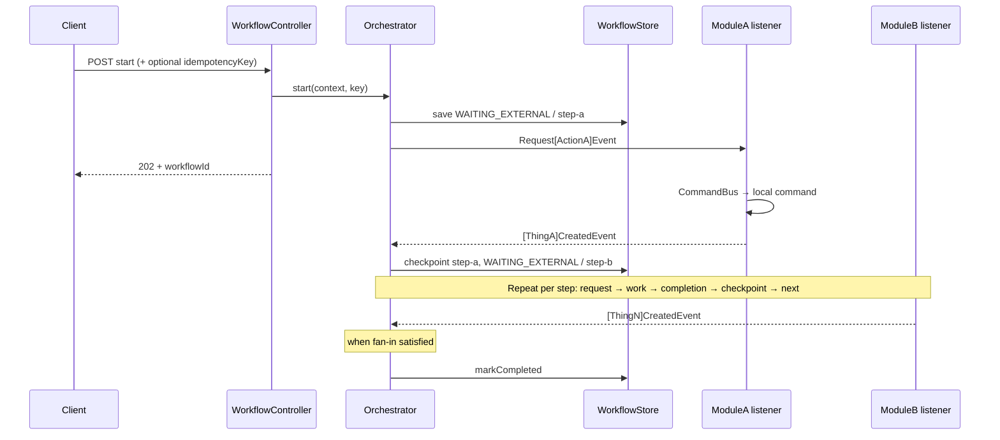
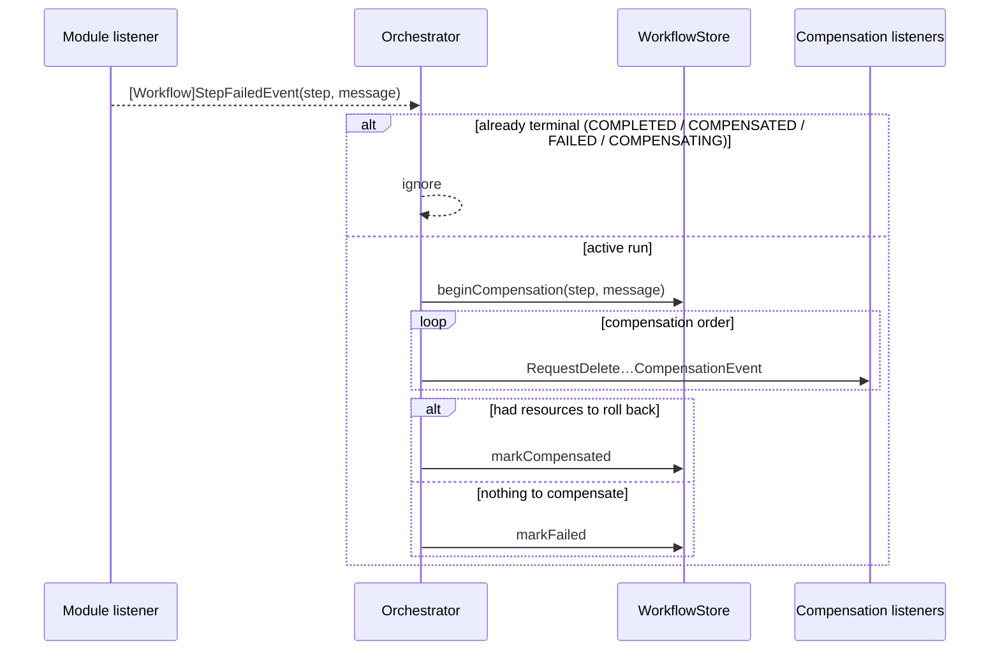

You are designing a Process Manager workflow (ADR-006 / ADR-007).

Focus this document on **ordered steps**, **request / completion / failure / compensation events**, and **sequence**. Do not expand into full domain ADRs here — link those separately.

**Author rules:**
- One workflow = one merchant/ops intent with a durable `WorkflowInstance`.
- Modules own aggregates; the orchestrator owns only sequence, checkpoints, and compensation order.
- Communicate across BCs only via `com.grab.store.workflows.events` (`workflows::events`).
- Every step must declare: enter condition, request event(s), completion event(s), advance rule, and compensation (if any).
- Replace every `[placeholder]` before merging.
- Reference quality example: `docs/workflows/architecture/ADR_001-Create_Sellable_Product_workflow.md`

---

# Workflow: [Workflow Display Name]

| Field | Value |
|-------|-------|
| Workflow name | `[kebab-case-name]` |
| Package | `store/.../workflows/internal/[packagename]/` |
| Orchestrator | `[Name]Orchestrator` |
| Pattern | Process Manager (`WAITING_EXTERNAL` + completion events) |
| Idempotent start | Yes / No (`idempotencyKey`) |
| Client API | `POST/GET /api/v1/workflows/[kebab-case-name]` |

**Intent (one sentence):**  
[What business outcome this run delivers when COMPLETED.]

**Participating BCs:**  
[Catalog] · [Pricing] · [Inventory] · …

**Related docs:**  
- ADR: `[link]`
- Feature / guideline: `[link]`

---

## 1. Step Sequence

> Ordered list only. Later steps must not start until earlier steps have checkpointed (or their fan-in rule is true).

| # | Step name (`currentStep`) | Owner BC | What the step does | Enter when | Done when | Checkpoint output |
|---|---------------------------|----------|--------------------|------------|-----------|-------------------|
| 1 | `[step-a]` | [BC] | [business action] | `start()` | [completion event / condition] | [e.g. entityId] |
| 2 | `[step-b]` | [BC] | [business action] | step 1 done | [e.g. `allX()`] | [e.g. projected set] |
| 3 | `[step-c]` | [BC] | [business action] | step 2 done | [e.g. `allY()`] | [e.g. created ids] |
| N | `[step-n]` | [BC] | [business action] | step N-1 done | all work done → `COMPLETED` | [final ids] |

**Fan-out / fan-in notes:**  
- [Which steps publish multiple request events?]
- [Which context helpers gate advancement? e.g. `allSkusProjected()`, `allPricesCreated()`]

**Statuses used:**

| Status | When |
|--------|------|
| `WAITING_EXTERNAL` | Parked on a step until completion event(s) |
| `COMPLETED` | Last step fan-in satisfied |
| `COMPENSATING` | Failure received; compensation requests publishing |
| `COMPENSATED` | Rollback requests issued (or confirmed) |
| `FAILED` | Failure with nothing meaningful to compensate |

---

## 2. Event Catalog

> All events live under `com.grab.store.workflows.events` unless noted. Include `workflowId`, `occurredAt`, `version` on every event.

### 2.1 Request events (Orchestrator → Module)

| Event | Published from step | Consumed by | Maps to local command | Key fields |
|-------|---------------------|-------------|----------------------|------------|
| `Request[Action]Event` | `[step-a]` | [Module] listener | `[CreateXCommand]` | `workflowId`, … |
| `Request[Action]Event` | `[step-b]` | [Module] listener | `[CreateYCommand]` | `workflowId`, … |

### 2.2 Completion events (Module → Orchestrator)

| Event | Produced after | Orchestrator handler | Advances / progresses |
|-------|----------------|----------------------|------------------------|
| `[Thing]CreatedEvent` | [command success] | `on[Thing]Created` | step A → step B (or fan-in progress) |
| `[Thing]ProjectedEvent` | [projection] | `on[Thing]Projected` | fan-in on step B |
| `[Thing]CreatedEvent` | [command success] | `on[Thing]Created` | step C → complete |

### 2.3 Failure event

| Event | Published by | When | Orchestrator handler |
|-------|--------------|------|----------------------|
| `[Workflow]StepFailedEvent` | Module listener or orchestrator guard | Command/validation failure | `onStepFailed` → compensate |

**Failure payload:** `workflowId`, `step`, `message`, `occurredAt`, `version`

### 2.4 Compensation events (Orchestrator → Module)

| Event | Order | Consumed by | Maps to | Condition |
|-------|-------|-------------|---------|-----------|
| `RequestDelete[Resource]CompensationEvent` | 1 | [Module] | delete/rollback command | resource id present in context |
| `RequestDelete[Resource]CompensationEvent` | 2 | [Module] | delete/rollback command | … |

**Compensation order (required):**  
1. [First undo]  
2. [Second undo]  
3. [… reverse of create order, or documented exception]

**Not compensated (document why):**  
- [e.g. inventory items — not rolled back today]

---

## 3. Sequence — Happy Path



### 3.1 Per-step detail (fill one block per step)

#### Step `[step-a]`

```
ENTER:  start() / previous step checkpointed
PUBLISH: Request[ActionA]Event (count: 1 | per item)
WAIT:    WAITING_EXTERNAL, currentStep=step-a
ON:      [ThingA]CreatedEvent
UPDATE:  context fields X, Y
GATE:    (none | allX())
THEN:    checkpoint(step-a, output) → markWaitingExternal(step-b) → publish next requests
```

#### Step `[step-b]`

```
ENTER:  …
PUBLISH: …
WAIT:    …
ON:      …
UPDATE:  …
GATE:    …
THEN:    …
```

---

## 4. Sequence — Failure & Compensation



**Guards (required):**
- Ignore completion events unless `status == WAITING_EXTERNAL` and `currentStep` matches.
- Ignore failure if already terminal or `COMPENSATING`.
- Idempotent start: same `idempotencyKey` returns existing instance.

---

## 5. Context Progress Fields

> Only fields the orchestrator mutates across steps (input vs progress). Full context shape belongs in the ADR.

| Field | Set at | Used by |
|-------|--------|---------|
| `[inputField]` | start | step requests |
| `[createdId]` | step 1 completion | later steps / compensation |
| `[progressSet]` | fan-in events | `allX()` gate |
| `[createdPairs]` | step N completion | compensation delete list |

---