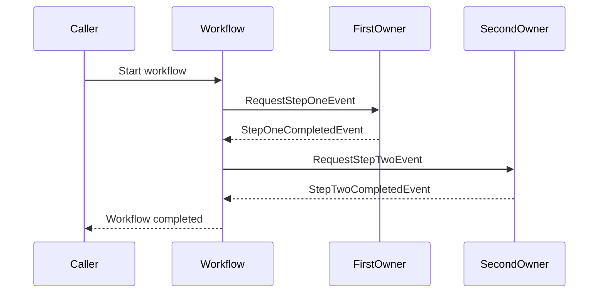
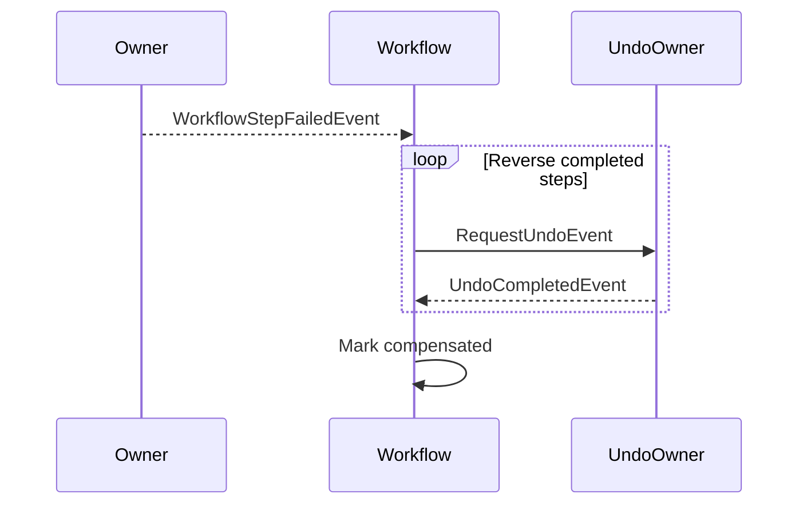

You are documenting an event-driven workflow.

Keep the document short and answer three questions:
1. What happens, step by step?
2. Which events move the workflow forward or report failure?
3. What is undone when the workflow fails?

**Author rules:**
- Describe the business flow, not framework internals.
- List steps in execution order and use the exact step and event names.
- Keep each table cell to one clear sentence.
- Explain loops, parallel work, and skipped steps only when they exist.
- List compensation in reverse execution order unless the workflow intentionally differs.
- State why a completed action is not compensated.
- Link detailed domain rules and architecture decisions instead of repeating them.
- Replace every `[placeholder]` before merging.

---

# Workflow: [Workflow Display Name]

**Purpose:** [The business outcome delivered when the workflow completes.]

**Starts when:** [API call, scheduled job, or business event.]

**Successful result:** [What exists or has changed after all steps complete.]

**Participants:** [System or module A] · [System or module B]

**Related docs:**
- [ADR or architecture document]
- [Feature or domain document]

---

## 1. Steps

> List the normal path in order. Add a note below the table only for a branch, loop, parallel work, or skipped step.

| # | Step | Owner | Action | Starts when | Complete when |
|---|------|-------|--------|-------------|---------------|
| 1 | `[step-one]` | [Owner] | [Business action] | Workflow starts | `[StepOneCompletedEvent]` is received |
| 2 | `[step-two]` | [Owner] | [Business action] | Step 1 completes | [Completion event or condition] |
| 3 | `[step-three]` | [Owner] | [Business action] | Step 2 completes | [Final condition] → workflow completes |

**Special flow:** [Remove if there are no branches, loops, parallel requests, or skipped steps.]

### Happy path

> Keep the diagram small. Use participant roles, not class names.

---

## 2. Events

### Request events

| Event | Step | Sent by | Received by | Purpose |
|-------|------|---------|-------------|---------|
| `[RequestStepOneEvent]` | `[step-one]` | Workflow | [Owner] | [Work being requested] |
| `[RequestStepTwoEvent]` | `[step-two]` | Workflow | [Owner] | [Work being requested] |

### Completion events

| Event | Step | Sent by | Meaning |
|-------|------|---------|---------|
| `[StepOneCompletedEvent]` | `[step-one]` | [Owner] | Step 1 succeeded; continue to step 2 |
| `[StepTwoCompletedEvent]` | `[step-two]` | [Owner] | [Progress made or condition satisfied] |

### Failure events

| Event | Sent by | When | Result |
|-------|---------|------|--------|
| `[WorkflowStepFailedEvent]` | [Owner] | [Command, validation, or timeout failure] | Stop normal steps and start compensation |

---

## 3. Compensation

**Starts when:** [Failure condition that requires completed work to be undone.]

> List undo actions in the order they run. Normally this is the reverse of the completed steps.

| Order | Completed action | Undo action | Request event | Acknowledgement event |
|-------|------------------|-------------|---------------|-----------------------|
| 1 | [Most recent completed action] | [Delete, cancel, or restore it] | `[RequestUndoEvent]` | `[UndoCompletedEvent]` |
| 2 | [Earlier completed action] | [Delete, cancel, or restore it] | `[RequestUndoEarlierEvent]` | `[UndoEarlierCompletedEvent]` |

**Not compensated:**
- [Action] — [Reason it is safe, impossible, or intentionally left unchanged.]

**Final result:** [State reached after all required acknowledgement events are received.]

### Failure path

