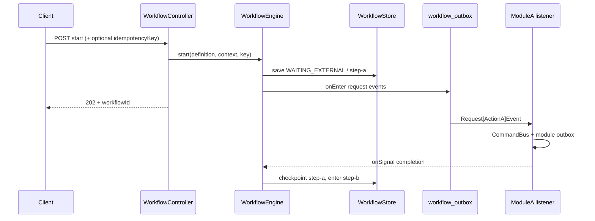
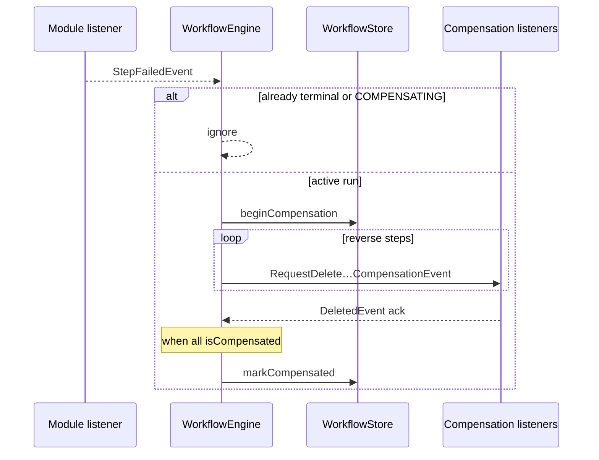

You are designing a Process Manager workflow (ADR-006 / ADR-007).

Focus this document on **ordered steps**, **request / completion / failure / compensation events**, and **sequence**. Do not expand into full domain ADRs here — link those separately.

**Author rules:**
- One workflow = one merchant/ops intent with a durable `WorkflowInstance` run by `EventDrivenWorkflowEngine`.
- Modules own aggregates; the definition owns only sequence, checkpoints, and compensation order.
- Communicate across BCs only via `com.grab.store.workflows.events` (`workflows::events`).
- Implement the graph as a `@Component` `WorkflowProcess<C>` (see `CreateSellableProductDefinition`). Do **not** write a new orchestrator class, register a `ProcessDefinition` `@Bean` by hand, or use deprecated `DefaultWorkflowRunner`.
- Every step must declare: `onEnter`, completion event(s) + `onSignal` / `isComplete`, correlations if the completion lacks `workflowId`, `compensate` + ack + `isCompensated`, `timeout`.
- Request events go through workflow outbox; completions through the module outbox.
- Replace every `[placeholder]` before merging.
- Reference quality example: `store/.../createsellableproduct/CreateSellableProductDefinition.java`

---

# Workflow: [Workflow Display Name]

| Field | Value |
|-------|-------|
| Workflow name | `[kebab-case-name]` |
| Package | `store/.../workflows/internal/[packagename]/` |
| Definition | `[Name]Definition` (`@Component` `WorkflowProcess<[Context]>`) |
| Pattern | Event-driven Process Manager (`WAITING_EXTERNAL` + `onSignal`) |
| Idempotent start | Yes / No (`idempotencyKey`) |
| Client API | `POST/GET /api/v1/workflows/[kebab-case-name]` |

**Intent (one sentence):**  
[What business outcome this run delivers when COMPLETED.]

**Participating BCs:**  
[Catalog] · [Pricing] · [Inventory] · …

**Related docs:**  
- ADR: `[link]`
- Feature / guideline: `[link]`

---

## 1. Step Sequence

> Ordered list only. Later steps must not start until earlier steps have checkpointed (or `isComplete` was already true and the step was skipped).

| # | Step name (`currentStep`) | Owner BC | What the step does | Enter when | Done when (`isComplete`) | Checkpoint output |
|---|---------------------------|----------|--------------------|------------|--------------------------|-------------------|
| 1 | `[step-a]` | [BC] | [business action] | `start()` | [completion event / condition] | [e.g. entityId] |
| 2 | `[step-b]` | [BC] | [business action] | step 1 done | [e.g. `allX()`] | [e.g. projected set] |
| N | `[step-n]` | [BC] | [business action] | step N-1 done | all work done → `COMPLETED` | [final ids] |

**Fan-out / fan-in notes:**  
- [Which steps publish multiple request events from `onEnter`?]
- [Which context helpers gate `isComplete`? e.g. `allSkusProjected()`, `allPricesCreated()`]
- [Correlation keys if a completion has no `workflowId` — e.g. `CorrelationKey.product(productId)`]

**Statuses used:**

| Status | When |
|--------|------|
| `WAITING_EXTERNAL` | Parked on a step until completion event(s) |
| `COMPLETED` | Last step `isComplete` |
| `COMPENSATING` | Failure/timeout; compensate events published; waiting for acks |
| `COMPENSATED` | All steps `isCompensated` |
| `FAILED` | Failure with nothing to compensate, or compensation timed out |

---

## 2. Event Catalog

> All events live under `com.grab.store.workflows.events` unless noted. Include `workflowId`, `occurredAt`, `version` on every event (projection completions may omit `workflowId` and route via correlation).
>
> Every event the engine consumes implements `WorkflowSignalEvent`, declaring its own `signalType()`, `signalDedupKey()`, and either `signalWorkflowId()` or `signalCorrelation()`. `WorkflowSignalInbox` listens on that interface, so no dispatcher needs editing when a workflow is added. Derive the dedup key from the work reported (an entity id), never from a timestamp.

### 2.1 Request events (Engine `onEnter` → Module)

| Event | Published from step | Consumed by | Maps to local command | Key fields |
|-------|---------------------|-------------|----------------------|------------|
| `Request[Action]Event` | `[step-a]` | [Module] listener | `[CreateXCommand]` | `workflowId`, … |

### 2.2 Completion events (Module outbox → `WorkflowSignalInbox`)

| Event | Produced after | Signal routing | Advances / progresses |
|-------|----------------|----------------|------------------------|
| `[Thing]CreatedEvent` | [command success] | `COMPLETION` by `signalWorkflowId()` | step A → step B (or fan-in) |
| `[Thing]ProjectedEvent` | [projection] | `COMPLETION` by `signalCorrelation()` | fan-in on step B |

### 2.3 Failure event

| Event | Published by | When | Engine |
|-------|--------------|------|--------|
| `[Workflow]StepFailedEvent` implements `WorkflowStepFailure` | Module listener | Command/validation failure | `onSignal(FAILURE)` → compensate |

**Failure payload:** `workflowId`, `step`, `message`, `occurredAt`, `version`

### 2.4 Compensation events (Engine `compensate` → Module) and acks

| Event | Order | Consumed by | Maps to | Ack event |
|-------|-------|-------------|---------|-----------|
| `RequestDelete[Resource]CompensationEvent` | 1 | [Module] | delete/rollback command | `[Resource]DeletedEvent` |

**Compensation order (required):** reverse of create order (engine iterates steps in reverse).

**Not compensated (document why):**  
- [e.g. inventory items — not rolled back today]

Stay in `COMPENSATING` until acks satisfy `isCompensated`. Do not mark `COMPENSATED` in the same method that publishes the first compensate event.

`compensate()` must shrink to empty as acks are folded in by `onCompensationAck` — the engine re-publishes it on resume and requires it to be empty, alongside `isCompensated`, before reaching `COMPENSATED`. A step that returns the same events forever never completes compensation; a step that declares compensation but forgets `isCompensated` cannot self-acknowledge.

---

## 3. Sequence — Happy Path



### 3.1 Per-step detail (fill one block per step)

#### Step `[step-a]`

```
ENTER:  start() / previous step checkpointed
PUBLISH: Request[ActionA]Event (count: 1 | per item)
WAIT:    WAITING_EXTERNAL, currentStep=step-a
ON:      [ThingA]CreatedEvent
UPDATE:  context fields X, Y
GATE:    isComplete (none | allX())
THEN:    checkpoint(step-a, output) → enter next step
CORRELATE: (none | CorrelationKey.…)
COMPENSATE: RequestDelete… / ack [Thing]DeletedEvent / isCompensated
TIMEOUT: default 10m
```

---

## 4. Sequence — Failure & Compensation



**Guards (required):**
- Engine ignores completion unless `WAITING_EXTERNAL` and `currentStep` matches (or correlation hits that instance).
- Ignore failure if already terminal or `COMPENSATING`.
- Idempotent start: same `idempotencyKey` returns existing instance.
- Completions are deduped via `workflow_signal_log`.

---

## 5. Context Progress Fields

> Only fields the definition mutates across steps (input vs progress). Full context shape belongs in the ADR.

| Field | Set at | Used by |
|-------|--------|---------|
| `[inputField]` | start | step requests |
| `[createdId]` | step 1 completion | later steps / compensation |
| `[progressSet]` | fan-in events | `allX()` gate |
| `[compensatedIds]` | compensation acks | `isCompensated` |
