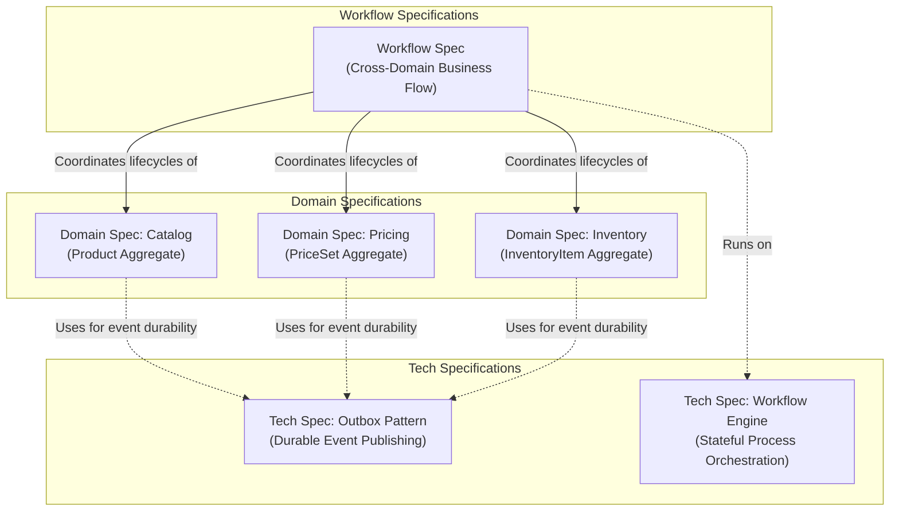

# Specification Authoring Guide

Use this skill when the user asks to create, update, or review a Domain Spec, Workflow Spec, or Tech Spec.

## Specification Architecture

Specifications are divided into three cohesive, complementary tiers:

---

## The 3 Specification Types & Templates

| Specification | Focus | Template Location | Target File Placement |
| :--- | :--- | :--- | :--- |
| **Domain Spec** | Domain Aggregate Model (boundaries, invariants, lifecycle states) | `docs/templates/domain-spec-template.md` | `docs/spec/{domain}/architecture/{aggregate}-domain-spec.md` |
| **Workflow Spec** | Cross-Domain Business Flow (steps, events, compensations) | `docs/templates/workflow-spec-template.md` | `docs/spec/workflows/{kebab-case-workflow-name}.md` |
| **Tech Spec** | Technical Platform Capability (architecture, internal engine, config) | `docs/templates/tech-spec-template.md` | `docs/spec/system/{kebab-case-tech-name}-tech-spec.md` |

---

## Golden Authoring Rules

1. **Explain with diagrams, not massive text blocks:** Keep paragraphs under 3 sentences. Replace long explanations with clear Mermaid flowcharts, sequence diagrams, and state machines.
2. **Cap diagram complexity:** Cap diagrams at ~7–9 nodes. Do not create tangled webs; split diagrams into focused views when necessary.
3. **Use role names in diagrams:** In diagrams, use logical participant and architectural roles (e.g. `Workflow Coordinator`, `Pricing Service`, `Outbox Poller`), **never** framework classes, Java types, or table schema names.
4. **Precise tables:** Use concise tables for invariants, steps, events, properties, and configuration. Keep each cell to 1 clear, unambiguous sentence.
5. **Strict boundaries:** In Domain Specs, show composition inside an aggregate root vs. ID-only references across aggregates and contexts. Never show direct cross-aggregate navigation.
6. **Normative contracts:** In Tech Specs, define non-negotiable rules using MUST / MUST NOT.

---

## Workflow Checklist

When authoring a specification:
1. Identify the specification type (Domain, Workflow, or Tech).
2. Read the corresponding template in `docs/templates/`.
3. Follow the file placement and naming convention.
4. Include all required Mermaid diagrams and tables.
5. Cross-link:
   - Workflow Specs link to the Domain Specs of all participating aggregates.
   - Domain Specs link to relevant Workflow Specs.
   - Both link to relevant Tech Specs (e.g., Outbox, Saga engine).
