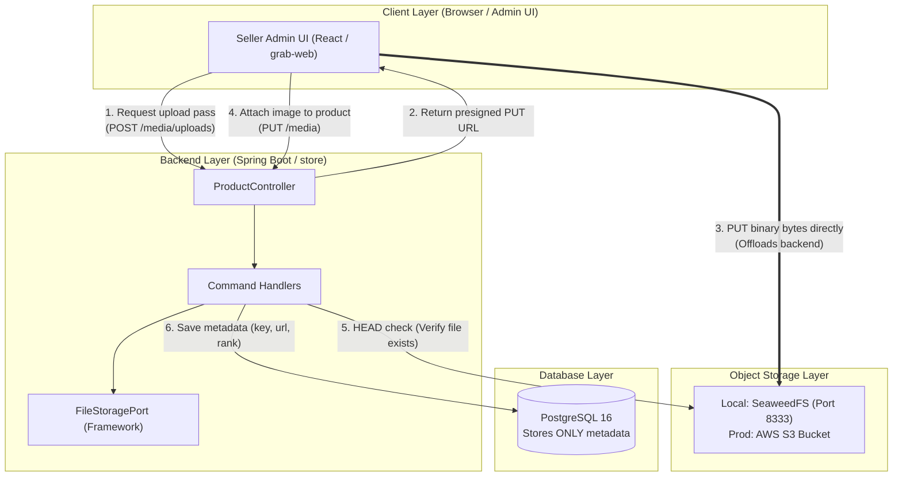
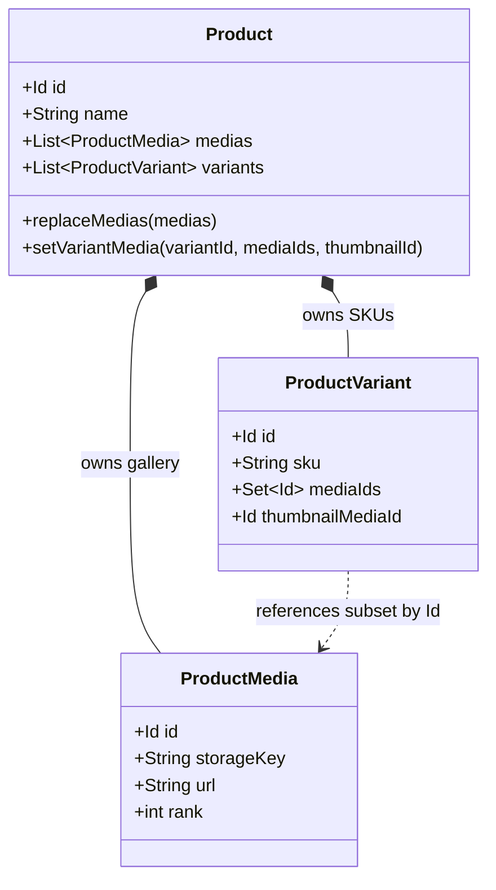

# Object Storage Implementation & Architecture Guide

A practical, easy-to-understand explanation of how file and media storage works in the Grab Commerce platform.

---

## 1. Quick Summary: Why Do We Need This?

In traditional simple web apps, when a user uploads an image:
1. The browser sends the whole image file to the Spring Boot backend.
2. The Spring Boot backend holds the file in memory and writes it to disk or directly into PostgreSQL as a `bytea` / BLOB.

### Why that breaks at scale:
- **Memory & Bandwidth Bottleneck:** Uploading 10MB–50MB product galleries through Spring Boot eats JVM RAM and ties up server threads. If 100 sellers upload files simultaneously, the server slows down or crashes with `OutOfMemoryError`.
- **Database Bloat:** Databases are meant for relational queries, indexes, and transactions — not storing gigabytes of image binaries. Backups become slow, expensive, and unwieldy.
- **Vendor Lock-in:** If you hardcode AWS S3 SDK calls inside your product domain logic, you cannot easily run locally without paying for AWS, and you cannot switch cloud providers later.

### How we solved it:
We use the **Direct-to-Storage Presigned Upload Pattern** with **Hexagonal Architecture**:
- File bytes **never touch the Spring Boot backend** and **never enter PostgreSQL**.
- The browser uploads bytes **directly** to the storage engine (SeaweedFS locally, AWS S3 in production).
- Spring Boot only coordinates permissions (signing short-lived URLs) and stores lightweight metadata (e.g. `storageKey`, `url`, `rank`) in PostgreSQL.

---

## 2. Tech Stack Overview

| Layer | Technology | Role in this Project |
| :--- | :--- | :--- |
| **Core Abstraction** | Java 21 (`framework/storage`) | Clean hexagonal interface (`FileStoragePort`) with zero external cloud dependencies. |
| **Storage Adapter** | AWS Java SDK v2 (`storage-infrastructure`) | Talks to S3-compatible APIs using path-style addressing and generates SigV4 signed URLs. |
| **Local Storage Engine** | **SeaweedFS** (`chrislusf/seaweedfs:4.45`) | Fast, lightweight S3-compatible object store running in Docker on port `8333`. |
| **Cloud Storage Engine** | **AWS S3** | Production drop-in replacement (uses the exact same code; only config changes). |
| **Database** | **PostgreSQL 16** | Stores only image links, content types, and display orders. |
| **Bucket Initializer** | **AWS CLI** (`amazon/aws-cli:2.22.35`) | One-shot Docker container that automatically creates the `grab-media` bucket at startup. |

---

## 3. Architecture at a Glance



---

## 4. How It Works Step-by-Step (The Upload Flow)

### Step 1: Seller asks for permission to upload
The frontend does **not** send the image file to Spring Boot. It only sends file metadata (name, MIME type, file size):
```http
POST /api/v1/catalog/products/prod_123/media/uploads
Content-Type: application/json

{
  "fileName": "front-view.jpg",
  "contentType": "image/jpeg",
  "fileSize": 204800
}
```

### Step 2: Backend generates a Presigned Upload URL
Spring Boot builds a unique `storageKey` enforcing tenant isolation:
```text
storageKey = merchants/{merchantId}/products/{productId}/{uuid}.jpg
```
The backend uses `FileStoragePort` to generate an AWS SigV4 signed URL that is valid for 15 minutes:
```json
{
  "url": "http://localhost:8333/grab-media/merchants/m_1/products/prod_123/a1b2c3.jpg?X-Amz-Algorithm=...",
  "method": "PUT",
  "requiredHeaders": {
    "Content-Type": "image/jpeg"
  },
  "storageKey": "merchants/m_1/products/prod_123/a1b2c3.jpg",
  "expiresAt": "2026-09-14T17:15:00Z"
}
```

### Step 3: Frontend uploads bytes directly to SeaweedFS / S3
The browser directly sends an HTTP `PUT` request with the image file bytes to the presigned URL:
```bash
curl -X PUT -H "Content-Type: image/jpeg" --data-binary @front-view.jpg "<presigned-url>"
```
> **Notice:** The file bytes flow directly from the user's browser to SeaweedFS / S3. The Spring Boot backend handles **zero bytes** of the file transfer.

### Step 4: Frontend attaches the media to the Product
Once the upload finishes successfully, the frontend notifies the backend to record the image in the product's gallery:
```http
PUT /api/v1/catalog/products/prod_123/media
Content-Type: application/json

[
  {
    "storageKey": "merchants/m_1/products/prod_123/a1b2c3.jpg",
    "rank": 0
  }
]
```

### Step 5: Backend verifies the file exists before saving
To prevent broken links or malicious fake keys, the backend sends a lightweight `HEAD` request to SeaweedFS / S3:
- If the file exists (`200 OK`) $\rightarrow$ Resolves the public URL (`http://localhost:8333/grab-media/...`) and saves the record in PostgreSQL.
- If the file does not exist (`404 Not Found`) $\rightarrow$ Rejects the request with an error.

---

## 5. Domain Business Rules: Products vs. Variants



1. **Product Owns the Gallery:** All media belongs to the `Product` aggregate root.
2. **Variants Reference a Subset:** A variant (e.g. "Red / Large") cannot upload its own separate images. It selects a **subset** of images from the parent product gallery (`variant.mediaIds` $\subseteq$ `product.medias`).
   - *Why?* One image can be reused across multiple variants without uploading the same file multiple times.
3. **Variant Thumbnail:** Each variant can designate one image as its `thumbnailMediaId` for shopping cart lines and search cards.
4. **Auto-Pruning:** If a merchant deletes an image from the product gallery, any variant referencing that image automatically has it removed (`pruneVariantMediaNotOwnedByProduct()`), preventing dangling references.

---

## 6. Codebase Structure

Where does each piece live in the repository?

```text
grab/
├── framework/                                    # Core Framework (Zero Cloud Dependencies)
│   └── src/main/java/com/grab/framework/storage/
│       ├── FileStoragePort.java                 # The main port interface (createPresignedUpload, objectExists, etc.)
│       ├── UploadRequest.java                   # Value record (storageKey, contentType, size, access)
│       ├── PresignedUpload.java                 # Value record (signed url, method, headers, expiresAt)
│       ├── StorageAccess.java                   # Enum (PUBLIC, PRIVATE)
│       └── spi/
│           ├── FileStorageProvider.java         # SPI contract for pluggable storage providers
│           └── FileStorageConfig.java           # Configuration bag (endpoint, region, bucket, keys)
│
├── storage-infrastructure/                       # Pluggable Storage Adapter Module
│   └── src/main/java/com/grab/storage/infrastructure/
│       ├── S3FileStorageAdapter.java            # Implements FileStoragePort using AWS SDK v2
│       ├── S3FileStorageProvider.java           # Implements FileStorageProvider SPI (id = "s3")
│       ├── S3StorageProperties.java             # Maps storage.s3.* configuration
│       └── StorageInfraConfig.java              # Spring @Configuration exposing @Bean FileStoragePort
│
├── store/                                       # Main Application & Catalog Domain
│   └── src/main/java/com/grab/store/catalog/internal/
│       ├── api/rest/controller/ProductController.java
│       └── command/handler/
│           ├── CreateProductMediaUploadCommandHandler.java  # Calls fileStoragePort.createPresignedUpload()
│           ├── ReplaceProductMediaCommandHandler.java      # Calls fileStoragePort.objectExists() & resolvePublicUrl()
│           └── SetVariantMediaCommandHandler.java          # Associates variant images (subset invariant)
│
├── docker-compose.yml                            # Defines seaweedfs & seaweedfs-init under "storage" profile
└── docker/
    ├── env/dev.env                               # Environment variables for dev (ports, credentials)
    └── seaweedfs/s3.json                         # S3 credentials & anonymous read permissions
```

---

## 7. How to Run & Access Storage Locally

### Start Storage Services
Run Docker Compose with the `storage` profile:
```bash
docker compose --env-file docker/env/dev.env -f docker-compose.yml --profile storage up -d
```

### Local Connection Details (from `docker/env/dev.env`)
- **S3 API Endpoint:** `http://localhost:8333`
- **Bucket Name:** `grab-media`
- **Access Key:** `s3admin`
- **Secret Key:** `s3secret`
- **Region:** `us-east-1`
- **Public URL Format:** `http://localhost:8333/grab-media/{storageKey}`

### Viewing Uploaded Files
Because anonymous read is enabled in [docker/seaweedfs/s3.json](docker/seaweedfs/s3.json), any uploaded file can be viewed directly in your web browser:
```text
http://localhost:8333/grab-media/merchants/m_1/products/prod_123/photo.jpg
```

---

## 8. Switching to Production (AWS S3)

To deploy to AWS S3 in staging or production, **zero lines of code change**. You only update your environment variables:

```bash
# In Production (e.g. AWS ECS / Kubernetes):
STORAGE_S3_ENDPOINT=""                    # Empty defaults to standard AWS S3
STORAGE_S3_REGION=ap-southeast-1          # Your AWS Region
STORAGE_S3_BUCKET=my-production-media     # Your Production S3 Bucket
STORAGE_S3_ACCESS_KEY=AKIA...             # AWS IAM Access Key
STORAGE_S3_SECRET_KEY=wJalr...            # AWS IAM Secret Key
STORAGE_S3_PUBLIC_BASE_URL=https://cdn.mycommerce.com/media # CloudFront / CDN URL
```

The Spring Boot backend will automatically talk to the real AWS S3 bucket and issue CloudFront/S3 URLs seamlessly.
