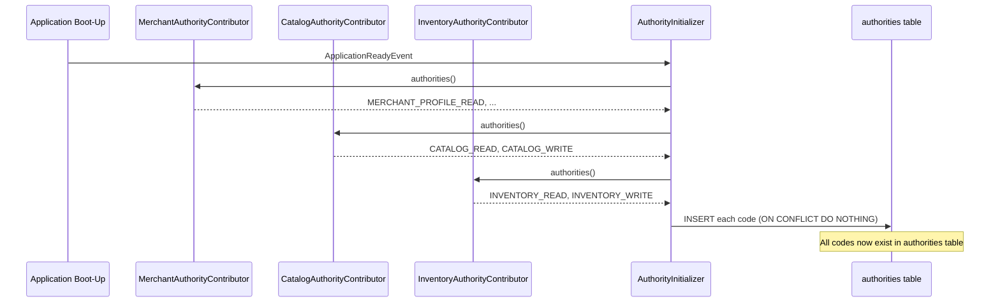
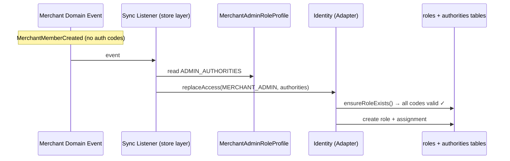

# Authority Codes: Where They Live & Who Assembles Cross-Boundary Roles

## Your Questions

1. **Where should authority codes live?** — In a seed file (SQL migration) or registered by the application at boot-up?
2. **When one module needs to create a role with cross-boundary auth codes** (like `MERCHANT_ADMIN` needing `CATALOG_READ` + `INVENTORY_WRITE`), who is responsible?
3. **How do Shopify and Amazon do it?**

---

## How Shopify Does It

### Decentralized Definition, Centralized Enforcement

```
┌─────────────────────────────────────────────────────────┐
│  Shopify Modular Monolith (single Rails codebase)        │
│                                                          │
│  ┌──────────┐  ┌──────────┐  ┌──────────┐               │
│  │ Inventory │  │  Orders  │  │ Products │  ...modules   │
│  │ Engine    │  │ Engine   │  │ Engine   │               │
│  │           │  │          │  │          │               │
│  │ Owns:     │  │ Owns:    │  │ Owns:    │               │
│  │ read_     │  │ read_    │  │ read_    │               │
│  │ inventory │  │ orders   │  │ products │               │
│  └─────┬─────┘  └─────┬────┘  └─────┬────┘               │
│        │              │             │                    │
│        ▼              ▼             ▼                    │
│  ┌──────────────────────────────────────────────┐        │
│  │         Platform "Kernel" Layer               │        │
│  │                                               │        │
│  │  • Central scope registry (all scopes known)  │        │
│  │  • OAuth token issuance & validation          │        │
│  │  • API gateway enforcement                    │        │
│  └──────────────────────────────────────────────┘        │
└─────────────────────────────────────────────────────────┘
```

**Key points:**
- Each Rails engine (module) **owns** which scopes apply to its resources
- Scopes are declared in **configuration** (`shopify.app.toml`), not in domain code
- The **platform layer** is the single enforcer — it checks tokens against the scope registry
- Staff roles (system roles + custom roles) are **data-driven** — merchants compose them in the UI by picking from the scope catalog
- When a new module ships, its scopes are added to the catalog; existing roles can adopt them without code changes

### Shopify's Answer to "Cross-Boundary"

Shopify **does not** have modules assembling cross-boundary roles in code. Instead:
- The **scope catalog is data** — every module contributes its entries
- **Role composition is a user/admin action** — merchants pick scopes when creating custom roles
- **System roles** (like "Full access") are defined by the **platform**, not by any individual module

---

## How AWS IAM Does It

### Decentralized Definition, Centralized Evaluation

```
┌──────────────────────────────────────────────────────────┐
│  AWS Service Teams                                        │
│                                                           │
│  ┌────────┐    ┌────────┐    ┌────────┐                   │
│  │   S3   │    │  EC2   │    │  RDS   │   ...services     │
│  │        │    │        │    │        │                    │
│  │ Defines│    │ Defines│    │ Defines│                    │
│  │ s3:Get │    │ ec2:   │    │ rds:   │                    │
│  │ s3:Put │    │ Start  │    │ Create │                    │
│  │ s3:Del │    │ ec2:   │    │ rds:   │                    │
│  │        │    │ Stop   │    │ Delete │                    │
│  └───┬────┘    └───┬────┘    └───┬────┘                    │
│      │             │             │                         │
│      ▼             ▼             ▼                         │
│  ┌──────────────────────────────────────────────┐          │
│  │    IAM Policy Evaluation Engine               │          │
│  │                                               │          │
│  │  • Centralized action metadata catalog        │          │
│  │  • Evaluates policies against requests        │          │
│  │  • Published in Service Authorization Ref     │          │
│  │  • Machine-readable JSON (automation)         │          │
│  └──────────────────────────────────────────────┘          │
└──────────────────────────────────────────────────────────┘
```

**Key points:**
- Each service team **defines its own actions** (`s3:PutObject`, `ec2:StartInstances`) as part of its service metadata
- Actions are **published/registered** into a centralized catalog — the IAM engine discovers them
- **Role composition is policy-driven** — administrators write JSON policies that reference actions from any service
- When a new service ships, its actions appear in the catalog; existing policies can reference them immediately
- **No service knows about another service's actions** — only IAM policies cross boundaries

### AWS's Answer to "Cross-Boundary"

AWS uses **policy documents** (data, not code) to compose cross-service permissions:
```json
{
  "Effect": "Allow",
  "Action": ["s3:GetObject", "ec2:DescribeInstances", "rds:CreateDBSnapshot"],
  "Resource": "*"
}
```
This policy references 3 different services' actions. **No service defined this policy** — the **administrator** did. The IAM engine evaluates it centrally.

---

## The Common Pattern

Both Shopify and AWS follow the same architecture:

| Concern | Who is Responsible | Where it Lives |
|---|---|---|
| **"What actions exist"** (catalog) | Each module/service declares its own | Module's application/config layer |
| **"Which actions make a role"** (composition) | Platform / administrator / composition root | Centralized platform or policy layer |
| **"Is this request allowed"** (enforcement) | Centralized authorization engine | API gateway / middleware |

> [!IMPORTANT]
> **Neither Shopify nor AWS has individual modules assembling cross-boundary roles.** The authority catalog is decentralized (each module contributes). Role composition is centralized (platform or admin does it).

---

## Seed File vs. Application Boot-Up Registration

| Approach | Seed File (SQL Migration) | Application Boot-Up Registration |
|---|---|---|
| **How** | Flyway/Liquibase SQL scripts | `PermissionProvider` interface + `ApplicationRunner` |
| **Used by** | Traditional, Rails-style apps | Modular monoliths, plugin systems |
| **Pros** | Version-controlled, auditable, runs before app code | Decoupled — each module self-registers; auto-discovery |
| **Cons** | Manual maintenance; one file knows all modules | Boot-time cost; risk of partial registration |
| **Cross-boundary?** | One migration file lists ALL authority codes | Central collector gathers from all providers |

### My Recommendation for Your System: **Application Boot-Up** (PermissionProvider)

Your current approach ([`V1__seed_authorities.sql`](file:///Users/khinemyaezin/Repository/grab-ecommerce/grab/store/src/main/resources/db/migration/identity/V1__seed_authorities.sql)) works, but it has a problem: **one SQL file knows about all modules' authority codes**. When you add a shipping module, you have to edit the identity migration file — that's cross-boundary knowledge in the wrong place.

The boot-up registration pattern solves this:

---

## Proposed Design for Your System

### Step 1: Define the Contract (in framework module)

```java
// framework/src/main/java/com/grab/framework/security/AuthorityContributor.java
package com.grab.framework.security;

import java.util.Set;

/**
 * Each module implements this to declare the authority codes it owns.
 * The composition root collects all contributors at startup and
 * ensures they exist in the authorities table.
 */
public interface AuthorityContributor {
    Set<AuthorityDefinition> authorities();

    record AuthorityDefinition(
        String code,
        String name,
        String description
    ) {}
}
```

### Step 2: Each Module Declares Its Own Authorities (application layer, NOT domain)

```java
// store/.../merchant/internal/config/MerchantAuthorityContributor.java
@Component
@MerchantEnabled
public class MerchantAuthorityContributor implements AuthorityContributor {
    @Override
    public Set<AuthorityDefinition> authorities() {
        return Set.of(
            new AuthorityDefinition("MERCHANT_GLOBAL_READ", "Merchant Global Read", "View all merchants"),
            new AuthorityDefinition("MERCHANT_LIFECYCLE_WRITE", "Merchant Lifecycle Write", "Change merchant status"),
            new AuthorityDefinition("MERCHANT_PROFILE_READ", "Merchant Profile Read", "View merchant profile"),
            new AuthorityDefinition("MERCHANT_PROFILE_WRITE", "Merchant Profile Write", "Update merchant profile"),
            new AuthorityDefinition("MERCHANT_STOREFRONT_READ", "Storefront Read", "View storefronts"),
            new AuthorityDefinition("MERCHANT_STOREFRONT_WRITE", "Storefront Write", "Manage storefronts")
        );
    }
}
```

```java
// store/.../catalog/internal/config/CatalogAuthorityContributor.java
@Component
@CatalogEnabled
public class CatalogAuthorityContributor implements AuthorityContributor {
    @Override
    public Set<AuthorityDefinition> authorities() {
        return Set.of(
            new AuthorityDefinition("CATALOG_READ", "Catalog Read", "View catalog items"),
            new AuthorityDefinition("CATALOG_WRITE", "Catalog Write", "Modify catalog items")
        );
    }
}
```

```java
// store/.../inventory/internal/config/InventoryAuthorityContributor.java
@Component
@InventoryEnabled
public class InventoryAuthorityContributor implements AuthorityContributor {
    @Override
    public Set<AuthorityDefinition> authorities() {
        return Set.of(
            new AuthorityDefinition("INVENTORY_READ", "Inventory Read", "View inventory"),
            new AuthorityDefinition("INVENTORY_WRITE", "Inventory Write", "Manage inventory")
        );
    }
}
```

### Step 3: Central Initializer Collects & Syncs at Boot-Up

```java
// store/.../identity/internal/config/AuthorityInitializer.java
@Component
@RequiredArgsConstructor
public class AuthorityInitializer {

    private final List<AuthorityContributor> contributors;  // Spring auto-injects all
    private final AuthorityRepository authorityRepository;

    @EventListener(ApplicationReadyEvent.class)
    @IdentityTransactional
    public void syncAuthorities() {
        Set<AuthorityContributor.AuthorityDefinition> allAuthorities = contributors.stream()
                .flatMap(c -> c.authorities().stream())
                .collect(Collectors.toSet());

        for (var def : allAuthorities) {
            if (!authorityRepository.existsByCode(def.code())) {
                // insert new authority
                authorityRepository.save(toEntity(def));
            }
        }
    }
}
```

### Step 4: Role Profile Assembly (Composition Root Only)

The question "who assembles cross-boundary roles?" — the answer is the **composition root** (store module). This is exactly like how an AWS administrator writes a policy referencing multiple services, or a Shopify merchant picks scopes for a custom role.

```java
// store/.../merchant/internal/policy/MerchantAdminRoleProfile.java
package com.grab.store.merchant.internal.policy;

/**
 * This is the composition root's job — it knows about all modules
 * because it's the deployment unit that wires them together.
 * 
 * Equivalent to:
 * - An AWS IAM policy referencing s3 + ec2 + rds actions
 * - A Shopify system role with scopes from multiple engines
 */
public final class MerchantAdminRoleProfile {
    public static final String ROLE_CODE = "MERCHANT_ADMIN";
    public static final String SCOPE_KEY = "merchant.account";

    public static final Set<String> ADMIN_AUTHORITIES = Set.of(
        // From MerchantAuthorityContributor
        "MERCHANT_PROFILE_READ",
        "MERCHANT_PROFILE_WRITE",
        "MERCHANT_STOREFRONT_READ",
        "MERCHANT_STOREFRONT_WRITE",
        // From IdentityAuthorityContributor
        "ACCESS_ASSIGNMENT_READ",
        "ACCESS_ASSIGNMENT_WRITE",
        "ACCESS_INVITATION_WRITE",
        "ROLE_READ",
        "ROLE_WRITE",
        // From CatalogAuthorityContributor
        "CATALOG_READ",
        "CATALOG_WRITE",
        // From InventoryAuthorityContributor
        "INVENTORY_READ",
        "INVENTORY_WRITE",
        // From SalesChannelAuthorityContributor
        "SALES_CHANNEL_READ",
        "SALES_CHANNEL_WRITE"
    );

    private MerchantAdminRoleProfile() {}
}
```

---

## Answering Your Specific Use Case

> *"If one module needs to insert cross-boundary auth codes in one go — who does it?"*

**Nobody "inserts" cross-boundary codes.** Here's the flow:





**Responsibilities:**

| Responsibility | Who | Why |
|---|---|---|
| **"What codes exist"** | Each module's `AuthorityContributor` | Module owns its own codes |
| **"Get them into the DB"** | `AuthorityInitializer` (runs at boot) | Central, idempotent, automatic |
| **"Which codes make MERCHANT_ADMIN"** | `MerchantAdminRoleProfile` in store layer | Composition root crosses boundaries |
| **"Store the role + validate codes"** | Identity module (adapter) | It's the adapter's job |

---

## What Happens to Your Seed File?

You can either:

**Option A** — Remove `V1__seed_authorities.sql` entirely, let `AuthorityInitializer` handle it at boot. Simpler, fully decentralized.

**Option B** — Keep the seed file as a safety net for fresh databases, but let `AuthorityInitializer` be the source of truth for new modules. The `ON CONFLICT DO NOTHING` in the SQL makes them compatible.

> [!TIP]
> **Option A is what Shopify and AWS do conceptually** — the platform/boot process is the source of truth, not a static file. But Option B is pragmatic for your current setup if you don't want a big-bang migration.
