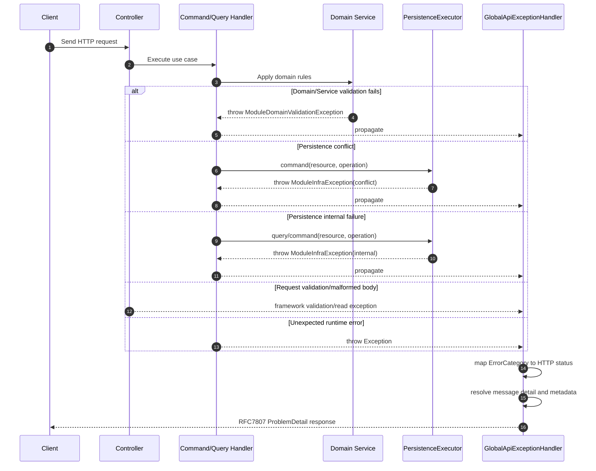

# Exception Handling Framework

```mermaid
sequenceDiagram
    autonumber
    participant Client
    participant API as Controller
    participant App as Command/Query Handler
    participant Domain as Domain Service
    participant Infra as PersistenceExecutor
    participant Advice as GlobalApiExceptionHandler

    Client->>API: Send HTTP request
    API->>App: Execute use case
    App->>Domain: Apply domain rules

    alt Domain/Service validation fails
        Domain-->>App: throw ModuleDomainValidationException
        App-->>Advice: propagate
    else Persistence conflict
        App->>Infra: command(resource, operation)
        Infra-->>App: throw ModuleInfraException(conflict)
        App-->>Advice: propagate
    else Persistence internal failure
        App->>Infra: query/command(resource, operation)
        Infra-->>App: throw ModuleInfraException(internal)
        App-->>Advice: propagate
    else Request validation/malformed body
        API-->>Advice: framework validation/read exception
    else Unexpected runtime error
        App-->>Advice: throw Exception
    end

    Advice->>Advice: map ErrorCategory to HTTP status
    Advice->>Advice: resolve message detail and metadata
    Advice-->>Client: RFC7807 ProblemDetail response
```
