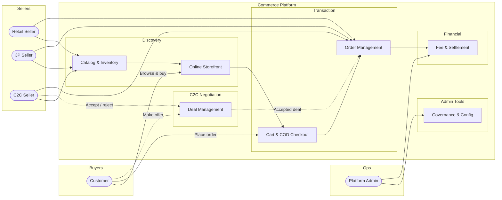

# Business Requirements Document: Commerce Platform

## 1. Executive Summary

This document defines the business requirements for a unified ecommerce
platform that enables sellers to sell products online and enables customers to
purchase through web and mobile channels.

The platform is intended to be built and maintained as an open-source
commerce application so that retailers, marketplace operators, developers, and
implementation partners can adopt, extend, and operate it flexibly.

The platform will support multiple commerce models in one ecosystem:

- retailer-led online commerce
- consumer-to-consumer (C2C) selling
- third-party seller (3P) marketplace selling

For C2C transactions, the platform will support a simple offer flow where a
customer can propose a different price and the seller can accept that offer to
form a deal.

The platform business model includes charging platform fees on transactions,
similar to major marketplaces such as Amazon. The platform may also support
additional monetization later through value-added seller services.

### Platform Overview Diagram

---

## 2. Purpose

The purpose of this initiative is to create an open-source ecommerce platform
that can be used by businesses and communities to launch and operate modern
commerce experiences across online marketplace channels.

The platform should provide a reusable foundation for:

- online product selling and customer purchasing
- marketplace operations with platform-fee monetization
- consumer-to-consumer (C2C) selling
- third-party seller (3P) marketplace operations
- extension and customization by contributors and implementation teams

---

## 3. Business Problem

Retailers and individual sellers need a single platform to:

- list and manage products
- sell online to consumers
- manage orders and payments
- expand from direct selling into marketplace selling

Customers need a trusted way to:

- discover products from multiple sellers
- compare offers
- propose a lower price for eligible C2C listings
- purchase online
- receive reliable order confirmation and support

The business needs a platform that can serve both retailer-led commerce and
marketplace operations without building separate systems for each sales model.

---

## 4. Vision

Build a flexible commerce platform that allows businesses and individuals to
sell through digital storefronts, while the platform operator earns revenue
through marketplace fees, transaction commissions, and future seller services.

---

## 5. Business Goals

- Enable retailers to sell products online from one platform.
- Enable customers to purchase from multiple sellers in a trusted marketplace.
- Support multiple seller models: retailer, C2C seller, and 3P seller.
- Create a scalable platform-fee revenue model on every eligible order.

---

## 6. Key Requirements for an Ecommerce Platform

The platform must satisfy the following key business requirements expected of
an ecommerce platform:

- support customer registration and simple seller profiles
- support product catalog management including categories, variants, media,
  pricing, and availability
- support search, browse, merchandising, and product discovery
- support shopping cart, checkout, Cash on Delivery selection, and order
  confirmation
- support order lifecycle management including order, confirmation,
  cancellation, and paid status
- support inventory management across sellers and warehouses
- support marketplace commission and seller settlement
- support multiple seller models including retailer, 3P, and C2C
- support C2C-only buyer offer, seller acceptance, and deal management
  workflows
- support admin governance, moderation, reporting, and policy enforcement
- support extension points suitable for an open-source product ecosystem

---

## 7. Business Model

### Primary revenue streams

- Platform commission fee per order line or order

### Platform fee model

The platform must support charging a configurable fee similar to a marketplace
commission model.

The fee model must support:

- percentage-based fee
- fixed fee
- hybrid fee combining percentage and fixed amount

### Settlement model

The platform must support recording Cash on Delivery orders, calculating the
platform fee, and settling the remaining balance to the seller based on
configured rules once an order is marked paid.

For C2C transactions where a seller accepts a buyer offer, settlement and fee
calculation must use the accepted deal price.

---

## 8. Stakeholders

- Platform owner or operator

---

## 9. User Types

### Platform Admin

Responsible for platform governance, fee configuration, catalog policy, fraud
monitoring, dispute handling, reporting, and operations.

### Retail Seller

A business selling its own inventory through online storefronts.

### Third-Party Seller (3P)

A professional merchant that sells on the marketplace under platform rules,
with its own catalog, inventory, pricing, order handling settings, and payout
profile.

### Consumer Seller (C2C)

An individual seller who can list approved products or personal items under a
simplified selling flow and stricter trust-and-safety controls.

### Customer

A buyer who browses products, adds items to cart, selects Cash on Delivery,
places orders, tracks order and payment status, and may propose an offer on
eligible C2C listings.

---

## 10. Scope

### In scope

- Multi-seller ecommerce marketplace
- Customer accounts and simple seller profiles
- Product listing and catalog management
- Inventory management by seller and by location
- Online storefront and Cash on Delivery checkout
- Order management workflows
- Cash on Delivery order capture, fee calculation, and settlement records
- Support for C2C sellers
- C2C buyer offer, seller acceptance, and deal management workflow
- Support for third-party marketplace sellers
- Customer accounts, order history, and notifications
- Admin controls, reporting, and seller governance

### Out of scope

- Point of Sale (POS)
- Card, wallet, bank, or other non-COD payment methods
- Promotions, vouchers, and campaign management
- Delivery management
- Shipment creation, shipment tracking, and shipping integrations

---

## 11. Core Business Capabilities

### 11.1 Seller Profiles and Roles

The platform must support seller profile types and role definitions without
requiring a full seller registration workflow in the initial scope.

Requirements:

- Support retailer, 3P seller, and C2C seller profile types
- Support seller profile
- Support seller roles and permissions
- Support seller active or suspended status

### 11.2 Product and Catalog Management

The platform must allow sellers to create and manage products they are allowed
to sell.

Requirements:

- Support product creation, update, activation, archive, and removal
- Support variants, categories, images, descriptions, pricing, and stock
- Support listing price as the seller asking price
- Support seller-owned listings and platform-owned catalog governance
- Support catalog moderation and approval where required
- Support category-based listing rules and prohibited products

Check the [Catalog Module PRD](catalog/product-requirements/catalog-module-prd.md) for catalog requirements.

### 11.3 Inventory and Availability

The platform must support inventory visibility for online sales.

Requirements:

- Support stock by seller
- Support stock by warehouse or seller-managed location
- Support stock reservation for checkout and order confirmation
- Support oversell prevention rules

### 11.4 Online Marketplace Experience

The platform must enable customers to discover and buy products online.

Requirements:

- Support browsing, search, filtering, and product detail pages
- Support cart and Cash on Delivery checkout
- Support customer offer submission on eligible C2C listings

### 11.5 Marketplace Fee and Settlement

The platform must monetize transactions through a configurable platform fee
engine.

Requirements:

- Calculate platform fee per order, line item, or seller settlement
- Support fee rules by seller type, category, channel
- Show fee breakdown to admin and seller where appropriate
- Use the accepted deal price for fee calculation on C2C negotiated orders
- Support settlement records after fee deduction for orders marked paid

### 11.6 Order Management

The platform must manage the lifecycle from order placement to paid status.

Requirements:

- Support order placement, confirmation, cancellation, and paid status
- Support Cash on Delivery as the only payment method
- Support order creation from an accepted C2C deal price
- Support split orders by seller
- Support customer notifications and status tracking
- Support seller order handling workflows
- Support exception handling for failed order placement, out-of-stock,
  cancellation, and payment status recording

### 11.7 C2C Marketplace Support

The platform must support individuals selling to other consumers.

Requirements:

- Support individual seller profiles under a simplified marketplace model
- Support listing review or moderation for C2C items
- Support item condition metadata such as new, used, refurbished
- Support buyer offer submission against the seller asking price
- Support seller accept or reject decision for each buyer offer
- Support conversion of an accepted offer into a deal price for ordering
- Support trust and safety controls for fraud, abuse, and prohibited listings
- Support dispute and complaint handling for buyer and seller protection
- Support optional listing caps or transaction caps by seller tier

### 11.8 Deal Management

The platform must manage accepted C2C offers as explicit deals that can be
tracked and used for ordering.

Requirements:

- Support deal creation when a seller accepts a buyer offer
- Support deal linkage to listing, buyer, seller, and agreed price
- Support deal status such as accepted, expired, cancelled, and converted
- Support order creation only from a valid active deal when negotiation was
  used
- Support deal audit history for later reporting and dispute review

### 11.9 Third-Party Seller (3P) Support

The platform must support professional merchants operating on the marketplace.

Requirements:

- Support merchant storefront or branded seller profile
- Support seller-managed pricing and stock settings
- Support merchant reporting and settlement reports
- Support service-level policy enforcement
- Support operational tools for catalog upload, bulk updates, and order
  management

### 11.10 Customer Trust and Support

The platform must create confidence for buyers and sellers.

Requirements:

- Support order history and payment history
- Support customer service case tracking
- Support ratings or review capability in later phases
- Support fraud monitoring and suspicious behavior flagging

### 11.11 Admin and Platform Operations

The platform operator must be able to govern and optimize the marketplace.

Requirements:

- Manage sellers, categories, listings, and policies
- Configure commissions and platform rules
- Review seller performance and customer issues
- Manage risk, trust, and compliance workflows
- View operational dashboards and financial reporting

---

## 12. Business Rules

- Every product listing must belong to a valid seller profile.
- Every order must capture seller ownership for each item sold.
- Platform fees must be calculated before settlement is finalized.
- Fee rules must be configurable without code changes.
- Cash on Delivery is the only supported payment method in the initial scope.
- Shipment and delivery workflows are outside the system scope.
- Orders are tracked through order and payment status only in the initial
  scope.
- Price proposal is supported for C2C listings only.
- Retailer and 3P listings use the listed selling price without buyer price
  negotiation in the initial scope.
- A C2C deal price becomes valid only when the seller accepts the buyer offer.
- A negotiated C2C purchase must reference a valid active deal.
- A deal may expire or be cancelled before it is converted into an order.
- Platform fee and settlement for a C2C negotiated order must use the accepted
  deal price.
- C2C sellers may be subject to stricter listing, payout, or transaction
  controls than retailer or 3P sellers.
- The platform must be able to suspend a seller while preserving order and
  financial history.

---

## 13. Functional Business Requirements

### FR-1 Seller profiles
- The system must support retailer, 3P, and C2C seller profile types.

### FR-2 Product listing
- The system must allow valid seller profiles to create and manage listings within
  policy.

### FR-3 Inventory management
- The system must manage stock per seller and per physical or logical
  location.

### FR-4 Customer shopping
- The system must allow customers to browse, search, add to cart, and
  complete checkout online using Cash on Delivery.

### FR-5 Fee engine
- The system must calculate platform fees and support configurable commission
  structures.

### FR-6 Order lifecycle
- The system must manage order creation, confirmation, cancellation, and paid
  status.

### FR-7 Seller settlement
- The system must support settlement calculation and payout reporting for paid
  COD orders.

### FR-8 C2C negotiation
- The system must allow a customer to propose a different price for a C2C
  listing and allow the seller to accept or reject the offer.

### FR-9 Deal management
- The system must create and manage a deal record when a C2C offer is
  accepted, and only valid deals may be converted into orders.

### FR-10 Admin control
- The system must provide operational controls, reporting, and governance
  tools for platform teams.

---

## 14. Non-Functional Business Requirements

- The platform must support growth in sellers, orders, products, and store
  locations.
- The platform must provide reliable transaction processing for checkout and
  COD order creation.
- The platform must protect sensitive customer, seller, payment, and payout
  data.
- The platform must provide auditability for fees, orders, paid status, and
  payouts.
- The platform must support configurable policies by country, category,
  seller type, and channel.
- The platform must provide sufficient availability for customer purchase and
  seller/admin operations.

---

## 15. Reporting and Analytics

The business requires reporting for:

- Gross Merchandise Value (GMV)
- Net revenue from platform fees
- Orders by seller type
- Orders by payment status
- Active sellers and new seller acquisition
- Conversion rate and cart abandonment
- Cancellation rate
- C2C offer acceptance rate
- Deal-to-order conversion rate
- Seller payout and settlement accuracy

---

## 17. Risks and Dependencies

### Risks

- Complex settlement and fee logic may delay launch if not designed clearly.
- Cash on Delivery payment confirmation may be delayed if paid status is
  updated outside the platform.
- Regulatory and tax obligations may vary by seller type and country.

### Dependencies

- Payout provider if automated settlement is required
- Identity verification or KYC capability
- Tax and invoicing capability
- Customer notification service
- Fraud and risk tooling

---

## 18. Delivery Phases

### Phase 1: Marketplace Foundation

- Seller profile model
- Product catalog
- Online storefront
- Cart and Cash on Delivery checkout
- Order and paid-status management
- Platform fee calculation
- Basic admin tools

### Phase 2: Expanded Marketplace

- Full 3P seller operations
- C2C seller workflows
- C2C offer and deal management
