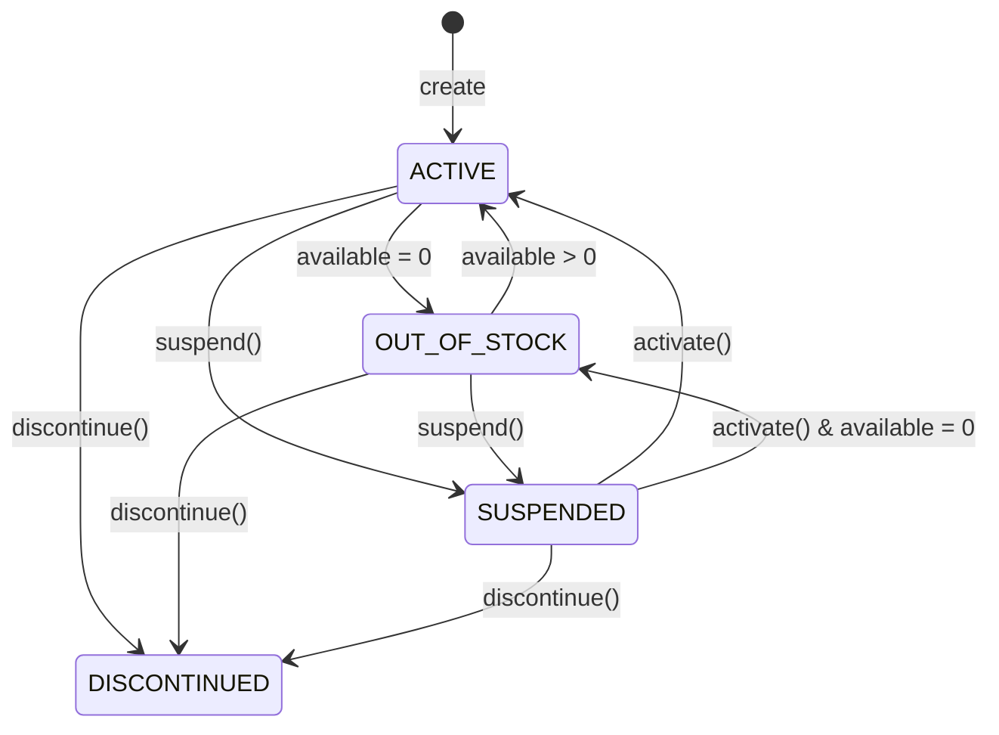

# ADR-010: Inventory Domain Design

## Status
Accepted

## Context

The e-commerce platform requires a robust inventory management system that can:
- Track product stock levels across multiple physical locations (warehouses, stores, distribution centers)
- Maintain a complete audit trail of all stock movements
- Support concurrent inventory operations without data inconsistencies
- Enable real-time stock availability queries
- Provide historical inventory analysis capabilities
- Associate inventory with sellers for multi-tenant ownership

The system must handle high-volume operations while maintaining data integrity and accuracy.

## Decision

We will implement a Domain-Driven Design (DDD) approach for the inventory domain with the following key architectural decisions:

### 1. Aggregate Design

**InventoryItem as Aggregate Root** 
- Enforces business rules through aggregate boundaries including seller ownership validation
- Domain events are published via `addEvent()` for cross-aggregate eventual consistency

```java
InventoryItem (Aggregate Root)
├── id: Id
├── sku: String
├── sellerId: Id
├── productVariantId: Id
├── locationId: Id
├── quantity: InventoryQuantity (Value Object)
├── reorderConfig: ReorderConfig (Value Object)
├── status: InventoryStatus
└── lastUpdated: LocalDateTime

StockMovement (Entity)
├── id: Id
├── inventoryItemId: Id
├── type: StockMovementType
├── quantity: int
├── quantityBefore: int
├── quantityAfter: int
├── onHandBefore: int
├── onHandAfter: int
├── reservedBefore: int
├── reservedAfter: int
├── referenceId: String
├── createdAt: LocalDateTime
└── createdBy: Id
```

**Rationale**:
- Ensures transactional consistency for inventory changes
- Aggregate boundary aligns with business invariants (InventoryQuantity holds all state)
- StockMovement tracks both overall quantity and dimension-specific before/after for full audit
- Movements are append-only audit records; corrections require compensating movements
- sellerId enables seller-scoped queries and ownership rules
- lastUpdated supports optimistic concurrency at the infrastructure layer

### 2. Stock Movement Lifecycle 

**Immutable Movement Records (Independently Persisted)**
- Stock movements are created once and never modified
- Each movement records: type, quantity, before/after for both onHand and reserved, referenceId, and inventoryItemId
- Mutations on `InventoryItem` return a `StockMovement` which is saved via `StockMovementRepository`
- Two `create()` overloads: simple (quantityBefore/After only) and detailed (onHandBefore/After, reservedBefore/After)
- Helper classification methods: `isInbound()`, `isOutbound()`, `isAdjustment()`, `isReservation()`
- Corrections require compensating movements

**Movement Types** 
- **Inbound**: PURCHASE_ORDER_RECEIPT, CUSTOMER_RETURN, TRANSFER_IN, INITIAL_STOCK
- **Outbound**: SALE, TRANSFER_OUT, RETURN_TO_VENDOR, WRITE_OFF
- **Adjustments**: CYCLE_COUNT_ADJUSTMENT, DAMAGE_ADJUSTMENT, SHRINKAGE
- **Reservations**: RESERVATION, RESERVATION_RELEASE

**Rationale**:
- Provides immutable audit trail with dimension-level tracking
- Supports compliance requirements
- Enables historical analysis and reconciliation
- Detailed before/after values allow exact state reconstruction

### 3. Quantity Management 

**InventoryQuantity Value Object (Record)**
```java
InventoryQuantity {
    - onHand: int (physical stock present)
    - reserved: int (allocated to orders)
    - inTransit: int (incoming not yet received)
    - damaged: int (unusable/sellable)
    
    Factory Methods:
    - zero(): InventoryQuantity
    - withOnHand(onHand): InventoryQuantity
    
    Query Methods:
    - available(): int        = max(0, onHand - reserved - damaged)
    - total(): int            = onHand + inTransit
    - sellable(): int         = max(0, onHand - damaged)
    
    Mutation Methods (return new instance):
    - addOnHand(qty)
    - subtractOnHand(qty)
    - reserve(qty)
    - releaseReservation(qty)
    - addInTransit(qty)
    - receiveInTransit(qty)
    - markDamaged(qty)
    - shipReserved(qty)
    
    Invariants Enforced:
    - All dimensions must be >= 0
    - Cannot subtract more than onHand
    - Cannot reserve more than available
    - Cannot release more than reserved
    - Cannot mark more damaged than undamaged stock
    - Cannot ship more than reserved
    - Cannot receive more than in transit
}
```

**Rationale**:
- Immutable record ensures thread safety for concurrent operations
- Separates physical stock from available stock across four dimensions (on-hand, reserved, in-transit, damaged)
- Available = onHand - reserved - damaged; never goes negative due to clamp
- Sellable = onHand - damaged (usable for internal operations)
- Prevents overselling through validate-and-copy pattern
- Self-validating compact constructor

### 4. Inventory Status Lifecycle



**Statuses** 
- **ACTIVE**: Inventory item is operational and stock is sellable
- **OUT_OF_STOCK**: Auto-transitioned when available quantity reaches zero; reverts to ACTIVE on replenishment
- **SUSPENDED**: Manual — temporarily halts selling without deleting the record
- **DISCONTINUED**: Manual — permanently retired; no further stock operations allowed

**Status Guards**:
- `validateNotBlocked()` blocks all stock operations (receive, reserve, release, ship, adjust, markDamaged, writeOff, transferOut, returnToVendor) on SUSPENDED or DISCONTINUED items
- Status transitions for ACTIVE/OUT_OF_STOCK fire automatically via `updateStatusBasedOnQuantity()` after any quantity-changing mutation
- Manual transitions: `suspend()`, `discontinue()`, `activate()` are called explicitly
- `discontinue()` emits `InventoryItemDiscontinuedEvent`

### 5. Multi-Location Support 

**Location as First-Class Concept**:
- Each inventory item is tied to a specific location via `locationId`
- Location ID is stored in both inventory and stock movements
- Transfers are represented as paired TRANSFER_OUT/TRANSFER_IN movements
- Independent stock levels per location
- Zone and Bin are independent aggregate roots with ID-only references (see ADR-006)

**Rationale**:
- Supports multi-warehouse operations
- Enables location-based fulfillment
- Clear tracking of inter-location transfers
- Scalable to many locations

### 6. Reorder Service 

**ReorderConfig Value Object (Record)**
```java
ReorderConfig {
    - safetyStock: int          // minimum buffer stock
    - reorderPoint: int         // threshold triggering reorder
    - reorderQuantity: int      // recommended order qty
    - maxStock: Integer         // upper limit (nullable)
    
    Validation:
    - All values must be >= 0
    - reorderPoint >= safetyStock
    
    Methods:
    - isLowStock(available): boolean     // available <= safetyStock
    - needsReorder(available): boolean   // available <= reorderPoint
    - wouldExceedMaxStock(current, incoming): boolean
    - suggestedOrderQuantity(currentAvailable): int
}
```

**Behavior** 
- `checkAndRaiseLowStockAlert()` fires a `LowStockAlertEvent` when available quantity drops below the reorder point on active items
- Called after: receiveStock, releaseReservation, shipStock, adjustStock, markDamaged, writeOff, transferOut, returnToVendor, and during create()
- Low-stock alert only fires when item is active
- Reorder recommendations available via `getSuggestedReorderQuantity()`

### 7. Event-Driven Design 

**Domain Events Published by InventoryItem**:

| Event | Trigger |
|---|---|
| StockReceivedEvent | receiveStock() or create() with initial qty > 0 |
| StockReservedEvent | reserveStock() |
| StockShippedEvent | shipStock() |
| StockAdjustedEvent | adjustStock() and markDamaged() |
| InventoryItemDiscontinuedEvent | discontinue() |
| LowStockAlertEvent | checkAndRaiseLowStockAlert() |

Events are captured via `addEvent()` and consumed from `pullEvents()` by the infrastructure layer for outbox persistence and downstream integration.

### 8. Aggregate Behavior Summary

**Stock Operations (all return StockMovement, check validateNotBlocked first):** 

| Method | Movement Type | Quantity Effect | Events |
|---|---|---|---|
| receiveStock | PURCHASE_ORDER_RECEIPT / CUSTOMER_RETURN / TRANSFER_IN / INITIAL_STOCK | onHand + qty | StockReceivedEvent |
| reserveStock | RESERVATION | reserved + qty | StockReservedEvent |
| releaseReservation | RESERVATION_RELEASE | reserved - qty | — |
| shipStock | SALE | onHand - qty, reserved - qty | StockShippedEvent |
| adjustStock | CYCLE_COUNT_ADJUSTMENT | onHand = newQty | StockAdjustedEvent |
| markDamaged | DAMAGE_ADJUSTMENT | damaged + qty | StockAdjustedEvent |
| writeOff | WRITE_OFF | onHand - qty | — |
| transferOut | TRANSFER_OUT | onHand - qty | — |
| returnToVendor | RETURN_TO_VENDOR | onHand - qty | — |

**Status Methods:**

| Method | Effect | Event |
|---|---|---|
| suspend() | status = SUSPENDED | — |
| discontinue() | status = DISCONTINUED | InventoryItemDiscontinuedEvent |
| activate() | status = ACTIVE (or OUT_OF_STOCK if qty = 0) | — |

**Query Methods:** getAvailableQuantity(), isLowStock(), needsReorder(), isOutOfStock(), isActive(), canFulfill(qty), getSuggestedReorderQuantity()

**Private Validation Methods:**
- `validateReceiveType(type)` — ensures only inbound types are used with receiveStock
- `validateNotBlocked()` — blocks operations on SUSPENDED/DISCONTINUED items
- `validatePositiveQuantity(qty)` — prevents negative quantities
- `checkAndRaiseLowStockAlert()` — fires LowStockAlertEvent when applicable
- `updateStatusBasedOnQuantity()` — auto-transitions ACTIVE/OUT_OF_STOCK

## Consequences

### Positive
 **Data Integrity**
- Aggregate boundaries enforce business rules
- Unique constraint prevents duplicate records
- Status guards prevent operations on blocked items

 **Auditability**
- Complete movement history with dimension-level before/after values
- Immutable records with classification helpers (inbound, outbound, etc.)
- Domain events for downstream traceability

**Scalability**
- Independent inventory per location
- Zone/Bin as separate aggregates — no lock contention with InventoryItem
- Domain events enable eventual consistency patterns

 **Testability**
- Domain logic isolated from infrastructure
- Immutable value objects are inherently thread-safe
- Clear aggregate boundaries simplify mocking

 **Seller Ownership**
- sellerId enables multi-tenant isolation
- Seller-scoped queries and reporting

### Negative

 **Complexity**
- Event-driven patterns add indirection

 **Storage**
- Movement history grows over time (mitigated: movements are decoupled from the aggregate)
- May need archival strategy

## Alternatives Considered

### Alternative 1: CQRS with Separate Read/Write Models
**Deferred**: Current design sufficient for expected load. Revisit if query performance becomes issue.

### Alternative 2: Zone/Bin as Children of Location
**Rejected**: Zone and Bin are independent aggregates to avoid lock contention and enable independent scaling (see ADR-006).

## References

- Domain-Driven Design by Eric Evans
- ADR-006: Location, Zone, and Bin Aggregate Promotion
- `docs/PRD/inventory-module-prd.md` — Product Requirements Document defining inventory module scope