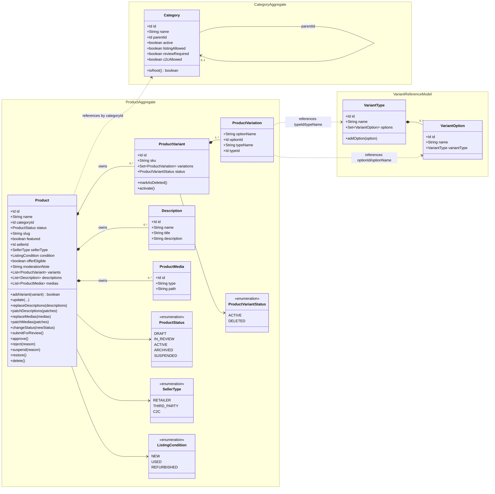

# Catalog Domain Aggregate Diagram

This diagram reflects the current catalog domain model in code.

## Class Diagram

## Notes

- `Product` and `Category` are the current aggregate roots in the catalog domain.
- `ProductVariant`, `Description`, and `ProductMedia` are owned by `Product`.
- `ProductVariation` is a value object stored inside `ProductVariant`.
- `VariantType` and `VariantOption` support variation-combination logic and are referenced by `ProductVariation`; they are not persisted inside the `Product` aggregate.
- Products reference categories by `categoryId`; there is no direct cross-aggregate navigation.
