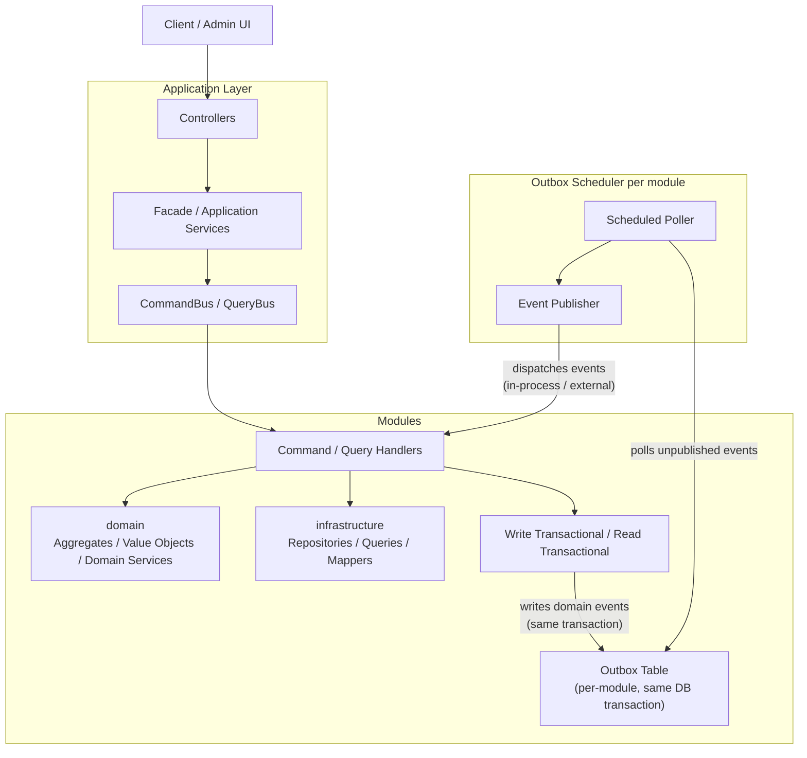
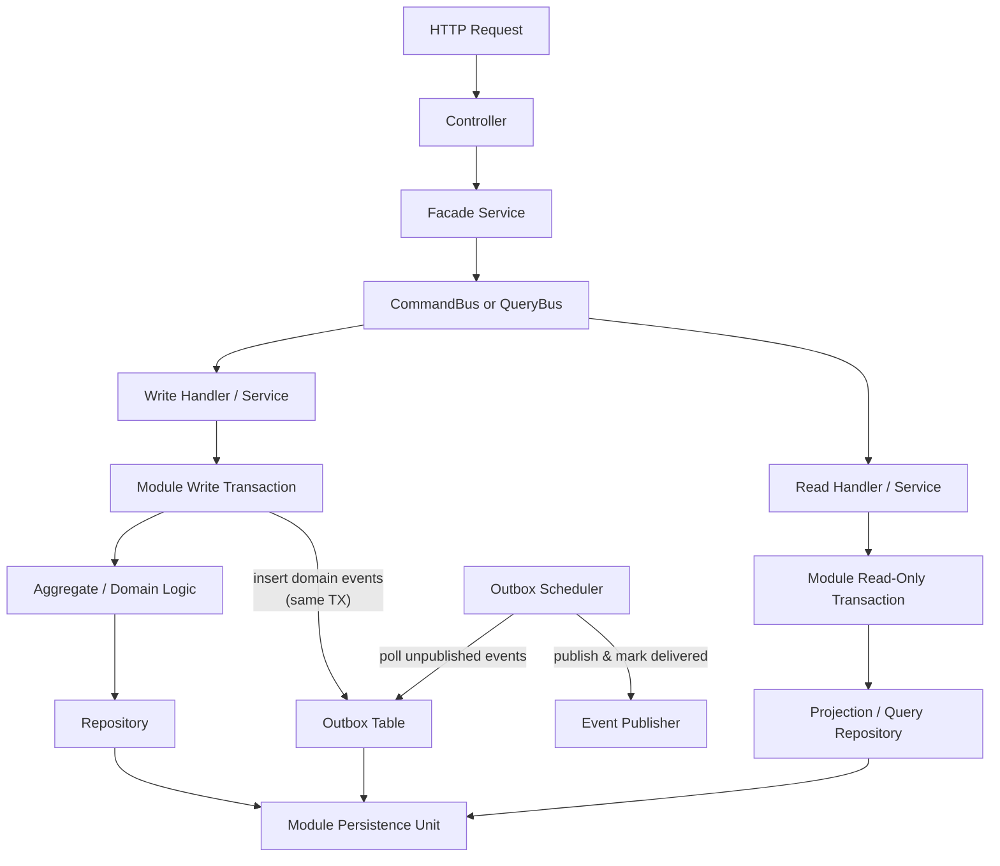

# System Architecture Diagram

This diagram describes the architecture currently used by the running system.
It reflects the current modular-monolith design.

## Overview

## Write and Read Flow

## Notes

- The application is a modular monolith.
- Each module is isolated by `datasource`, `entity manager factory`, and `transaction manager`.
- CQRS is in-process, not distributed.
- Each module's write transaction inserts domain events into a per-module **outbox table** within the same database transaction, guaranteeing at-least-once delivery.
- Each **outbox scheduler** periodically polls outbox tables per module for unpublished events, publishes them (in-process or to an external broker), and marks them as delivered.
- This outbox pattern ensures reliable event propagation without two-phase commits across module boundaries.
- The concrete outbox comparison and proposed implementation shape are documented in [ADR-007](../decisions/ADR-007-module-scoped-outbox.md) and [module-scoped-outbox.md](module-scoped-outbox.md).
