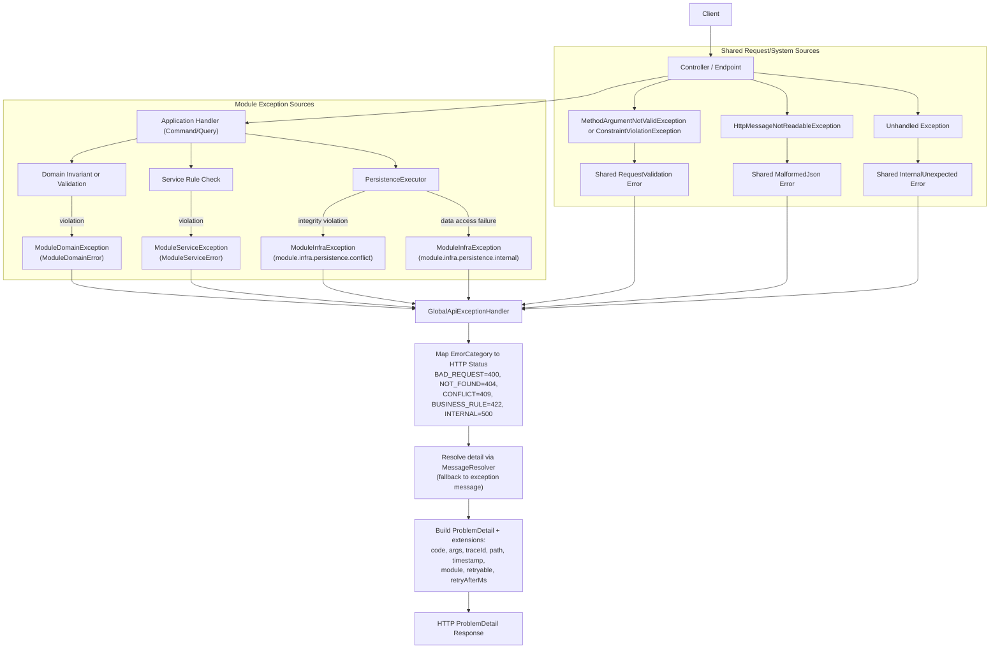
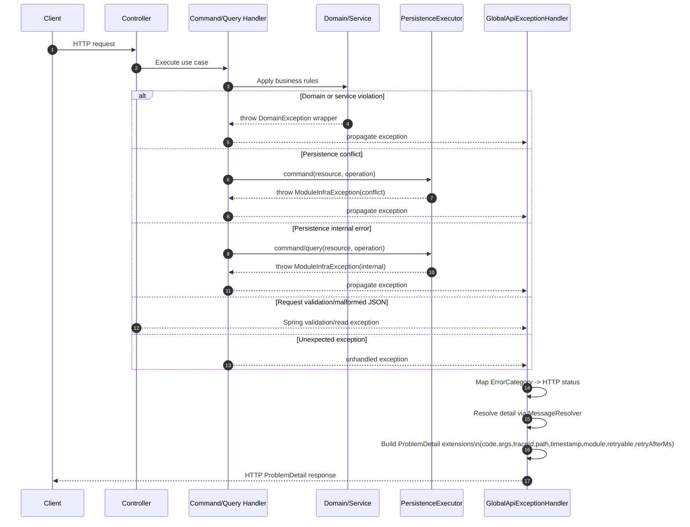

# Exception Handling Framework Flow

This diagram describes the framework-level exception flow from request handling to RFC7807 response generation.

## End-to-End Flow

## Request Exception Lifecycle (Sequence)

## Notes

- All module wrappers extend `DomainException` and carry a typed `MessageSource`.
- `GlobalApiExceptionHandler` centralizes transport mapping so domain and infrastructure code stay HTTP-agnostic.
- Retry metadata is attached only for configured retryable internal errors.
