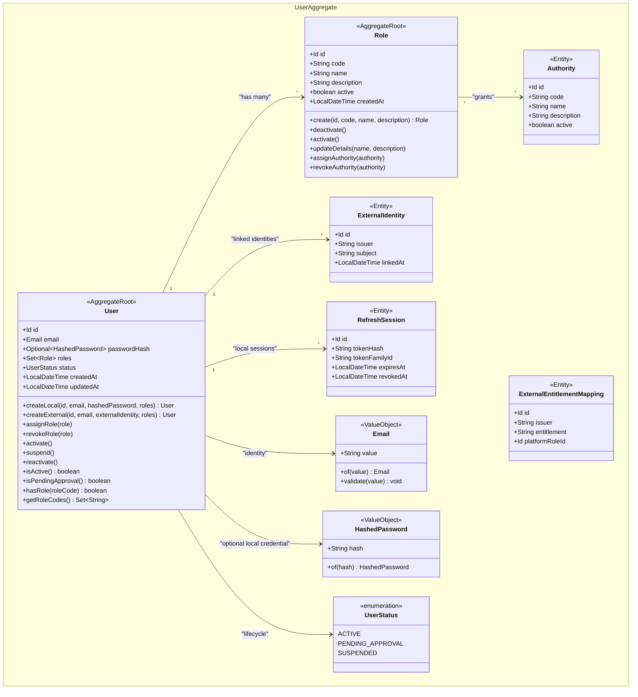
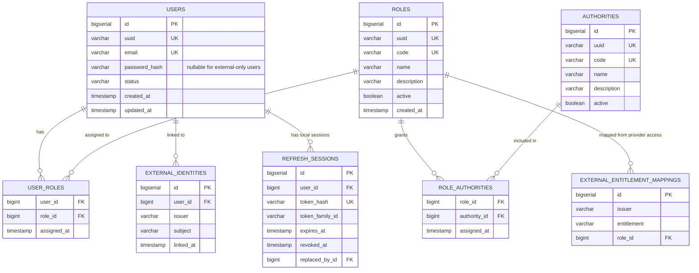
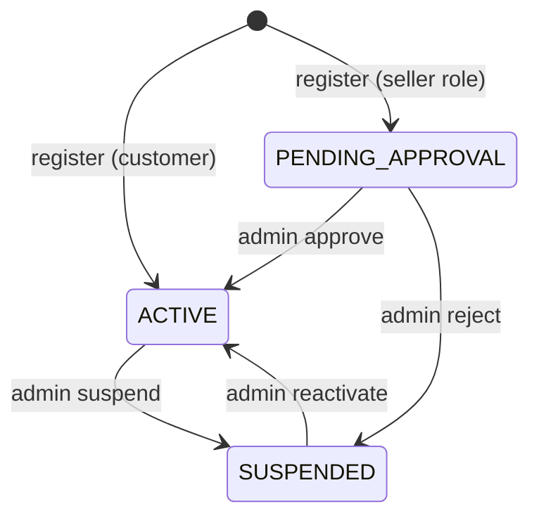
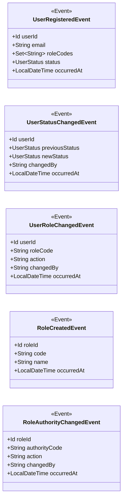
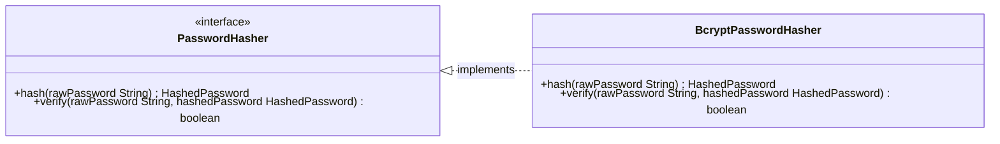
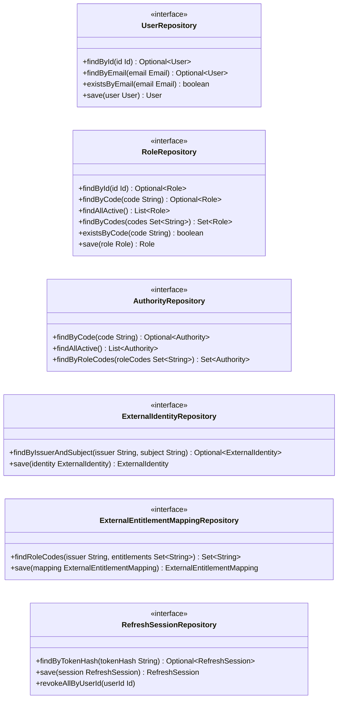
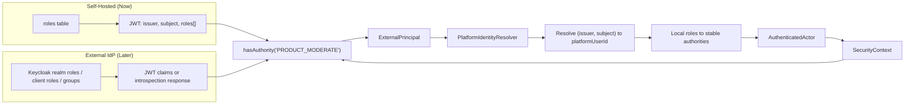

# Identity Domain Aggregate Diagram

This diagram reflects the identity domain model for authentication and
authorization with dynamic, database-driven roles.

## Class Diagram

### User Aggregate

### Entity Relationship

`EXTERNAL_IDENTITIES` has a unique constraint on `(issuer, subject)`.
`EXTERNAL_ENTITLEMENT_MAPPINGS` has a unique constraint on
`(issuer, entitlement, role_id)`.

### User Status Lifecycle

### Domain Events

## Domain Services

### PasswordHasher

## Repository Interfaces

## External IdP Compatibility

## Notes

- The User aggregate holds a `Set<Role>` for many-to-many role assignment.
- Role is an **Aggregate Root** because it has an independent lifecycle and
  owns its authority assignments. Users reference assigned role identities.
- Role codes are immutable strings, not enums, enabling runtime creation.
- Authorities are stable platform capabilities. Dynamic roles become useful by
  mapping them to authorities without changing endpoint code.
- Three seed roles (`ADMIN`, `SELLER`, `CUSTOMER`) are created at startup but
  are not hardcoded.
- `AccessTokenAuthenticator` normalizes local JWTs, OIDC JWTs, or OAuth2
  introspection responses into `ExternalPrincipal`.
- `AuthenticatedActor` carries normalized roles and authorities and never
  exposes provider-specific claims or SDK types to application code.
- External accounts link to stable platform users by `(issuer, subject)`;
  email is not used as the durable identity key.
- Email is a self-validating value object that enforces format constraints.
- HashedPassword wraps the BCrypt hash; the domain never stores plaintext. It
  is optional for users whose credentials exist only at an external provider.
- Local refresh tokens are stored only as hashes and rotated through
  `RefreshSession`; external providers own refresh sessions after migration.
- UserStatus controls authentication eligibility: only ACTIVE users can log in.
- Sellers register as PENDING_APPROVAL and require admin activation.
- Seller ownership checks use `AuthenticatedActor.platformUserId` in
  application handlers after request-level authority checks.
- Domain events are accumulated via `addEvent()` and published through the
  outbox pattern.
- The PasswordHasher interface lives in the domain; the BCrypt implementation
  lives in infrastructure.
