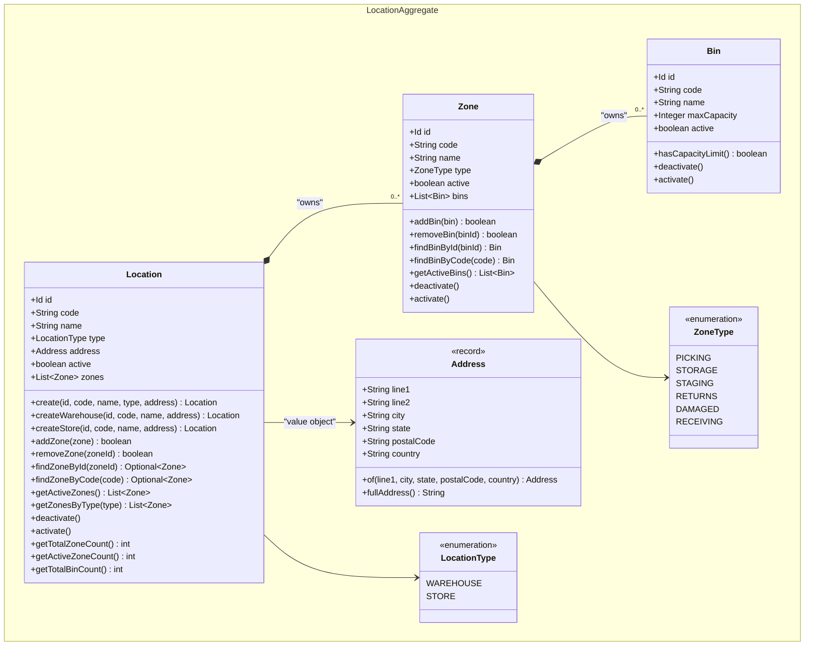
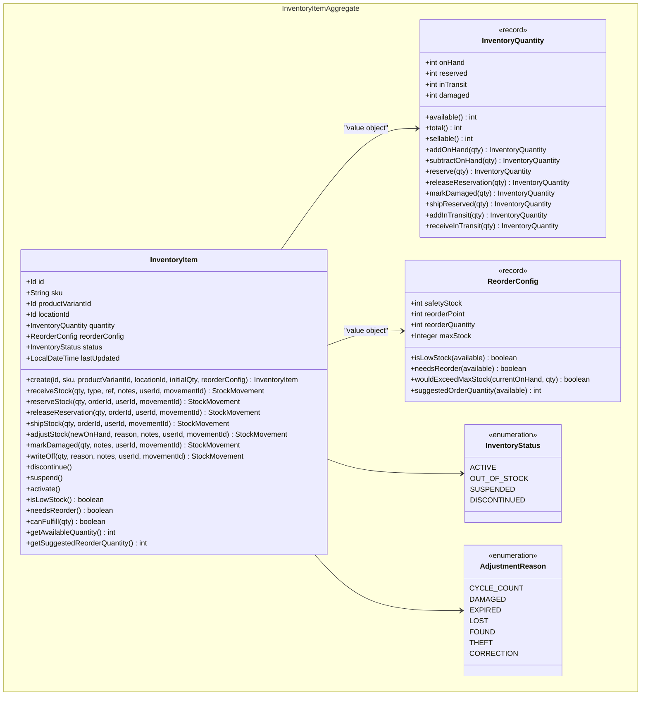
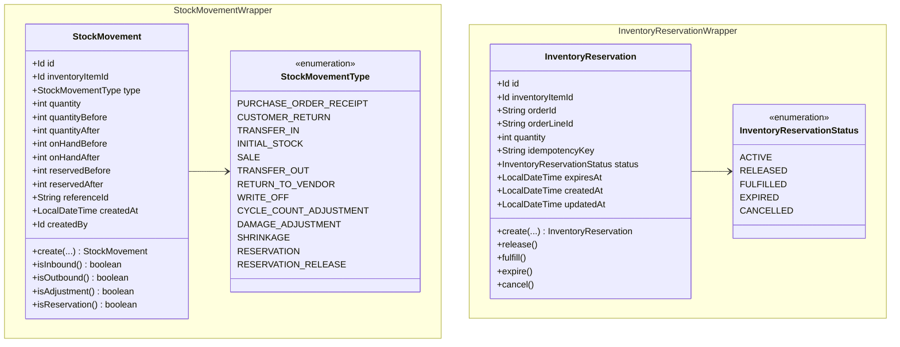
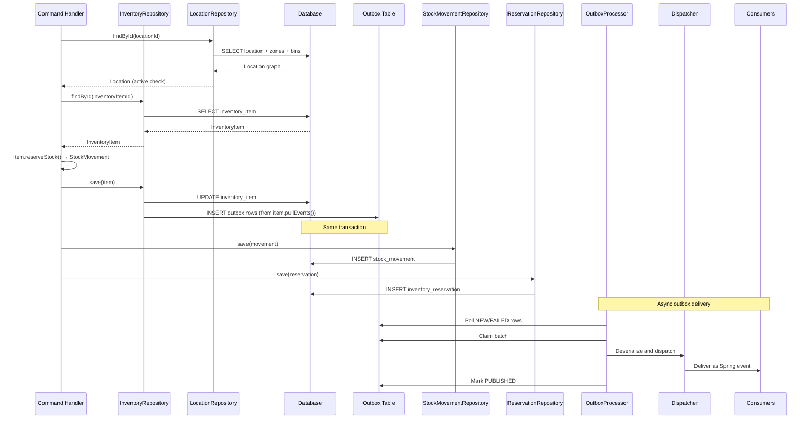

# Inventory Domain Aggregate Diagram

This diagram reflects the current inventory domain model in code.

## Class Diagram

### Location

### Inventory

## Persistence and Event Flow

## Notes

- `InventoryItem` and `Location` are the two aggregate roots in the inventory domain.
- `Zone` and `Bin` are child entities owned by `Location`, loaded and saved as a single aggregate unit.
- `StockMovement` and `InventoryReservation` are independently persisted entities, not part of the `InventoryItem` aggregate.
- All cross-aggregate references use ID only — no object navigation across aggregate boundaries.
- `InventoryItem` stock operations return `StockMovement` entities for the caller to persist independently via `StockMovementRepository`.
- Only `InventoryItem` publishes domain events via the outbox pattern. `Location`, `StockMovement`, and `InventoryReservation` repositories do not publish events. Location events are a planned addition per ADR-008.
- `InventoryItemDiscontinuedEvent` is defined but not yet raised in code.
- Domain services (`InventoryAllocationService`, `ReorderService`) orchestrate cross-aggregate logic without owning state.
- `InventoryItem` uses optimistic locking (`@Version`) to protect concurrent stock modifications.
- `InventoryReservation` supports idempotency via `idempotencyKey` to prevent duplicate reservations.
