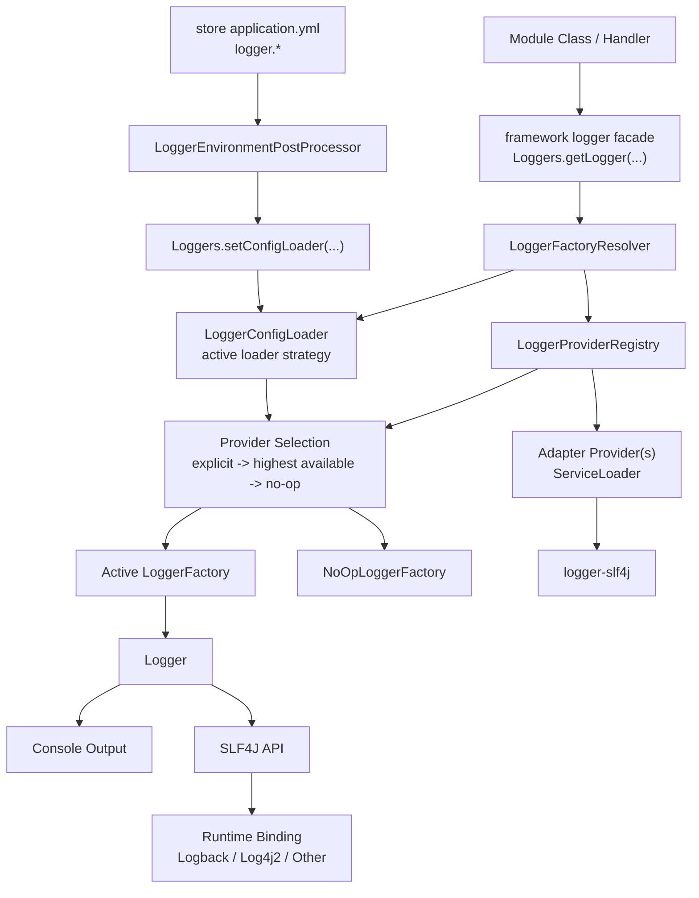
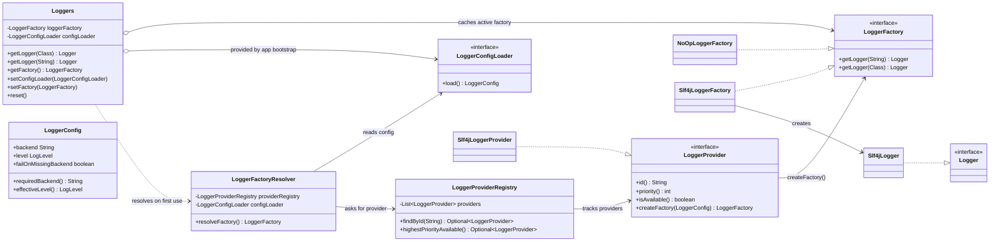
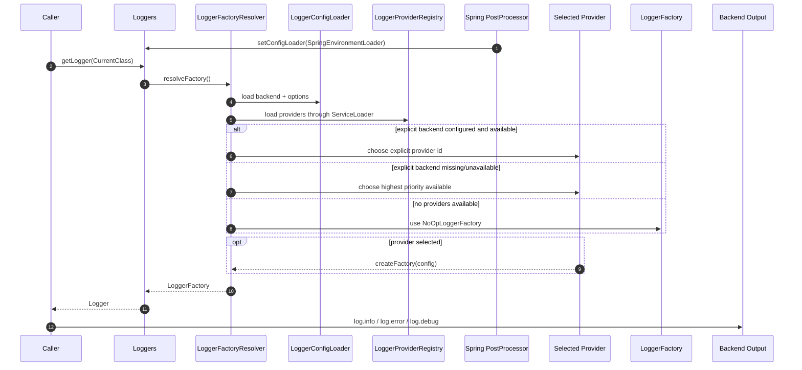

# Modular Logging Framework Diagram

This page explains the current logging architecture in the repo.

If you are new to the project, read it in this order:

1. how application code enters through `Loggers.getLogger(...)`
2. how the resolver chooses the backend
3. which concrete logger object is finally created

Use this page for the runtime picture. If you want code-level usage rules, read `docs/features/framework-logging-usage-guide.md` next.

## Architecture Overview

## Internal Class Diagram

## How To Read The Class Diagram

- `Loggers` is the entry point used by application classes.
- `Loggers` does not create loggers directly. It resolves and caches a `LoggerFactory`.
- `LoggerFactoryResolver` decides which backend to use.
- `LoggerProviderRegistry` knows only about providers discovered through `ServiceLoader`.
- The chosen provider creates a `LoggerFactory`.
- That factory creates a concrete logger object such as `Slf4jLogger`.
- `Slf4jLogger` delegates to SLF4J. If nothing is configured, `NoOpLoggerFactory` keeps callers safe.

## Runtime Selection Sequence

## Notes

- `framework` does not depend on `slf4j-api` and does not ship concrete backend adapters.
- `framework` does not ship a default `LoggerConfigLoader`; app bootstrap installs one when real backend selection is needed.
- Applications choose backend bindings and formatting at runtime.
- New logger backends are added via `LoggerProvider` plus `META-INF/services` without changing module callsites.
- In this repo, the common runtime path is `Logger` -> `Loggers` -> `logger-slf4j` -> Logback.
