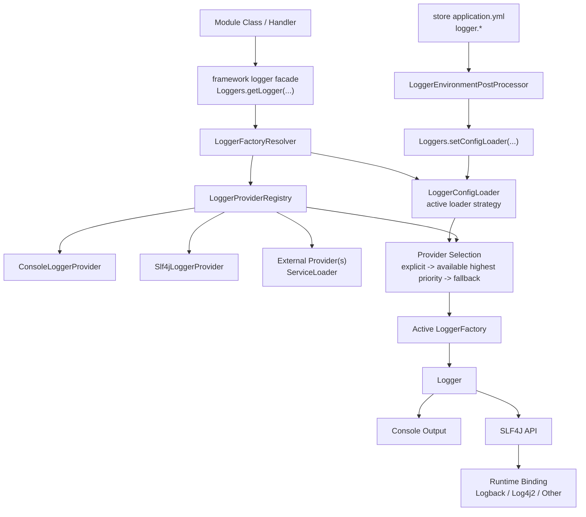
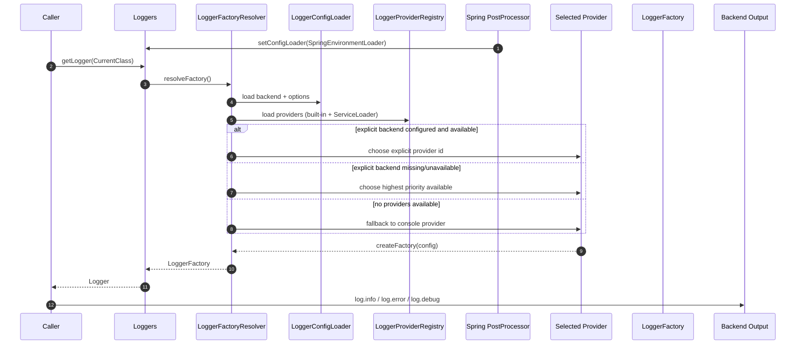

# Modular Logging Framework Diagram

This diagram describes the pluggable logging architecture for framework-level logging with built-in `console` and `slf4j` providers plus external provider extension.

## Architecture Overview

## Runtime Selection Sequence

## Notes

- `framework` depends on `slf4j-api` only and does not ship a backend binding.
- `framework` does not ship a default `LoggerConfigLoader`; app bootstrap must install one.
- Applications choose backend bindings/configuration at runtime.
- New logger backends are added via `LoggerProvider` + `META-INF/services` without changing module callsites.
