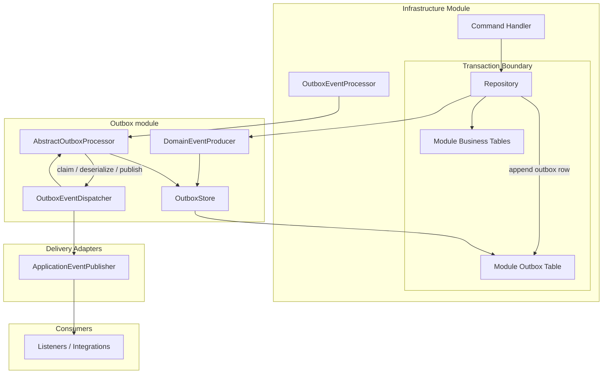
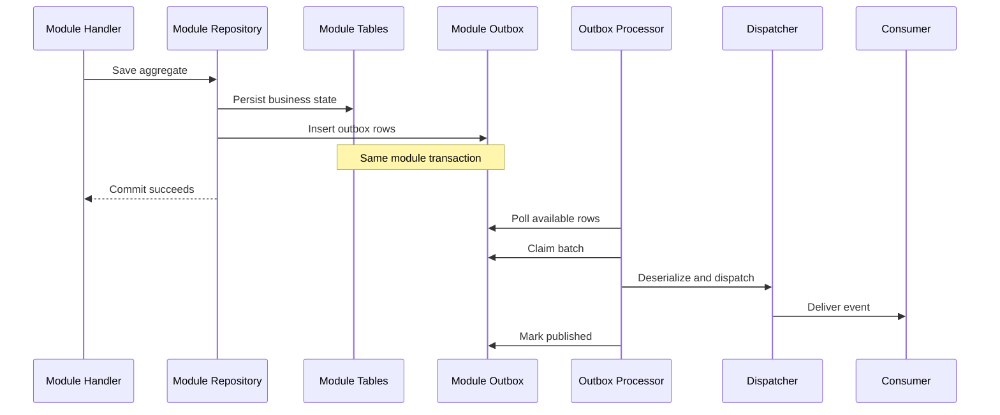
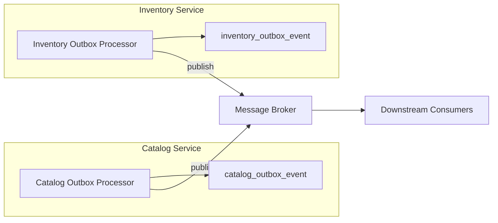

# Module-Scoped Outbox Design

This diagram describes the proposed outbox design for the current modular
monolith.

The design assumes:

- module-owned persistence boundaries remain explicit
- outbox writes are atomic with module writes
- outbox delivery is asynchronous and retryable

## Overview

## Publish Lifecycle

## Notes

- `framework` contains Spring-free outbox contracts.
- `infrastructure-outbox-spring` contains reusable Spring/JPA outbox mechanics.
- Each module owns its outbox table and scheduler wrapper bean.
- If modules still share one physical database, prefer separate schemas or
  table prefixes to preserve ownership boundaries.

## Extraction Path

