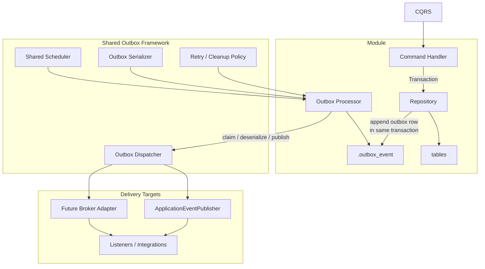
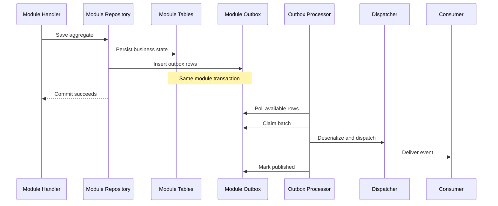

# Module-Scoped Outbox Design

This diagram describes the proposed outbox design for the current modular
monolith.

The design assumes:

- module-owned persistence boundaries remain explicit
- outbox writes are atomic with module writes
- outbox delivery is asynchronous and retryable

## Overview

## Publish Lifecycle

## Notes

- Each module owns its outbox table and repository.
- Scheduler infrastructure can be shared even though processors are
  module-specific.
- If modules still share one physical database, prefer separate schemas or
  table prefixes to preserve ownership boundaries.
