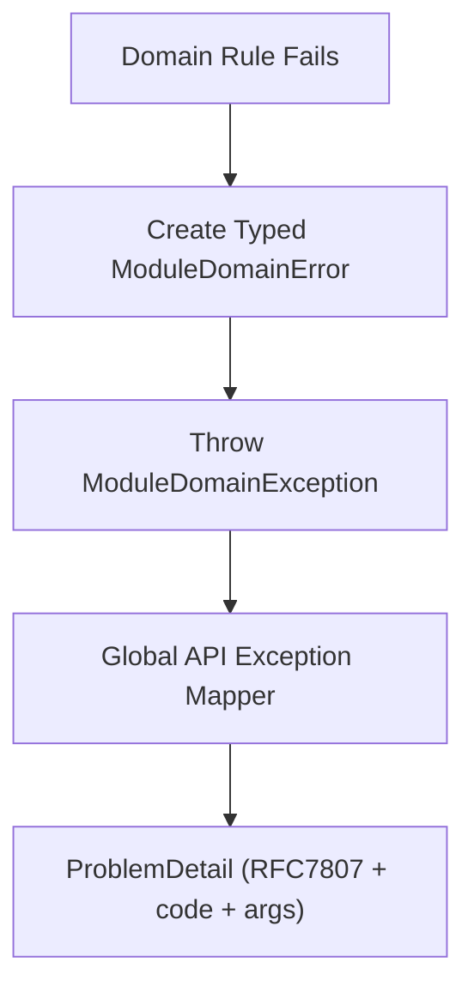

# Exception Handling Framework

## Status
Draft (March 9, 2026)

## Scope
This document defines a generic exception-handling framework for all modules in this codebase.

It covers:

- framework contracts
- module-level domain error modeling
- API transport mapping contract (RFC7807 style)
- testing and rollout expectations

## Goals

- Keep domain errors typed and explicit.
- Keep error codes stable and machine-readable.
- Avoid exception-class explosion.
- Keep domain independent from HTTP transport concerns.
- Keep refactoring safe with compile-time support.

## Core Contracts (Framework Module)

- [`DomainException`](../../framework/src/main/java/com/grab/framework/exception/DomainException.java)
  - Base runtime exception carrying a `MessageSource`.
- [`MessageSource`](../../framework/src/main/java/com/grab/framework/exception/MessageSource.java)
  - Standard error payload contract:
    - `kind()` -> `ErrorCategory`
    - `code()` -> stable machine code
    - `args()` -> structured values
- [`ErrorCategory`](../../framework/src/main/java/com/grab/framework/exception/ErrorCategory.java)
  - Semantic category used by API mapping.
- [`MessageResolver`](../../framework/src/main/java/com/grab/framework/exception/MessageResolver.java)
  - Resolves `code + args + locale` into human-readable message text.

## Standard Module Pattern

Every bounded-context module should follow this shape:

1. `ModuleDomainError` sealed interface implementing `MessageSource`.
2. Nested record errors with required arguments.
3. One wrapper exception class extending `DomainException`.
4. Domain code throws wrapper exception with typed error.

### Generic Example (Java 21)

```java
public sealed interface ModuleDomainError extends MessageSource
        permits ModuleDomainError.InvalidState, ModuleDomainError.NotFound {

    record InvalidState(String current, String expected) implements ModuleDomainError {
        @Override public ErrorCategory kind() { return ErrorCategory.BUSINESS_RULE; }
        @Override public String code() { return "mod.domain.invalid_state"; }
        @Override public Map<String, Object> args() { return Map.of("current", current, "expected", expected); }
    }

    record NotFound(String id) implements ModuleDomainError {
        @Override public ErrorCategory kind() { return ErrorCategory.NOT_FOUND; }
        @Override public String code() { return "mod.domain.not_found"; }
        @Override public Map<String, Object> args() { return Map.of("id", id); }
    }
}
```

```java
public final class ModuleDomainException extends DomainException {
    public ModuleDomainException(ModuleDomainError error, String defaultMessage) {
        super(error, defaultMessage);
    }
}
```

```java
throw new ModuleDomainException(
    new ModuleDomainError.InvalidState("ARCHIVED", "ACTIVE"),
    "Invalid state transition."
);
```

## API Mapping Contract

Transport layer should map exceptions via `@RestControllerAdvice` and produce `application/problem+json`.

Status mapping by `ErrorCategory`:

- `BUSINESS_RULE -> 422`
- `BAD_REQUEST -> 400`
- `NOT_FOUND -> 404`
- `CONFLICT -> 409`
- `INTERNAL -> 500`

Problem payload should include:

- `code`
- `args`
- `detail`
- `status`
- `path`
- `timestamp`
- `traceId` (if available)

## End-to-End Flow



## Error Code Convention

Use dot-notation codes:

- `<module>.domain.<reason>`
- `<module>.service.<reason>`
- `<module>.infra.<reason>`
- `shr.<area>.<reason>` for shared/system errors

Rules:

- codes are stable public contract
- do not embed human message text in code
- args must be structured and non-sensitive

## Testing Strategy

### Domain Contract Tests

- each typed error record verifies `kind`, `code`, `args`
- each domain rule violation throws expected wrapper exception

### API Contract Tests

- HTTP status matches `ErrorCategory`
- `ProblemDetail.code` and `args` reflect source error
- payload shape remains backward-compatible