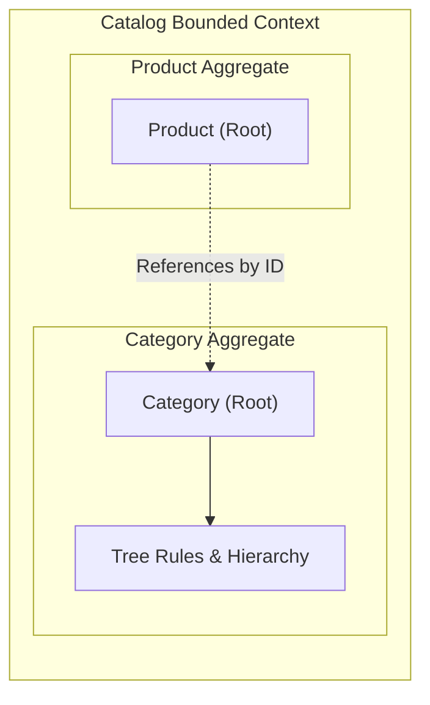

# Category as Aggregate Root with Hierarchical Operations
---

## 1. The Problem

**What's not working?**  
The system requires full lifecycle management of product categories (hierarchical organization, tree queries, and reordering), but previously, category behavior was partially missing. This made hierarchy changes risky and hard to reason about.

**What's at stake?**  
Category operations such as moving nodes and fetching trees require strong consistency and explicit invariant enforcement. Without this, maintaining a valid category hierarchy is error-prone.

---

## 2. What We Decided

**The core approach:**  
Implement Category as a dedicated Aggregate Root to manage parent-child hierarchies and tree-related invariants.

**Key changes:**
- Make Category a dedicated Aggregate Root.
- Expose category behavior through application services and REST endpoints.
- Use an Aggregate Assembler to reconstitute the category from persistence models.

**What stays the same:**  
Products will continue to reference categories by ID only. Category queries may still use optimized read models, and tree structure may evolve without breaking API contracts.

---

## 2.1. Visual Overview

> *Diagrams to understand the architecture at a glance.*

### Domain Bounded Context

---

## 3. Why This Approach

**Primary reasons:**
1. Ensures clear ownership of hierarchy rules.
2. Provides safer category move operations within the aggregate.
3. Guarantees consistent category tree behavior by enforcing strong consistency.

---

## 4. Trade-offs

| Pros | Cons |
|-------|-------|
| Clear ownership of hierarchy rules | Additional complexity in aggregate design |
| Safer category move operations | More upfront modeling effort |
| Consistent category tree behavior | |

---

## 5. What Needs to Change

**New components/modules to build:**
- Category Aggregate Root with invariant enforcement.
- Application services and REST endpoints for category behavior.
- Aggregate Assembler for persistence.

**Changes to existing systems:**
- Migrate existing category logic to the new Aggregate Root.
- Update persistence layer to work with the Aggregate Assembler.

---

## 6. Implementation Plan

- **Phase 1:** Design the Category Aggregate Root and define the core invariants for hierarchy management.
- **Phase 2:** Implement the Aggregate Assembler, Repository, and Application Services.
- **Phase 3:** Expose REST endpoints and migrate existing category management flows to the new architecture.

**Rollback strategy:**  
Keep the existing partial category management logic operational during Phase 1 & 2. Ensure new endpoints are versioned or toggled so we can route back to the old implementation if invariants fail unexpectedly in production.

---

## 7. Related Documents

- [Link to related ADR]
- [Link to technical specifications]
