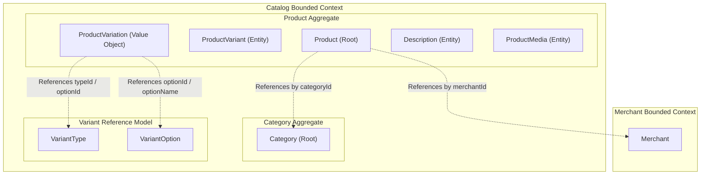
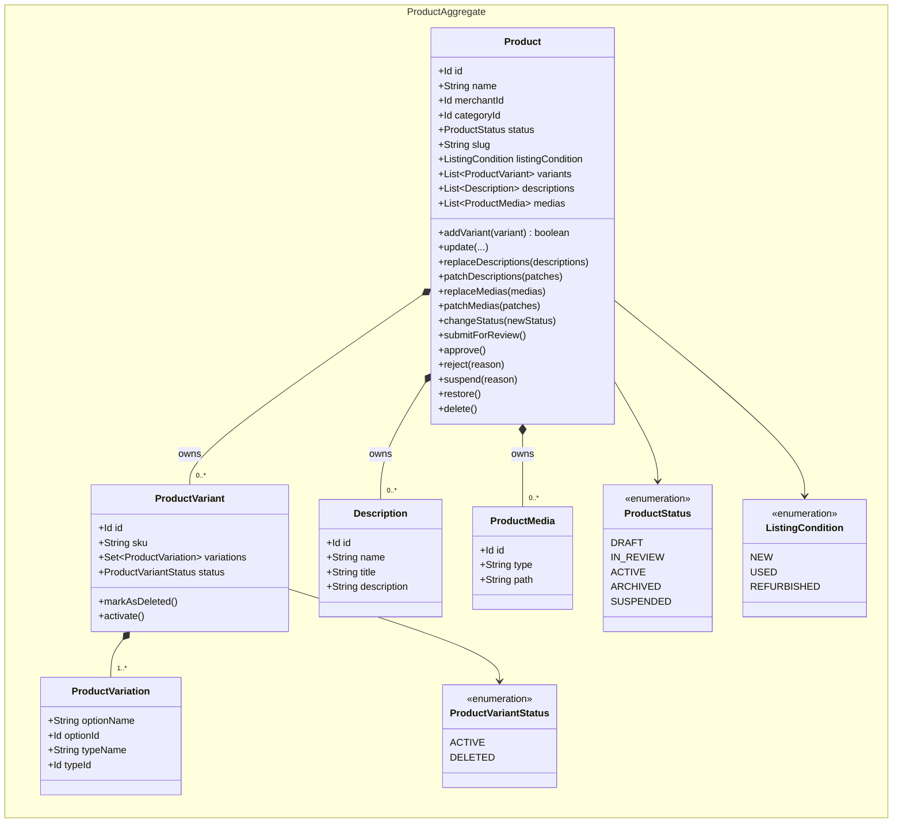
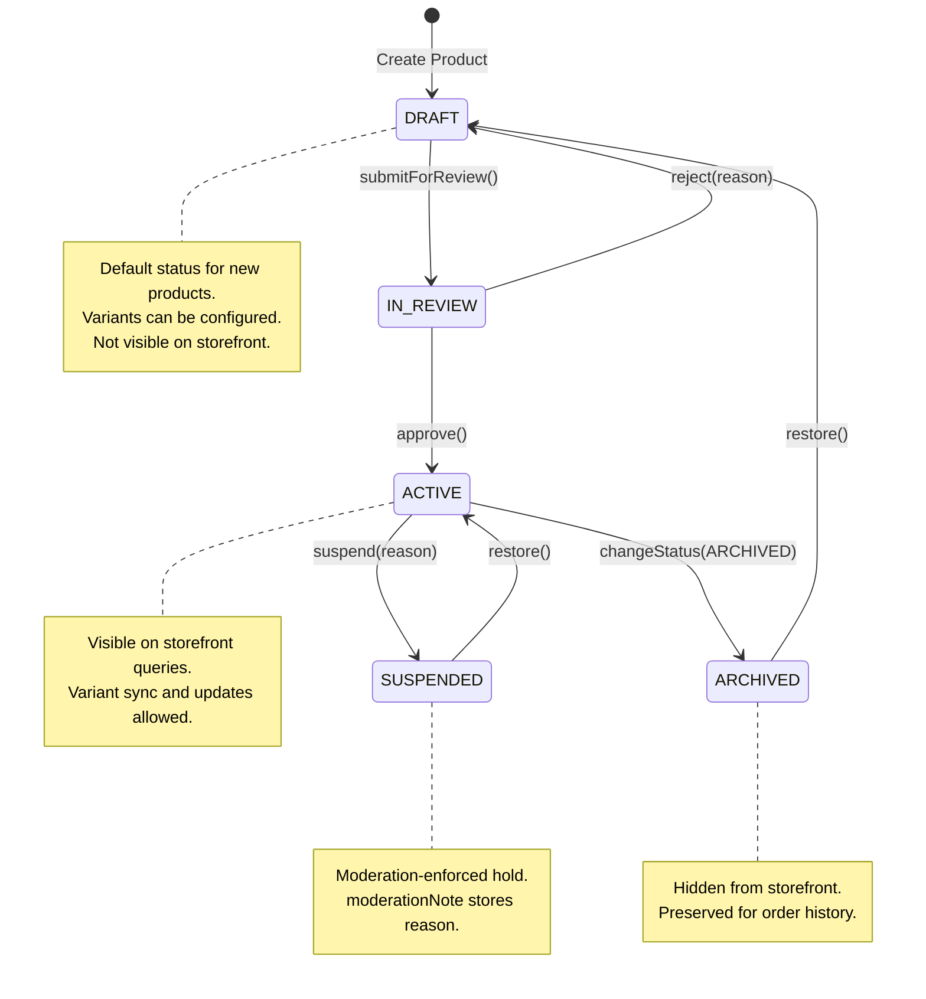
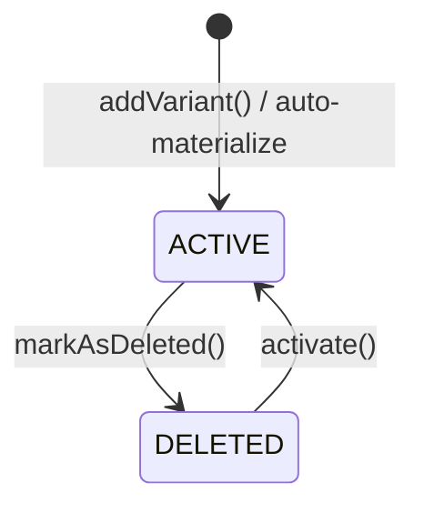
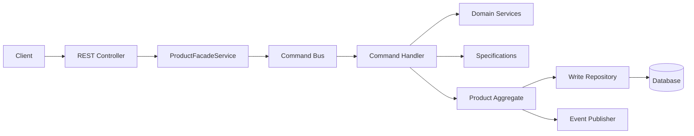
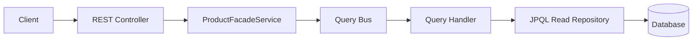

# Product Bounded Context Architecture
---

## 1. The Problem

**What's not working?**  
The catalog system needs to manage products with complex variant structures, lifecycle statuses, storefront visibility, and bulk sync operations. Previously, products had no lifecycle status, no slug-based lookup, no storefront queries, and variant management was fragmented across individual CRUD operations — making it difficult to maintain consistency, support simple listings, or reconcile variant sets after option changes.

**What's at stake?**  
Without a unified aggregate design: variant uniqueness violations can corrupt data, simple products require unnecessary synthetic payloads from clients, merchants cannot draft or archive products, SEO-friendly URLs are impossible, and bulk variant sync requires error-prone manual coordination. The catalog module must remain decoupled from other bounded contexts while supporting both admin and storefront use cases.

---

## 2. What We Decided

**The core approach:**  
Implement Product as a dedicated Aggregate Root that owns its variants, descriptions, and media — governing lifecycle transitions, standalone product auto-materialization, bulk variant sync, and storefront query support — all within a CQRS architecture.

**Key changes:**
- Product is an Aggregate Root managing variants (add, update, remove, soft-delete, sync), descriptions, and media.
- `ProductStatus` enum governs lifecycle transitions (`DRAFT → IN_REVIEW → ACTIVE → ARCHIVED / SUSPENDED`).
- Standalone products without explicit variants auto-materialize a default synthetic variant at create time.
- A bulk sync endpoint (`PUT /products/{id}/variants`) reconciles variants with desired type/option combinations.
- `slug` and `featured` fields enable SEO-friendly lookups and curated storefront experiences.
- Variant-level endpoints expose soft-delete, restore, and SKU update for individual variants.
- Storefront query endpoints filter by `ACTIVE` status only.
- Specification pattern enforces SKU and variation-combination uniqueness in the domain layer.
- CQRS with in-process command/query buses separates reads from writes.
- Domain events are published via Spring `ApplicationEventPublisher` after saves.

**What stays the same:**  
Products reference categories by ID only (no cross-aggregate navigation). The Catalog module remains decoupled via Spring Modulith. MapStruct handles all mapping layers. `variantTypes` remains in request/command shape but is not consumed by save materialization.

---

## 2.1. Visual Overview

> *Diagrams to understand the architecture at a glance.*

### Part 1 — Domain Bounded Context

#### Context Map

The Product Aggregate and Category Aggregate exist within the same Catalog Bounded Context but are isolated by ID reference. The Product Aggregate references the Merchant Bounded Context by `merchantId` only — no cross-aggregate navigation. The Variant Reference Model (VariantType / VariantOption) is used during combination generation but is not persisted inside the Product aggregate.

#### Aggregate Domain Model

#### Why Each Property Exists

| Property | Type | Business Reason |
|----------|------|----------------|
| `name` | String | Primary product identity displayed to customers and used for slug generation. |
| `categoryId` | Id | Links the product to a category for browsing and filtering without coupling aggregates. |
| `status` | ProductStatus | Controls lifecycle visibility — only `ACTIVE` products appear on storefronts; `DRAFT` allows configuration before publishing; `ARCHIVED` preserves order history; `SUSPENDED` enables moderation. |
| `slug` | String | SEO-friendly URL identifier, auto-generated from name, enabling human-readable product URLs. |
| `featured` | boolean | Marks products for curated storefront promotion (e.g., homepage highlights). |
| `merchantId` | Id | Associates the product with its merchant for multi-tenant marketplace operations. References the Merchant Bounded Context by ID only. |
| `listingCondition` | ListingCondition | Captures whether a product is `NEW`, `USED`, or `REFURBISHED` — relevant for buyer expectations and search filters. |
| `variants` | List | A product must always have at least one variant (auto-materialized if omitted). Each variant carries its own SKU and variation set. |
| `descriptions` | List | Supports multi-language or multi-section product descriptions. |
| `medias` | List | Product images and videos for storefront display. |
| `sku` (on variant) | String | Unique stock-keeping unit for inventory tracking and order fulfillment per variant. |
| `variations` (on variant) | Set | Defines the specific type/option combination (e.g., Color:Red + Size:S) that makes this variant unique. |

#### Product Aggregate Lifecycle — State Diagram

#### ProductVariant Lifecycle — State Diagram

#### Standalone Product — Auto-Materialization

When a product is created without explicit variants, the aggregate auto-materializes a single default variant:

- Status: `ACTIVE`
- Generated ID and SKU
- Single synthetic variation: `typeName = "Title"`, `optionName = "Default Title"`, `typeId = "system:type:title"`, `optionId = "system:option:default-title"`

This ensures every product always has at least one variant, providing consistent behavior for downstream consumers.

#### Variant Sync — Bulk Reconciliation

The `PUT /products/{id}/variants` sync operation:

1. Generates all desired combinations from `variantTypes`.
2. Filters out fully deleted options via `VariantDeletionStrategy`.
3. Diffs desired combinations against existing variants using `VariationCombinationManager` and `VariationKeyGenerator`.
4. Requires a matching request variant for each desired combination (fails if missing).
5. Updates existing, adds new, and removes variants not in the desired set.
6. All synced variants are set to `ACTIVE`.

---

### Part 2 — Application Architectural Design

#### Design & Components

The architecture follows a CQRS pattern with clear separation of concerns:

- **REST Controllers:** HTTP entry points exposing product, variant, and storefront endpoints.
- **ProductFacadeService:** Orchestration layer translating HTTP requests into commands or queries.
- **CommandBus / SimpleCommandBus:** In-process dispatcher routing write operations to `CommandHandler` implementations. Commands are `@Transactional`.
- **QueryBus / SimpleQueryBus:** In-process dispatcher routing read operations to `QueryHandler` implementations. Queries are read-only.
- **Validation Specifications:** Composable domain validators (`UniqueProductVariantCompositeSpec`, `UniqueSkuSpec`, `UniqueProductVariantSpec`) enforcing rules before persistence.
- **Domain Services:** `VariantCombinationService` (generates combinations with order preservation, bounded at 100,000), `VariationCombinationManager` (classifies combinations as NEW/EXTENDED/UNCHANGED), `VariantDeletionStrategy` (determines removals on type changes).
- **Event Publisher:** `ApplicationDomainEventProducer` publishes domain events collected in `AggregateRoot.getEvents()` after save. Currently in-memory only.
- **Assemblers:** MapStruct-based mappers for JPA ↔ Domain ↔ DTO conversions. HATEOAS model assemblers add links at the controller layer.

#### Write-Side Data Flow

#### Read-Side Data Flow

#### API Endpoints

| Method | Endpoint | Purpose |
|--------|----------|---------|
| `POST` | `/api/v1/products` | Create product (with or without variants) |
| `PUT` | `/api/v1/products/{id}` | Update product |
| `DELETE` | `/api/v1/products/{id}` | Delete product |
| `PUT` | `/api/v1/products/{id}/variants` | Bulk sync variants by desired combinations |
| `PUT` | `/api/v1/products/{id}/variants/{variantId}` | Update single variant SKU |
| `DELETE` | `/api/v1/products/{id}/variants/{variantId}` | Soft-delete a single variant |
| `POST` | `/api/v1/products/{id}/variants/{variantId}/restore` | Restore a soft-deleted variant |
| `GET` | `/api/v1/products/{id}/full` | Full product detail (variants + types) |
| `GET` | `/api/v1/products/category/{categoryId}` | Browse by category (paginated) |
| `GET` | `/api/v1/products/slug/{slug}` | Lookup by SEO-friendly slug |
| `GET` | `/api/v1/products/featured` | Featured products listing (paginated) |

Storefront-facing GET endpoints only return `ACTIVE` products.

---

## 3. Why This Approach

**Primary reasons:**
1. Strong consistency within the Product aggregate boundary — all variant mutations are validated atomically before persistence.
2. Domain validation (Specifications) and combination logic (Domain Services) are testable without database dependencies.
3. CQRS enables independent optimization of reads (lightweight JPQL summaries) versus writes (full aggregate graph).
4. Lifecycle status gives products a clear state machine visible to both admin and storefront, with archiving preserving order history.
5. Standalone product auto-materialization eliminates unnecessary client complexity for simple listings.
6. Bulk variant sync provides a single canonical operation for reconciling variants after option changes.

---

## 4. Trade-offs

| Pros | Cons |
|-------|-------|
| Strong consistency within aggregate boundary | Aggregate loads all variants on every write (may need lazy optimization) |
| Domain validation is testable without database | In-memory events are lost on application failure |
| CQRS enables independent read/write optimization | CQRS adds indirection (bus → handler → repository) |
| Domain events enable decoupled integration | Specification pattern requires new classes for each validation rule |
| Clear lifecycle for admin and storefront visibility | Status transitions add validation complexity to the aggregate |
| Standalone products reduce client burden | Save behavior becomes richer and less "pure pass-through" |
| Single sync endpoint simplifies variant management | Clients must send the full desired variant list on every sync |
| SEO-friendly slugs and featured support | Slug uniqueness requires enforcement at domain and database level |
| Variant-level operations reduce need to re-submit entire product | Large option sets can produce many combinations (bounded at 100k) |

---

## 5. What Needs to Change

**New components/modules to build:**
- Product Aggregate Root with ProductVariant, Description, ProductMedia child entities.
- `ProductStatus` enum with `canTransitionTo()` transition validation.
- `slug` and `featured` fields on Product with slug generation strategy.
- Standalone product auto-materialization in the `SaveProduct` command handler.
- Bulk variant sync endpoint and `VariationCombinationManager` / `VariantDeletionStrategy`.
- Composable specifications for variant uniqueness (`UniqueProductVariantCompositeSpec`).
- Domain services for combination generation (`VariantCombinationService`).
- CQRS infrastructure (CommandBus, QueryBus, Handlers).
- Storefront query endpoints (by category, slug, featured).
- Variant-level update, soft-delete, and restore endpoints.

**Changes to existing systems:**
- Migrate product management logic to use the new CQRS and aggregate-based architecture.
- Add `status`, `slug`, `featured` columns to the product persistence layer.
- Ensure event publishing triggers correctly after saves.
- Storefront queries must filter by `status = ACTIVE` at the repository level.

---

## 6. Implementation Plan

- **Phase 1:** Define the Product aggregate with all entities, value objects, and the `ProductStatus` lifecycle state machine.
- **Phase 2:** Implement domain services (combination generation, variant sync) and specifications (uniqueness validation).
- **Phase 3:** Roll out CQRS infrastructure, standalone product auto-materialization, and domain event publishing.
- **Phase 4:** Add `slug`, `featured`, storefront query endpoints, and variant-level operations.

**Rollback strategy:**  
Retain existing CRUD implementations behind feature toggles at the facade layer. New CQRS-routed operations can be disabled per-endpoint, falling back to direct repository calls. Slug and status fields can be made nullable during migration to avoid breaking existing data.

---
