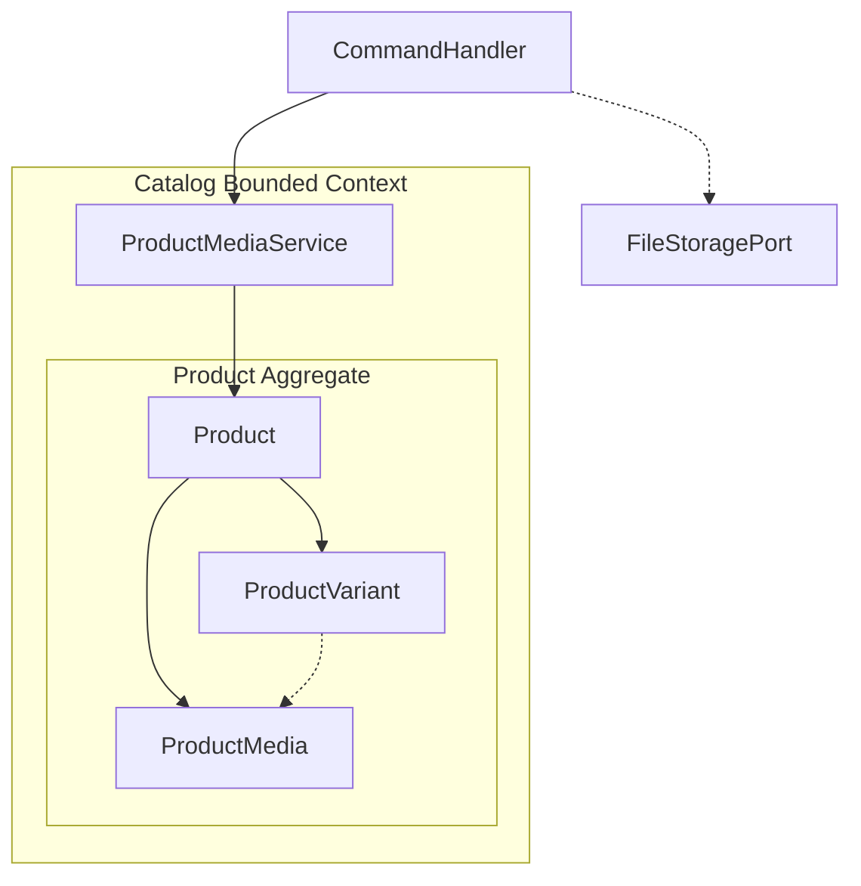
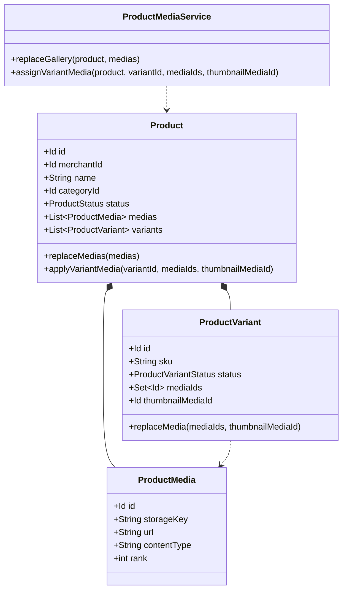
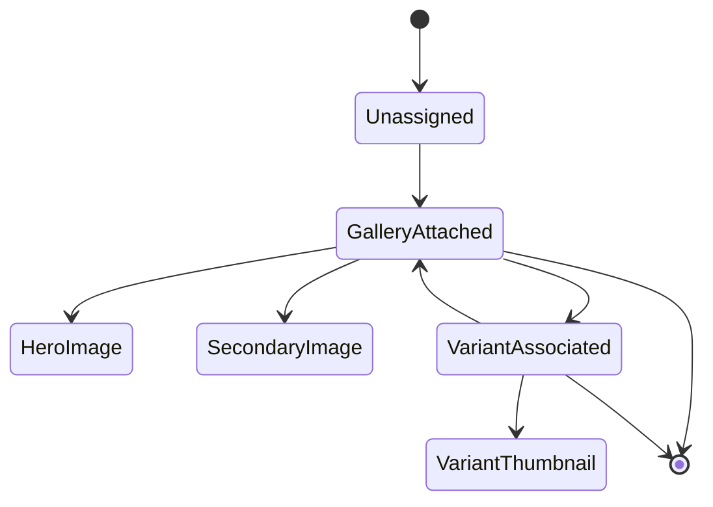
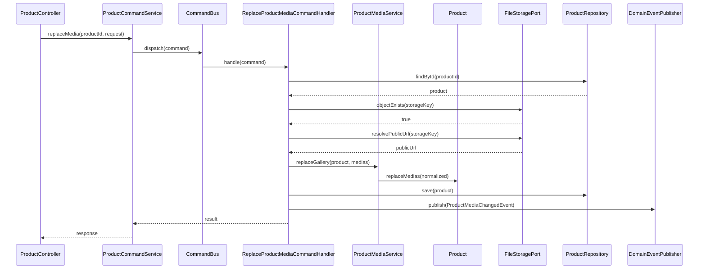
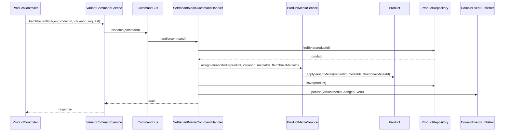

# Product and Variant Media Consumption Architecture

---

## 1. The Problem

**What's not working?**  
In an e-commerce marketplace, products require rich visual presentations (hero photos, feature highlights, lifestyle galleries), while individual variants (color swatches, style options, material variations) require SKU-scoped imagery so customers can see exactly what they are purchasing. Previously, media was modeled as a flat, disconnected `{type, path}` string with no aggregate ownership, no display hierarchy, and no domain relationship between products and their variants. Variant media existed only as an abandoned join table without domain representation, allowing variants to either drift into untracked image pools or duplicate identical image uploads across multiple SKUs.

**What's at stake?**  
Without a cohesive domain model governing media ownership:
1. **Broken Storefront Visuals:** Variant-specific images (e.g., a "Midnight Blue" jacket) cannot be filtered when a customer selects a variant option, causing high customer return rates.
2. **Data Inconsistency:** When sellers remove an obsolete product image, variants retain dangling references to missing pictures.
3. **Bloated Seller Workflow:** Merchants are forced to re-upload identical photographs multiple times for each variant size or SKU, wasting storage and merchant time.

---

## 2. What We Decided

**The core approach:**  
Model media strictly within the Catalog domain where the **Product Aggregate Root owns the complete media collection**, while individual **Product Variants reference a validated subset** of the product's media collection, enforcing subset consistency, thumbnail designation, and automatic cascade pruning in the domain layer.

**Key changes:**
- **Product-Owned Media Collection:** The `Product` aggregate root is the single consistency boundary for all media. Media items (`ProductMedia`) are entities within the Product aggregate with deterministic display ordering (`rank`).
- **Variant Media as a Strict Subset:** `ProductVariant` holds a collection of `mediaIds` that must strictly belong to the parent Product's media collection. Variants cannot own external or unassociated media.
- **Variant Thumbnail Designation:** Each variant may designate a `thumbnailMediaId` to represent the SKU in search results, cart lines, and checkout summaries. The thumbnail must belong to the variant's assigned media subset.
- **Automatic Pruning Policy:** When product media items are removed or replaced via `ProductMediaService.replaceGallery` → `product.replaceMedias(...)`, any variant referencing a removed media ID is automatically pruned to prevent dangling references.
- **Domain service for media use cases:** Command handlers call `ProductMediaService`. Product never depends on that service. Product applies gallery replacement (plus prune/events) and variant media writes.
- **Domain Event Emission:** Domain operations emit explicit business events (`ProductMediaChangedEvent` and `VariantMediaChangedEvent`) to notify search indexes, recommendation engines, and storefront caches.
- **Pure Hexagonal Storage Decoupling:** The Catalog domain consumes media storage exclusively through the abstract `FileStoragePort` interface (for existence verification and public URL resolution), remaining completely decoupled from cloud storage infrastructure.

**What stays the same:**  
Product remains the aggregate root (as established in ADR_002). Variants remain internal entities within the Product aggregate. Catalog stays isolated from merchant billing and identity domains.

---

## 2.1. Visual Overview

> Diagrams and tables so a newcomer can learn the domain and application design at a glance.

### Part 1 — Domain Bounded Context

#### Responsibility & Boundary

**This bounded context (Catalog Bounded Context) owns:**
- Defining and maintaining the product visual gallery (`ProductMedia`).
- Enforcing gallery ordering, rank progression, and hero image determination.
- Managing variant-to-media associations and enforcing the strict subset invariant.
- Managing variant thumbnail selection for cart and checkout representation.
- Emitting domain events when catalog media composition changes.

**This bounded context does not own:**
- Physical binary storage, disk management, or byte streaming (delegated to object storage via `FileStoragePort`).
- Cloud credential management, signature generation, or bucket configuration (owned by `framework` storage SPI and infrastructure).
- Image resizing, transcoding, or CDN edge caching (owned by media optimization services).
- Merchant tenant permission checks (owned by domain security policies).

**Primary use cases:**
1. **Curate Product Gallery:** Merchants upload and order images for a product listing (hero shot, angle views, size chart).
2. **Assign Variant Visuals:** Merchants assign specific images from the product gallery to a variant (e.g., assigning blue shirt photos to all "Blue" size variants).
3. **Select SKU Thumbnail:** Merchants select a primary thumbnail image for a specific variant.
4. **Re-rank Gallery:** Merchants adjust image priority to optimize storefront conversion.
5. **Cascade Prune on Deletion:** System automatically strips removed gallery images from any variant referencing them.

---

#### Ubiquitous Language

| Business term | Domain type / value | Meaning |
|---|---|---|
| **Product Aggregate** | `Product` | The root entity governing product identity, variants, descriptions, and media gallery. |
| **Product Media** | `ProductMedia` | An entity representing a visual asset owned by the product, including its storage key, public URL, content type, and display rank. |
| **Product Variant** | `ProductVariant` | A purchasable SKU within the product aggregate representing a specific option combination (e.g., Color=Red, Size=XL). |
| **Variant Media Subset** | `ProductVariant.mediaIds` | An ordered set of media IDs referencing a subset of the parent product's media gallery. |
| **Variant Thumbnail** | `ProductVariant.thumbnailMediaId` | The primary representative image ID used for the SKU across storefront cards, search, and checkout. |
| **Gallery Rank** | `ProductMedia.rank` | Zero-indexed integer defining display order on storefront pages (rank 0 is the hero image). |
| **Subset Invariant** | Business rule | Every media ID assigned to a variant must exist in the parent product's media collection. |
| **Product Media Service** | `ProductMediaService` | Domain service that replaces the gallery (unique storage key/id) and assigns variant media subsets. Invoked by command handlers, never by Product. |
| **Variant Media Event** | `VariantMediaChangedEvent` | Domain event emitted when a variant's media subset or thumbnail is modified. |

---

#### Context Map

The Product Aggregate Root owns gallery and variant state. Command handlers invoke `ProductMediaService` for media use cases; the service calls Product apply APIs. Product never calls the domain service.

---

#### Aggregate Domain Model

---

#### Relationships

| From | To | Kind | Notes |
|---|---|---|---|
| `Product` | `ProductMedia` | Composition (`*--`) | Strong ownership. `ProductMedia` has no lifecycle outside `Product`. Mutated only through `Product`. |
| `Product` | `ProductVariant` | Composition (`*--`) | Strong ownership. Product aggregates contain one or more purchasable variant entities. |
| `ProductVariant` | `ProductMedia` | ID Reference (`..>`) | Soft reference by `Id`. The variant does not embed the media object; it references `Id`s enforced via `ProductMediaService` then applied on `Product`. |
| `ProductMediaService` | `Product` | Domain service | Command handlers invoke the service. Product never depends on it. |
| Command handler | `FileStoragePort` | Hexagonal Dependency | Existence check and public URL resolution before `replaceGallery`. |

---

#### Why Each Property Exists

> Every property and method parameter on the domain diagram appears here with its business justification.

| Property | Owner type | Type | Business reason |
|---|---|---|---|
| `id` | `ProductMedia` | `Id` | Unique domain identifier for referencing this specific photo across the product and its variants. |
| `storageKey` | `ProductMedia` | `String` | Immutable logical storage coordinate locating the physical file in object storage without hardcoding server hosts. |
| `url` | `ProductMedia` | `String` | Fully resolved public URL used by storefronts and web apps to display the image. |
| `contentType` | `ProductMedia` | `String` | MIME type (e.g., `image/webp`, `image/jpeg`) required by browsers and clients for proper image rendering. |
| `rank` | `ProductMedia` | `int` | Explicit ordinal position in the product gallery. Rank 0 is designated as the primary hero image. |
| `mediaIds` | `ProductVariant` | `LinkedHashSet<Id>` | Ordered set of media IDs assigned to this variant, showing customers SKU-specific visual angles. |
| `thumbnailMediaId` | `ProductVariant` | `Id` | Specific media ID selected to represent this variant in compact UI contexts (cart, checkout, mini-cart). |
| `sku` | `ProductVariant` | `String` | Stock Keeping Unit code uniquely identifying the variant in commerce and warehouse operations. |
| `status` | `ProductVariant` | `ProductVariantStatus` | Governs whether the variant is active, out of stock, or discontinued. |

---

#### Invariants & Policies

| Rule (business language) | Enforced by | When |
|---|---|---|
| **Variant Media Subset Invariant** | `ProductMediaService.assignVariantMedia` | When assigning media to a variant. Every `mediaId` in `variant.mediaIds` must exist in `product.medias`. Violations throw `VariantMediaNotOwnedByProduct`. |
| **Thumbnail Subset Invariant** | `ProductMediaService.assignVariantMedia` | When designating a variant thumbnail. The `thumbnailMediaId` must be an owned product media ID and is automatically included in `variant.mediaIds`. |
| **Cascade Pruning Policy** | `Product.replaceMedias` | If an image is removed from the product, all variant references to that image ID are automatically purged. |
| **Unique Storage Key per Product** | `ProductMediaService.replaceGallery` | Prevents duplicate entries for the same file path or media id within a single product gallery. |
| **Pre-Attach Verification Policy** | Application Command Handler | Verifies `fileStoragePort.objectExists(storageKey)` before allowing the aggregate to attach media. |

---

#### Lifecycle

The domain lifecycle of product and variant media:

---

### Part 2 — Application Architectural Design

#### Components & Layers

| Layer | Responsibility | Example types |
|---|---|---|
| **Controller** | Exposes REST endpoints for media upload requests, gallery replacement, and variant image assignment. | `ProductController` |
| **Command Service** | Validates incoming payloads and dispatches commands across the command bus. | `ProductCommandService`, `VariantCommandService` |
| **Command Handlers** | Loads aggregate roots, verifies storage existence, invokes `ProductMediaService`, and persists changes. | `ReplaceProductMediaCommandHandler` `SetVariantMediaCommandHandler` |
| **Domain Layer** | Pure business models enforcing graph invariants, plus a domain service for media use cases. | `Product`, `ProductMedia`, `ProductVariant`, `ProductMediaService` |
| **Framework Storage Port** | Hexagonal output port providing existence checks and public URL resolution without vendor lock-in. | `FileStoragePort` |
| **Domain Events** | Asynchronous notifications published after state transitions. | `ProductMediaChangedEvent` `VariantMediaChangedEvent` |

---

#### Data / Command Flow

##### Flow 1: Replacing Product Gallery Media

##### Flow 2: Assigning Media to a Variant

---

#### Integration

**Publishes (Domain Events):**
- `ProductMediaChangedEvent(productId)`: Dispatched when product gallery images are added, removed, or re-ranked. Consumed by storefront catalog indexes, search services, and recommendation engines.
- `VariantMediaChangedEvent(productId, variantId)`: Dispatched when variant image subsets or thumbnails change. Consumed by inventory caching services, storefront product display views, and cart pricing services.

**Consumes:**
- `CreateProductMediaUploadCommand`: Requests presigned upload credentials for product media.
- `ReplaceProductMediaCommand`: Replaces the product's entire media collection and re-ranks images.
- `SetVariantMediaCommand`: Updates variant image associations and thumbnail selection.

**Named Interfaces:**
- Exposes: `catalog::api::media` (Product media and variant media management).
- Depends on: `framework::storage::port` (`FileStoragePort` for object existence checks and URL resolution).

---

## 3. Why This Approach

**Primary reasons:**
1. **Single Consistency Boundary:** The `Product` aggregate root guarantees that variant media never references missing, foreign, or deleted assets.
2. **Preventing Visual Drift:** Variants cannot establish private image collections disconnected from the parent product listing.
3. **Single Upload, Multiple SKU Reuse:** An image uploaded once to the product can be linked across dozens of variant combinations without uploading duplicate binary bytes.
4. **Resilient Domain Model:** The domain layer guarantees clean cascading deletion. If an image is removed from a product, variants immediately self-heal rather than surfacing broken image icons to customers.
5. **Decoupled from Storage Implementations:** The Catalog domain contains zero references to S3, buckets, or vendor SDKs, preserving pure domain business logic.

---

## 4. Trade-offs

| Pros | Cons |
|---|---|
| **Guaranteed Data Integrity:** Invariants ensure variants only reference valid, existing product media. | **Aggregate Load Overhead:** Modifying variant images requires loading and saving the entire `Product` aggregate. |
| **Efficient Media Reuse:** Shared photos (e.g. front view) are stored once and referenced by multiple SKUs. | **Pruning Sensitivity:** Deleting a product image silently strips it from variants (merchants must be aware that gallery removals affect variants). |
| **Strict Hexagonal Purity:** Domain logic is 100% independent of underlying cloud or physical storage mechanisms. | **Validation Step:** Attaching media requires checking `objectExists` via the storage port prior to aggregate save. |

---

## 5. What Needs to Change

**Domain Model Changes:**
- `Product.java`:
  - `replaceMedias(List<ProductMedia>)` replaces the gallery and prunes variant refs.
  - `applyVariantMedia(Id, Collection<Id>, Id)` writes variant media and emits `VariantMediaChangedEvent`.
- `ProductMediaService`:
  - `replaceGallery` enforces unique storage key/id then calls `product.replaceMedias`.
  - `assignVariantMedia` enforces the subset/thumbnail rules then calls `product.applyVariantMedia`.
- `ProductMedia.java`:
  - Encapsulates `id`, `storageKey`, `url`, `contentType`, and `rank`.
- `ProductVariant.java`:
  - `LinkedHashSet<Id> mediaIds` and `Id thumbnailMediaId` accepted in a single constructor.
  - Package-private `replaceMedia` / `retainOwnedMedia`.
- `CatalogDomainError.java`:
  - `VariantMediaNotOwnedByProduct`, `DuplicateProductMedia`.

**Application Services & Handlers:**
- Created `CreateProductMediaUploadCommandHandler`.
- Created `ReplaceProductMediaCommandHandler` with storage existence verification.
- Created `SetVariantMediaCommandHandler` for batch variant image association.
- Updated `ProductController` with endpoints for upload initialization, gallery replacement, and variant image batch assignment.

---

## 6. Implementation Plan

- **Phase 1 (Complete):** Enhance `Product`, `ProductMedia`, and `ProductVariant` domain models to enforce the subset invariant, cascading prune, and domain event emission.
- **Phase 2 (Complete):** Implement application command handlers (`ReplaceProductMediaCommandHandler`, `SetVariantMediaCommandHandler`) with `FileStoragePort` integration.
- **Phase 3 (Complete):** Expose REST APIs on `ProductController` and write comprehensive unit/slice tests verifying subset invariants and event publication.
- **Phase 4 (Future):** Implement automated background cleanup to purge unattached physical storage files when media entities are permanently removed.

---

## 7. Related Documents

- **Product Bounded Context Architecture:** [ADR_002-Product_bounded_context_architecture.md](ADR_002-Product_bounded_context_architecture.md)
- **Framework Storage Abstraction Architecture:** [ADR_012-Framework_object_storage_abstraction.md](../../system/ADR_012-Framework_object_storage_abstraction.md)
- **System Architecture:** [ADR_001-System_architecture.md](../../system/ADR_001-System_architecture.md)
- **Commerce Platform Overview:** [Commerce_Platform.md](../../../Commerce_Platform.md)

**Rollback strategy:**  
The domain model enhancements are backward compatible with legacy products that do not yet have media assigned. If variant media association features need to be disabled, the REST endpoints can be gated without corrupting existing product catalog records.
