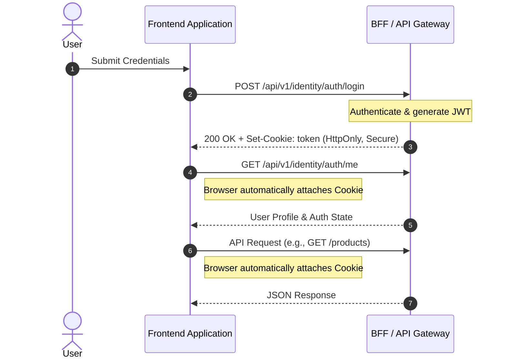

# Frontend Communication and Authentication

## 1. The Problem

**What's not working?**  
Storing JSON Web Tokens (JWTs) in `localStorage` or `sessionStorage` exposes them to client-side JavaScript. Additionally, the frontend application currently lacks a secure, standardized pattern for handling shared global concerns like authentication.

**What's at stake?**  
If we continue exposing raw JWTs to the client, an attacker injecting malicious code into the frontend could easily extract the tokens via a Cross-Site Scripting (XSS) attack, leading to complete account compromise.

---

## 2. What We Decided

**The core approach:**  
Use a Backend-For-Frontend (BFF) or Gateway to manage authentication state via `HttpOnly` cookies.

**Key changes:**
- The **Frontend application** relies on an endpoint to determine authentication state instead of parsing local tokens.
- A **BFF/Gateway** manages an `HttpOnly` cookie for authentication instead of exposing raw JWTs to the frontend.

**What stays the same:**  
Backend APIs remain the absolute source of truth for business data.

---

## 2.1. Visual Overview

> *Diagrams to understand the architecture at a glance.*

### High-Level Flow / Components

---

## 3. Why This Approach

**Primary reasons:**
1. **XSS Mitigation:** The `HttpOnly` flag prevents client-side scripts from accessing the cookie (`document.cookie`), completely protecting the token from theft even if the frontend has an XSS vulnerability.
2. **Simplified Frontend Architecture:** The browser natively attaches the authentication cookie to outgoing API requests. The frontend no longer needs complex logic to store, retrieve, or manually inject tokens into `Authorization` headers.
3. **Centralized Security Perimeter:** The Backend-For-Frontend (BFF) strictly dictates the cookie lifecycle (`Secure`, `SameSite=Strict`, `max-age`), cleanly decoupling the frontend from sensitive credential handling.

---

## 4. Trade-offs

| Pros | Cons |
|-------|-------|
| Eliminates token theft vulnerabilities via XSS. | Requires strict CORS (`withCredentials: true`) configuration across the platform. |
| Radically simplifies frontend architecture and state management. | Frontend cannot decode the JWT payload to read user data. |
| Centralizes security management at the BFF layer. | Frontend must rely on a dedicated network request (e.g., `/api/v1/identity/auth/me`) to determine authentication state. |

---

## 5. What Needs to Change

**New components/modules to build:**
- The frontend must implement logic to fetch user profile details and current authentication state from a dedicated BFF endpoint (e.g., `/me`).
- BFF endpoints must be refactored to set and clear `HttpOnly`, `Secure`, and `SameSite` cookies upon login, refresh, and logout.

**Changes to existing systems:**
- Frontend HTTP clients (like `fetch` or `axios`) must be updated globally to include credentials (`withCredentials: true`) so cookies are transmitted.

**Team impact:**
- Frontend developers will no longer handle raw JWTs or authorization headers and must instead rely on the dedicated endpoint for authentication state.

---

## 6. Migration Plan

- **Phase 1:** Implement cookie generation, parsing, and clearing on the Backend/BFF. Ensure endpoints gracefully fall back to JSON body tokens if cookies are missing.
- **Phase 2:** Update the frontend HTTP clients to send credentials. Implement a `/me` endpoint for the frontend to load initial authentication state securely.
- **Phase 3:** Fully deprecate the return of raw JWTs in JSON bodies.

**Rollback strategy:**  
Retain tokens in the JSON response payload alongside the new cookies during Phase 1 and Phase 2. If cookie delivery fails due to unforeseen CORS or domain issues, frontend clients can temporarily revert to manually extracting the tokens from the JSON body and appending `Authorization` headers.

---

## 7. Related Documents

- [ADR-001_authentication-authorization](ADR_001-Identity-module-architecture.md)
