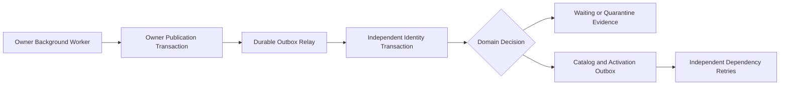

# ADR-004: Security manifests with local ACID and durable delivery

**Status:** Accepted
**Date:** 2026-10-08
**Scope:** Owner publication, identity catalog activation, authorization, and service extraction

## Context

Each bounded context owns its complete security declaration. Publishing directly at startup loses recovery evidence, while partial scope and authority writers can expose inconsistent definitions. Catalog registration must remain atomic without sharing an owner transaction across service boundaries.

## Decision

Use two local ACID transactions connected by durable, idempotent delivery. Owner publication commits its coordination row and full outbox payload together. Identity independently commits catalog changes, candidate outcome, receipt, module watermark, catalog revision, and activation outbox event.

| Responsibility | Owner |
| :--- | :--- |
| Immutable declaration and explicit release revision | Owner application layer |
| Publication orchestration | `Publish{Owner}SecurityManifestUseCase` |
| Lease timing, serialization, row locking, enqueue | Framework publication port implemented by neutral outbox infrastructure with an owner datasource binding |
| Event factory and local event delivery | `store` assembly and shared integration events |
| Revision, ownership, graph, conservation, and lifecycle invariants | Identity `SecurityCatalog` aggregate and pure policies |
| Loading, mapping, and saving validated state | Identity repository port and persistence adapter |
| Waiting candidate discovery | Application query port and bounded specification |
| Individual retry and transaction boundary | Identity command handler with `REQUIRES_NEW` |
| Effective authorization data | Immutable persisted snapshots in a fresh repeatable-read identity primary transaction |

Publication locks a seeded row through JPA. A lower revision returns `SUPERSEDED`, an equal revision with another digest returns `CONFLICT`, and an identical snapshot enqueues only when its repair interval expires. Additive database guards protect these invariants against legacy writers during rolling deployment.

Identity serializes activation on the catalog singleton. Canonical payload identity is pinned by module/revision; conflicting attempts are separate evidence and never overwrite history or the original receipt. Event ID deduplication and semantic revision/digest deduplication are independent, so inbox cleanup and new repair IDs cannot repeat activation.

Quarantined candidates do not advance accepted revision ordering. Permanent defects are checked before dependency waiting. Omissions, ownership changes, parent changes, cycles, and reactivation of retired definitions are rejected by domain decisions.

Provider lifecycle, immutable owner, source revision, and local administrative enablement are separate metadata. Activation preserves authority UUIDs, role links, local disablement, and retirement tombstones. Effective scope checks traverse every ancestor; retired or locally disabled authorities are excluded from authorization.

## Runtime flow

Startup remains asynchronous, full repair runs every five minutes, and a bounded waiting sweep runs every 30 seconds. An identity activation event triggers reconsideration through its durable outbox. Each candidate command reloads current state and commits independently; failures are caught after its transaction ends.

Outbox listeners remain synchronous. Durable waiting and quarantine return normally; transient database and lock failures propagate to the relay. Identity's own manifest also uses an independent consumer transaction, so consumer failure does not poison the source outbox transaction.

## Authorization and extraction

Online decisions use fresh repeatable-read transactions on identity's primary. Decisions beginning after retirement commits observe retirement; already running decisions may finish. Identity failure denies affected operations, with no stale authorization cache or token-role fallback.

Type ancestry does not prove resource-instance ownership. Existing owner capabilities continue checking whether a child resource belongs to the actor's resource.

The versioned `SecurityManifestEnvelope` exposes a stable logical type, producer, event ID, timestamp, supplied digest, and complete manifest. Java class names remain internal to local outbox serialization. A future network adapter must authenticate producers, enforce owner-specific permissions, and acknowledge only after identity commits; a digest provides integrity, not authentication.

## Consequences

Activation is locally atomic and replay-safe; owner and identity commits have no global rollback. Delivery and dependency convergence are eventual and require functioning workers and correction of permanent defects.

Singleton catalog locking bounds concurrent registration throughput. Partitioning is deferred until contention is measured. Fresh online primary reads trade additional database work for immediate observation of committed retirement.

Deploy and restore controls must compare applied revision/digest against an approved external release baseline before enabling sensitive features. Legacy partial-manifest listeners and command handlers are disabled; old event contracts remain only for compatibility with stored payloads.

See the [technical specification](../../../../spec/system/security-manifest-consistency-tech-spec.md) and [operational runbook](../../../../runbook/security-manifest-consistency.md) for contracts, verification, and release steps.
