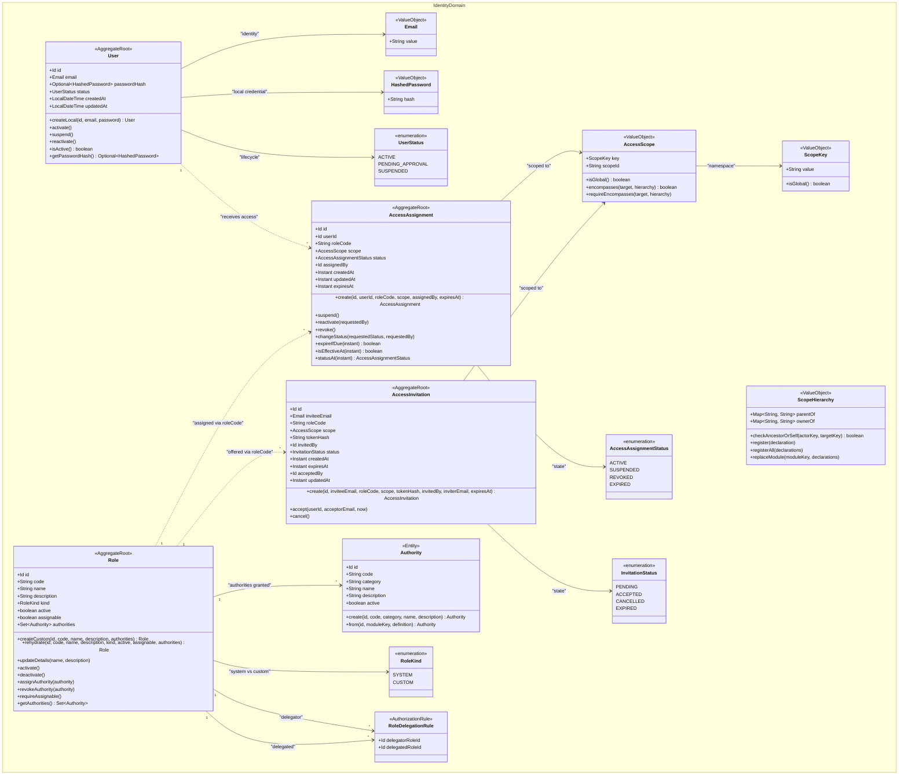
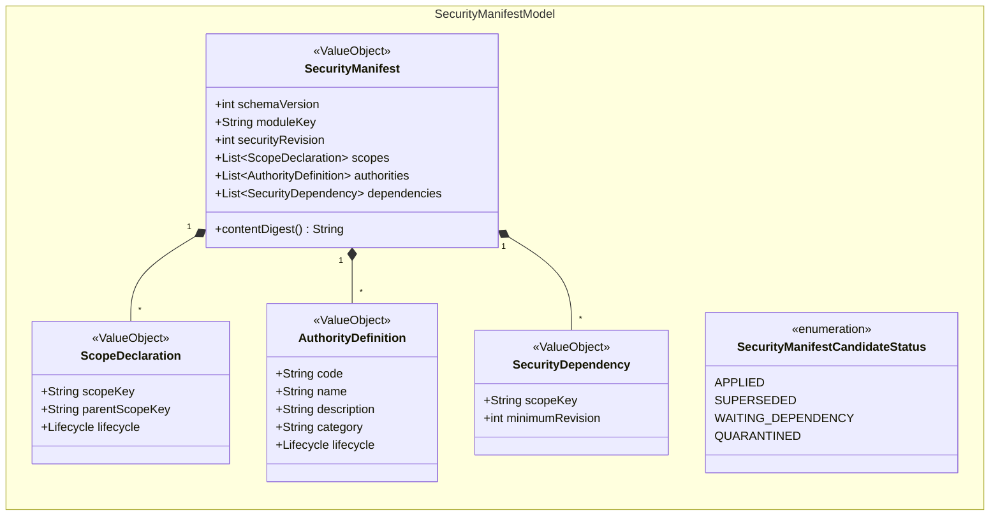
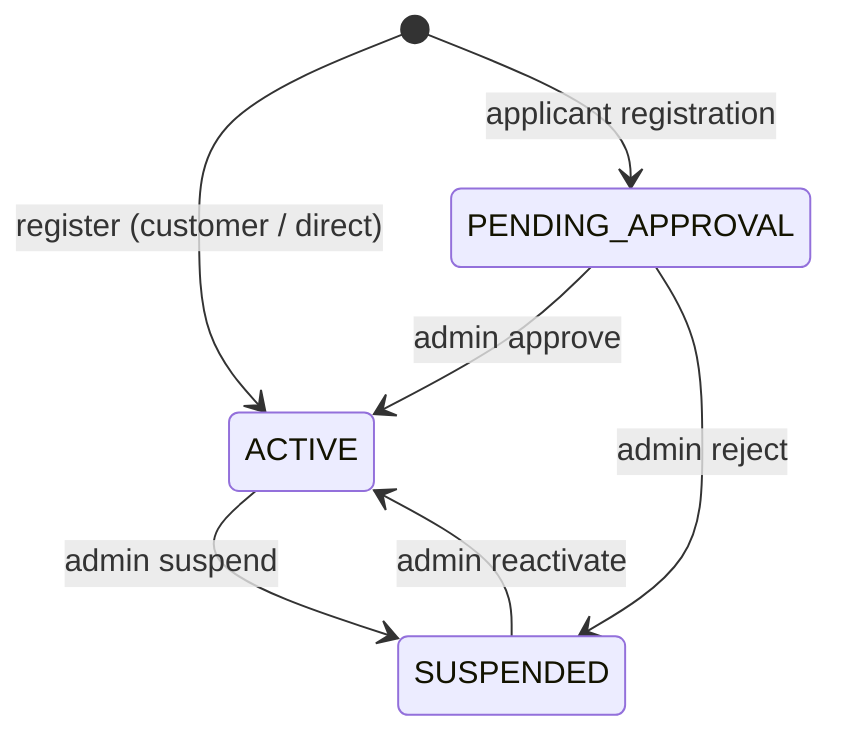
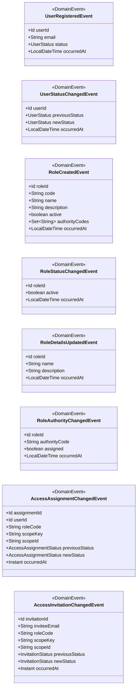
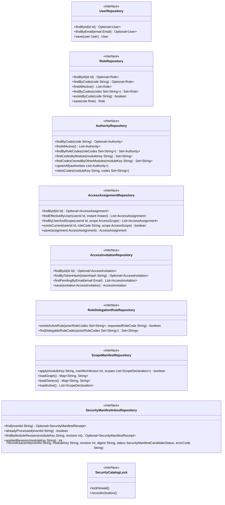

# Identity Domain Aggregate Diagram

This diagram reflects the identity domain model for authentication, authorization,
scoped access delegation, and distributed security manifest synchronization.

## Class Diagram

### Core Identity and Access Aggregates

---

### Security Manifest and Dynamic Catalog Model

---

## Entity Relationship

```mermaid
erDiagram
    USERS {
        bigserial id PK
        varchar uuid UK
        varchar email UK
        varchar password_hash "nullable"
        varchar status
        timestamp created_at
        timestamp updated_at
    }

    ROLES {
        bigserial id PK
        varchar uuid UK
        varchar code UK
        varchar name
        varchar description
        varchar role_kind
        boolean active
        boolean assignable
    }

    AUTHORITIES {
        bigserial id PK
        varchar uuid UK
        varchar code UK
        varchar category
        varchar name
        varchar description
        boolean active
    }

    ROLE_AUTHORITIES {
        bigint role_id FK
        bigint authority_id FK
    }

    ROLE_DELEGATION_RULES {
        bigserial id PK
        bigint delegator_role_id FK
        bigint delegated_role_id FK
    }

    ACCESS_ASSIGNMENTS {
        bigserial id PK
        varchar uuid UK
        bigint user_id FK
        bigint role_id FK
        varchar scope_key
        varchar scope_id
        varchar status
        varchar assigned_by
        timestamp created_at
        timestamp updated_at
        timestamp expires_at
    }

    ACCESS_INVITATIONS {
        bigserial id PK
        varchar uuid UK
        varchar invitee_email
        bigint role_id FK
        varchar scope_key
        varchar scope_id
        varchar token_hash UK
        varchar invited_by
        varchar status
        timestamp created_at
        timestamp updated_at
        timestamp expires_at
        varchar accepted_by
    }

    REFRESH_SESSIONS {
        bigserial id PK
        bigint user_id FK
        varchar token_hash UK
        varchar token_family_id
        timestamp expires_at
        timestamp revoked_at
        bigint replaced_by_id FK
        timestamp created_at
        timestamp last_used_at
        varchar assignment_uuid
        varchar scope_key
        varchar scope_id
    }

    EXTERNAL_IDENTITIES {
        bigserial id PK
        bigint user_id FK
        varchar issuer
        varchar subject
        timestamp linked_at
    }

    EXTERNAL_ENTITLEMENT_MAPPINGS {
        bigserial id PK
        varchar issuer
        varchar entitlement
        bigint role_id FK
    }

    SECURITY_SCOPE_DEFINITIONS {
        bigserial id PK
        varchar module_key
        varchar scope_key UK
        varchar parent_scope_key
        int manifest_version
        boolean active
        bigint row_version
    }

    SECURITY_MANIFEST_MODULE {
        varchar module_key PK
        int applied_revision
        varchar applied_digest
        bigint row_version
    }

    SECURITY_MANIFEST_INBOX {
        varchar event_id PK
        varchar module_key
        int revision
        varchar content_digest
        timestamp processed_at
        varchar status
        varchar error_code
    }

    SECURITY_CATALOG_STATE {
        bigint id PK
        bigint catalog_revision
        bigint row_version
    }

    USERS ||--o{ ACCESS_ASSIGNMENTS : "has"
    ROLES ||--o{ ACCESS_ASSIGNMENTS : "grants role"
    ROLES ||--o{ ROLE_AUTHORITIES : "has"
    AUTHORITIES ||--o{ ROLE_AUTHORITIES : "mapped to"
    ROLES ||--o{ ROLE_DELEGATION_RULES : "delegator"
    ROLES ||--o{ ROLE_DELEGATION_RULES : "delegated"
    ROLES ||--o{ ACCESS_INVITATIONS : "offered role"
    USERS ||--o{ REFRESH_SESSIONS : "owns sessions"
    USERS ||--o{ EXTERNAL_IDENTITIES : "linked to"
    ROLES ||--o{ EXTERNAL_ENTITLEMENT_MAPPINGS : "mapped from provider"
```

---

## User Status Lifecycle

---

## Domain Events

---

## Repository Ports (Domain Layer)

---

## Core Architectural Rules & Invariants

1. **User Aggregate Decoupling**: The `User` aggregate no longer holds direct references or collections of `Role`. All user access is expressed through independent `AccessAssignment` aggregates.
2. **Platform & Scoped Access Model**: Applications (`CUSTOMER_APP`, `SELLER_PORTAL`, `ADMIN_CONSOLE`) and scopes (`merchant.account`, `merchant.storefront`, `inventory.fulfillment-location`) are governed by namespaced `ScopeKey` values rather than an isolated `PLATFORM_ROLES` table.
3. **Role Kinds & System Immutability**: Roles are categorized by `RoleKind` (`SYSTEM` vs `CUSTOM`). `SYSTEM` roles (such as seeded system roles) cannot be updated, activated/deactivated, or have their authorities modified through runtime APIs.
4. **Hierarchical Scope Encompassing**: An actor possessing access in an ancestor scope (e.g., `merchant.account`) can administer or encompass child scopes (e.g., `merchant.storefront`) via `AccessScope.encompasses()` evaluated against `ScopeHierarchy`. Cross-scope ownership verification is delegated to `ScopeOwnershipPort`.
5. **Decentralized Security Manifest Synchronization**: Bounded contexts autonomously declare their scopes, authorities, and version dependencies at startup. The Identity module validates SHA-256 digests, ensures backward compatibility, rejects scope cycles, and maintains the authoritative security catalog.
