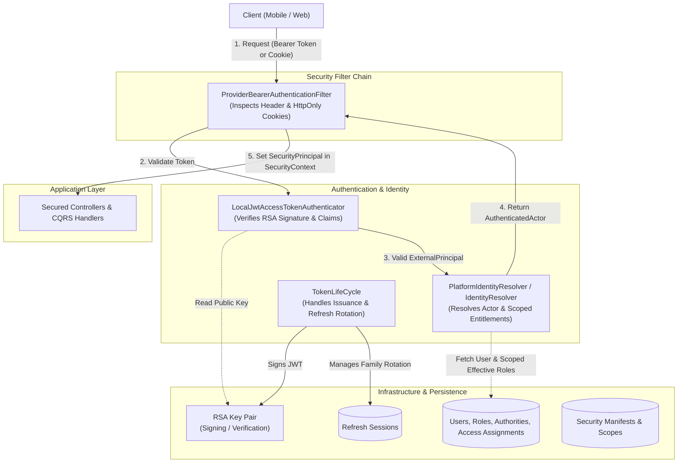
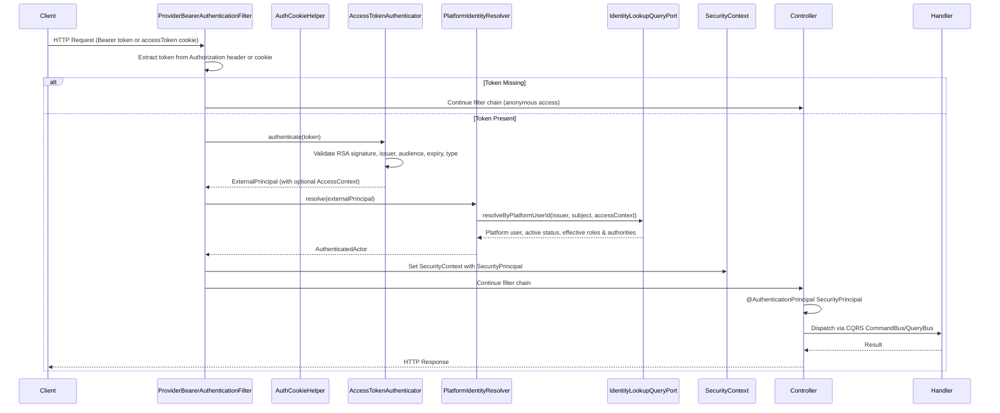
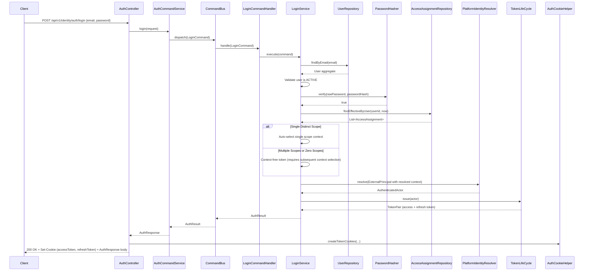
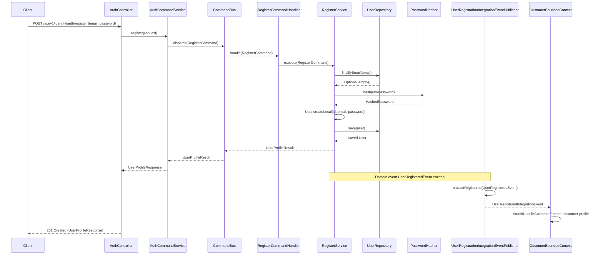
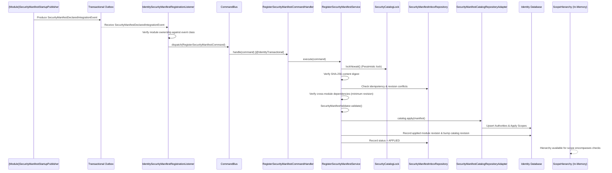
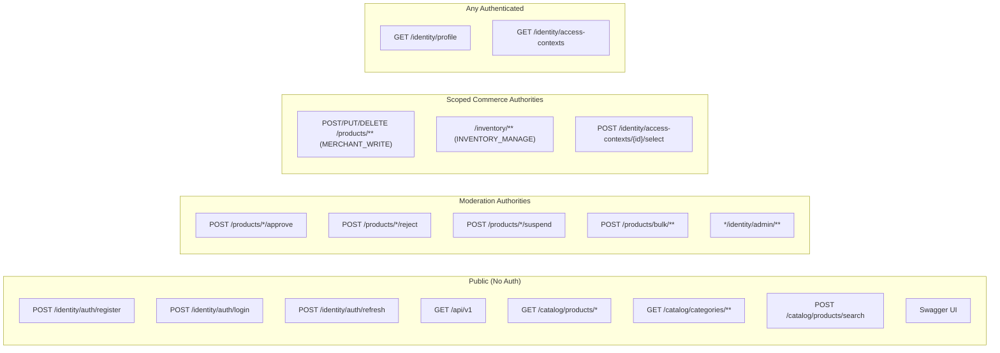
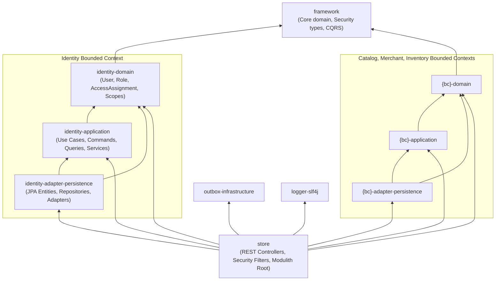

# Identity Security Architecture Diagram

This diagram describes the authentication, authorization, access context resolution,
and distributed security manifest synchronization architecture for the platform.

## Overview: Provider-Neutral Authentication Architecture

---

## Authentication Flow

---

## Login Flow

---

## Registration Flow

---

## Distributed Security Manifest Synchronization Flow

---

## Authorization: Endpoint Access Matrix

---

## Hexagonal Module Architecture & Dependencies

---

## Notes

- **Decoupled Roles**: The `User` aggregate does not store roles or refresh tokens. Roles and scopes are assigned dynamically via `AccessAssignment`.
- **HttpOnly Cookies & Bearer Tokens**: `ProviderBearerAuthenticationFilter` inspects both the `Authorization: Bearer` header and `accessToken` cookies, ensuring secure browser execution while supporting headless API clients.
- **Scope Hierarchy**: Scope parent-child relationships (e.g. `merchant.storefront` owned by `merchant.account`) are published via manifests and cached in `ScopeHierarchy` for zero-IO permission encompassing checks.
- **Provider Neutrality**: Token parsing emits `ExternalPrincipal`, resolved into `AuthenticatedActor` by `PlatformIdentityResolver`, allowing easy migration from local RSA JWTs to external OIDC providers (Keycloak, Auth0, Cognito).
