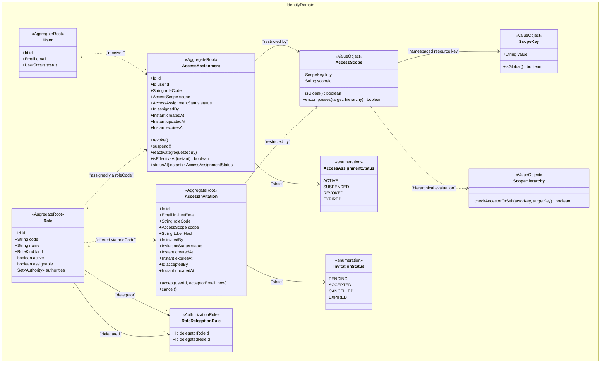
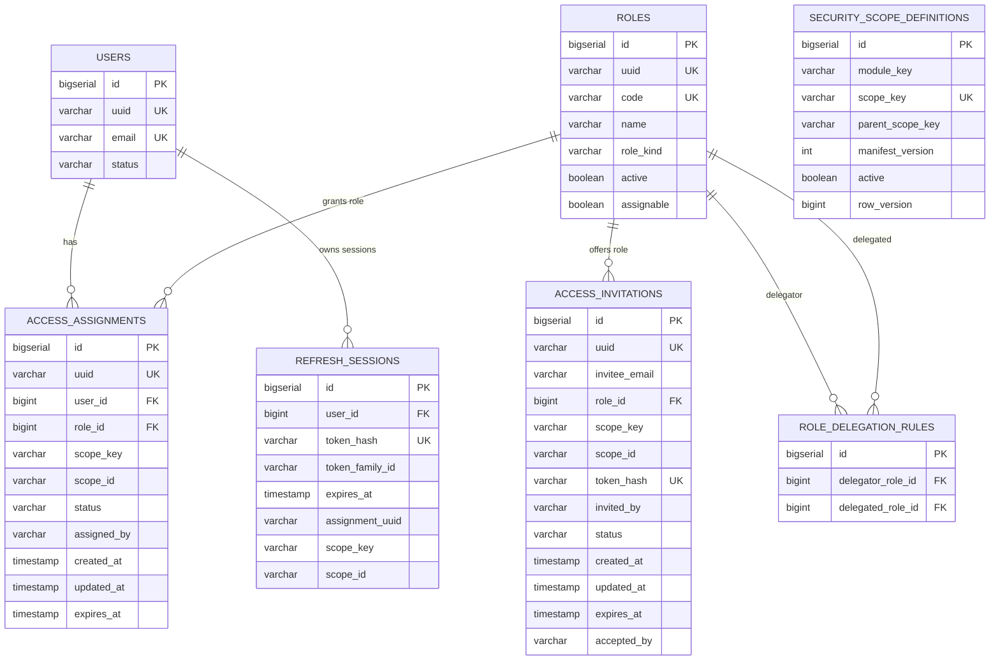

# Platform-Scoped Identity Domain Aggregates

This diagram reflects the extended identity domain model introducing platform-scoped and resource-scoped RBAC, as defined in ADR-003 and implemented in the codebase.

## Class Diagram

### Scoped Platform Access Aggregate



---

## Entity Relationship



---

## Domain Aggregate & Value Object Descriptions

### 1. `AccessScope` (Value Object)
Defines the boundary of an access grant. It consists of:
- A namespaced `ScopeKey` (for example, `merchant.account`, `merchant.storefront`, `inventory.fulfillment-location`, or `global`).
- A `scopeId` representing the specific business aggregate identifier (or `*` for global scope).

### 2. `ScopeHierarchy` (In-Memory Tree & Dynamic Catalog)
Maintains the graph of scope relationships (e.g., `merchant.account` is the parent of `merchant.storefront`).
When an actor operates with a parent scope, `AccessScope.encompasses(target)` allows managing descendants automatically. Cross-module verification of resource links is performed via `ScopeOwnershipPort`.

### 3. `AccessAssignment` (Aggregate Root)
Binds a `User` to a `Role` within an `AccessScope`.
Replaces static user-to-role mappings. A single user can have separate assignments:
- `CUSTOMER` role in `global` scope.
- `MERCHANT_OWNER` in scope `merchant.account` with ID `merchant-123`.
- `STORE_MANAGER` in scope `merchant.storefront` with ID `store-456`.

### 4. `AccessInvitation` (Aggregate Root)
Secures staff onboarding. Records an invitation for an email address to receive a role within a specific scope.
Stores a cryptographic `tokenHash` and expires after a defined TTL. Upon acceptance by the intended user, creates an `AccessAssignment`.

### 5. `RoleDelegationRule` (Authorization Rule)
Explicit active-role relationship declaring whether a delegator role can assign or invite another role. Evaluated by `RoleDelegationPolicy` during access granting and invitation creation.

---

## Flowcharts

### Context-Bound Token Issuance Flow

```mermaid
flowchart TD
    Login[User Authenticates with Email & Password] --> LoadAssignments[Load Active AccessAssignments for User]
    LoadAssignments --> GroupScopes[Group Assignments by Scope: scopeKey + scopeId]
    GroupScopes --> CheckMulti{Distinct Scopes Count?}
    
    CheckMulti -- 0 --> FreeToken0[Issue Context-Free Token Pair]
    CheckMulti -- 1 Scope --> AutoSelect[Auto-select Scope & Combine Effective Roles]
    CheckMulti -- >1 Scopes --> SelectionToken[Issue Context-Free Token Pair]
    
    SelectionToken --> PromptSelect[Client Calls GET /identity/access-contexts]
    PromptSelect --> ClientSelects[User Selects Target Merchant/Store Scope]
    ClientSelects --> PostSelect[POST /identity/access-contexts/{assignmentId}/select]
    PostSelect --> CombineRoles[Combine Effective Roles in Selected Scope]
    
    AutoSelect --> IssueBound[Issue Context-Bound Access & Refresh Token]
    CombineRoles --> IssueBound
    IssueBound --> SetCookies[Set HttpOnly Cookies & Return 200 OK]
```
