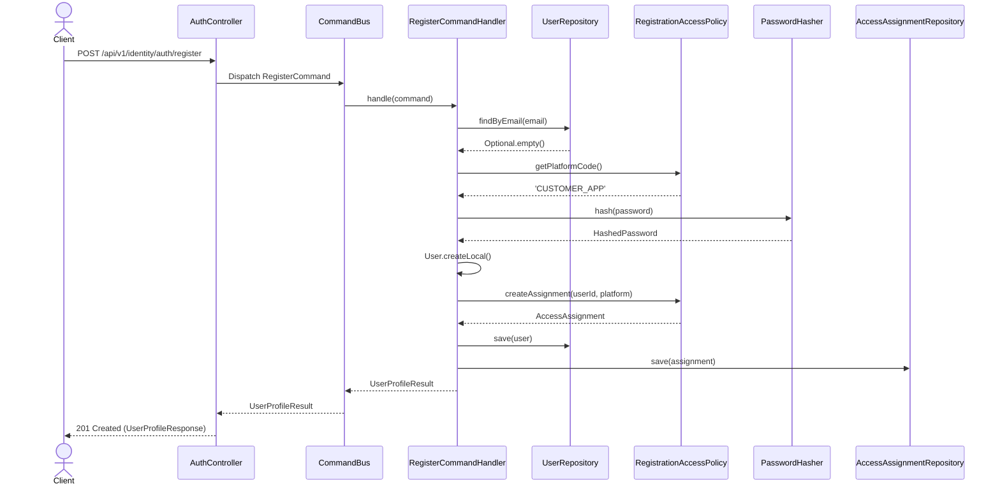
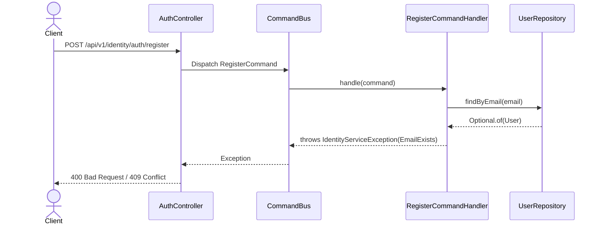
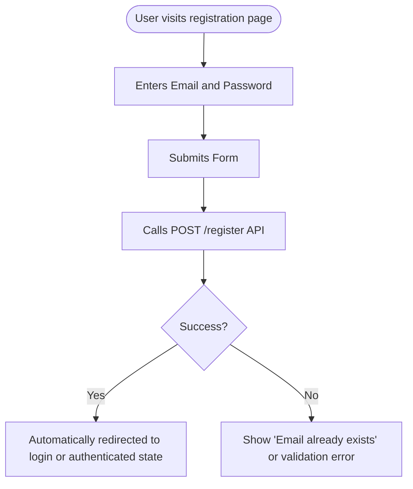
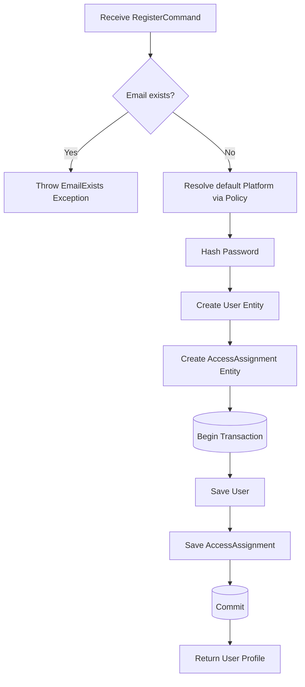

# Feature: Default User Registration

> **Description:** Allows new users (like customers) to register for an account using their email and password, automatically granting them the foundational platform access they need.

---

## 1. Business Rules

| # | Rule | Description |
|---|------|-------------|
| R1 | Unique Email | A user cannot register with an email address that is already active in the system. |
| R2 | Secure Password | Passwords must not be stored in plaintext. They must be hashed using a strong algorithm (e.g., BCrypt). |
| R3 | Default Access | Upon registration, a user must automatically be granted a default global access assignment (e.g., `CUSTOMER` on `CUSTOMER_APP`) determined by the `RegistrationAccessPolicy`. |
| R4 | Atomic Creation | The creation of the `User` record and the initial `AccessAssignment` must be performed within a single database transaction. |

---

## 2. Acceptance Criteria

- [ ] AC1: Given a valid email and password, when a user registers, their account is created with an `ACTIVE` status and the password is securely hashed.
- [ ] AC2: Given a successful registration, the system automatically assigns the user the default platform role defined in the system policy.
- [ ] AC3: Given an email that already exists in the system, when a user attempts to register, the system rejects the request with an `EmailExists` error and does not create duplicate records.
- [ ] AC4: A successful registration returns the user's ID, email, status, and creation date, but never returns the hashed password.

---

## 3. Sequence Diagrams

### 3.1 Happy Path Flow



### 3.2 Error Flow (Duplicate Email)



### 3.3 Multi-Entity / Cross-Bounded-Context Flow

*(Not applicable for basic local registration, as it remains entirely within the Identity bounded context without emitting external domain events in this flow)*

---

## 4. Flow Charts

### 4.1 Workflow



### 4.2 Business Logic Flow



---

## 5. Data Contracts

### 5.1 Request

```json
{
  "email": "user@example.com",
  "password": "securePassword123!"
}
```

### 5.2 Response (Success)

```json
{
  "id": "123e4567-e89b-12d3-a456-426614174000",
  "email": "user@example.com",
  "status": "ACTIVE",
  "createdAt": "2026-06-30T10:00:00Z"
}
```

### 5.3 Response (Error)

```json
{
  "code": "IDENTITY_EMAIL_EXISTS",
  "message": "User with this email already exists",
  "details": {
    "email": "user@example.com"
  }
}
```

---

## 6. Related Documents

- [Identity Management Architecture](../architecture/IDENTITY.md) (Assuming path based on standard layout)
