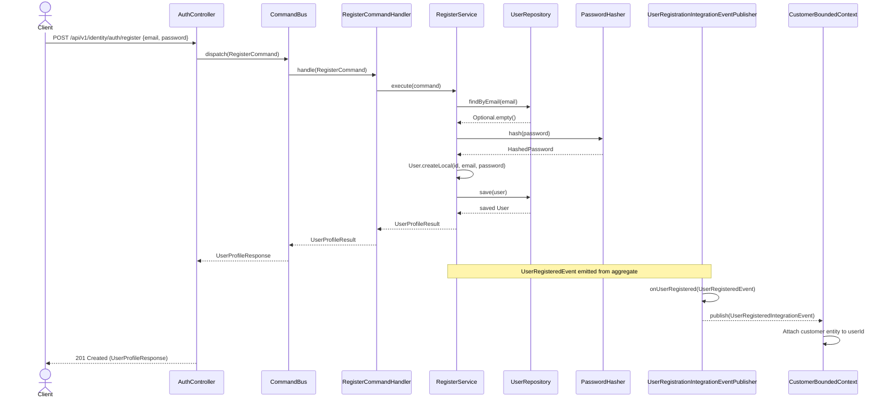
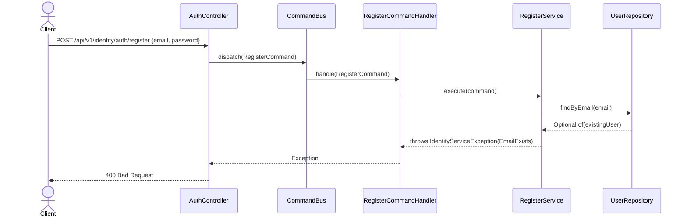

# Feature: Default User Registration

> **Description:** Allows new users to register for an account using their email and password, creating their identity record and publishing integration events for downstream modules (such as the Customer bounded context) to establish default access.
> **Actors:** User, System
> **Tags:** `@[identity]` `@[auth]` `@[registration]`

---

## 1. Business Rules

| # | Rule | Description |
|---|------|-------------|
| R1 | Unique Email | A user cannot register with an email address that is already registered in the system. Violations return an `EmailExists` error. |
| R2 | Secure Password | Passwords must not be stored in plaintext. They must be hashed using BCrypt. |
| R3 | User Creation | New local users are created with `ACTIVE` status and immediate timestamp records. |
| R4 | Integration Notification | Registration emits `UserRegisteredEvent` locally, which triggers `UserRegistrationIntegrationEventPublisher` to notify downstream contexts (e.g. `customer` module). |

---

## 2. Acceptance Criteria

- [ ] AC1: Given a valid email and password, when a user registers, their account is created with `ACTIVE` status and the password is securely hashed.
- [ ] AC2: Given an email that already exists, the system rejects the registration with an `EmailExists` error (`400 Bad Request`).
- [ ] AC3: A successful registration returns the user's ID, email, status, and creation timestamp, never exposing the password hash.
- [ ] AC4: A `UserRegisteredIntegrationEvent` is published to the application event bus.

---

## 3. Sequence Diagrams

### 3.1 Happy Path Flow


```mermaid
sequenceDiagram
    actor Client
    participant AuthController
    participant CommandBus
    participant RegisterCommandHandler
    participant RegisterService
    participant UserRepository
    participant PasswordHasher
    participant IntegrationPublisher as UserRegistrationIntegrationEventPublisher
    participant CustomerModule as CustomerBoundedContext
    
    Client->>AuthController: POST /api/v1/identity/auth/register {email, password}
    AuthController->>CommandBus: dispatch(RegisterCommand)
    CommandBus->>RegisterCommandHandler: handle(RegisterCommand)
    RegisterCommandHandler->>RegisterService: execute(command)
    
    RegisterService->>UserRepository: findByEmail(email)
    UserRepository-->>RegisterService: Optional.empty()
    
    RegisterService->>PasswordHasher: hash(password)
    PasswordHasher-->>RegisterService: HashedPassword
    
    RegisterService->>RegisterService: User.createLocal(id, email, password)
    RegisterService->>UserRepository: save(user)
    UserRepository-->>RegisterService: saved User
    
    RegisterService-->>RegisterCommandHandler: UserProfileResult
    RegisterCommandHandler-->>CommandBus: UserProfileResult
    CommandBus-->>AuthController: UserProfileResponse
    
    Note over RegisterService,IntegrationPublisher: UserRegisteredEvent emitted from aggregate
    IntegrationPublisher->>IntegrationPublisher: onUserRegistered(UserRegisteredEvent)
    IntegrationPublisher-->>CustomerModule: publish(UserRegisteredIntegrationEvent)
    CustomerModule->>CustomerModule: Attach customer entity to userId
    
    AuthController-->>Client: 201 Created (UserProfileResponse)
```

### 3.2 Error Flow (Duplicate Email)


```mermaid
sequenceDiagram
    actor Client
    participant AuthController
    participant CommandBus
    participant RegisterCommandHandler
    participant RegisterService
    participant UserRepository
    
    Client->>AuthController: POST /api/v1/identity/auth/register {email, password}
    AuthController->>CommandBus: dispatch(RegisterCommand)
    CommandBus->>RegisterCommandHandler: handle(RegisterCommand)
    RegisterCommandHandler->>RegisterService: execute(command)
    
    RegisterService->>UserRepository: findByEmail(email)
    UserRepository-->>RegisterService: Optional.of(existingUser)
    
    RegisterService-->>RegisterCommandHandler: throws IdentityServiceException(EmailExists)
    RegisterCommandHandler-->>AuthController: Exception
    AuthController-->>Client: 400 Bad Request
```

---

## 4. Data Contracts

### 4.1 Request

```json
{
  "email": "customer@example.com",
  "password": "SecurePassword123!"
}
```

### 4.2 Response (201 Created)

```json
{
  "id": "123e4567-e89b-12d3-a456-426614174000",
  "email": "customer@example.com",
  "status": "ACTIVE",
  "createdAt": "2026-10-08T14:30:00Z"
}
```

### 4.3 Error Response (Email Exists)

```json
{
  "type": "about:blank",
  "title": "Bad Request",
  "status": 400,
  "detail": "User with this email already exists",
  "instance": "/api/v1/identity/auth/register",
  "code": "idt.service.user.email_exists"
}
```
