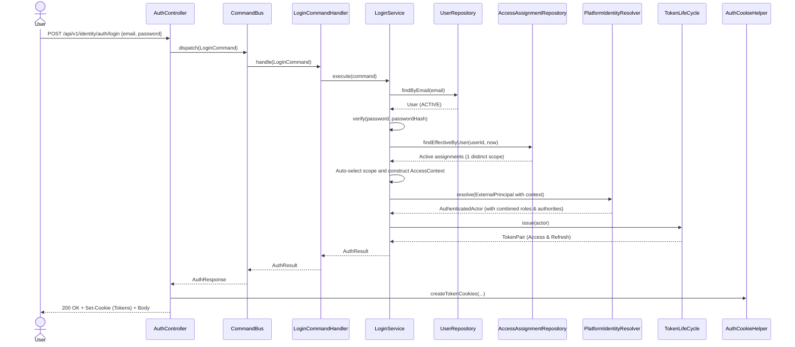
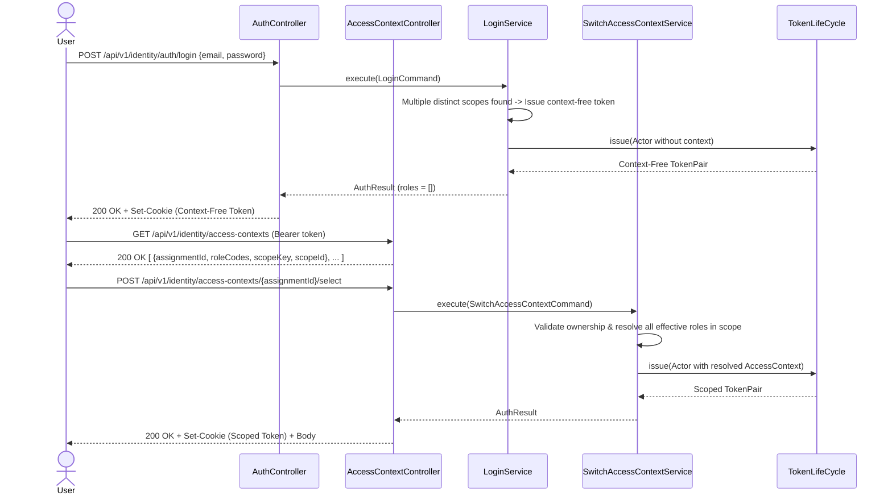

# Feature: User Login

> **Description:** Allows registered users to authenticate via email and password, combines their effective roles within a single business scope, handles scope selection when several merchant or storefront contexts exist, and issues secure access and refresh tokens (delivered in both JSON bodies and HttpOnly cookies).
> **Actors:** User, System
> **Tags:** `@[identity]` `@[auth]` `@[login]`

---

## 1. Business Rules

| # | Rule | Description |
|---|------|-------------|
| R1 | Valid Credentials | Users must provide a valid email and matching password to authenticate. Failing this returns an `InvalidCredentials` error. |
| R2 | Active Account | The user's account status must be `ACTIVE`. Suspended accounts cannot log in. |
| R3 | Context Identity | A context is identified by `scopeKey + scopeId` (e.g. `merchant.account:merchant-123`). Multiple role assignments in the same scope are merged into one context. |
| R4 | Role Combination | All effective assignments in the selected scope contribute their roles and authorities to the authenticated actor. The user never chooses a role. |
| R5 | Single Context Auto-Selection | If active assignments resolve to exactly one distinct scope, the system automatically selects it and issues a scoped token containing the combined roles. |
| R6 | Multiple Context Handling | If active assignments resolve to several distinct scopes (or 0 scopes), the system issues a context-free token. The authenticated user then lists available contexts and selects one. |
| R7 | Explicit Context Selection | Calling `POST /api/v1/identity/access-contexts/{assignmentId}/select` switches the user's active session context and issues a new context-bound token pair. |
| R8 | Dual Token Delivery | Tokens are delivered both as JSON response fields and as `HttpOnly`, `Secure`, `SameSite` cookies for web clients. |

---

## 2. Acceptance Criteria

- [ ] AC1: Given several active role assignments in one scope, login auto-selects that scope and the token contains every effective role in it.
- [ ] AC2: Given active assignments across multiple scopes, login returns a context-free token with an empty roles set.
- [ ] AC3: A user with a context-free token can call `GET /api/v1/identity/access-contexts` to list their available contexts.
- [ ] AC4: Context listing returns one item per distinct scope with an anchor `assignmentId` and combined `roleCodes`.
- [ ] AC5: Calling `POST /api/v1/identity/access-contexts/{assignmentId}/select` validates user ownership and issues a scoped token with combined roles.
- [ ] AC6: Given invalid credentials or a suspended account, the system rejects the login attempt with `401 Unauthorized`.
- [ ] AC7: Auth responses attach `Set-Cookie` headers for `accessToken` and `refreshToken`.

---

## 3. Sequence Diagrams

### 3.1 Happy Path Flow (Single Context Auto-Selection)



### 3.2 Happy Path Flow (Multiple Contexts & Explicit Selection)



---

## 4. Data Contracts

### 4.1 Login Request

```json
{
  "email": "user@example.com",
  "password": "securePassword123!"
}
```

### 4.2 Login / Context Selection Response (Success)

```json
{
  "accessToken": "eyJhbGciOiJSUzI1NiIsInR5cCI6ImF0K2p3dC...",
  "refreshToken": "7c9e6679-7425-40de-944b-e07fc1f90ae7",
  "expiresInMs": 900000,
  "userId": "123e4567-e89b-12d3-a456-426614174000",
  "email": "user@example.com",
  "roles": [
    "MERCHANT_OWNER",
    "STORE_MANAGER"
  ],
  "status": "ACTIVE"
}
```

*Note: `roles` is empty when a context-free token is returned due to multiple scopes requiring user selection.*

### 4.3 List Available Contexts Request & Response

**Endpoint:** `GET /api/v1/identity/access-contexts`  
**Headers:** `Authorization: Bearer <token>` or `Cookie: accessToken=<token>`

**Response:**
```json
[
  {
    "assignmentId": "b1b707e2-cfc3-424b-97e3-0dcb65b0ad11",
    "roleCodes": [
      "MERCHANT_OWNER"
    ],
    "scopeKey": "merchant.account",
    "scopeId": "merch-1001",
    "expiresAt": null
  },
  {
    "assignmentId": "c2c808f3-ded4-535c-a8f4-1edc76c1be22",
    "roleCodes": [
      "STORE_MANAGER"
    ],
    "scopeKey": "merchant.storefront",
    "scopeId": "store-2002",
    "expiresAt": null
  }
]
```

### 4.4 Switch / Select Context Request

**Endpoint:** `POST /api/v1/identity/access-contexts/{assignmentId}/select`  
**Headers:** `Authorization: Bearer <token>` or `Cookie: accessToken=<token>`

Returns the same response format as **4.2**, updating both access and refresh cookies.

### 4.5 Error Response

```json
{
  "type": "about:blank",
  "title": "Unauthorized",
  "status": 401,
  "detail": "Invalid email or password",
  "instance": "/api/v1/identity/auth/login",
  "code": "idt.service.auth.invalid_credentials"
}
```
