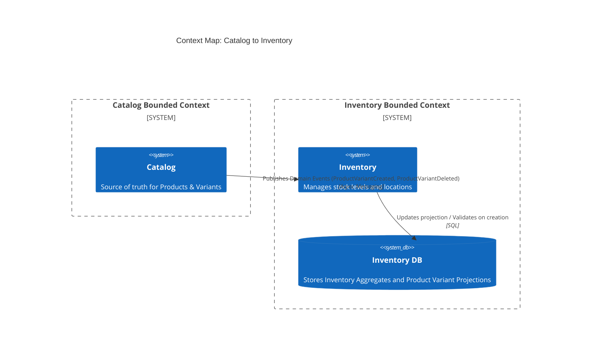
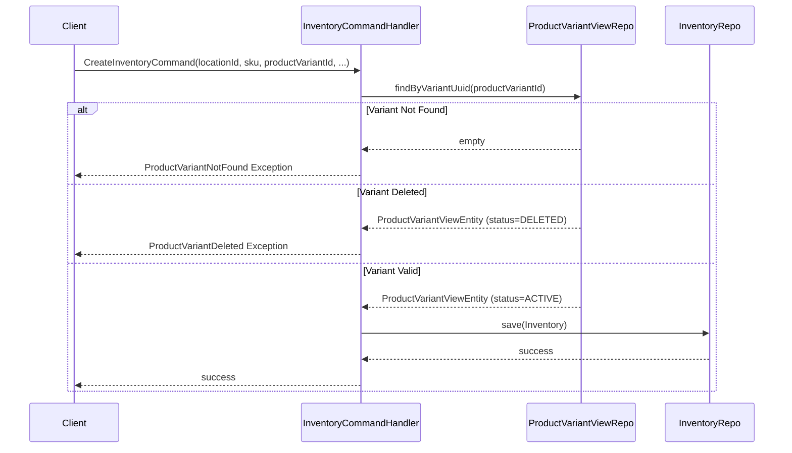
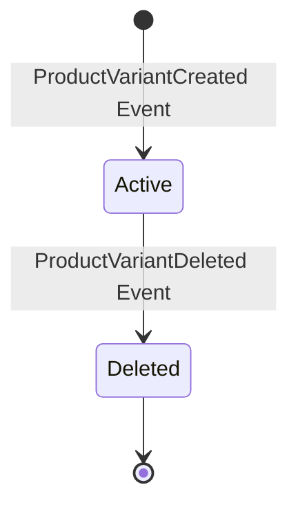

# Inventory Owned Products

---

## 1. The Problem

**What's not working?**  
When creating a new inventory item, we need to ensure the referenced product variant exists and is not deleted. The Inventory context should not rely on synchronous calls to the Catalog context for this validation, as it tightly couples the contexts and degrades resilience and performance.

**What's at stake?**  
Without validating product variants, invalid or deleted products could end up in the inventory system, causing downstream processing errors and inconsistent data states. Conversely, using synchronous cross-domain calls would introduce tight coupling and potential cascading failures across bounded contexts.

---

## 2. What We Decided

**The core approach:**  
The Inventory context will maintain a read-optimized projection (local copy) of product variants by subscribing to domain events from the Catalog context.

**Key changes:**
- Introduce `ProductVariantViewEntity` and `ProductVariantViewJpaRepository` within the Inventory infrastructure to store projected product variant data.
- Modify `CreateInventoryCommandHandler` to validate the `productVariantId` against the local projection before allowing inventory creation.
- Add specific domain exceptions (`ProductVariantNotFound`, `ProductVariantDeleted`) to handle validation failures.
- Update `InventoryModule` dependencies to explicitly allow consumption of `catalog::events`.

**What stays the same:**  
The core Inventory aggregate structure and other commands remain unchanged. The source of truth for product data continues to reside in the Catalog context.

---

## 2.1. Visual Overview

> *Diagrams to understand the architecture at a glance.*

### Domain Bounded Context & Context Map

The Inventory context needs a local representation of Catalog data to enforce the business rule that inventory can only exist for valid products. 

### High-Level Flow / Components

### Aggregate Lifecycle State Diagram

The local projection lifecycle mirrors the external Catalog domain events:

---

## 3. Why This Approach

**Primary reasons:**
1. **Autonomy and Resilience:** By maintaining a local projection, the Inventory context can validate creation commands even if the Catalog context is temporarily down.
2. **Performance:** Local database lookups for validation are significantly faster than synchronous HTTP/gRPC calls across microservices/modules.
3. **Decoupling:** Follows modular monolith/microservice best practices by relying on async event-driven architecture rather than request/response coupling.

---

## 4. Trade-offs

| Pros | Cons |
|-------|-------|
| High availability for Inventory creation | Eventual consistency (slight delay between Catalog change and Inventory view update) |
| Low latency validation | Data duplication (storing product variant info in Inventory DB) |
| Independent scaling of contexts | Increased complexity in handling event idempotency and ordering |

---

## 5. What Needs to Change

**New components/modules to build:**
- Event listener in Inventory context to consume `catalog::events` and update `ProductVariantViewEntity`.
- `ProductVariantViewEntity` schema management in the database.

**Changes to existing systems:**
- `CreateInventoryCommandHandler` updated to perform validation using the local view repository.
- Error codes and exception handling mechanisms expanded for new validation scenarios in `InventoryServiceError` and `InventoryServiceException`.

---

## 6. Implementation Plan

- **Phase 1:** Define `ProductVariantViewEntity` and its repository. Configure `InventoryModule` to allow dependencies on `catalog::events`.
- **Phase 2:** Update `CreateInventoryCommandHandler` to enforce validation logic. Implement associated service exceptions.
- **Phase 3:** Implement the event listeners to populate the `ProductVariantViewEntity` projection from Catalog events (if not already done).

**Rollback strategy:**  
If the local projection becomes out of sync or fails, we can temporarily disable the variant validation in the command handler and trigger a full rebuild/resync of the projection table from the Catalog's source of truth.

---

## 7. Related Documents

- [Spring Modulith Documentation on Cross-Module Events]
