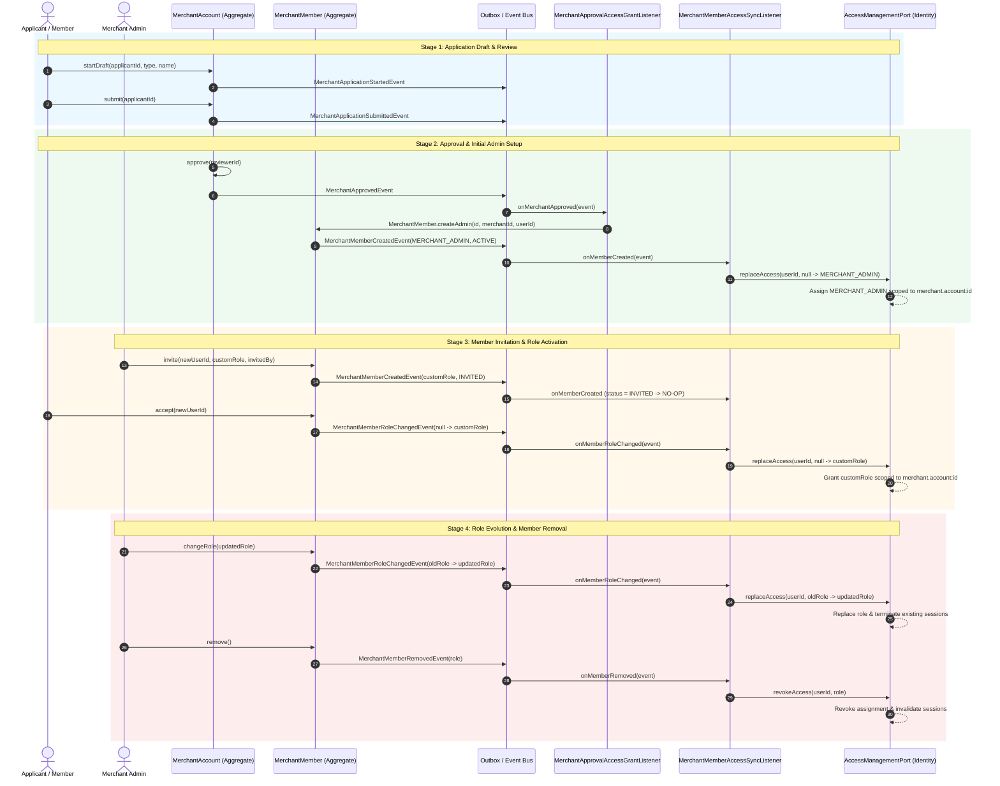
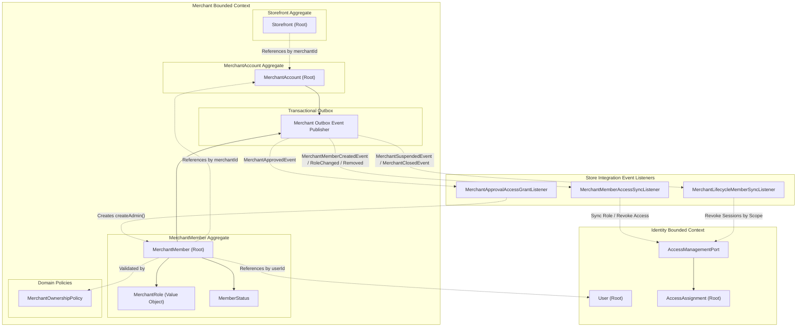
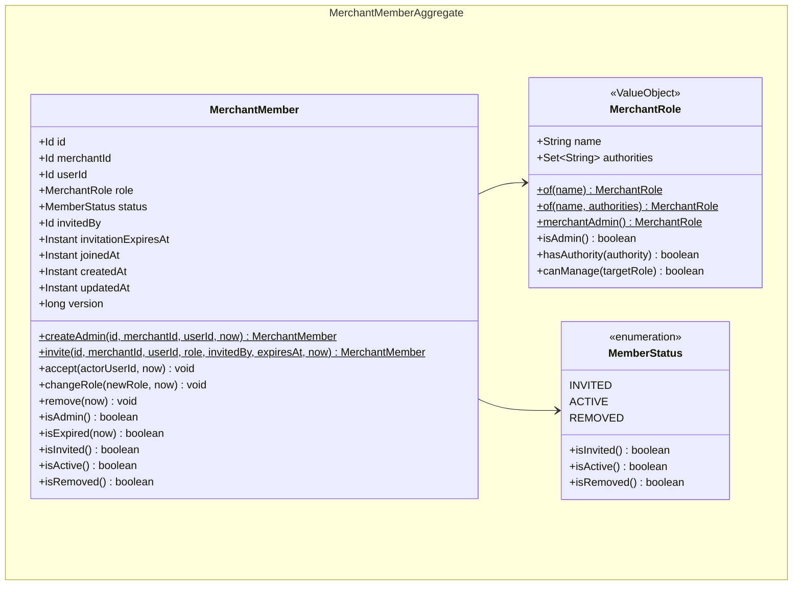
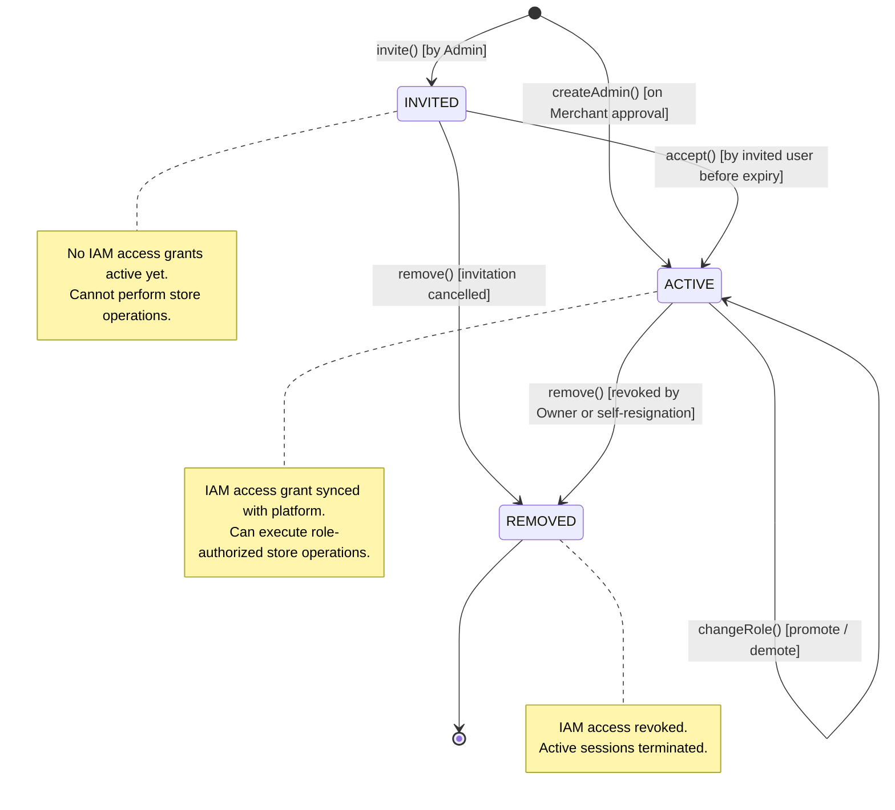
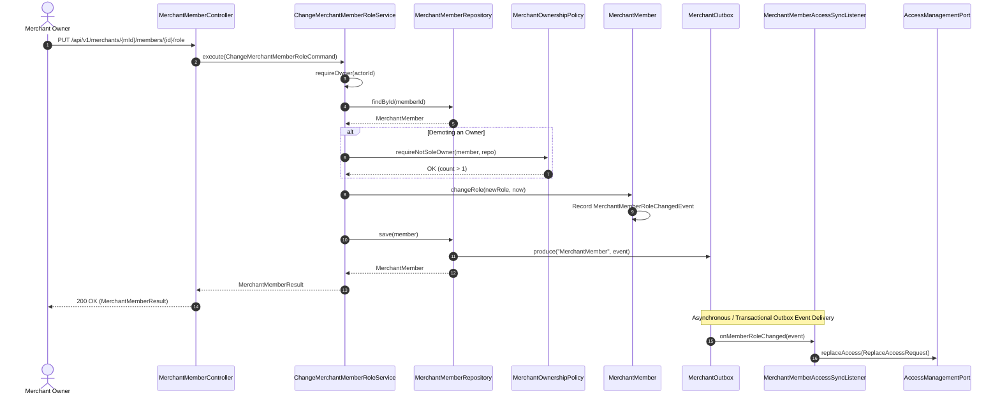

# Merchant Member Aggregate Architecture

**Status:** Accepted  
**Date:** 2026-09-23  

---

## 1. The Problem

**What's not working?**  
Currently, merchant organizational hierarchy and business membership are conflated with generic Identity Access Management (IAM) technical grants (`AccessAssignment`). Core merchant operations previously lacked a domain model for team membership, dynamic roles (`MerchantRole` VO accepting customized role names and permissions), and admin protection invariants. Furthermore, role transitions require guessing or querying low-level authorization tables because there is no domain model tracking a member's business role transitions.

**What's at stake?**  
Conflating business membership with IAM creates leaky abstractions across bounded contexts. Storing merchant store roles inside the `User` aggregate would introduce severe concurrency bottlenecks (`OptimisticLockingException` across independent stores) and aggregate bloat. Conversely, embedding members inside `MerchantAccount` would cause write contention whenever multiple administrators invite or assign roles. Crucially, without explicit domain tracking, stores risk demoting or removing their sole active admin, locking themselves out of the platform.

---

## 2. What We Decided

**The core approach:**  
Introduce `MerchantMember` as an independent Aggregate Root within the Merchant bounded context, scoped to `merchantId`, responsible for business membership, invitation lifecycles, and team roles (modeled as a dynamic `MerchantRole` Value Object accepting custom role names and module authority sets), while synchronizing with the Identity bounded context through asynchronous domain events.

**Key changes:**
- Model `MerchantMember` as an independent aggregate root referencing `merchantId` and `userId` by opaque ID only.
- Define `MerchantRole` as a dynamic Value Object containing role `name` and `authorities` (module-level permission codes), eliminating rigid enums (`OWNER`, `STORE_OWNER`, `MANAGER`, `STAFF`).
- Streamline member lifecycle into three explicit business states: `INVITED`, `ACTIVE`, and `REMOVED`.
- Introduce `MerchantOwnershipPolicy` to guard whole-merchant invariants (e.g., ensuring a merchant maintains at least one active `MERCHANT_ADMIN`).
- Emit rich domain events (`MerchantMemberCreatedEvent`, `MerchantMemberRoleChangedEvent`, `MerchantMemberRemovedEvent`) carrying explicit previous and new roles for deterministic synchronization with Identity's `AccessManagementPort`.
- Establish a **Clean Lifecycle Bridge** connecting `MerchantAccount` onboarding applications, `MerchantMember` team operations, and `AccessAssignment` grants in Identity.
- Keep onboarding draft and submission endpoints authenticated by standard user token (`.authenticated()`), eliminating the transient `MERCHANT_APPLICANT` role.
- Automatically provision the initial active `MerchantMember.createAdmin(...)` upon onboarding approval, which synchronizes `MERCHANT_ADMIN` in Identity under `(SELLER_PORTAL, merchant.account:merchantId)`.
- Cascade merchant account suspension and closure to invalidate active seller sessions across the affected merchant scope.

**What stays the same:**  
Identity remains the authoritative source of truth for platform users, authentication credentials, permissions, and security sessions. `MerchantAccount` remains the business profile and legal lifecycle root. `Storefront` remains an independent aggregate representing customer-facing sales channels.

---

## 2.1. Clean Lifecycle Bridge

The platform synchronizes three separate lifecycles across bounded contexts without direct cross-aggregate coupling:
1. **Merchant Application Lifecycle** (`MerchantAccount` root): Governs onboarding states (`DRAFT` $\to$ `PENDING_REVIEW` $\to$ `ACTIVE` / `REJECTED` / `SUSPENDED` / `CLOSED`).
2. **Merchant Member Lifecycle** (`MerchantMember` root): Governs team membership (`INVITED` $\to$ `ACTIVE` $\to$ `REMOVED`).
3. **Identity Access Lifecycle** (`AccessAssignment` root in Identity): Governs platform authorization roles (`MERCHANT_ADMIN` and custom merchant team roles $\to$ revocation & session invalidation).

### End-to-End Lifecycle Flowchart

```mermaid
flowchart TD
    classDef app fill:#e1f5fe,stroke:#0288d1,stroke-width:2px;
    classDef member fill:#e8f5e9,stroke:#388e3c,stroke-width:2px;
    classDef iam fill:#fff3e0,stroke:#f57c00,stroke-width:2px;
    classDef event fill:#f3e5f5,stroke:#7b1fa2,stroke-width:1.5px,stroke-dasharray: 5 5;
    classDef terminal fill:#ffebee,stroke:#d32f2f,stroke-width:2px;

    %% ----------------------------------------------------
    %% STAGE 1: MERCHANT APPLICATION (ONBOARDING)
    %% ----------------------------------------------------
    subgraph S1 ["Stage 1: Merchant Application (Onboarding)"]
        direction TB
        StartApp["1. MerchantAccount.startDraft()<br><b>Status: DRAFT</b><br>Secured by standard authenticated user"]:::app
        SubmitApp["2. MerchantAccount.submit()<br><b>Status: PENDING_REVIEW</b>"]:::app
        E_AppSubmitted["MerchantApplicationSubmittedEvent"]:::event
        Review{"Review & KYC Decision"}:::app

        StartApp --> SubmitApp
        SubmitApp --> E_AppSubmitted
        E_AppSubmitted --> Review
    end

    %% Rejection Path
    subgraph S1_Reject ["Application Rejection"]
        RejectApp["3a. MerchantAccount.reject()<br><b>Status: REJECTED</b>"]:::terminal
        Review -->|Rejected| RejectApp
    end

    %% Approval Path
    subgraph S2 ["Stage 2: Approval & Initial Admin Provisioning"]
        direction TB
        ApproveApp["3b. MerchantAccount.approve()<br><b>Status: ACTIVE</b>"]:::app
        E_AppApproved["MerchantApprovedEvent"]:::event
        GrantAdminListener["MerchantApprovalAccessGrantListener<br>calls createAdmin()"]:::member
        CreateAdminMember["MerchantMember Aggregate<br><b>Role: MERCHANT_ADMIN, Status: ACTIVE</b>"]:::member
        E_AdminCreated["MerchantMemberCreatedEvent<br>(MERCHANT_ADMIN, ACTIVE)"]:::event
        SyncAdminIAM["MerchantMemberAccessSyncListener<br>replaceAccess(<br>  prev = null,<br>  new = MERCHANT_ADMIN<br>)"]:::iam
        IAM_AdminActive["Identity: AccessAssignment<br><b>MERCHANT_ADMIN</b><br>Scope: merchant.account:id"]:::iam

        Review -->|Approved| ApproveApp
        ApproveApp --> E_AppApproved
        E_AppApproved --> GrantAdminListener
        GrantAdminListener --> CreateAdminMember
        CreateAdminMember --> E_AdminCreated
        E_AdminCreated --> SyncAdminIAM
        SyncAdminIAM --> IAM_AdminActive
    end

    %% ----------------------------------------------------
    %% STAGE 3: TEAM MEMBERSHIP LIFECYCLE
    %% ----------------------------------------------------
    subgraph S3 ["Stage 3: Team Expansion & Membership Management"]
        direction TB
        InviteMember["4. MerchantMember.invite()<br>by Admin"]:::member
        MemberInvited["MerchantMember Aggregate<br><b>Status: INVITED</b><br>(Custom Role & Authorities)"]:::member
        E_MemberInvited["MerchantMemberCreatedEvent<br>(Status: INVITED)"]:::event
        NoIAM["No IAM Grant Yet<br>(Awaiting user acceptance)"]:::iam

        AcceptInvite["5. MerchantMember.accept()<br>by invited user"]:::member
        MemberActive["MerchantMember Aggregate<br><b>Status: ACTIVE</b>"]:::member
        E_MemberAccepted["MerchantMemberRoleChangedEvent<br>(prev = null, new = role)"]:::event
        GrantMemberIAM["MerchantMemberAccessSyncListener<br>replaceAccess(role = customRole)"]:::iam
        IAM_MemberActive["Identity: AccessAssignment<br>Active store access granted"]:::iam

        ChangeRole["6. MerchantMember.changeRole()<br>guarded by MerchantOwnershipPolicy"]:::member
        E_RoleChanged["MerchantMemberRoleChangedEvent<br>(prevRole, newRole)"]:::event
        SyncRoleChange["MerchantMemberAccessSyncListener<br>replaceAccess(prevRole, newRole)"]:::iam
        IAM_RoleReplaced["Identity: Role Replaced<br>Old role revoked, sessions refreshed,<br>New role active"]:::iam

        RemoveMember["7. MerchantMember.remove()<br>guarded by MerchantOwnershipPolicy"]:::terminal
        E_MemberRemoved["MerchantMemberRemovedEvent"]:::event
        SyncRemoval["MerchantMemberAccessSyncListener<br>revokeAccess(role)"]:::iam
        IAM_MemberRevoked["Identity: Assignment Revoked<br>& Member Sessions Terminated"]:::terminal

        IAM_AdminActive -.->|Admin manages team| InviteMember
        InviteMember --> MemberInvited
        MemberInvited --> E_MemberInvited
        E_MemberInvited --> NoIAM

        NoIAM -.->|Invited user receives notification| AcceptInvite
        AcceptInvite --> MemberActive
        MemberActive --> E_MemberAccepted
        E_MemberAccepted --> GrantMemberIAM
        GrantMemberIAM --> IAM_MemberActive

        IAM_MemberActive -.->|Role Adjustment| ChangeRole
        ChangeRole --> E_RoleChanged
        E_RoleChanged --> SyncRoleChange
        SyncRoleChange --> IAM_RoleReplaced

        IAM_MemberActive -.->|Removal / Resignation| RemoveMember
        RemoveMember --> E_MemberRemoved
        E_MemberRemoved --> SyncRemoval
        SyncRemoval --> IAM_MemberRevoked
    end

    %% ----------------------------------------------------
    %% STAGE 4: ACCOUNT LIFECYCLE SUSPENSION & CLOSURE
    %% ----------------------------------------------------
    subgraph S4 ["Stage 4: Account Lifecycle Enforcement"]
        direction TB
        SuspendClose["8. MerchantAccount Suspended or Closed"]:::app
        E_Lifecycle["MerchantSuspendedEvent / MerchantClosedEvent"]:::event
        SyncScopeRevoke["MerchantLifecycleMemberSyncListener<br>revokeSessionsByScope(SELLER_PORTAL, merchant.account:id)"]:::iam
        IAM_ScopeRevoked["Identity: All Active Sessions Across<br>Entire Merchant Scope Terminated"]:::terminal

        SuspendClose --> E_Lifecycle
        E_Lifecycle --> SyncScopeRevoke
        SyncScopeRevoke --> IAM_ScopeRevoked
    end
```

### Lifecycle Alignment Matrix

| Step | Business Action | Domain Aggregate & Event | Member Status & Role | Identity Access Role (`SELLER_PORTAL`) | Identity Scope | Event Listener |
|---|---|---|---|---|---|---|
| **1. Start Draft** | User initiates onboarding | `MerchantAccount.startDraft(...)` $\to$ `MerchantApplicationStartedEvent` | *None yet* | Authenticated user session | `merchant.account` : `merchantId` | *(None needed)* |
| **2. Submit Application** | Applicant submits KYC / profile | `MerchantAccount.submit(...)` $\to$ `MerchantApplicationSubmittedEvent` | *None yet* | Authenticated user session | `merchant.account` : `merchantId` | `MerchantAccountSubmitStatusEventListener` (checks auto-approve) |
| **3a. Reject Application** | Admin rejects application | `MerchantAccount.reject(...)` $\to$ `MerchantRejectedEvent` | *None yet* | Unchanged | `merchant.account` : `merchantId` | *(None needed)* |
| **3b. Approve Application** | Admin or policy approves | `MerchantAccount.approve(...)` $\to$ `MerchantApprovedEvent` | *None yet* | *(In transition)* | `merchant.account` : `merchantId` | `MerchantApprovalAccessGrantListener` |
| **4. Provision Initial Admin** | System provisions applicant as admin | `MerchantMember.createAdmin(...)` $\to$ `MerchantMemberCreatedEvent` | `ACTIVE` `MERCHANT_ADMIN` | **`MERCHANT_ADMIN`** | `merchant.account` : `merchantId` | `MerchantMemberAccessSyncListener` |
| **5. Invite Member** | Admin invites colleague | `MerchantMember.invite(...)` $\to$ `MerchantMemberCreatedEvent` | `INVITED` Custom Role | *None yet* (Pending acceptance) | *N/A* | `MerchantMemberAccessSyncListener` (ignores `INVITED`) |
| **6. Accept Invitation** | Colleague accepts invite | `MerchantMember.accept(...)` $\to$ `MerchantMemberRoleChangedEvent(prev=null)` | `ACTIVE` Custom Role | Custom Role (Granted) | `merchant.account` : `merchantId` | `MerchantMemberAccessSyncListener` |
| **7. Change Member Role** | Admin updates member role | `MerchantMember.changeRole(...)` $\to$ `MerchantMemberRoleChangedEvent(prev, new)` | `ACTIVE` New Role | **Replaces Role** in Identity (Old role revoked, old sessions terminated, new role granted) | `merchant.account` : `merchantId` | `MerchantMemberAccessSyncListener` |
| **8. Remove Member** | Member removed or resigns | `MerchantMember.remove(...)` $\to$ `MerchantMemberRemovedEvent` | `REMOVED` Role | **Revoked** (Assignment revoked, member sessions terminated) | `merchant.account` : `merchantId` | `MerchantMemberAccessSyncListener` |
| **9. Suspend / Close Account** | Merchant violates policy or closes | `MerchantSuspendedEvent` / `MerchantClosedEvent` | Unchanged (historical) | **Revoke all active sessions** across entire scope | `merchant.account` : `merchantId` | `MerchantLifecycleMemberSyncListener` |
### End-to-End Sequence Diagram

---

## 2.2. Visual Overview

### Part 1 — Domain Bounded Context

#### Responsibility & Boundary

**This bounded context owns:**
- Merchant business profile, onboarding, and legal operational status (`MerchantAccount`).
- Customer-facing branded sales presence (`Storefront`).
- Store organizational membership, invitation lifecycle, and team roles (`MerchantMember`).
- Business administration policies (sole-admin protection, member limits, hierarchy permissions).

**This bounded context does not own:**
- User authentication, passwords, tokens, MFA, and user profile data (owned by `Identity`).
- Generic technical authorization scopes, platform authorities, and session stores (owned by `Identity`).
- Physical warehouse and fulfillment location management (owned by `Inventory`).
- Product catalog and listings (owned by `Catalog`).

**Primary use cases:**
- Auto-provisioning the merchant applicant as the primary business admin (`MERCHANT_ADMIN`) upon onboarding approval.
- Inviting new team members with custom roles and specific module authorities.
- Accepting invitations by invited users.
- Updating active member roles within administrative invariants.
- Removing team members or self-resigning while protecting sole-admin continuity.
- Listing and auditing team members across a merchant business.

#### Ubiquitous Language

| Business term | Domain type / value | Meaning |
|---|---|---|
| Merchant Member | `MerchantMember` (aggregate root) | An individual user's business affiliation and organizational role within a specific merchant account. |
| Merchant Admin | `MerchantRole.merchantAdmin()` (`MERCHANT_ADMIN`) | Full business and administrative authority over the merchant account and all its members. Mapped to IAM role `MERCHANT_ADMIN`. |
| Custom Role | `MerchantRole` (Value Object) | Dynamic business role defined by name and module-scoped authorities (e.g. `STORE_OPERATOR`, `INVENTORY_CLERK`). |
| Invited Member | `MemberStatus.INVITED` | A pending membership awaiting acceptance by the designated user before access is activated. |
| Active Member | `MemberStatus.ACTIVE` | A fully activated team member whose operational access is granted and effective. |
| Removed Member | `MemberStatus.REMOVED` | A former member whose affiliation and platform access have been revoked. |
| Sole Admin Policy | `MerchantOwnershipPolicy` | Invariant service guaranteeing that a merchant always retains at least one active Admin (`MERCHANT_ADMIN`). |

#### Context Map

#### Aggregate Domain Model

#### Relationships

| From | To | Kind | Notes |
|---|---|---|---|
| `MerchantMember` | `MerchantRole` | contains / Value Object | Domain role and authority set within the aggregate boundary. |
| `MerchantMember` | `MemberStatus` | contains / value | Current lifecycle status within the aggregate boundary. |
| `MerchantMember` | `MerchantAccount` | references-by-id | Same bounded context; references parent business via `merchantId`. No shared database transaction. |
| `MerchantMember` | `User` | cross-BC by id | External reference to Identity user via `userId`. Identity owns credentials and user details. |
| `MerchantMember` | `invitedBy` | references-by-id | Identity `userId` of the actor who initiated the invitation. |

#### Why Each Property Exists

| Property | Owner type | Type | Business reason |
|---|---|---|---|
| `id` | `MerchantMember` | `Id` | Unique business identifier for the membership record. |
| `merchantId` | `MerchantMember` | `Id` | Identifies the merchant business account to which this member belongs. |
| `userId` | `MerchantMember` | `Id` | Identifies the platform user holding this membership. |
| `role` | `MerchantMember` | `MerchantRole` | Governs the member's operational authority (`name` and granular `authorities`). |
| `status` | `MerchantMember` | `MemberStatus` | Tracks membership lifecycle (`INVITED`, `ACTIVE`, `REMOVED`). |
| `invitedBy` | `MerchantMember` | `Id` | Audit trail of who invited this member into the organization. |
| `invitationExpiresAt` | `MerchantMember` | `Instant` | Expiration deadline for accepting pending invitations, mitigating stale invitation attacks. |
| `joinedAt` | `MerchantMember` | `Instant` | Timestamp when the member officially accepted the invitation and became active. |
| `createdAt` | `MerchantMember` | `Instant` | Audit timestamp when the member record was created. |
| `updatedAt` | `MerchantMember` | `Instant` | Audit timestamp of the most recent role or status modification. |
| `version` | `MerchantMember` | `long` | Optimistic locking counter ensuring transactional isolation and concurrency control. |

#### Invariants & Policies

| Rule (business language) | Enforced by | When |
|---|---|---|
| A merchant must always have at least one active Admin. | `MerchantOwnershipPolicy.requireNotSoleAdmin` | Demoting an admin or removing an admin. |
| New members cannot be directly invited with the `MERCHANT_ADMIN` role. | `MerchantMember.invite` | Inviting a new member. |
| Pending invitations must have a future expiration date. | `MerchantMember.invite` | Inviting a new member. |
| Only the designated invited user can accept their invitation. | `MerchantMember.accept` | Accepting an invitation. |
| Expired invitations cannot be accepted. | `MerchantMember.accept` / `isExpired` | Accepting an invitation. |
| Member roles can only be changed when the member is in an ACTIVE state. | `MerchantMember.changeRole` | Changing a member's role. |
| Non-admin members can only manage roles lower than themselves in hierarchy. | `MerchantRole.canManage` | Inviting or updating member roles. |
| A user can only hold one active or invited membership per merchant account. | Database unique constraint `uk_merchant_member(merchant_id, user_id)` | Member creation. |

#### Lifecycle

---

### Part 2 — Application Architectural Design

#### Components & Layers

| Layer | Responsibility | Example types |
|---|---|---|
| Controller | Exposes HTTP REST API endpoints, parses JSON, binds principals | `MerchantMemberController` |
| Inbound Ports | Use case contracts decoupling presentation from application logic | `InviteMerchantMemberUseCase`, `ChangeMerchantMemberRoleUseCase`, `RemoveMerchantMemberUseCase`, `ListMerchantMembersUseCase` |
| Application Services | Orchestrates transaction, executes business flows, enforces actor authorization, interacts with domain repositories and policies | `InviteMerchantMemberService`, `ChangeMerchantMemberRoleService`, `RemoveMerchantMemberService` |
| Domain Layer | Pure domain models, aggregate roots, policies, and outbound repository ports | `MerchantMember`, `MerchantOwnershipPolicy`, `MerchantMemberRepository` |
| Outbound Ports | Contracts for persistence and projection queries | `MerchantMemberRepository`, `MerchantMemberQueryPort` |
| Persistence Adapter | Spring Data JPA implementations, MapStruct entity assemblers, transactional outbox publishing | `MerchantMemberRepositoryAdapter`, `MerchantMemberJpaRepository`, `MerchantMemberEntity` |
| Integration Listeners | Bridges domain events to cross-context ports | `MerchantApplicationAccessSyncListener`, `MerchantApprovalAccessGrantListener`, `MerchantMemberAccessSyncListener`, `MerchantLifecycleMemberSyncListener` |

#### Data / Command Flow

#### Integration

**Publishes (Domain Events via Outbox):**
- `MerchantApprovedEvent`: Published when onboarding is approved.
- `MerchantMemberCreatedEvent`: Published when an initial admin is provisioned or a new member is invited.
- `MerchantMemberRoleChangedEvent`: Published when an invitation is accepted or an active member's role is changed. Carries `previousRole` and `newRole` for deterministic IAM synchronization.
- `MerchantMemberRemovedEvent`: Published when a membership is revoked or cancelled.

**Consumes (Domain Events):**
- `MerchantApprovedEvent`: Listened to by `MerchantApprovalAccessGrantListener` to automatically construct and persist the initial `MerchantMember.createAdmin(...)`.
- `MerchantMemberCreatedEvent`: Listened to by `MerchantMemberAccessSyncListener` to provision `MERCHANT_ADMIN` in Identity.
- `MerchantMemberRoleChangedEvent`: Listened to by `MerchantMemberAccessSyncListener` to update Identity access assignments with replacement roles.
- `MerchantMemberRemovedEvent`: Listened to by `MerchantMemberAccessSyncListener` to revoke role assignment in Identity.
- `MerchantSuspendedEvent` & `MerchantClosedEvent`: Listened to by `MerchantLifecycleMemberSyncListener` to revoke all active sessions under the merchant's scope.

**Named Interfaces / Ports:**
- Exposes: REST API `/api/v1/merchants/{merchantId}/members` for team management.
- Depends on: `AccessManagementPort` (provided by `store/identity`) to synchronize access assignments and revoke sessions.

---

## 3. Why This Approach

**Primary reasons:**
1. **Clean Bounded Context Separation**: Business membership (who works at a store and what team role they occupy) is a domain concept belonging in the Merchant context. Technical access assignments (`AccessAssignment`) belong in Identity. This prevents business logic from leaking into IAM.
2. **Concurrency Isolation**: By making `MerchantMember` an independent aggregate root referencing `merchantId`, team invitations, role changes, and member removals do not contend for locks on `MerchantAccount` or `User`, preventing `OptimisticLockingException` across busy stores.
3. **Deterministic Role Replacement**: Emitting `MerchantMemberRoleChangedEvent` with both `previousRole` and `newRole` directly solves the ambiguity in `ReplaceAccessService` and `AccessManagementPort`, eliminating the need to query or guess existing IAM records.
4. **Guaranteed Business Continuity**: Enforcing the sole-admin invariant at the domain policy level prevents stores from accidentally demoting or removing their only admin.
5. **Seamless Lifecycle Continuity**: By bridging application draft start, approval, member invitation, acceptance, role change, and member removal, users maintain precisely the right platform permissions throughout their journey without manual intervention.

---

## 4. Trade-offs

| Pros | Cons |
|---|---|
| Zero lock contention between member management and account profile updates. | Requires eventual consistency synchronization with Identity access assignments. |
| Strict DDD boundary: Identity remains a generic IAM provider; Merchant remains rich. | Two records exist in database (`merchant_members` and `access_assignments`), synchronized via events. |
| Protects business continuity via domain-level sole admin invariant. | Cross-aggregate invariant verification requires querying the repository in the policy service. |
| Explicit invitation expiration and acceptance flow. | Additional API round-trip required for invited members to accept access. |

---

## 5. What Needs to Change

**New components/modules to build:**
- Domain: `MerchantMember`, `MerchantRole` (Value Object), `MemberStatus`, `MerchantOwnershipPolicy`, `MerchantMemberRepository`, domain events.
- Application: Member command/query use cases, DTOs, and services (`InviteMerchantMemberService`, `ChangeMerchantMemberRoleService`, etc.).
- Persistence: `MerchantMemberEntity`, `MerchantMemberJpaRepository`, assembler, mapper, and repository/query adapters.
- Migrations: `V5__create_merchant_members_table.sql` and `V6__create_merchant_member_authorities_table.sql` in Merchant; updated seed scripts in Identity.
- Integration: `MerchantApprovalAccessGrantListener`, `MerchantMemberAccessSyncListener`, `MerchantLifecycleMemberSyncListener`, and `MerchantMemberController`.

**Changes to existing systems:**
- `MerchantAccessProfile`: Centralized role code mappings (`ADMIN_ROLE_CODE = "MERCHANT_ADMIN"`).
- `MerchantApprovalAccessGrantListener`: Auto-provisions initial `MerchantMember.createAdmin(...)`.
- `MerchantUseCaseConfig`: Registered member use cases and repository adapters in the Spring context.

---

## 6. Implementation Plan

- **Phase 1: Domain & Application Core**: Implement `MerchantRole`, `MemberStatus`, `MerchantMember`, `MerchantOwnershipPolicy`, use cases, and unit test invariants.
- **Phase 2: Persistence & Migrations**: Implement JPA entity, repository adapter, transactional outbox publishing, and Flyway scripts (`V5` and `V11`).
- **Phase 3: Integration & APIs**: Wire event listeners (`MerchantApplicationAccessSyncListener`, `MerchantMemberAccessSyncListener`, `MerchantApprovalAccessGrantListener`, `MerchantLifecycleMemberSyncListener`), REST controller, and end-to-end tests.

**Rollback strategy:**  
If rollback is required, existing `AccessAssignment` and `MerchantAccount` tables remain backward-compatible. Dropping the `merchant_members` table and disabling member endpoints returns authorization to direct applicant-owner grants without data corruption.

---

## 7. Related Documents

- Domain architecture: [docs/dev/domain/merchant/architecture/ADR_001-Merchant_module_architecture.md](file:///Users/khinemyaezin/Repository/grab-ecommerce/grab/docs/dev/domain/merchant/architecture/ADR_001-Merchant_module_architecture.md)
- Bounded context design: [docs/dev/domain/merchant/architecture/ADR_002-Merchant_bounded_context_architecture.md](file:///Users/khinemyaezin/Repository/grab-ecommerce/grab/docs/dev/domain/merchant/architecture/ADR_002-Merchant_bounded_context_architecture.md)
- Implementation Plan: [brain/11947355-2bc0-4c34-895f-39ff79ebddef/implementation_plan.md](file:///Users/khinemyaezin/.gemini/antigravity-ide/brain/11947355-2bc0-4c34-895f-39ff79ebddef/implementation_plan.md)
- Walkthrough: [brain/11947355-2bc0-4c34-895f-39ff79ebddef/walkthrough.md](file:///Users/khinemyaezin/.gemini/antigravity-ide/brain/11947355-2bc0-4c34-895f-39ff79ebddef/walkthrough.md)
