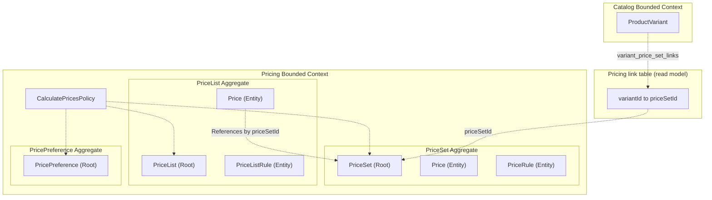
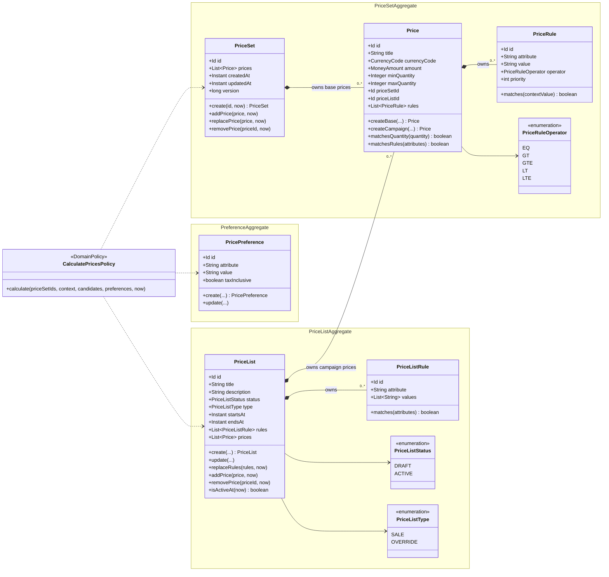
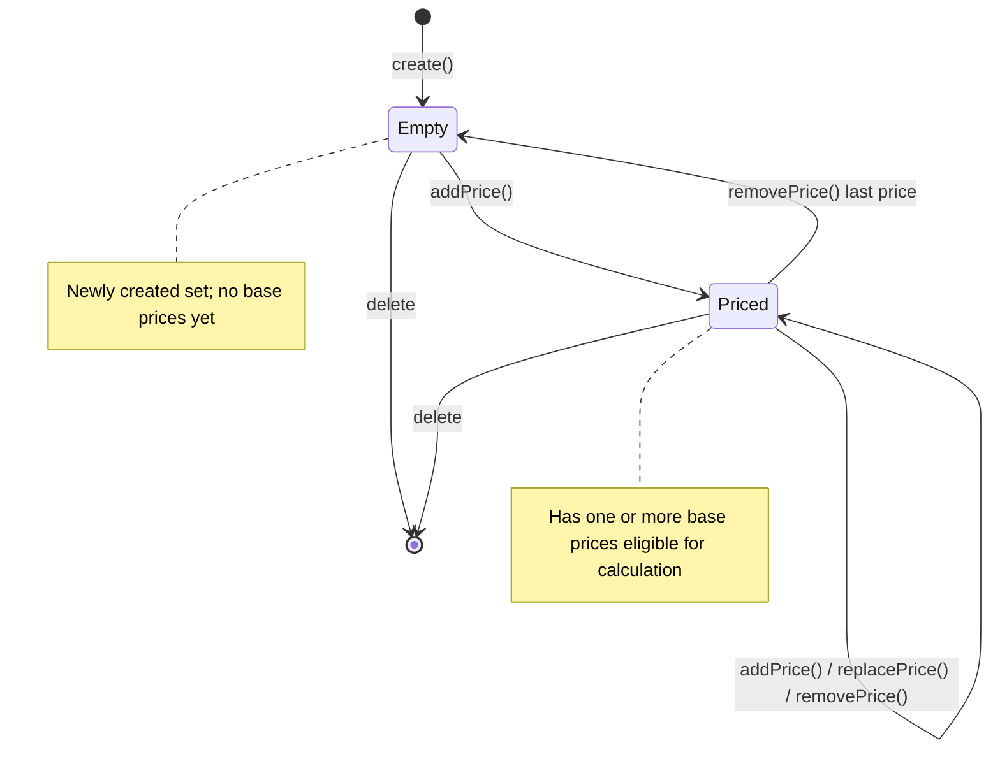
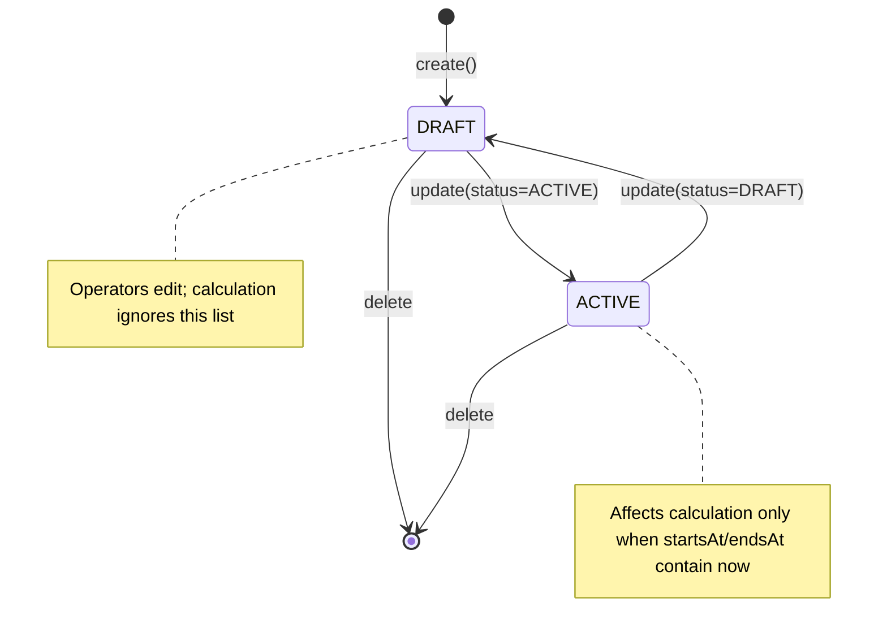
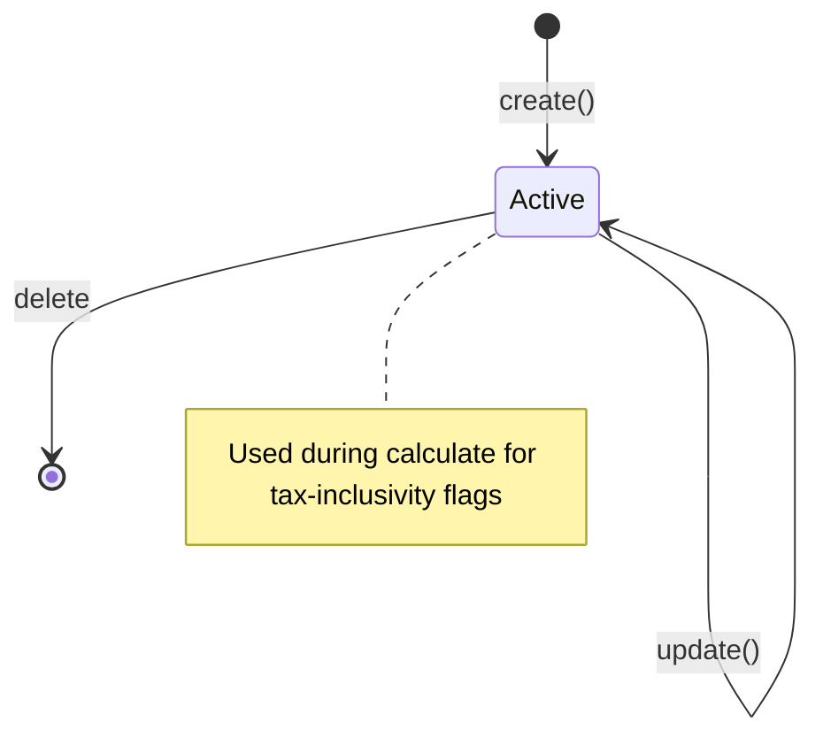
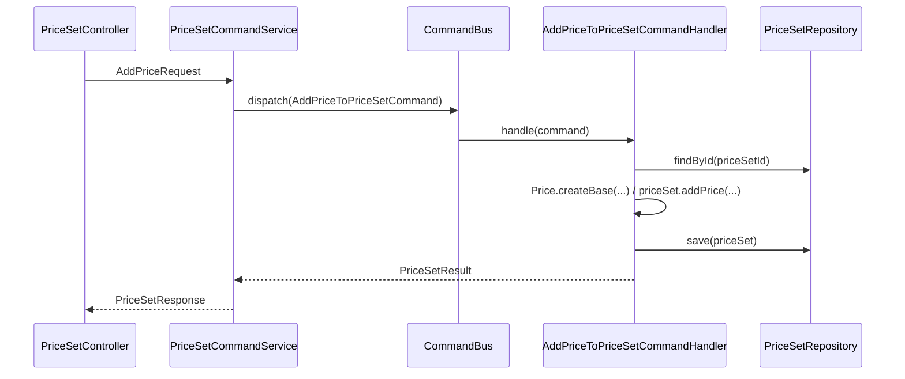
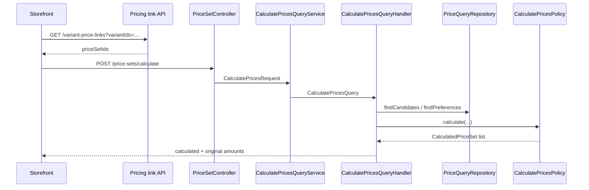

# Pricing Bounded Context Architecture

---

## 1. The Problem

**What's not working?**  
Catalog owns sellable products and variants but must not own prices. The
platform needs a dedicated, entity-agnostic pricing engine that can resolve
base prices, volume tiers, and campaign overrides from runtime context
(currency, region, customer group, quantity) without embedding pricing rules
inside Catalog, Inventory, or Order.

**What's at stake?**  
Without a clear Pricing bounded context, amounts leak into product tables,
campaign logic scatters across modules, and storefront/checkout cannot rely on
one `calculatePrices` contract. Mixing pricing into Catalog also blocks reuse
for non-product priced entities later (for example shipping options).

---

## 2. What We Decided

**The core approach:**  
Introduce a standalone Pricing bounded context that owns price sets, campaign
price lists, tax-inclusivity preferences, and contextual price calculation,
while Catalog and other modules only hold opaque `priceSetId` references
(remote links deferred).

**Key changes:**
- Add `pricing-domain` and `pricing-infrastructure`, composed under
  `store/com/grab/store/pricing`.
- Model three aggregate roots: `PriceSet`, `PriceList`, and `PricePreference`.
- Keep Pricing entity-agnostic: a `PriceSet` does not know variants, shipping
  methods, or merchants.
- Resolve runtime prices through `CalculatePricesPolicy` given `priceSetIds`
  plus a `PricingContext`.
- Enforce SALE vs OVERRIDE synthesis and ranking in the domain policy, not in
  controllers or services.
- Persist through a dedicated pricing datasource with module-scoped outbox.
- Gate the module with `pricing.enabled`.

**What stays the same:**  
Catalog remains source of truth for products and variants. Inventory owns
stock. Merchant owns seller lifecycle. Identity owns users and access. The
system remains a modular monolith with in-process CQRS and per-module
persistence.

---

## 2.1. Visual Overview

> Diagrams and tables so a newcomer can learn the domain and application design at a glance.

### Part 1 — Domain Bounded Context

#### Responsibility & Boundary

**This bounded context owns:**
- Price sets and base prices (currency, amount, quantity bands, per-price rules)
- Campaign price lists (`DRAFT` / `ACTIVE`, `SALE` / `OVERRIDE`, date windows)
- Campaign prices that reference a price set by id
- Tax-inclusivity preferences
- Contextual calculation of calculated and original amounts

**This bounded context does not own:**
- Product, variant, or listing content (Catalog)
- Stock levels (Inventory)
- Merchant onboarding (Merchant)
- Users, roles, sessions (Identity)
- Cart, order, payment, or a full tax engine
- The durable `variantId` ↔ `priceSetId` link (Pricing link table / read model)

**Primary use cases:**
- After a Catalog product/variant is created, create a `PriceSet`, add base
  prices, and persist `variantId → priceSetId` in the Pricing link table.
- Attach SALE/OVERRIDE campaigns to existing price sets without mutating base
  prices.
- Storefront/checkout calls `calculatePrices` with `priceSetIds` and context to
  get charge and strikethrough amounts.

#### Ubiquitous Language

| Business term | Domain type / value | Meaning |
|---------------|---------------------|---------|
| Price set | `PriceSet` (aggregate root) | Opaque container of candidate prices for one priced thing |
| Base price | `Price` with `priceListId == null` | Default amount owned by a price set |
| Campaign price | `Price` with `priceListId` set | Promotional amount on a price list that references a price set |
| Price rule | `PriceRule` (entity) | Attribute condition a single price must match |
| Price list | `PriceList` (aggregate root) | Campaign grouping with status, type, and window |
| Price list rule | `PriceListRule` (entity) | Campaign-wide attribute ∈ values match |
| Preference | `PricePreference` (aggregate root) | Tax inclusivity by attribute/value |
| Pricing context | `PricingContext` (value object) | Runtime currency (required), quantity, attributes |
| Calculated price | result of `CalculatePricesPolicy` | Amount to charge after ranking and synthesis |
| Original price | result of `CalculatePricesPolicy` | Non-sale reference for strikethrough display |
| SALE | `PriceListType.SALE` | Discount: `min(sale, base)` |
| OVERRIDE | `PriceListType.OVERRIDE` | Replaces base regardless of amount |
| Catalog variant | foreign `variantId` | Owned by Catalog; paired via Pricing link table |

#### Context Map

> Pricing never loads Catalog aggregates. Catalog (or the app) may hold
> `priceSetId`. Campaign prices reference `PriceSet` by id only.

#### Aggregate Domain Model

#### Relationships

| From | To | Kind | Notes |
|------|----|------|-------|
| `PriceSet` | `Price` (base) | owns / contains | Consistency boundary; mutate only via `PriceSet` methods |
| `Price` | `PriceRule` | owns / contains | Rules count must match attached rules |
| `PriceList` | `PriceListRule` | owns / contains | Campaign-wide eligibility |
| `PriceList` | `Price` (campaign) | owns / contains | Campaign price also stores `priceSetId` |
| Campaign `Price` | `PriceSet` | references-by-id | Same BC; no object navigation into the other root |
| Catalog `ProductVariant` | `PriceSet` | cross-BC by id | Pricing link table owns durable pairing; Pricing never loads variants |

#### Why Each Property Exists

| Property | Owner type | Type | Business reason |
|----------|------------|------|-----------------|
| `id` | `PriceSet` | Id | Stable opaque handle other modules pair to |
| `prices` | `PriceSet` | List | Base candidate amounts for that priced thing |
| `createdAt` / `updatedAt` | `PriceSet` | Instant | Audit / concurrency timeline |
| `version` | `PriceSet` | long | Optimistic concurrency |
| `title` | `Price` | String | Optional human label for operators |
| `currencyCode` | `Price` | CurrencyCode | Prices are currency-specific; context currency is required |
| `amount` | `Price` | MoneyAmount | Monetary value to charge or promote |
| `minQuantity` / `maxQuantity` | `Price` | Integer | Volume / tier bands |
| `priceSetId` | `Price` | Id | Which set this price belongs to |
| `priceListId` | `Price` | Id | Null for base; set for campaign ownership |
| `rules` | `Price` | List | Contextual targeting without hardcoding foreign enums |
| `attribute` / `value` / `operator` / `priority` | `PriceRule` | fields | Match region, group, channel, etc. |
| `title` / `description` | `PriceList` | String | Campaign identity for operators |
| `status` | `PriceList` | PriceListStatus | Draft campaigns must not affect live prices |
| `type` | `PriceList` | PriceListType | SALE vs OVERRIDE synthesis |
| `startsAt` / `endsAt` | `PriceList` | Instant | Time-boxed campaigns |
| `rules` | `PriceList` | List | Audience for the whole campaign |
| `values` | `PriceListRule` | List | Allowed attribute values for the campaign |
| `attribute` / `value` / `taxInclusive` | `PricePreference` | fields | Whether displayed/charged amounts are tax-inclusive |

#### Invariants & Policies

| Rule (business language) | Enforced by | When |
|--------------------------|-------------|------|
| Price set is entity-agnostic (no variant/merchant ids inside) | Aggregate design / API contracts | Always |
| Base prices must belong to the set and have no price list | `PriceSet.addPrice` / `Price.createBase` | Write |
| Campaign prices must belong to the list and reference a price set | `PriceList.addPrice` / `Price.createCampaign` | Write |
| Amount is non-negative; currency required and lowercase | `MoneyAmount` / `CurrencyCode` | Write |
| `minQuantity` ≤ `maxQuantity` when both set | `Price.replaceDetails` | Write |
| List window: `startsAt` not after `endsAt` | `PriceList.replaceMetadata` | Write |
| Only ACTIVE in-window lists participate in calculation | `CalculatePricesPolicy` / `PriceList.isActiveAt` | Calculate |
| Price eligible only if all price rules match (`matched == rulesCount`) | `CalculatePricesPolicy` / `Price.matchesRules` | Calculate |
| All price-list rules must match for campaign prices | `CalculatePricesPolicy` / `PriceListRule.matches` | Calculate |
| Rank: list over base, then higher specificity, then lower amount | `CalculatePricesPolicy.rank` | Calculate |
| SALE → `min(sale, base)`; OVERRIDE replaces base | `CalculatePricesPolicy.resolveCalculated` | Calculate |
| Original prefers non-SALE override else base | `CalculatePricesPolicy.resolveOriginal` | Calculate |
| Tax flag: match `region_id` preference first, else `currency_code` | `CalculatePricesPolicy.resolveTaxInclusive` | Calculate |

#### Lifecycle

**PriceSet** — no status enum; empty vs priced by whether base prices exist.

**PriceList**

**PricePreference**

---

### Part 2 — Application Architectural Design

#### Components & Layers

| Layer | Responsibility | Example types |
|-------|----------------|---------------|
| Controller | HTTP in/out, HATEOAS | `PriceSetController`, `PriceListController`, `PricePreferenceController` |
| Command / Query Service | Map DTO ↔ command/query, dispatch bus | `PriceSetCommandService`, `CalculatePricesQueryService` |
| Mapper | DTO ↔ Command/Query/Result | `AddPriceToPriceSetRequestMapper`, `CalculatePricesRequestMapper` |
| Handler | Transaction, load aggregate, invoke methods/policy, persist | `AddPriceToPriceSetCommandHandler`, `CalculatePricesQueryHandler` |
| Domain | Aggregates, VOs, `CalculatePricesPolicy` | `pricing-domain` |
| Infrastructure | JPA, assemblers, write/query repos, outbox | `pricing-infrastructure` |

#### Data / Command Flow

**Write (add base price)**

**Calculate (variant → price set → amount)**

#### Integration

**Publishes (events / outbox):**
- `PriceSetCreated` / `PriceSetUpdated` — price set lifecycle for future cache/link sync
- `PriceListCreated` / `PriceListUpdated` — campaign changes
- `PricePreferenceCreated` / `PricePreferenceUpdated` — preference changes

**Consumes:**
- `workflows::events` — `RequestCreateVariantPriceEvent` for sellable-product saga pricing steps

**Named interfaces / API links:**
- Exposes: Tier-2 `GET /api/v1/pricing` and Tier-1 `get-pricing-root`;
  `GET /api/v1/pricing/attribute-keys` (`list-pricing-attribute-keys`) publishes
  well-known context/preference keys from `PricingAttributeKeys`;
  `pricing::api` (`PricingApiLinks`) publishes cross-module discovery links:
  `list-variant-price-links`, `calculate-prices`
- Depends on: `shared`, `workflows::events` (`PricingModule.allowedDependencies`)

---

## 3. Why This Approach

**Primary reasons:**
1. Entity-agnostic reuse — the same engine can price variants or later shipping without Catalog schema inside Pricing.
2. Invariant ownership — SALE/OVERRIDE, rule matching, and windows live in domain policy/aggregates (R10 / R19).
3. Modulith isolation — dedicated datasource, transactions, and outbox keep pricing changes from cascading into Catalog.

---

## 4. Trade-offs

| Pros | Cons |
|------|------|
| Clear ownership of price calculation | Optional Phase 2b: catalog delete events to prune stale links |
| Contextual rules without hardcoded foreign keys | Attribute key naming must stay consistent (`region_id`, …) |
| Campaigns compose without mutating base prices | Equal-specificity SALE vs OVERRIDE ranks by lowest amount |
| Feature flag and own DB support safe rollout | Extra database to operate |

---

## 5. What Needs to Change

**New components/modules to build:**
- `pricing-domain` / `pricing-infrastructure`
- Flyway `db/migration/pricing`
- Store package `com.grab.store.pricing` (CQRS REST, config, root)
- `CalculatePricesPolicy` and calculate query path

**Changes to existing systems:**
- Root and `store` POMs depend on pricing
- `application-dev.yml` gains `pricing.*`
- No Catalog schema change; pairing lives in Pricing link table

---

## 6. Implementation Plan

- **Phase 1:** Aggregates, CRUD, calculate, Flyway, outbox, domain tests, API discovery (delivered).
- **Phase 2:** Durable `variantId` ↔ `priceSetId` via Pricing link table; sellable-product workflow integration; `pricing::api` facade (delivered).
- **Phase 3:** Checkout integration, optional `pricing::events` consumers, caching.

**Rollback strategy:**  
Set `pricing.enabled=false` to stop beans and APIs. Pricing data stays in the pricing DB and can be dropped independently of Catalog.

---

## 7. Related Documents

- PRD: `docs/pricing/product-requirements/PRD_001-Pricing_product_requirement.en.md`
- Aggregate PRD: `docs/pricing/product-requirements/PRD_002-Pricing_aggregate.md`
- Platform BRD: `docs/Commerce_Platform.md`
- Catalog PRD: `docs/catalog/product-requirements/catalog-module-prd.md`
- System ADR: `docs/system/ADR_001-System_architecture.md`
- Code: `pricing-domain/…`, `pricing-infrastructure/…`, `store/…/pricing/…`
