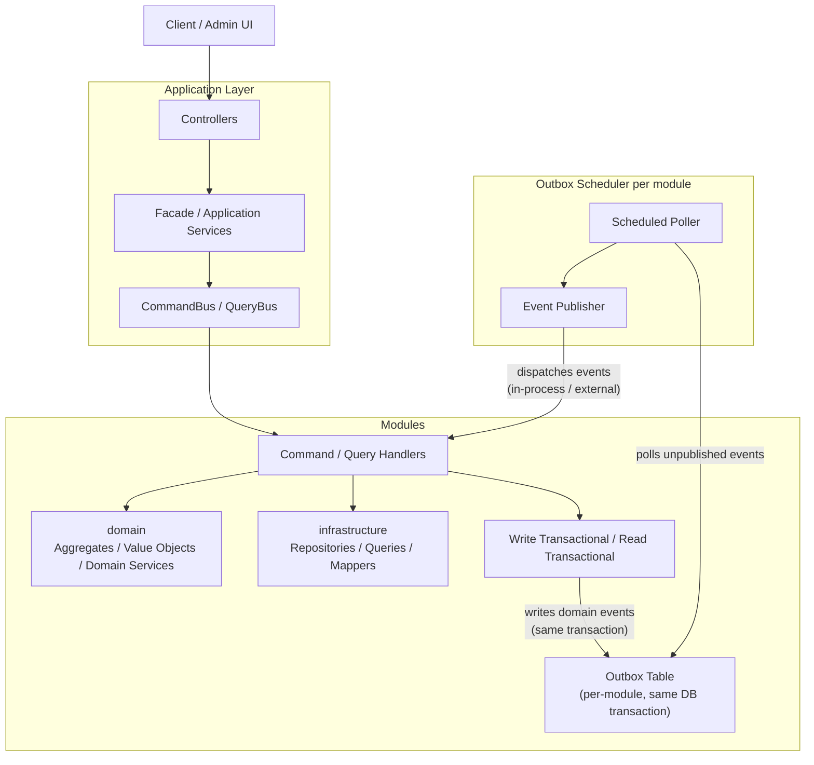
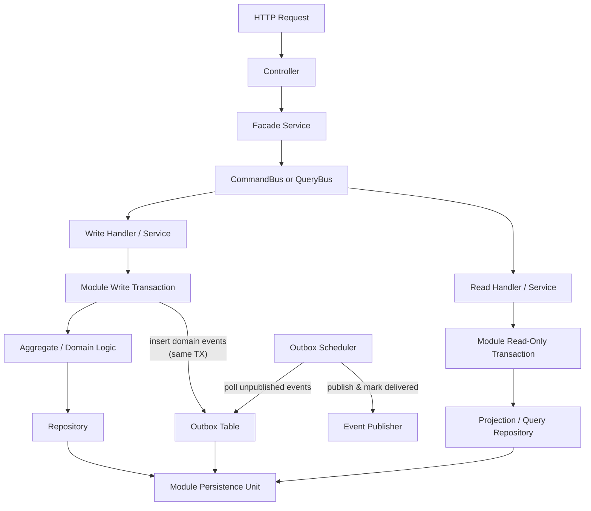

# ADR-001: Current System Architecture as a Modulith

## Status
Accepted

## Context

The current codebase runs as a single Spring Boot application, but it is
already split into bounded-context-oriented modules:

- `framework`
- `domain`
- `infrastructure`
- `application`

The system needs to support:

- strong consistency for transaction writes
- clear domain boundaries without immediate microservice overhead
- separate persistence configuration for each module.
- read/write separation for evolving query use cases

The implementation should beyond a single shared database setup:

- each module use separate datasources, entity managers, and transaction managers
- commands and queries are dispatched through in-process CQRS buses

---

## Project Structure

```
grab/
├── pom.xml                          # parent POM (module aggregator)
├── docker-compose.yml
├── Dockerfile
│
├── framework/                       # shared kernel / building blocks
│   └── src/main/java/com/grab/framework/
│       ├── cqrs/                    
│       │   ├── command/
│       │   └── query/
│       ├── domain/                  
│       ├── event/                   
│       ├── exception/
│       ├── id/                      
│       ├── logger/
│       ├── mapper/
│       ├── outbox/                  
│       ├── service/
│       └── specification/
│
├── domain/                  # bounded context – pure domain
│   └── src/main/java/com/{name}/domain/
│       ├── aggregate/
│       ├── event/
│       ├── exception/
│       ├── repository/              # repository interfaces (ports)
│       ├── service/                 # domain services
│       ├── specification/
│       └── valueobject/
│
├── infrastructure/          # bounded context – persistence / adapters
│   └── src/main/java/com/{name}/infrastructure/
│       ├── configuration/
│       ├── entity/                  # database entities
│       ├── event/                   
│       ├── exception/
│       ├── factory/
│       ├── mapper/                  # assemblers
│       ├── repository/              
│       ├── specification/
│       └── view/                    # read-model / projection queries
│
├── store/                           # composition root – Spring Boot application
│   └── src/main/java/com/grab/store/
│       ├── EcommerceApplication.java
│       ├── module/
│       │   ├── Module.java
│       │   └── internal/
│       │       ├── api/             # controllers
│       │       ├── command/         # command handlers
│       │       ├── config/         
│       │       ├── event/           # event listeners
│       │       ├── exception/
│       │       ├── query/           # query handlers
│       │       ├── runner/
│       │       └── util/
│       └── shared/
│           ├── SharedModule.java
│           └── config/              # CqrsConfiguration, SharedConfiguration
│
└── docs/
    ├── architecture/
    │   ├── decisions/               # ADRs
    │   └── diagrams/
    └── features/                    # feature specifications
```

---

## Decision

### 1. Deploy as a modular monolith

The system is deployed as one Spring Boot application (`store`) rather than as
independent services.

`store` acts as the composition root:

- imports infrastructure modules
- exposes APIs
- wires CQRS buses
- provides datasource and transaction-manager configuration

This keeps operational complexity low while preserving bounded context
separation in code.

### 2. Keep each bounded context split into domain and infrastructure modules

Each major business area is split into:

- a pure domain module
- an infrastructure module

Responsibilities:

- domain modules contain aggregates, value objects, domain services, and domain
  rules
- infrastructure modules contain data entities, repositories, assemblers, and
  Spring-facing persistence adapters
- application contains controllers, facade services, CQRS handler registration, and
  persistence composition

This keeps domain logic free from transport and persistence concerns.

### 3. Use in-process CQRS inside the monolith

The application uses 
- `CommandBus`
- `QueryBus`

implementations to dispatch commands and queries to handlers.

Flow:

- controllers call facade/application services
- services dispatch commands or queries
- handlers execute module logic
- handlers call repositories or domain services

Writes and reads remain in-process, but the code is separated by intent:

- command handlers mutate aggregates
- query handlers return read models and projections

### 4. Use module-scoped persistence

Each module does not share one implicit datasource runtime.

Current persistence model:

- `DataSource` + `EntityManagerFactory` + `TransactionManager`

This preserves module boundaries and avoids coupling infrastructure modules to
application modules.

### 5. Make transaction boundaries explicit per module

Because the application has multiple transaction managers, module code must not
use an ambiguous bare `@Transactional` as a default convention.

Current pattern:

- each module 
  - writes use `@{module-name}Transactional`
  - reads use `@{module-name}ReadTransactional`

This ensures module logic always runs by its own `transactionManager`

### 6. Use the transactional outbox pattern for domain events

Each module persists domain events into a per-module **outbox table** within
the same database transaction that mutates the aggregate. This guarantees
at-least-once delivery without two-phase commits.

A per-module **outbox scheduler** periodically polls the outbox table for
unpublished events, publishes them (in-process via `ApplicationEventPublisher`
or to an external broker in the future), and marks them as delivered.

Key characteristics:

- events are written atomically with the business state change
- delivery is decoupled from the write transaction
- each module's infrastructure wires its own outbox table against its own
  datasource and transaction manager

This replaces direct in-process-only event publishing and ensures events
survive process failure.

The detailed comparison between a shared outbox table and a module-scoped
outbox, plus the proposed concrete design for this repository, is captured in
[ADR-007: Module-Scoped Transactional Outbox](ADR-007-module-scoped-outbox.md).

### 7. Prefer tailored read models over aggregate loading for queries

The read side is allowed to bypass aggregate loading when a projection is a
better fit.

Current examples:

- summary/product listing queries use tailored query repositories and JPQL-based
  projections
- write handlers operate on full aggregates and enforce invariants before save

This gives the system:

- simpler query DTO shaping
- less coupling between read APIs and aggregate structure
- room to optimize read performance independently

---

## Overview



## Write and Read Flow



## Notes

- The application is a modular monolith.
- Each module is isolated by `datasource`, `entity manager factory`, and `transaction manager`.
- CQRS is in-process, not distributed.
- Each module's write transaction inserts domain events into a per-module **outbox table** within the same database transaction, guaranteeing at-least-once delivery.
- Each **outbox scheduler** periodically polls outbox tables per module for unpublished events, publishes them (in-process or to an external broker), and marks them as delivered.
- This outbox pattern ensures reliable event propagation without two-phase commits across module boundaries.
- The concrete outbox comparison and proposed implementation shape are documented in [Module Scoped Outbox Architecture](ADR_002-Module_scoped_outbox_architecture.md).


## Consequences

### Positive

- Strong consistency for module-local writes
- Clear separation between domain, infrastructure, and application wiring
- Catalog and inventory can evolve persistence independently
- CQRS keeps read and write code paths understandable
- Architecture is still simple to run locally and in Docker

### Negative

- More Spring wiring than a single-datasource application
- Every module must declare explicit transaction boundaries
- Shared defaults such as a single `EntityManager` or `TransactionManager` are
  no longer safe
- Outbox processors and cleanup jobs add operational overhead
- Event payload format and broker adapter choices must be governed for future
  service extraction

---

## Notes

- This ADR describes the current running architecture, not the target future
  microservice architecture.
- The current system is a modular monolith with explicit persistence boundaries.
- If new bounded contexts are added later, they should follow the same pattern:
  - domain module
  - infrastructure module
  - module-scoped datasource/entity manager/transaction manager if persistence is separate
  - explicit read/write transaction annotations
