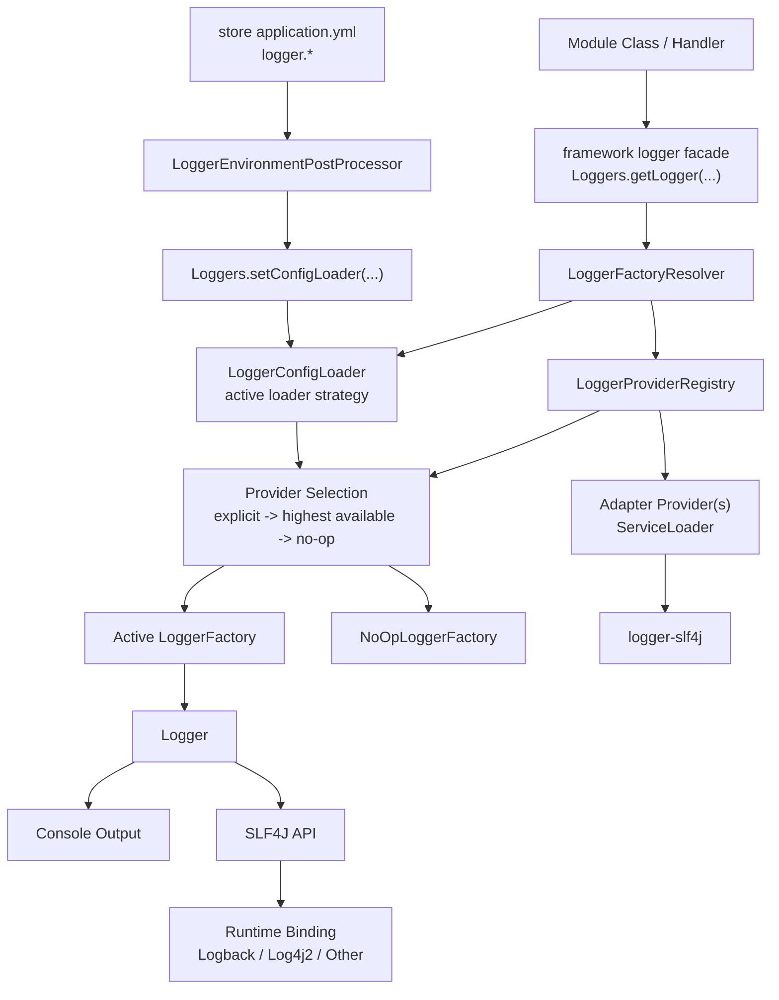
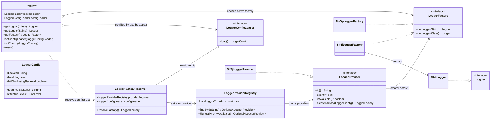
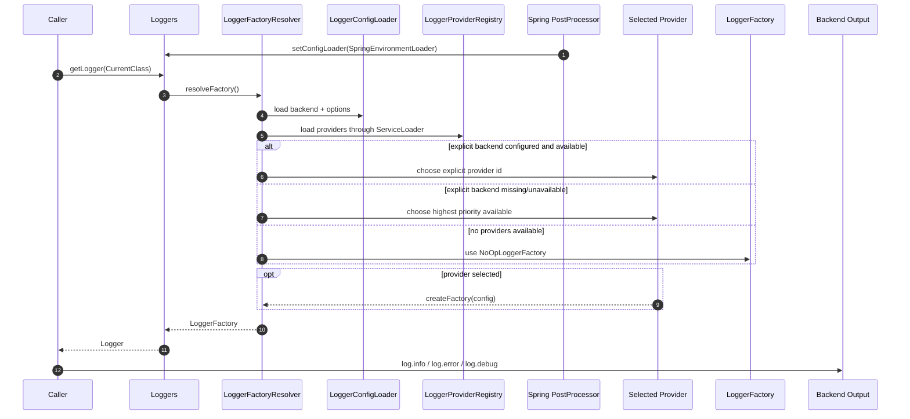

# ADR-004: Modular Logging Framework With Pluggable Providers

## Status

Implemented (March 11, 2026)

## Context

This ADR records the decision behind the logging system that is now implemented in the repo.

At the time of the decision, the project needed a logging approach that could:

- support SLF4J-based logging for Spring Boot integration
- allow future backends without rewriting business/module callsites

The project also had inconsistent logging usage. Some code used Lombok `@Slf4j`, while framework-level code already had a custom logger abstraction. That made backend evolution inconsistent and coupled callers to implementation details.

## Decision

Adopt a modular logging architecture in `framework` using a provider SPI.

### 1) Keep a stable framework logging API

The caller-facing API is:

- `com.grab.framework.logger.Logger`
- `com.grab.framework.logger.LoggerFactory`
- `com.grab.framework.logger.Loggers`

All modules log through this API rather than directly through a backend-specific logger type.

### 2) Introduce a backend provider SPI

Backends plug into the framework through:

- `LoggerProvider`
- `LoggerConfig`
- provider discovery and resolution infrastructure

Provider contract principles:

- each provider has a stable `id`
- each provider reports availability
- each provider creates a `LoggerFactory` for its backend

### 3) Resolve the backend at runtime

Backend resolution order is:

1. explicit backend from config (`logger.backend` or `LOGGER_BACKEND`)
2. if not set, highest-priority available provider
3. if no provider is available, fallback to no-op logging

Provider discovery uses:

- Java `ServiceLoader`

### 4) Keep adapters outside `framework`

The current adapter module is:

- `logger-slf4j`

Rules:

- `framework` owns only the facade, SPI, resolver, and no-op fallback
- adapter modules register providers through `META-INF/services`
- applications choose which adapter modules and config they need

### 5) Standardize caller code in `store`

The resulting caller pattern in `store/src/main/java` is:

```java
private static final Logger log = Loggers.getLogger(CurrentClass.class);
```

This keeps backend swaps transparent to application code.

### 6) Keep backend configuration owned by the application

`store` owns runtime logger configuration through `logger.*` properties in `application.yml`.

`LoggerEnvironmentPostProcessor` installs a Spring-backed `LoggerConfigLoader` into the framework bootstrap via `Loggers.setConfigLoader(...)`.

The framework intentionally does not ship a default `LoggerConfigLoader`. If an application does not install one, logger calls resolve to the no-op fallback until a loader or explicit factory is set.

### 7) Keep the formatting contract familiar

Parameterized logging follows SLF4J-style `{}` placeholders.

This allows framework logger calls to stay familiar to most Java developers.

---

## Visual Overview

> *Diagrams to understand the architecture at a glance.*



## Internal Class Diagram



## How To Read The Class Diagram

- `Loggers` is the entry point used by application classes.
- `Loggers` does not create loggers directly. It resolves and caches a `LoggerFactory`.
- `LoggerFactoryResolver` decides which backend to use.
- `LoggerProviderRegistry` knows only about providers discovered through `ServiceLoader`.
- The chosen provider creates a `LoggerFactory`.
- That factory creates a concrete logger object such as `Slf4jLogger`.
- `Slf4jLogger` delegates to SLF4J. If nothing is configured, `NoOpLoggerFactory` keeps callers safe.

## Runtime Selection Sequence



## Notes

- `framework` does not depend on `slf4j-api` and does not ship concrete backend adapters.
- `framework` does not ship a default `LoggerConfigLoader`; app bootstrap installs one when real backend selection is needed.
- Applications choose backend bindings and formatting at runtime.
- New logger backends are added via `LoggerProvider` plus `META-INF/services` without changing module callsites.
- In this repo, the common runtime path is `Logger` -> `Loggers` -> `logger-slf4j` -> Logback.

---

## Consequences

### Positive

- backend-pluggable logging with stable caller code
- consistent logging style across modules
- clear application ownership of runtime configuration
- easy extension path for new providers
- adapters are no longer sprayed transitively through every module that depends on `framework`

### Negative

- additional module and SPI complexity
- resolver and provider behavior require explicit tests
- more moving parts than using one hard-coded backend directly

## Alternatives Considered

### Use SLF4J directly everywhere

Rejected because it does not provide a framework-owned backend selection model or a clean provider extension path.

### Keep only a custom in-framework logger

Rejected because it integrates poorly with the normal Java/Spring logging ecosystem and makes future backend expansion harder.

### Hard-code support for multiple backends without SPI

Rejected because backend branching would become rigid and harder to maintain as more backends are added.
