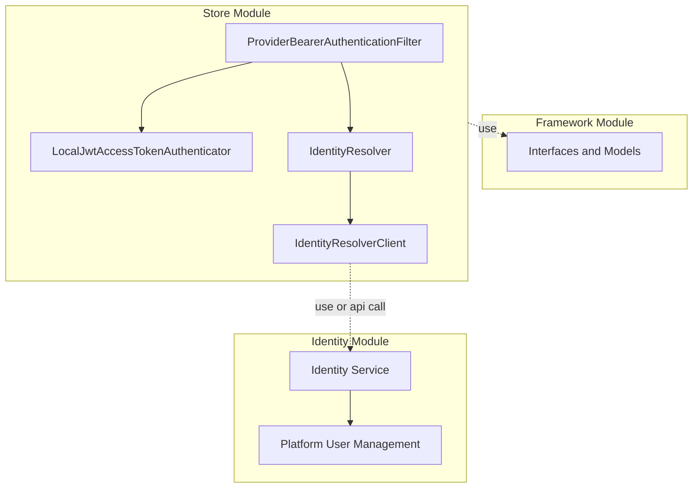
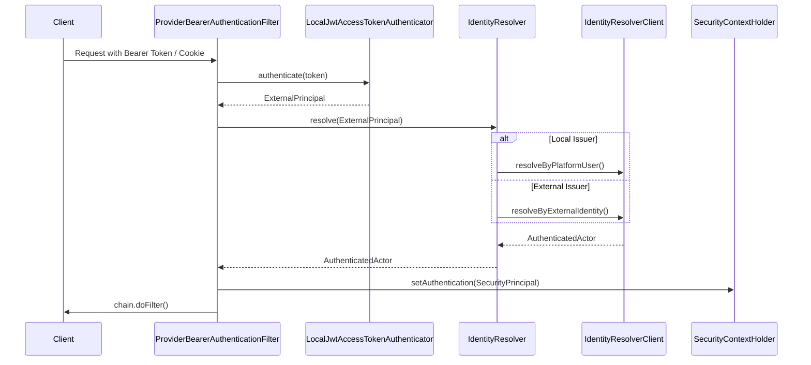

# API Security Architecture: JWT Authentication and Identity Resolution

## 1. The Problem

**What's not working?**  
The store API needs a secure, scalable, and decoupled mechanism to authenticate incoming requests and resolve user identities across different modules.

**What's at stake?**  
Without a robust and modular security architecture, we risk unauthorized access, tightly coupled security logic across modules, and difficulties in scaling or integrating with external identity providers in a distributed architecture.

---

## 2. What We Decided

**The core approach:**  
Implement a decentralized, JWT-based bearer token authentication flow using a custom Spring Security filter that delegates token validation and identity resolution to dedicated domain components.

**Key changes:**
- Created `ProviderBearerAuthenticationFilter` to extract JWT from `Authorization` headers or cookies.
- Developed `LocalJwtAccessTokenAuthenticator` to verify token signatures, validate claims (issuer, audience, type), and extract an `ExternalPrincipal`.
- Introduced `IdentityResolver` and `IdentityResolverClient` to decouple token validation from actual identity resolution, distinguishing between local platform users and external identities.
- Wrapped the resolved `AuthenticatedActor` in a `SecurityPrincipal` for standard Spring Security context integration.

**What stays the same:**  
Existing Spring Security configuration concepts (like `SecurityContextHolder`) continue to be used to define route-level access rules and authorize requests based on the populated context.

---

## 2.1. Visual Overview

> *Diagrams to understand the architecture at a glance.*

### Module Relationships

### High-Level Flow / Components

---

## 3. Why This Approach

**Primary reasons:**
1. **Separation of Concerns:** Validating a JWT signature and claims (`AccessTokenAuthenticator`) is distinctly separated from resolving what that identity means within our system (`IdentityResolver`).
2. **Extensibility:** The `IdentityResolver` checks the token issuer and delegates to the appropriate resolution path, making it easy to support external identity providers in the future without changing the core authentication filter.
3. **Framework Integration:** By wrapping our rich domain model (`AuthenticatedActor`) inside `SecurityPrincipal`, we leverage Spring Security's native `@PreAuthorize` mechanisms without polluting our domain models with Spring dependencies.

---

## 4. Trade-offs

| Pros | Cons |
|-------|-------|
| Highly decoupled token validation and identity resolution. | Increased complexity with multiple abstraction layers (`ExternalPrincipal`, `AuthenticatedActor`, `SecurityPrincipal`). |
| Flexible token extraction (supports both Headers and Cookies). | Custom filter requires careful ordering in the Spring Security chain and dedicated error handling (`AuthenticationEntryPoint`). |
| Ready for multi-issuer support (local vs external). | Potential performance overhead if `IdentityResolverClient` requires remote or database calls per request. |

---

## 5. What Needs to Change

**New components/modules to build:**
- Custom JWT parsing and validation logic (`LocalJwtAccessTokenAuthenticator`).
- Interfaces for identity resolution (`IdentityResolver`, `IdentityResolverClient`).
- Custom security filter (`ProviderBearerAuthenticationFilter`).
- Specific exception handling for authentication failures (`IdentityAuthenticationException`).

**Changes to existing systems:**
- Spring Security configuration must be updated to insert `ProviderBearerAuthenticationFilter` before standard authentication filters.
- Controllers and services need to expect `SecurityPrincipal` in their security context for authorization checks.
---

## 7. Related Documents

- [Architecture Decision Record Template](file:///Users/khinemyaezin/Repository/grab-ecommerce/grab/docs/ADR_SKILLS.md)
- [Security Module Source Code](file:///Users/khinemyaezin/Repository/grab-ecommerce/grab/store/src/main/java/com/grab/store/shared/security)
