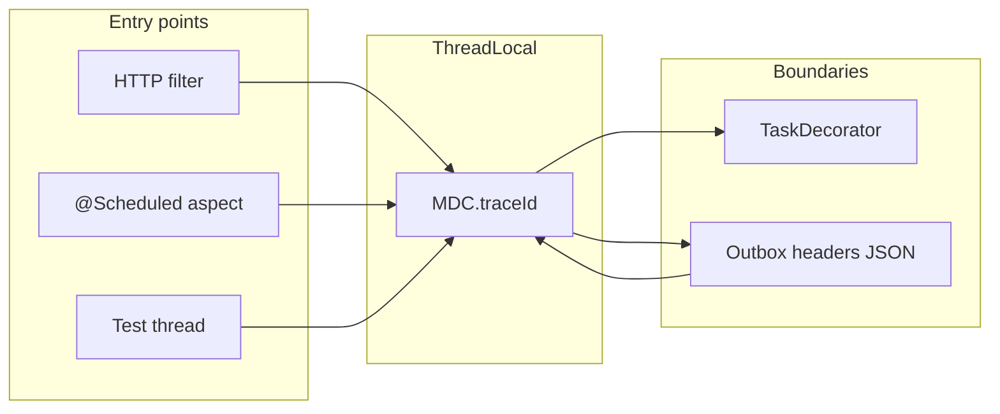
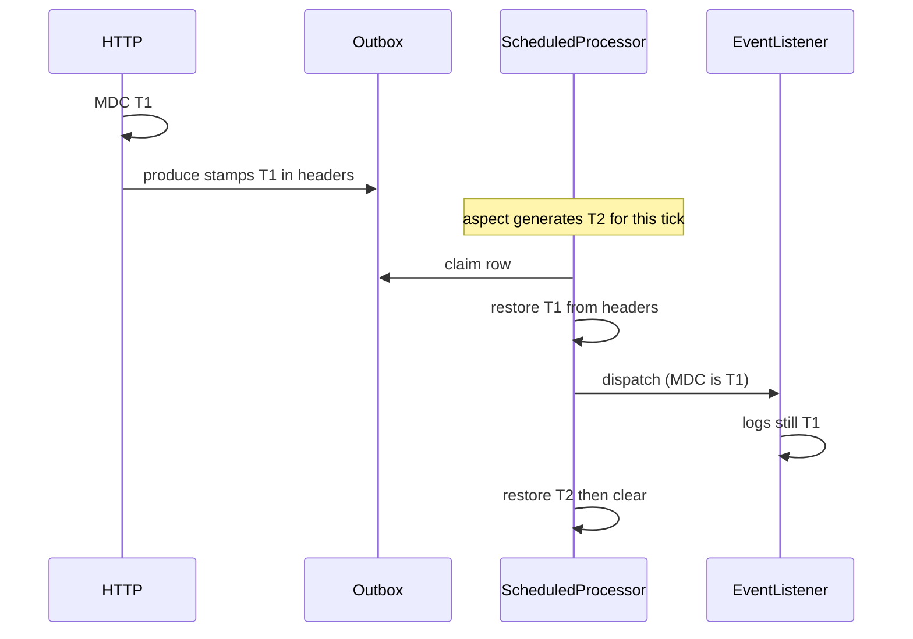

# MDC Correlation Context at Every Entry Point

## Status

Accepted (implemented)

**Does not replace:** [ADR_004 — Framework logging facade](./ADR_004-Framework_logging_facade_&_slf4j_bridge.md). Callers still log through `Loggers.getLogger(...)`. This ADR only fills SLF4J MDC so Logback `%X{traceId}` and ProblemDetail `traceId` are non-empty.

**Does not replace:** [ADR_002 — Module-scoped outbox](./ADR_002-Module_scoped_outbox_architecture.md). Outbox remains the durability domain. Trace context is extra JSON on the existing `headers` column, not a second outbox or a new event field.

**Does not replace:** workflow `correlationId` ([ADR_006](./ADR_006-Orchestrated_saga_architecture.md), [ADR_007](./ADR_007-Workflow_framework_internal_design.md)). That ID identifies a saga instance. MDC `traceId` identifies a log/request join key. They are not automatically equal.

---

## 1. The Problem

Logback already prints `[traceId=%X{traceId:-}]`. `GlobalApiExceptionHandler` and `ProblemDetailAuthEntryPoint` already read `MDC.get("traceId")`. Nothing wrote it.

MDC is a `ThreadLocal`. It is empty unless the current thread put a value, and it does not survive a thread hop or a later outbox replay. The result:

- HTTP logs and 401/500 ProblemDetail showed empty `traceId`
- `@Scheduled` jobs (reservation expiry, outbox processors) logged with no join key
- Tests and background threads had no context unless a caller remembered `MDC.put`

Micrometer Tracing / OpenTelemetry would auto-fill HTTP MDC only. Jobs, tests, and outbox listeners would still need adapters. Installing a tracer without those adapters would not fix the empty field.

---

## 2. What We Decided

Treat **MDC `traceId` as a correlation ID** populated at every process entry, copied across thread hops, and carried in outbox headers across time. Do **not** add Micrometer Tracing or OpenTelemetry in this pass.

**The core approach:** one helper, three adapters.

| Boundary | Adapter | Behavior |
|----------|---------|----------|
| HTTP request | `TraceIdFilter` (`OncePerRequestFilter`, `HIGHEST_PRECEDENCE`) | Prefer `X-Trace-Id`, else `X-Request-Id`, else generate UUID. Echo `X-Trace-Id`. Clear/restore MDC in `finally`. |
| Executor hop | `MdcCopyingTaskDecorator` | Copy `MDC.getCopyOfContextMap()` onto the worker; restore afterward. |
| `@Scheduled` tick | `ScheduledTraceContextAspect` | Generate a **new** ID for the tick; always `clear()` after (scheduler threads are reused). |
| Outbox produce | `JpaOutboxDomainEventProducer` | If MDC is set, merge `traceId` into headers JSON. Keep `contentType` so JSON vs legacy detection still works. |
| Outbox dispatch | `AbstractOutboxProcessor` | Restore `headers.traceId` around `dispatcher.dispatch`. If missing (old rows), generate for that publish. |

Shared helper: `com.grab.framework.logger.slf4j.TraceContext` in `logger-slf4j` (`put` / `current` / `generate` / `run` / `clear`). `framework` stays free of SLF4J.

**What stays the same:**

- Logback pattern is unchanged.
- Exception handlers still *read* MDC; they do not generate IDs.
- In-process `@EventListener`s (no `@Async`) keep the publisher thread’s MDC for free.
- Workflow `correlationId` is unchanged.

### Same ID vs new ID

- **HTTP → outbox produce → later dispatch → `@EventListener`:** same `traceId` as the original request, if it was stamped at produce time.
- **Scheduler tick logs** (`Processing available … outbox events`): a **new** job ID for that poll. Dispatch of each row then switches to the stamped (HTTP) ID, then restores the job ID.
- **Rows produced with empty MDC** (tests, legacy `{}` headers): a **new** UUID at publish time, not the original request.

---

## 2.1. Visual Overview

---

## 3. Why This Approach

1. Logback and ProblemDetail already assumed MDC `traceId`. Filling it is cheaper than changing the log contract or adding a collector.
2. A servlet filter at highest precedence covers Security 401s and `security.enabled=false`. An MVC interceptor would not.
3. Explicit adapters at thread and outbox boundaries are required even with OpenTelemetry. Doing them now means a later tracer can plug in without a second round of plumbing.
4. Stamping outbox `headers` (already a JSON column) avoids a schema migration and keeps payload types untouched.
5. Generating a fresh ID per `@Scheduled` tick isolates reused scheduler threads. Restoring the stamped ID only around `dispatch` still joins listener logs to the originating HTTP request.

---

## 4. Trade-offs

| Pros | Cons |
|------|------|
| HTTP, jobs, and outbox listeners become joinable in logs and error bodies | Correlation IDs, not traces: no spans, timing, or parent/child |
| 401s and security-disabled requests still get an ID | Inbound `X-Trace-Id` is trusted as-is (no W3C `traceparent` / format check) |
| Outbox replay keeps the HTTP ID on listener logs | Scheduler *tick* logs use a different ID than the dispatched events |
| No new ops stack (Zipkin, OTel collector) | UUIDs are not OTel 32-hex IDs; a later tracer must map or dual-write |
| `framework` stays free of SLF4J | `outbox-infrastructure` depends on `logger-slf4j` |
| Cleanup in `finally` limits ThreadLocal leaks | Custom executors / raw threads still drop MDC unless they use the decorator |
| Workflow `correlationId` stays a saga key | WebMvc tests with `addFilters = false` still need a manual `MDC.put` |

---

## 5. Alternatives Considered

### Micrometer Tracing / OpenTelemetry only

Rejected as the *first* step. HTTP MDC would fill automatically; `@Scheduled`, tests, and outbox restore would still be empty. The same three adapters would be required. UUID correlation IDs now; a tracer can be added later because `GlobalApiExceptionHandler` already falls back to `X-B3-TraceId` / `trace_id`.

### MVC interceptor instead of a servlet filter

Rejected. Interceptors do not run for Spring Security authentication failures. `ProblemDetailAuthEntryPoint` would still emit empty `traceId`.

### Put `traceId` on the event payload

Rejected. It would leak logging transport into every domain event type. Outbox `headers` already exist for envelope metadata.

### One ID for the whole scheduler tick, no restore on dispatch

Rejected. Listener logs would not join the originating HTTP request. Restoring around `dispatch` is the point of carrying headers.

---

## 6. Related Documents

- [ADR_002 — Module-scoped outbox](./ADR_002-Module_scoped_outbox_architecture.md)
- [ADR_003 — Exception handling](./ADR_003-Exception_handling_framework_architecture.md)
- [ADR_004 — Framework logging facade](./ADR_004-Framework_logging_facade_&_slf4j_bridge.md)
- [ADR_006 — Orchestrated saga](./ADR_006-Orchestrated_saga_architecture.md)
- [ADR_007 — Workflow framework](./ADR_007-Workflow_framework_internal_design.md)
