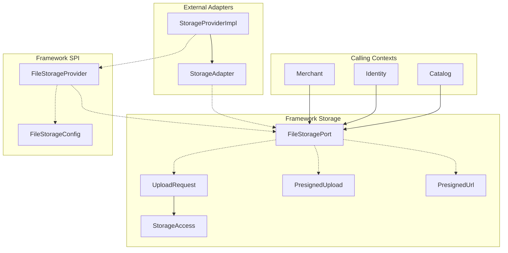
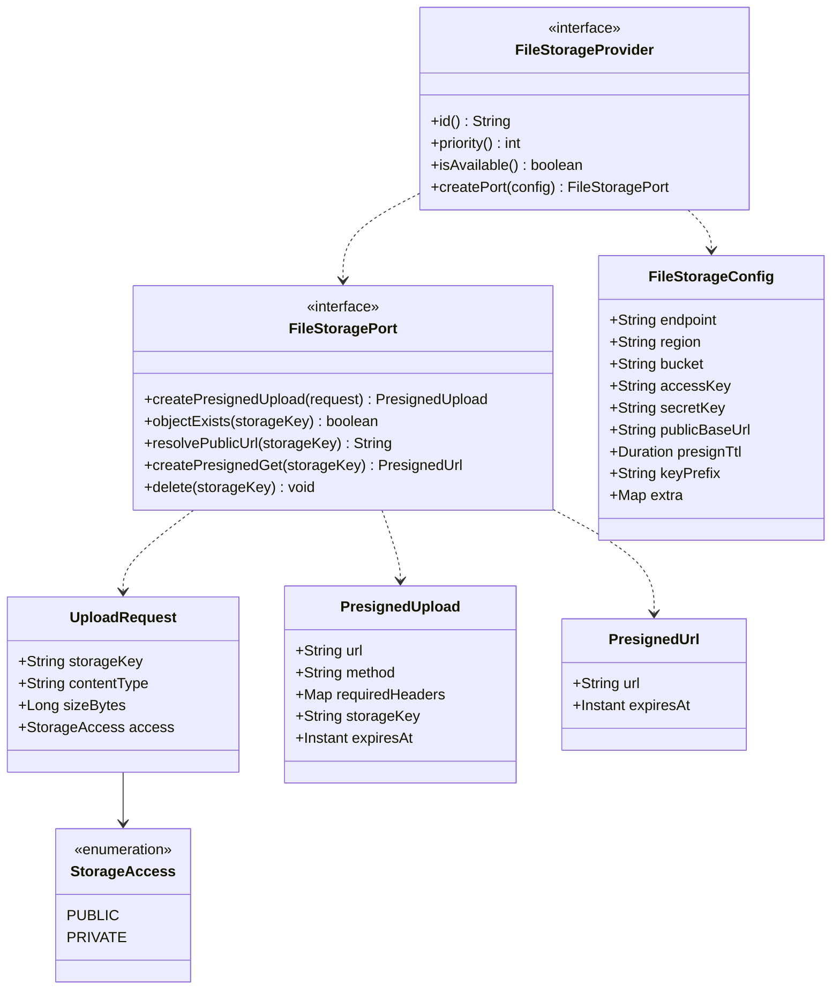
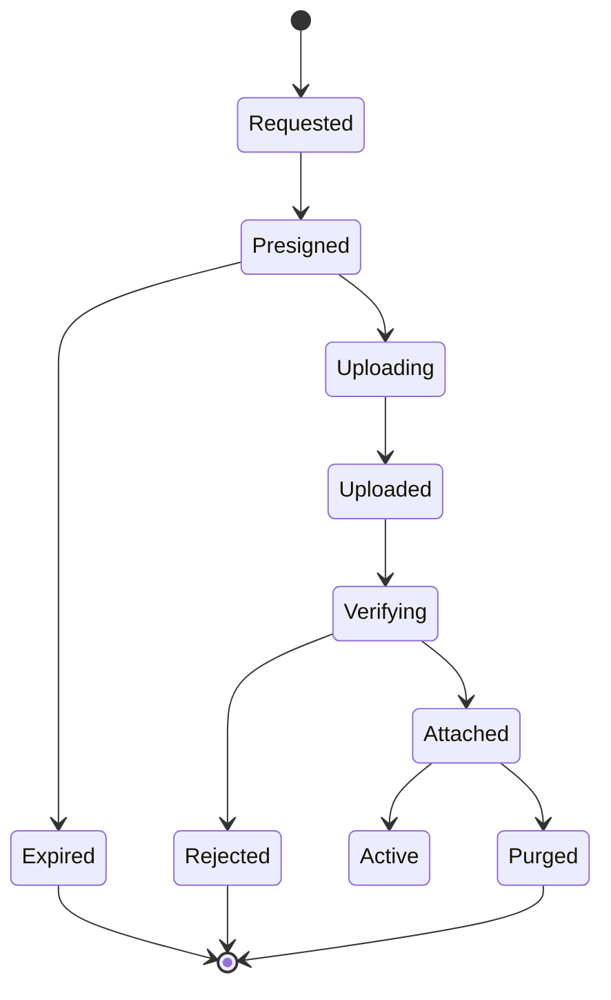
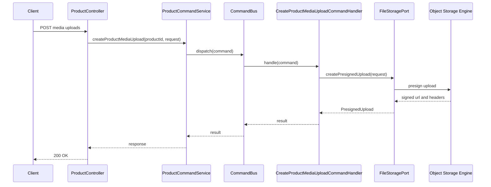
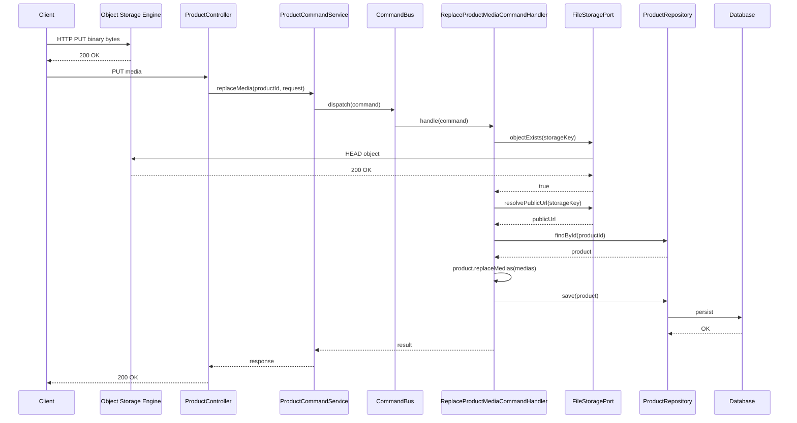

# Framework Object Storage Abstraction and SPI Architecture

---

## 1. The Problem

**What's not working?**  
The commerce platform requires persistent binary assets (product images, variant swatches, documents, and future merchant/identity media), but storing binary files or base64 payloads directly inside relational database tables (PostgreSQL) degrades query performance, inflates database backups, and violates database sizing limits. Passing binary streams directly through backend REST controllers exhausts worker threads and network I/O, while hardcoding vendor-specific storage SDKs (e.g., AWS SDK, Google Cloud Storage, Azure Blob) directly into business domain modules tightly couples domain logic to infrastructure and prevents backend portability.

**What's at stake?**  
Without a pure, vendor-neutral storage abstraction in the core framework, domain modules (`catalog`, `identity`, `merchant`) would either:
1. Stream binary payloads through the JVM, creating severe memory pressure and latency bottlenecks.
2. Directly import vendor-specific cloud libraries, breaking hexagonal architectural boundaries and making testing, local emulation, and cloud provider migration costly and error-prone.
3. Persist unverified storage paths, leaving the database vulnerable to broken links and dangling references.

---

## 2. What We Decided

**The core approach:**  
Establish a vendor-agnostic object storage abstraction (`com.grab.framework.storage`) and Service Provider Interface (`com.grab.framework.storage.spi`) within the core `framework` module, adopting direct client-to-storage presigned uploads with server-side `HEAD` verification, while keeping all concrete vendor SDKs and infrastructure adapters strictly outside `framework`.

**Key changes:**
- **Framework Storage Port:** Define `FileStoragePort` in `com.grab.framework.storage` as the singular hexagonal output port for generating presigned upload URLs, verifying object existence, resolving public URLs, issuing presigned download URLs, and deleting objects.
- **Pure Domain Value Types:** Provide immutable domain records (`UploadRequest`, `PresignedUpload`, `PresignedUrl`, and `StorageAccess`) within `framework` with zero dependencies on third-party cloud SDKs.
- **Pluggable Provider SPI:** Mirror the framework's logging SPI pattern (`com.grab.framework.logger.spi`) by introducing `FileStorageProvider` and `FileStorageConfig` in `com.grab.framework.storage.spi`, allowing concrete storage backends to be discovered, prioritized, and instantiated dynamically.
- **Presigned Direct Upload Pattern:** Shift binary transfer entirely out-of-band: clients obtain an authorized presigned upload contract from domain services, upload bytes directly to the storage engine via HTTP PUT, and subsequently submit the storage key to the domain API for verification.
- **Server-Side Verification Contract:** Mandate that calling domain services verify object existence (`FileStoragePort.objectExists(storageKey)`) via an out-of-band `HEAD` check before associating media records with domain aggregates.
- **Zero Cloud SDKs in Framework:** Keep the `framework` module completely free of cloud vendor dependencies (AWS SDK, GCS, Azure). Infrastructure adapters implement the framework SPI in separate adapter modules (e.g., `storage-infrastructure`).

**What stays the same:**  
Relational databases continue to store only metadata (storage keys, public URLs, content types, rank orders, and dimensions); raw bytes are never stored in the database. Domain aggregate roots (e.g., `Product`) remain pure and completely oblivious to storage endpoints, credentials, and presigning mechanics.

---

## 2.1. Visual Overview

> Diagrams and tables so a newcomer can learn the domain and application design at a glance.

### Part 1 — Domain Bounded Context

#### Responsibility & Boundary

**This bounded context (Framework Storage Core) owns:**
- Defining the vendor-neutral object storage port (`FileStoragePort`).
- Defining pure value representations for upload specifications and presigned contracts (`UploadRequest`, `PresignedUpload`, `PresignedUrl`).
- Defining access visibility classifications (`StorageAccess.PUBLIC`, `StorageAccess.PRIVATE`).
- Defining the pluggable provider SPI contracts and configuration records (`FileStorageProvider`, `FileStorageConfig`).
- Enforcing structural validation on storage requests (non-blank storage keys, default visibility, immutable signature headers).

**This bounded context does not own:**
- Media-to-product aggregate relationships, gallery ordering, or variant subset invariants (owned by the `Catalog Bounded Context`).
- Business authorization or multi-tenancy access rules (owned by calling bounded contexts like `Catalog` or `Merchant`).
- Physical binary persistence, block allocation, or bucket storage management (delegated to the underlying object storage engine).
- Concrete vendor SDK implementations or HTTP client lifecycles (owned by external infrastructure adapter modules).

**Primary use cases:**
1. **Presigned Upload Generation:** Issuing time-limited cryptographically signed PUT URLs so frontend clients can upload media directly to object storage without burdening the application server.
2. **Pre-Attachment Verification:** Executing high-speed `HEAD` probes (`objectExists`) to guarantee that a file was successfully uploaded to the storage engine before committing database foreign keys.
3. **Public URL Resolution:** Formatting canonical, CDN-cacheable storefront URLs for public assets.
4. **Presigned Private Download:** Generating temporary authorized GET URLs for private or sensitive assets (e.g., merchant verification documents, invoices).
5. **Physical Cleanup:** Deleting orphaned or purged objects from the storage bucket when domain entities are permanently removed.

---

#### Ubiquitous Language

| Business term | Domain type / value | Meaning |
|---|---|---|
| **Storage Key** | `String storageKey` | The deterministic relative path identifier of an object within the storage bucket (e.g., `merchants/10/products/55/a1b2c3.jpg`). |
| **Storage Port** | `FileStoragePort` | The framework interface providing core storage operations to all calling domain modules. |
| **Presigned Upload** | `PresignedUpload` | A signed contract authorizing an HTTP client to directly PUT binary bytes to storage within a specific validity window. |
| **Presigned URL** | `PresignedUrl` | An ephemeral signed GET URL granting temporary read access to a private object. |
| **Public Base URL** | `FileStorageConfig.publicBaseUrl` | The root host URL used to publicly view storefront media (e.g., `http://localhost:8333/grab-media`). |
| **Storage Access** | `StorageAccess` | Enumeration indicating whether an object is publicly readable (`PUBLIC`) or requires signed access (`PRIVATE`). |
| **Upload Request** | `UploadRequest` | Value record describing the intended upload: key, MIME type, payload size, and access policy. |
| **Storage Provider** | `FileStorageProvider` | SPI interface implemented by infrastructure adapters to supply storage port instances. |
| **Storage Config** | `FileStorageConfig` | Immutable configuration bag conveying connection strings, bucket names, credentials, and TTLs to providers. |

---

#### Context Map

The `framework` storage package defines the hexagonal port and value types consumed by business bounded contexts (`Catalog`, and future `Identity` / `Merchant` modules). Concrete infrastructure adapters implement the framework SPI outside `framework`.

---

#### Aggregate Domain Model

> The domain model encapsulates the core framework storage contracts, value records, and SPI interfaces with zero external library dependencies.

---

#### Relationships

| From | To | Kind | Notes |
|---|---|---|---|
| `FileStoragePort` | `UploadRequest` | Parameter | Input specification defining the target key, content type, size limit, and access visibility. |
| `FileStoragePort` | `PresignedUpload` | Return type | Output contract delivering the presigned upload URL, HTTP method, signature headers, and expiration timestamp. |
| `FileStoragePort` | `PresignedUrl` | Return type | Ephemeral read contract delivering authorized download URL and expiration timestamp. |
| `UploadRequest` | `StorageAccess` | Composition | Enum indicating whether the uploaded asset is publicly accessible or access-restricted. |
| `FileStorageProvider` | `FileStoragePort` | Factory | Instantiates a concrete storage port adapter configured with operational parameters. |
| `FileStorageProvider` | `FileStorageConfig` | Parameter | Immutable configuration settings passed into provider factory methods. |
| `Domain Callers` | `FileStoragePort` | Dependency | Business services call the port to presign uploads and verify object existence without knowing the underlying storage engine. |

---

#### Why Each Property Exists

> Every property and method parameter on the domain diagram appears here with its business justification.

| Property | Owner type | Type | Business reason |
|---|---|---|---|
| `storageKey` | `UploadRequest` | `String` | Uniquely locates the file within the storage bucket following tenancy rules (`merchants/{mId}/products/{pId}/{uuid}.{ext}`). |
| `contentType` | `UploadRequest` | `String` | Enforces standard MIME type (e.g., `image/jpeg`) so storage services sign and serve the correct `Content-Type`. |
| `sizeBytes` | `UploadRequest` | `Long` | Optional payload constraint preventing clients from uploading files exceeding allowed upload quotas. |
| `access` | `UploadRequest` | `StorageAccess` | Directs storage adapters whether to format public CDN links or enforce private signed access tokens. |
| `url` | `PresignedUpload` | `String` | The complete URL (including authentication query parameters) where the client must PUT the binary bytes. |
| `method` | `PresignedUpload` | `String` | The required HTTP verb (typically `PUT`) specified in the cryptographic signature. |
| `requiredHeaders` | `PresignedUpload` | `Map<String, String>` | HTTP headers that the client must include in the upload request (e.g., `Content-Type`) to prevent signature mismatch. |
| `storageKey` | `PresignedUpload` | `String` | Echoed back to the client so it can identify the upload and send it back to the backend during the attach step. |
| `expiresAt` | `PresignedUpload` | `Instant` | Informs the client when the presigned authorization expires, preventing stalled uploads. |
| `url` | `PresignedUrl` | `String` | Ephemeral signed GET URL used to read private or protected assets. |
| `expiresAt` | `PresignedUrl` | `Instant` | Expiration time for temporary download authorization. |
| `PUBLIC` | `StorageAccess` | Enum value | Assets accessible by any anonymous internet user (product images, catalog swatches). |
| `PRIVATE` | `StorageAccess` | Enum value | Restricted business assets accessible only by authorized authenticated principals. |
| `endpoint` | `FileStorageConfig` | `String` | Configurable storage server endpoint URI, enabling connection to local emulators or custom cloud endpoints. |
| `region` | `FileStorageConfig` | `String` | Geographic region or cluster zone required for service routing and signature validation. |
| `bucket` | `FileStorageConfig` | `String` | Namespace or container where media objects are segregated. |
| `accessKey` | `FileStorageConfig` | `String` | Authentication identity/key used to authenticate with storage engines. |
| `secretKey` | `FileStorageConfig` | `String` | Cryptographic secret key used to sign presigned URLs and requests. |
| `publicBaseUrl` | `FileStorageConfig` | `String` | Publicly resolvable base URL for storefront clients to fetch images without gateway routing. |
| `presignTtl` | `FileStorageConfig` | `Duration` | Time-to-live for presigned signatures (defaulting to 15 minutes). |
| `keyPrefix` | `FileStorageConfig` | `String` | Optional root prefix to isolate environments or tenants sharing a single physical bucket. |
| `extra` | `FileStorageConfig` | `Map<String, String>` | Extensibility bag for provider-specific properties without breaking core config schemas. |
| `id` | `FileStorageProvider` | `String` | Stable unique identifier for the provider (e.g., `"s3"`, `"gcs"`). |
| `priority` | `FileStorageProvider` | `int` | Determines provider precedence when multiple providers are present on the classpath. |
| `isAvailable` | `FileStorageProvider` | `boolean` | Health probe reporting whether required client libraries and configurations are met. |

---

#### Invariants & Policies

| Rule (business language) | Enforced by | When |
|---|---|---|
| **Storage key cannot be blank** | `UploadRequest` constructor | At upload request creation; rejects null or empty strings immediately. |
| **Default to PUBLIC access** | `UploadRequest` constructor | When `access` parameter is omitted, defaults safely to `StorageAccess.PUBLIC`. |
| **HTTP method defaults to PUT** | `PresignedUpload` constructor | Ensures client upload contracts mandate HTTP `PUT` if unspecified. |
| **Defensive copy of required headers** | `PresignedUpload` constructor | Ensures the signed header map is immutable and non-null. |
| **Default presign duration is 15 minutes** | `FileStorageConfig` constructor | Guarantees signature validity duration if unspecified in configuration. |
| **Default region fallback** | `FileStorageConfig` constructor | Defaults region to `us-east-1` when blank. |
| **Missing object returns false, not exception** | `FileStoragePort.objectExists` contract | Implementations must catch missing key/404 responses and return `false` cleanly to callers. |
| **Deterministic public URL formatting** | `FileStoragePort.resolvePublicUrl` contract | Implementations must cleanly join `publicBaseUrl` and `storageKey` without missing or duplicate slashes. |
| **Server-side verification before metadata commit** | Domain Command Handlers | Verifies `fileStoragePort.objectExists(storageKey)` before persisting media rows in the database. |

---

#### Lifecycle

The media upload lifecycle transitions from initialization to verified persistence or cleanup:

---

### Part 2 — Application Architectural Design

#### Components & Layers

The storage framework integrates cleanly into the CQRS architecture of the commerce platform:

| Layer | Responsibility | Example types |
|---|---|---|
| **Controller** | Exposes REST endpoints for requesting upload URLs and attaching media. | `ProductController` |
| **Command Service** | Coordinates HTTP DTO mapping and dispatches commands to the command bus. | `ProductCommandService` |
| **Command Handlers** | Executes business transactions, calls `FileStoragePort`, and mutates aggregates. | `CreateProductMediaUploadCommandHandler` `ReplaceProductMediaCommandHandler` |
| **Domain Model** | Pure aggregate roots maintaining media collections and variants. | `Product`, `ProductMedia`, `ProductVariant` |
| **Framework Port & SPI** | Pure vendor-agnostic interface, value types, and provider SPI contracts. | `FileStoragePort`, `UploadRequest`, `PresignedUpload`, `FileStorageProvider`, `FileStorageConfig` |
| **Infrastructure Adapter (Outside Framework)** | Pluggable module translating port calls to external storage SDKs. | `storage-infrastructure` (`S3FileStorageAdapter`, `S3FileStorageProvider`) |

---

#### Data / Command Flow

##### Flow 1: Requesting Presigned Upload

##### Flow 2: Direct Binary Upload & Attachment Verification

---

#### Integration

**Publishes (Domain Events):**
- `ProductMediaChangedEvent` — Dispatched after product media rows are replaced or re-ranked, notifying storefront search indices and inventory caches to update.
- `VariantMediaChangedEvent` — Dispatched when SKU variants are mapped to specific subsets of product media.

**Consumes:**
- `CreateProductMediaUploadCommand` — Generates presigned upload URL and storage key.
- `ReplaceProductMediaCommand` — Validates storage keys via `FileStoragePort.objectExists` and replaces aggregate media collections.

**Named Interfaces & Modules:**
- **Exposes:** `com.grab.framework.storage.FileStoragePort` (public storage interface for any bounded context).
- **SPI Hook:** `com.grab.framework.storage.spi.FileStorageProvider` (extensibility SPI implemented by external adapter modules).

---

## 3. Why This Approach

**Primary reasons:**
1. **Zero Backend Bandwidth / Memory Saturation:** Transferring binary bytes directly between the client and object storage completely removes heavy payloads from Spring Boot application servers. Backend services remain lightweight and consume minimal JVM heap.
2. **Absolute Clean Decoupling (Hexagonal Architecture):** Placing `FileStoragePort` and pure value objects in `framework` ensures that business aggregates (`Product`, `Merchant`, `Identity`) never import cloud vendor libraries. Swapping object storage engines requires zero changes to business domain logic.
3. **Pluggable Multi-Backend SPI:** Following the same architectural pattern as the framework logging facade (`LoggerProvider`), storage implementations are pluggable through `FileStorageProvider`, enabling seamless transitions between local emulators, S3, GCS, Azure Blob, or test mocks.
4. **Resilience Against Dangling References:** Performing an instantaneous server-side `HEAD` probe (`objectExists`) before saving media associations in PostgreSQL guarantees that every catalog media row points to an existing, verified object.

---

## 4. Trade-offs

| Pros | Cons |
|---|---|
| **High Throughput & Scalability:** Web servers handle lightweight JSON metadata only; file streaming is offloaded to specialized storage infrastructure. | **Two-Step Upload Flow:** Frontend clients must orchestrate a two-phase interaction (request upload URL → PUT bytes → submit attachment). |
| **Pluggable & Vendor Neutral:** Storage engine can be swapped via SPI without modifying core domain modules. | **Orphaned Object Accumulation:** If a client requests an upload URL and PUTs bytes to storage but never calls the attach API, the unattached object remains in the bucket (requires periodic bucket lifecycle expiration rules). |
| **Strict Multi-Tenant Security:** Signed URLs restrict clients to upload only to their assigned tenant/product storage key with an exact content type and short expiration window. | **CORS Configuration Required:** Object storage endpoints must configure CORS headers to allow direct PUTs from client browser domains. |
| **Zero Database Bloat:** Database tables store lightweight string keys and metadata, keeping backups and index lookups highly performant. | **Distributed Consistency:** Deleting a database record does not atomically delete storage bytes within a two-phase commit (addressed via asynchronous cleanup jobs). |

---

## 5. What Needs to Change

**New components in framework:**
- `framework/src/main/java/com/grab/framework/storage`:
  - `FileStoragePort.java`: Vendor-neutral storage port contract.
  - `UploadRequest.java`: Value record for upload intents.
  - `PresignedUpload.java`: Presigned upload result model.
  - `PresignedUrl.java`: Ephemeral read URL model.
  - `StorageAccess.java`: Visibility enum (`PUBLIC`, `PRIVATE`).
- `framework/src/main/java/com/grab/framework/storage/spi`:
  - `FileStorageConfig.java`: Vendor-agnostic configuration record.
  - `FileStorageProvider.java`: Extensibility SPI interface.

**External adapter implementations (outside framework):**
- Separate infrastructure modules (such as `storage-infrastructure`) implement `FileStorageProvider` and `FileStoragePort` using specific client libraries (e.g., AWS SDK v2 for S3-compatible engines).

**Changes to existing domain consumers:**
- `store/catalog`:
  - Inject `FileStoragePort` into `CreateProductMediaUploadCommandHandler` and `ReplaceProductMediaCommandHandler`.
  - Deprecate direct path string uploads; replace with presigned upload and verify pipeline.

---

## 6. Implementation Plan

- **Phase 1 (Complete):** Implement framework storage port (`FileStoragePort`) and SPI contracts (`FileStorageProvider`, `FileStorageConfig`) in `framework`.
- **Phase 2 (Complete):** Implement external adapter in `storage-infrastructure` and configure local object storage under Docker Compose.
- **Phase 3 (Complete):** Integrate `FileStoragePort` into the Catalog bounded context (`ProductController`, `CreateProductMediaUploadCommandHandler`, `ReplaceProductMediaCommandHandler`, and unit/slice tests).
- **Phase 4 (Future):** Reuse `FileStoragePort` across other bounded contexts (e.g., Identity user profile avatars and Merchant storefront branding).

---

## 7. Related Documents

- **Catalog Media Architecture ADR:** [ADR_003-Product_and_variant_media.md](../domain/catalog/architecture/ADR_003-Product_and_variant_media.md)
- **Product Bounded Context Architecture ADR:** [ADR_002-Product_bounded_context_architecture.md](../domain/catalog/architecture/ADR_002-Product_bounded_context_architecture.md)
- **System Architecture ADR:** [ADR_001-System_architecture.md](ADR_001-System_architecture.md)
- **Framework Logging SPI Reference:** [ADR_004-Framework_logging_facade_&_slf4j_bridge.md](ADR_004-Framework_logging_facade_&_slf4j_bridge.md)
- **Platform Architecture:** [Commerce_Platform.md](../../Commerce_Platform.md)

**Rollback strategy:**  
Because `FileStoragePort` is an abstraction behind an interface, rolling back to an alternative storage provider (or a no-op / local filesystem mock) requires registering a different `FileStorageProvider` implementation without altering any domain or command handler code. Existing media records in the database retain their relative `storageKey` strings, preserving backward compatibility.
