# Storefront Query Read Model

> **Status:** Proposed  
> **Type:** System architecture (read-side module, not a write aggregate)  
> **Filename note:** This record lives at `storefront-query.md` as requested. It is the next system ADR after ADR-012.

---

## 1. The Problem

**What's not working?**  
Customer browse and PDP must show one screen of product, channel visibility, price, and stock. Those facts live in four write bounded contexts (Catalog, Sales Channel, Pricing, Inventory). Specs describe Storefront Query as a live composition API that asks those contexts on every request. That fans out across module internals, couples listing availability to every write module being up, and cannot filter “published + in stock + priced on this channel” without pulling too much data. As a microservice split, request-time joins become latency and failure cascades.

**What's at stake?**  
If we SQL-join or call `internal/` handlers from Catalog into Pricing and Inventory, we violate Modulith isolation (no cross-module FKs, no `internal/` imports) and block extraction. If we treat Catalog `ACTIVE` as globally buyable, unpublished website/marketplace listings leak. If add-to-cart reads the same stale listing the shop showed, two eventual layers stack and we oversell or underprice with no source-of-truth check.

---

## 2. What We Decided

**The core approach:**  
Industry hybrid commerce: **the shop page is allowed to lag; the cart line is not allowed to invent numbers.** Storefront Query owns a projected `BuyableOffer` document keyed by `(salesChannelId, variantId)`, fed by write-module outbox events. Browse and PDP read only that store. Add-to-cart ignores the offer, calls published `::query` ports on Sales Channel, Catalog, Pricing, and Inventory, then snapshots the live quote onto a Cart line. Reservation at complete-cart (later) is the only oversell lock.

**Key changes:**
- Storefront Query is a **read module**, not a domain aggregate. It does not mutate Catalog, Pricing, Inventory, Cart, or Order.
- Introduce `BuyableOffer` as a denormalized read model (own datasource), mirroring Inventory’s `ProductVariantView` pattern.
- Browse/PDP require `salesChannelId` and hit only `BuyableOffer`. Disabled channel fails closed. Unpublished SKUs never appear.
- Write modules publish integration events on Modulith `::events` named interfaces; projectors upsert or hide offers.
- Add-item is a **Cart command** plus `::query` ports (single write → not an ADR-006 durable saga). It must not read `BuyableOffer`.
- Three copies of the same facts: source of truth (strong in each write BC), display offer (eventual), cart line snapshot (exact at add-time, then frozen).

**What stays the same:**
- Catalog remains source of truth for Product, Variant, and ProductPublication. Seller product search stays on Catalog.
- Pricing remains source of truth for calculate. Inventory remains source of truth for `available = onHand - reserved - damaged` at locations with a ChannelFulfillmentRoute.
- Sales Channel remains source of truth for channel identity, type, and ENABLED/DISABLED.
- Storefront branding (`Storefront.salesChannelId`) is not the browse key. Cross-module writes still use outbox and, when multi-write, the process manager (ADR-002, ADR-006).
- Complete-cart reserve, Customer module, customer UI, search ranking, and PDP live overlay are out of this slice.

---

## 2.1. Visual Overview

> Diagrams and tables so a newcomer can learn the read-side domain and application design at a glance.

### Part 1 — Domain Bounded Context

#### Responsibility & Boundary

**This bounded context owns:**
- The `BuyableOffer` read model: one projected row per `(salesChannelId, variantId)` used for customer listing and PDP.
- Public browse and PDP query APIs scoped by `salesChannelId`.
- Projector and rebuild logic that derive `buyable` from copied facts (it does not invent price or stock).

**This bounded context does not own:**
- Product, Variant, ProductPublication (Catalog).
- PriceSet or calculate (Pricing).
- InventoryItem, Location, ChannelFulfillmentRoute, or reservations (Inventory).
- SalesChannel identity/status (Sales Channel).
- Cart, Order, Payment, Customer.
- Seller catalog search (Catalog owner API). A consumer projection must not replace the owner’s list API.

**Primary use cases:**
- Customer (or seller preview) lists buyable product cards for one sales channel.
- Customer opens PDP by slug on one sales channel.
- Projectors keep the offer aligned after publish, price, stock, route, and channel-status changes.
- Operators rebuild the offer store from write-module facts when the projection is untrusted.

#### Ubiquitous Language

| Business term | Domain type / value | Meaning |
|---------------|---------------------|---------|
| Storefront Query | Read module (not an aggregate) | Composition surface for customer discovery. Owns the offer store, not the live product. |
| Buyable offer | `BuyableOffer` (read model) | Channel-scoped card/PDP document: visible, priced, and in stock enough to show. |
| Sales channel | `salesChannelId` (Id ref) | Selling surface: `WEBSITE`, `MARKETPLACE`, `POS`. One browse request is one channel. |
| Publication | Catalog `ProductPublication` | Product or variant listed on that channel. Copied as `published`. |
| Routed availability | Inventory available at ChannelFulfillmentRoute locations | Promiseable qty for this channel, not raw on-hand everywhere. |
| Display price | `amount` + `currency` on the offer | Last projected calculate. May lag live Pricing. |
| Buyable | `buyable = true` | ACTIVE + published + priced + (qty > 0 or untracked) + channel enabled. Listing filter. |
| Soft cart | Cart add without reserve | Two guests may add the last unit. Checkout reserve (later) is the fence. |
| Cart line snapshot | Cart `CartLine` | Frozen title, sku, sellerId, unitPrice, qty as of the live add-time read. |
| Source of truth | Write BCs | Strong inside each module TX. Used at add-to-cart and checkout, not at browse. |

#### Context Map

> Storefront Query holds a read model, not an aggregate root. All links to write BCs are ID copies or event subscriptions. No object navigation into Product, PriceSet, or InventoryItem.

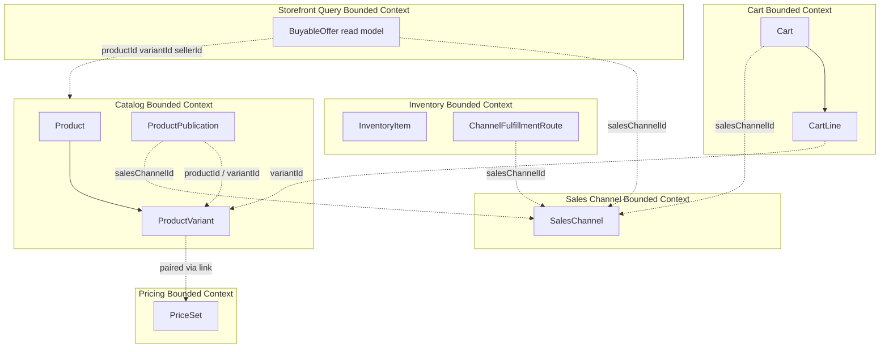

#### Aggregate Domain Model

> There is no write aggregate. `BuyableOffer` is a tailored read model (ADR-001: prefer projections over aggregate loading for queries). Methods below are projector operations, not seller commands.

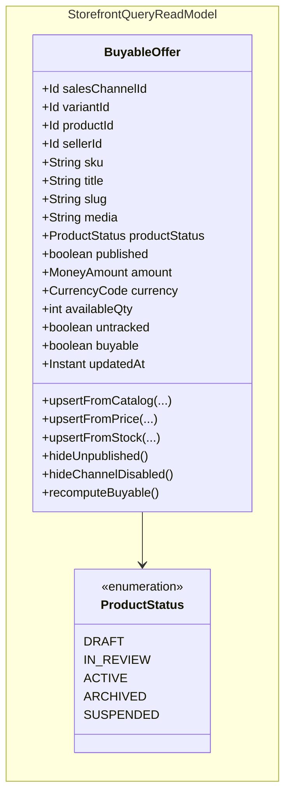

Natural key: `(salesChannelId, variantId)`. Price and stock are SKU-level, so the offer is per variant even if some Catalog specs describe publication as product × channel.

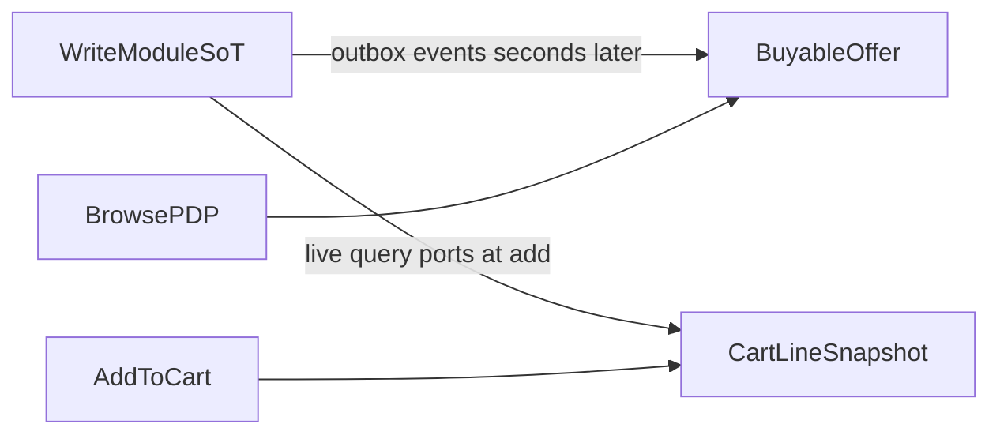

| Copy | Where | Freshness | User-facing role |
| :--- | :--- | :--- | :--- |
| Source of truth | Catalog publication, Pricing calculate, Inventory available at routed locations | Strong inside that module TX | Hidden from listing; used at add and checkout |
| Display | `BuyableOffer` | Eventual (outbox + projector) | Cards, PDP title/price/in-stock |
| Cart snapshot | `CartLine.unitPrice`, title, sku, sellerId, qty | Exact as of add-time SoT read, then frozen | What the buyer is purchasing until checkout re-quotes |

**Do not** read `BuyableOffer` in add-to-cart. If you do, two stale layers stack.

#### Relationships

| From | To | Kind | Notes |
|------|----|------|-------|
| `BuyableOffer` | `SalesChannel` | cross-BC by id | Channel of the listing. Not a composition. |
| `BuyableOffer` | `Product` / `ProductVariant` | cross-BC by id | Display copy. Catalog owns the live product. |
| `BuyableOffer` | Merchant | cross-BC by `sellerId` | Seller of the SKU. Used for website vs marketplace cards. |
| `BuyableOffer` | PriceSet | none at rest | Amount/currency are copied numbers, not a live link. |
| `BuyableOffer` | InventoryItem | none at rest | `availableQty` is a copied sum over routed locations. |
| `Cart` | `BuyableOffer` | none | Cart must not query the offer store. |
| `CartLine` | `ProductVariant` | cross-BC by id | Snapshot plus variantId for later reserve. |

#### Why Each Property Exists

| Property | Owner type | Type | Business reason |
|----------|------------|------|-----------------|
| `salesChannelId` | `BuyableOffer` | Id | Which surface this card is for. Website and marketplace are different rows. |
| `variantId` | `BuyableOffer` | Id | SKU identity for price, stock, and add-to-cart. |
| `productId` | `BuyableOffer` | Id | Groups variants on PDP; publication and status live on the product. |
| `sellerId` | `BuyableOffer` | Id | Marketplace cards name the seller; website carts must stay single-seller later. |
| `sku` | `BuyableOffer` | String | Customer- and seller-visible stock-keeping code. |
| `title` | `BuyableOffer` | String | What the shop displays without calling Catalog. |
| `slug` | `BuyableOffer` | String | Public PDP URL on this channel. |
| `media` | `BuyableOffer` | String | Primary image path for the card. |
| `productStatus` | `BuyableOffer` | ProductStatus | Copied Catalog lifecycle. Only `ACTIVE` can be buyable. |
| `published` | `BuyableOffer` | boolean | ProductPublication (or variant publication) exists for this channel. |
| `amount` | `BuyableOffer` | MoneyAmount | Last projected calculated price. Display only. |
| `currency` | `BuyableOffer` | CurrencyCode | Currency of `amount`. Must match the channel’s region when quoting. |
| `availableQty` | `BuyableOffer` | int | Last projected routed availability. Listing may hide at 0; PDP may show the number. |
| `untracked` | `BuyableOffer` | boolean | Catalog `manageInventory = false`: buyable without qty > 0. |
| `buyable` | `BuyableOffer` | boolean | Derived listing flag so browse does not re-evaluate four BCs. |
| `updatedAt` | `BuyableOffer` | Instant | Projector watermark. Ignore events with older `occurredAt`. |

#### Invariants & Policies

| Rule (business language) | Enforced by | When |
|--------------------------|-------------|------|
| Browse and PDP always carry a `salesChannelId` | query validation on Storefront Query API | Read |
| Disabled channel fails closed (no cards) | query handler / channel-status projector `hideChannelDisabled()` | Read / event |
| `ACTIVE` is not globally buyable | `recomputeBuyable()` requires `published` | Project / read |
| Unpublished SKUs never appear | `published = false` or row deleted; browse filters `buyable` | Project / read |
| Website channel lists only that seller’s publications | projector copies merchant from Catalog; browse does not default to all sellers | Project / read |
| Marketplace channel lists any seller published there | same filter by `salesChannelId` only | Read |
| `buyable` iff ACTIVE + published + priced + (qty > 0 or untracked) + channel enabled | `BuyableOffer.recomputeBuyable()` | After every upsert |
| Display qty/price may lag seconds | accepted; no 2PC to write modules | Always |
| Add-to-cart does not read `BuyableOffer` | Cart command uses `::query` ports only | Add-item |
| Add-to-cart does not reserve stock | Inventory query is a read of available; reserve is complete-cart | Add-item |
| Two guests may add the last unit | soft-cart policy | Add-item |
| Live calculate wins over display price; UI may toast `priceAdjusted` | Cart snapshots quoted amount | Add-item |
| Open cart does not auto-rewrite when PriceSet changes | Cart line snapshot | After add |
| Complete-cart (later) re-quotes and rejects if price moved | complete-cart policy | Checkout |
| Projector ignores stale events | `occurredAt` older than `updatedAt` skipped | Project |
| Stock/route events re-sum routed availability; they do not increment | Inventory `::query` from projector | Project |
| Storefront Query never mutates write BCs | no command handlers in this module | Always |

#### Consistency policy (what the user is allowed to see)

**Stock.** Listing/PDP may show a few-seconds-old `availableQty`. MVP: hide when projected qty is 0 unless `untracked`; PDP may show the number. Add-to-cart does not reserve (Shopify/Amazon soft cart). Only complete-cart reserve drops available for everyone. Display lag after reserve is OK: `StockReserved` flips the card shortly after.

**Price.** PDP shows projected amount. Add-to-cart runs live calculate with `salesChannelId` in PricingContext. The quoted amount is written on the line even if the card differed; response includes `priceAdjusted` when they differ. Complete-cart later re-quotes and rejects if different. No silent charge.

**Product display.** Unpublished / not ACTIVE / channel DISABLED → projector sets `buyable=false` or deletes the row. A line already in the cart stays until the next add/qty change or checkout. Add-item re-checks publication (`NOT_PUBLISHED`).

**Acceptable races (API errors, not 2PC).** Last unit: both adds succeed, first reserve wins. Price change between PDP and add: add at new price + `priceAdjusted`. Unpublish between PDP and add: `NOT_PUBLISHED`. Projector down: stale cards, add-to-cart still correct.

#### Lifecycle

> `BuyableOffer` is inserted when a variant is first known on a channel (publication or rebuild). `buyable` is a derived flag, not a seller-driven status enum.

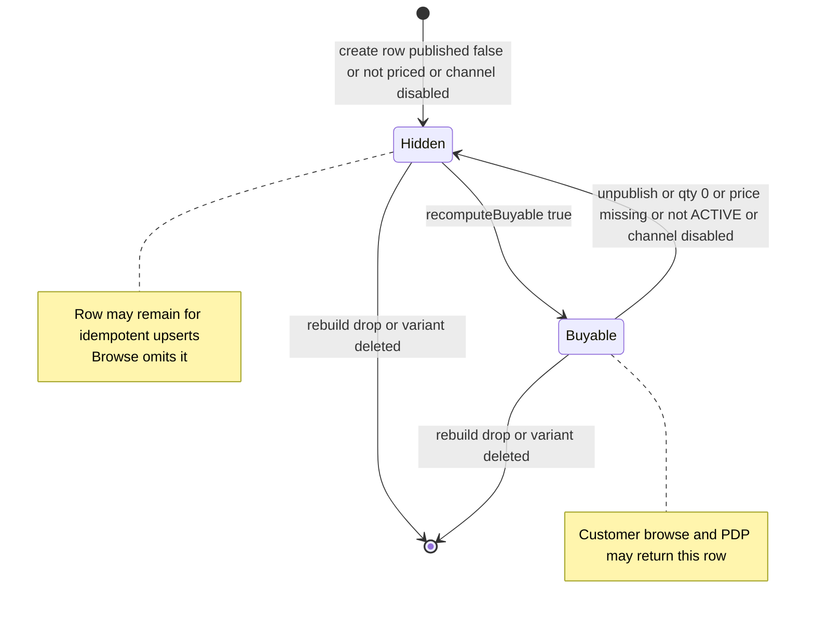

Channel listing contents:

| Channel type | Browse contents |
| :--- | :--- |
| `WEBSITE` | Offers the owning seller published to that website channel |
| `MARKETPLACE` | Offers any seller published to the platform marketplace channel |
| `POS` | Out of MVP |

---

### Part 2 — Application Architectural Design

#### Components & Layers

> Follow project CQRS: Controller → Query Service → Mapper → QueryBus → Handler → read repository. This module has **no domain command API**. Projectors are event listeners that write the offer table. Handlers own transactions (`@StorefrontQueryTransactional`).

| Layer | Responsibility | Example types |
|-------|----------------|---------------|
| Controller | HTTP in/out, HATEOAS Tier 2 | `StorefrontProductController`, `StorefrontQueryRootController` |
| Query Service | Map request → query, dispatch QueryBus | `StorefrontQueryService` |
| Mapper | DTO ↔ Query/Result | `StorefrontProductResponseMapper` |
| Query Handler | Channel required, fail closed if disabled, filter `buyable` | `SearchBuyableOffersQueryHandler`, `GetBuyableOfferBySlugQueryHandler` |
| Projector | Consume `::events`, upsert offer, `recomputeBuyable()` | `BuyableOfferProjectionEventListener` |
| Rebuild | Batch: publications + calculate + routed availability | `BuyableOfferRebuildJob` |
| Read model | JPA entity + query repo | `BuyableOfferEntity`, `BuyableOfferJpaRepository` |
| Domain jar | None for MVP | Read model is infrastructure + application, like `ProductVariantView` |
| Infrastructure | Own datasource (ADR-001) | `storefront-query-infrastructure` |

Maven / packages:

- `storefront-query-infrastructure` — entity, repo, datasource, migrations
- `com.grab.store.storefrontquery` — `StorefrontQueryModule`, controllers, query handlers, projectors
- No `storefront-query-domain` aggregate module

#### Data / Command Flow

**Browse (no write modules on the request path)**

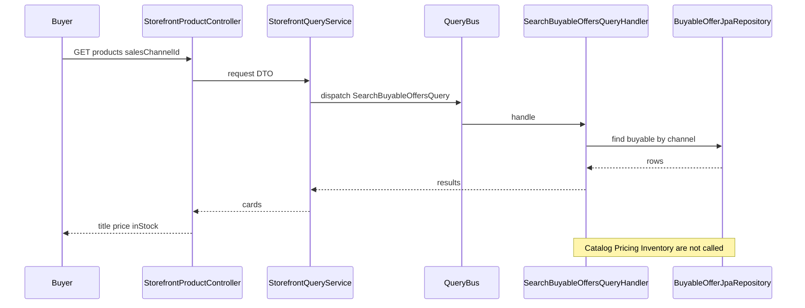

**Seller changes stock (SoT first, display catches up)**

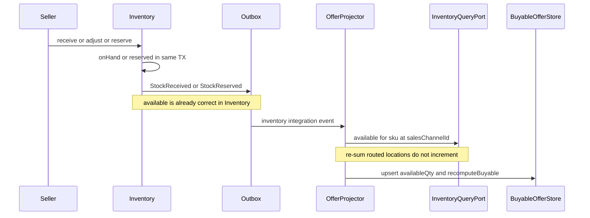

Same shape for price (`PriceSetUpdated` → recalculate for published channels) and publication (`ProductPublishedToChannel` / unpublished → upsert / hide).

**Add to cart (live SoT, then snapshot) — Cart module, not Storefront Query**

Add-item has one write (Cart). It is a Cart command plus published `::query` ports, not a durable saga. ADR-006 sagas are for multi-write. The add-item workflow spec remains the business sequence.

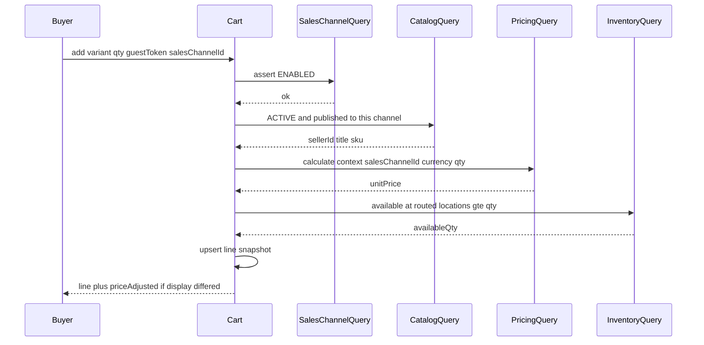

Guest cart: Cart issues a `guestToken` (cookie/header). No Customer module in this slice.

**Stale stock on PDP (soft-cart oversell window)**

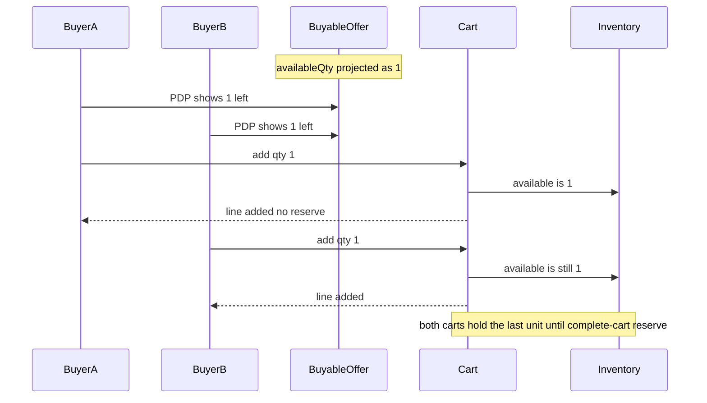

UI copy: availability is confirmed at checkout. Do not tell the buyer the unit is held.

**Stale price on PDP**

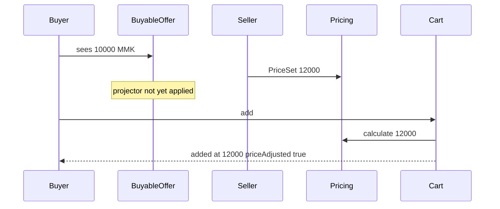

**Unpublish while looking at PDP**

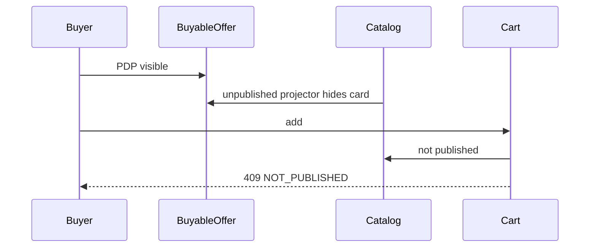

Add-item errors: `CHANNEL_DISABLED`, `NOT_PUBLISHED`, `NOT_PRICED`, `INSUFFICIENT_STOCK`.

#### Integration

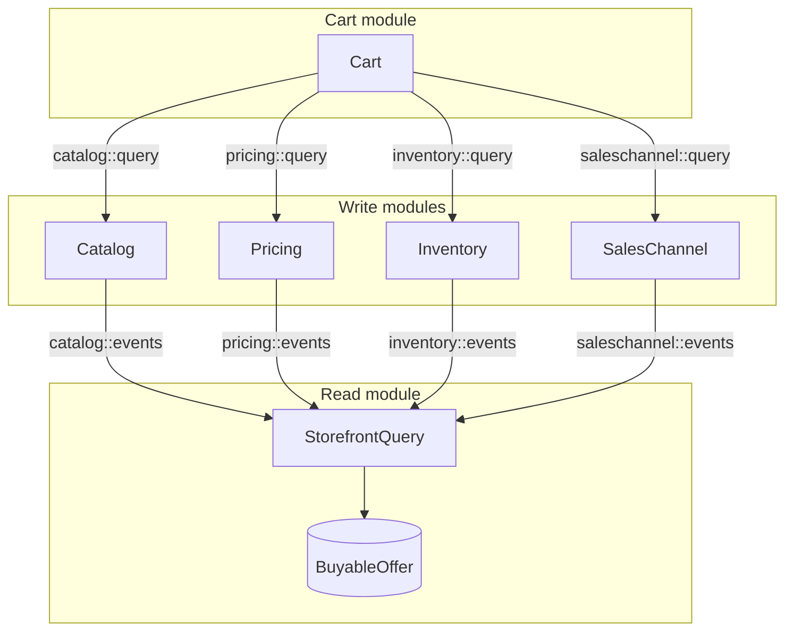

**Publishes (events / outbox):**
- None required for MVP. Storefront Query does not emit facts other BCs must consume. Optional later: `BuyableOfferProjected` for ops/debug.

**Consumes:**
- Catalog `::events` — product/variant upsert, status, media, name; publish/unpublish (also on `workflows::events` today as `ProductPublishedToChannelEvent` / unpublished)
- Inventory `::events` — `StockReceived`, `StockReserved`, `StockAdjusted`, `StockShipped`, `LocationLinkedToChannel`, `LocationUnlinkedFromChannel`
- Pricing `::events` — `PriceSetCreated` / `PriceSetUpdated` plus variant↔priceSet id
- Sales Channel `::events` — disabled / enabled

Projectors react via `@EventListener` and write the offer table. They must not call other modules’ `internal/` packages. On stock/route events they may call Inventory `::query` to re-sum. On price events they may call Pricing `::query` to recalculate.

**Named interfaces / API links:**
- Exposes: `storefrontquery::api` — HATEOAS links for browse/PDP. No `::query` port that Cart may use (Cart must not depend on this module for buyability).
- Depends on: `catalog::events`, `pricing::events`, `inventory::events`, `saleschannel::events`; optionally `catalog::query` / `pricing::query` / `inventory::query` / `saleschannel::query` from **projectors and rebuild only**.
- Cart (separate module) depends on: `catalog::query`, `pricing::query`, `inventory::query`, `saleschannel::query` — not HATEOAS `::api` link facades.

**Query ports other modules must publish** (`{module}::query`):

| Port | Method | Why |
| :--- | :--- | :--- |
| Sales Channel | channel enabled? | Fail closed for browse rebuild and add-item |
| Catalog | published + ACTIVE + sellerId/title/sku for variant+channel | Add-item and rebuild catalog slice |
| Pricing | calculate(context: currency, qty, salesChannelId) | Display projection and live add-item quote |
| Inventory | `getAvailableForAllocation(sku, salesChannelId)` | Routed sum. Domain already supports channel; HTTP handler today ignores it and must be fixed on the port |

**HTTP (HATEOAS Tier 2):**

- `GET /api/v1/storefront-query` — root links
- `GET /api/v1/storefront-query/products?salesChannelId=` — buyable cards only
- `GET /api/v1/storefront-query/products/{slug}?salesChannelId=` — PDP
- Require `salesChannelId`. Optional later: category, query text, seller (marketplace only)

Seller product search stays `POST /api/v1/catalog/.../search`. Customer browse does not call `/catalog`.

**Rebuild job:** for each ProductPublication, load catalog slice, calculate price, sum routed availability, upsert. Required before trusting browse. Same idea as Medusa Index Module reindex.

**Projector idempotency:** ignore events with `occurredAt` older than `updatedAt`. Re-sum stock rather than increment so missed events self-heal.

---

## 3. Why This Approach

**Primary reasons:**
1. **Listing QPS must not join write databases.** Amazon, Shopify, and Zalando denormalize visibility, display price, and in-stock onto a channel-keyed offer/search document. Medusa `query.graph` is in-process stitching; `query.index` is the projected-store analogue Grab needs when modules split.
2. **Write-module isolation stays extractable.** Events + IDs + no `internal/` calls already match ADR-001, ADR-002, ADR-006, and Inventory ADR-003 (`ProductVariantView`). Putting `BuyableOffer` in Catalog would force Catalog to consume price and stock events and become a god module.
3. **Money movement stays strongly consistent.** Soft cart + live quote at add + reserve at complete-cart is the industry oversell window. Display lag is an accepted UX; silent wrong charge is not.

---

## 4. Trade-offs

| Pros | Cons |
|------|------|
| Browse latency and availability independent of Pricing/Inventory | Offer lags seconds; cards can show a unit already in another cart |
| Clear ownership: discovery vs purchase | Duplicated display fields (title, price, qty) |
| Matches future microservice extraction | Projector idempotency, ordering, and rebuild are extra machinery |
| Add-item still correct if the projector is down | Soft cart can over-promise until complete-cart reserve |
| Seller Catalog API remains the owner browse | Two product APIs (seller vs customer) must not be confused |

---

## 5. What Needs to Change

**New components/modules to build:**
- `storefront-query-infrastructure` with `BuyableOffer` table, datasource, migrations
- `StorefrontQueryModule` (`allowedDependencies` on write-module `::events`, and `::query` for projector/rebuild only)
- Projection listeners, rebuild job, browse/PDP query handlers, Tier 2 root
- Cart BC (`cart-domain`, `cart-adapter-persistence`, `CartModule`) for add-item: guest token, line snapshot, website single-seller, marketplace mixed sellers
- `{module}::query` named interfaces on Catalog, Pricing, Inventory, Sales Channel

**Changes to existing systems:**
- Publish Inventory stock/route events, Pricing price-set events, and Sales Channel enable/disable on `::events` (today only Catalog has a public events named interface; publication also sits on `workflows::events`)
- Inventory availability HTTP/query must pass `salesChannelId` into `getAvailableForAllocation(sku, salesChannelId)`
- Update [storefront-query-tech-spec.md](../../../../docs/spec/system/storefront-query-tech-spec.md): projected store, not live fan-out; three-copy consistency
- Note on [add-item-to-cart.md](../../../../docs/spec/workflows/add-item-to-cart.md): business sequence stays; implementation is Cart command + query ports because there is a single write

**Out of this ADR’s implementation slice:**
- Complete-cart reserve, Customer module, customer storefront UI, search ranking, merchandising, PDP live overlay, durable saga for add-item

---

## 6. Implementation Plan

- **Phase 1 — Specs and contracts:** Patch storefront-query and add-item specs. Add `::events` integration events for inventory, pricing, and sales-channel. Add `::query` port interfaces (channel-scoped availability included).
- **Phase 2 — Display path:** `BuyableOffer` table, projectors, rebuild, public browse/PDP. Tests: publish to website only → marketplace browse empty; stock at unrouted location → not buyable; disable channel → fail closed; hide unpublished.
- **Phase 3 — Add-item path:** Cart module + add-item command. Tests: live price wins over stale offer (`priceAdjusted`); two adds of last unit both succeed; unpublish then add fails `NOT_PUBLISHED`; website mixed-seller rejected. Guest token, no Customer module.

**Tests that lock the consistency fences:**
- Projector down, add-to-cart still uses live stock/price
- Rebuild converges with live publication + routed qty + calculate
- Stale event (`occurredAt` < `updatedAt`) does not overwrite

---

## 7. Related Documents

- MVP: `docs/spec/mvp/00-mvp-commerce-overview.md`, `docs/spec/mvp/01-mvp-phrases.md`
- Tech spec: `docs/spec/system/storefront-query-tech-spec.md`
- Domains: `docs/spec/domain/catalog/architecture/product-domain-spec.md`, `docs/spec/domain/pricing/architecture/pricing-domain-spec.md`, `docs/spec/domain/inventory/architecture/inventory-domain-spec.md`, `docs/spec/domain/sales-channel/architecture/sales-channel-domain-spec.md`, `docs/spec/domain/cart/architecture/cart-domain-spec.md`
- Workflows: `docs/spec/workflows/add-item-to-cart.md`, `docs/spec/workflows/complete-cart.md`
- Platform: `docs/dev/system/ADR_001-System_architecture.md` (modulith, tailored read models), `docs/dev/system/ADR_002-Module_scoped_outbox_architecture.md`, `docs/dev/system/ADR_006-Orchestrated_saga_architecture.md` (saga only for multi-write)
- Projection precedent: `docs/dev/domain/inventory/architecture/ADR_003-Inventory-owned-products.md`
- Code (to be added): `storefront-query-infrastructure/`, `store/src/main/java/com/grab/store/storefrontquery/`
- BRD (read-only original): `docs/Commerce_Platform.md`

**Rollback strategy:**  
Leave seller Catalog APIs unchanged. Feature-flag Storefront Query routes and projector listeners. Drop or stop writing `BuyableOffer` without touching Catalog/Pricing/Inventory data. If the projection is wrong, disable public browse and run rebuild from publications + calculate + routed availability. Cart add-item can ship independently; it does not depend on `BuyableOffer`. Revert Cart by disabling add-item routes; no write-module compensation required because add-item does not reserve.

---

## 7. Related Documents

- [ADR-001 System architecture](ADR_001-System_architecture.md)
- [ADR-002 Module-scoped outbox](ADR_002-Module_scoped_outbox_architecture.md)
- [ADR-006 Orchestrated saga](ADR_006-Orchestrated_saga_architecture.md)
- [Inventory ADR-003 Product variant projection](../domain/inventory/architecture/ADR_003-Inventory-owned-products.md)
- [Storefront query tech spec](../../../../docs/spec/system/storefront-query-tech-spec.md)
- [Add item to cart](../../../../docs/spec/workflows/add-item-to-cart.md)
