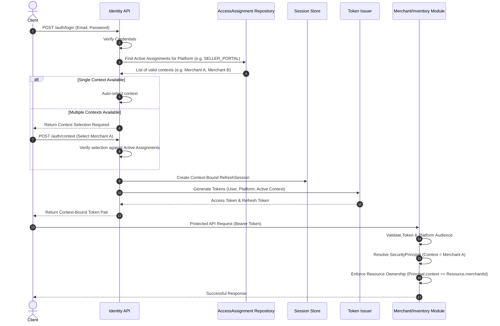

# Platform-Scoped Identity Access for Merchant Resources

**Status:** Accepted  
**Date:** 2026-06-27

---

## 1. The Problem

**What's not working?**  
The current identity model assigns roles directly to users, so a role applies
globally and cannot express which application the user is
allowed to operate. Seller self-registration also mixes account status with
seller approval, and some APIs accept caller-provided seller or actor IDs
instead of deriving the acting context from the authenticated principal.

**What's at stake?**  
One person may shop as a customer, own several merchant businesses, manage only
one storefront for another merchant, and administer the platform. Without
platform and resource scopes, the system either over-grants access or spreads
ad-hoc ownership checks across modules. This becomes a direct tenant-isolation
risk as the new Merchant bounded context is introduced.

---

## 2. What We Decided

**The core approach:**  
Use platform-scoped, resource-scoped RBAC in Identity while keeping merchant
business objects in a separate Merchant bounded context.

**Key changes:**

- **Decoupled User Identity:** `User` handles credentials globally, independent of specific merchant or customer types.
- **Shared Platforms:** Introduced `CUSTOMER_APP`, `SELLER_PORTAL`, and `ADMIN_CONSOLE`.
- **Platform Roles:** Created `PlatformRole` to restrict which roles apply to which platform.
- **Scoped Assignments:** Replaced global `UserRole` with `AccessAssignment` (User + Platform Role + Resource Scope).
- **Context-Bound Tokens:** Access and refresh tokens are tied strictly to a single platform and active context.
- **Scoped Invitations:** Allow staff access without creating redundant merchant or storefront accounts.
- **Event-Driven Lifecycles:** Merchant lifecycle changes are coordinated via integration events, not shared transactions.
- **Trust the Principal:** APIs derive context strictly from `SecurityPrincipal`, rejecting caller-provided identifiers.

**What stays the same:**  
Users, credentials, external identity links, roles, authorities, role-authority
mappings, and refresh-session security remain owned by Identity. The
provider-neutral authentication contracts from ADR-001 remain in place, and
local JWT or future OAuth2/OIDC adapters still resolve into one
`AuthenticatedActor`. Catalog, Inventory, Merchant, and future Order modules
continue to enforce their own business state and resource-ownership rules.

## 2.1. Visual Overview

> The Identity module owns access grants. Business resources remain in their
> respective bounded contexts and are referenced only by stable IDs.

### Identity and Business Resource Relationships

```mermaid
classDiagram
  class USER
  class ACCESS_ASSIGNMENT
  class PLATFORM
  class PLATFORM_ROLE
  class ROLE
  class AUTHORITY
  class ACCESS_INVITATION
  class REFRESH_SESSION
  class MERCHANT_ACCOUNT

  USER "1" --> "*" ACCESS_ASSIGNMENT : receives
  PLATFORM "1" --> "*" PLATFORM_ROLE : supports
  ROLE "1" --> "*" PLATFORM_ROLE : maps
  ROLE "*" --> "*" AUTHORITY : grants
  PLATFORM_ROLE "1" --> "*" ACCESS_ASSIGNMENT : assigned
  USER "1" --> "*" ACCESS_INVITATION : accepts
  USER "1" --> "*" REFRESH_SESSION : opens
  ACCESS_ASSIGNMENT "*" --> "0..1" MERCHANT_ACCOUNT : references_by_uuid

  style ACCESS_ASSIGNMENT fill:#2B4F35,stroke:#4caf50,stroke-width:2px
  style PLATFORM fill:#2B4F35,stroke:#4caf50,stroke-width:2px
  style PLATFORM_ROLE fill:#2B4F35,stroke:#4caf50,stroke-width:2px
  style ACCESS_INVITATION fill:#2B4F35,stroke:#4caf50,stroke-width:2px
```

### Identity Context-Bound Authentication Flow

---

## 3. Why This Approach

**Primary reasons:**

1. **Least privilege:** Roles are restricted to specific platforms and resources, preventing unauthorized cross-merchant access.
2. **Multiple personas:** One user account can seamlessly act as customer, merchant, and admin.
3. **Clear boundaries:** Identity handles authentication and grants; Merchant handles business data.
5. **Auditable sessions:** Explicit scopes enable targeted session revocation and clean audit logs.
6. **Future growth:** Supports multiple storefronts and multi-merchant users without schema changes.
7. **Provider independence:** Easily supports local JWTs or external OAuth2/OIDC providers.

---

## 4. Trade-offs

| Pros | Cons |
|------|------|
| Roles no longer grant unintended cross-platform or cross-merchant access. | Access resolution and administration are more complex than a global `user_roles` join. |
| One identity supports several customer, merchant, and admin personas. | Tokens and sessions must carry and preserve an explicit context. |
| Merchant and Identity remain independently modeled bounded contexts. | Integration events and idempotent consumers are required to synchronize grants. |
| Scoped invitations support merchant staff without creating duplicate businesses. | Invitation expiry, acceptance, cancellation, and audit workflows must be implemented. |
| Resource ownership is explicit and testable. | Owning modules must perform a second business-resource relationship check. |
| Merchant suspension does not unnecessarily lock the user's other access. | Effective access depends on both identity grants and business-resource status. |

---

## 5. What Needs to Change

**New components/modules to build:**
- **Identity Domain:** Add `Platform`, `PlatformRole`, `AccessAssignment`, and `AccessInvitation` models (and their repositories).
- **Access Operations:** Add CQRS flows for granting, revoking, switching context, and managing invitations.
- **Merchant Integration:** Build outbox-backed event consumers to sync Merchant and Identity modules.
- **Seed Data:** Add roles and authorities tailored to merchants and onboarding.
- **Authorization Helpers:** Build scope-specific verification utilities for resource-ownership checks.

**Changes to existing systems:**
- **Database Schema:** Replace `user_roles` with `access_assignments`. Add tables for platforms and invitations, and extend `refresh_sessions` with context fields.
- **Core Identity & Tokens:** Extend `AuthenticatedActor` and token lifecycle to require an explicit access context and validate platform audience.
- **Registration Flow:** Remove caller-selected roles in favor of explicit customer and merchant onboarding flows.
- **Seller Lifecycle:** Move seller approval out of `User.status` and into the Merchant module and scoped assignments. Migrate old `SELLER` roles to the new model.
- **API Contracts:** APIs must read actor/seller identifiers strictly from the `SecurityPrincipal`, ignoring them in request headers or bodies.
- **External Identity Mappings:** Ensure provider entitlements map to explicit platforms and scopes without trusting raw token claims for merchant IDs.

**Team impact:**

- API developers obtain actor and merchant context only from
  `SecurityPrincipal`.
- Domain handlers receive verified IDs or an access context from application
  services; they do not parse JWT claims or request headers.
- Merchant and Inventory developers expose ownership checks without importing
  Identity persistence entities.
- Frontend clients select a platform and, when necessary, an available merchant
  or storefront context. They do not select roles.
- Tests cover cross-merchant denial, platform-role mismatch, revoked grants,
  context-preserving refresh, and event retry idempotency.

---

## 6. Migration Plan

- **Phase 1 — Additive foundation:** Create platform, platform-role,
  assignment, invitation, and session-context columns. Seed platform-role and
  authority mappings. Add context to the actor model while retaining legacy
  role reads behind a compatibility path.
- **Phase 2 — Merchant onboarding:** Introduce the Merchant module events,
  applicant/owner grant transitions, scoped invitations, context selection,
  and context-bound token/session issuance. Stop accepting seller as a public
  registration role.
- **Phase 3 — Authorization migration:** Backfill customer and admin global
  assignments, then backfill merchant assignments after MerchantAccount IDs
  exist. Switch identity resolution to scoped assignments and remove trusted
  use of caller-provided actor/seller IDs.
- **Phase 4 — Cleanup:** Remove the legacy `SELLER` role and `user_roles` table
  after reconciliation confirms every required assignment exists. Remove the
  compatibility resolver and obsolete request fields.

**Rollback strategy:**  
Keep `user_roles` and its resolver path during the additive and backfill phases.
Scoped assignments are introduced behind a configuration switch, and migration
jobs are idempotent. If scoped resolution fails before cleanup, disable it and
return to legacy role reads while retaining the new tables for diagnosis. Do
not drop legacy data or request compatibility until assignment counts, access
decisions, refresh behavior, and cross-merchant denial tests pass in production.

---

## 7. Related Documents

- [ADR-001: Authentication and Authorization](ADR-001_authentication-authorization.md)
- [ADR-002: Frontend Communication and Authentication](ADR-002_authentication-cookie-session.md)
- [Identity Domain Aggregate Diagram](DRG-001_identity-domain-aggregates.md)
- [Identity Security Architecture Diagram](DRG-002_identity-architecture.md)
- [System Architecture as a Modulith](../../system/ADR-001-system-architecture.md)
- [ADR Writing Guideline](../../SKILLS.md)
