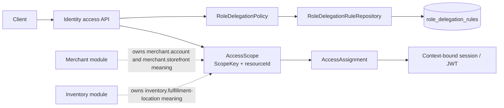
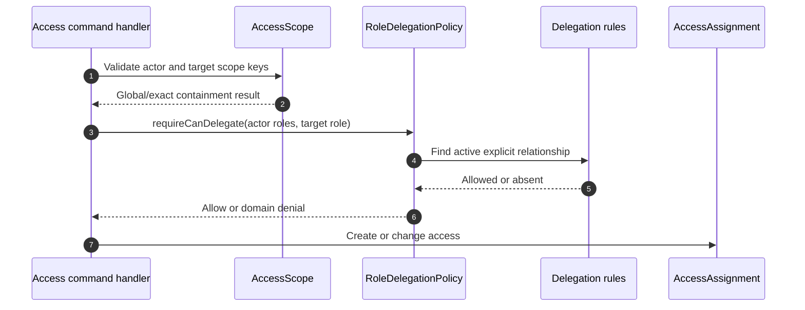

# ADR-004: Extensible Access Scopes and Role Delegation

**Status:** Accepted  
**Date:** 2026-06-28

---

## 1. The Problem

**What's not working?**  
Identity defines Merchant and Inventory resource names in an `AccessScopeType`
enum and hard-codes role delegation relationships in a domain service. Adding a
new bounded-context resource or access profile therefore requires modifying and
releasing the Identity domain.

**What's at stake?**  
This coupling prevents bounded contexts from evolving independently and makes
Identity a growing catalog of business terminology. It also makes delegation
changes code deployments instead of explicit, auditable authorization data.

---

## 2. What We Decided

**The core approach:**  
Identity stores a generic namespaced `ScopeKey` and enforces role delegation
through a deny-by-default policy backed by persisted role relationships.

**Key changes:**

- Replace `AccessScopeType` with the `ScopeKey` value object.
- Reserve `global` as Identity's only built-in scope key.
- Use namespaced resource keys such as `merchant.account`,
  `merchant.storefront`, and `inventory.fulfillment-location`.
- Rename API, event, session, persistence, and token contracts from
  `scopeType`/`scope_type` to `scopeKey`/`scope_key`.
- Define `RoleDelegationPolicy` as an interface and implement it using persisted
  `role_delegation_rules` between active roles.
- Deny delegation when no explicit rule exists; new roles receive no implicit
  delegation privileges.
- Keep global and exact-scope containment in Identity. Resource existence,
  parent-child relationships, ownership, and lifecycle remain with the bounded
  context that owns the resource.

**What stays the same:**  
Identity continues to own platforms, roles, authorities, assignments,
invitations, and context-bound sessions. The current modular-monolith deployment
and Identity transaction boundary remain unchanged. Extracting access
management into a separate bounded context is deferred.

### Contract decision

This is a clean contract change. Legacy `scopeType` request fields and
`scope_type` JWT claims are not accepted. Existing database values are migrated
to namespaced keys, and stored refresh-session contexts can issue replacement
tokens using `scope_key`.

## 2.1. Visual Overview

> Identity understands the reference format and grant rules; owning modules
> understand the referenced business resources.

### Scope and Delegation Components

### Authorization Decision

---

## 3. Why This Approach

**Primary reasons:**

1. **Bounded-context independence:** Identity no longer compiles against a list
   of Merchant or Inventory resource types.
2. **Open extension:** New modules introduce namespaced keys without changing an
   Identity enum.
3. **Secure defaults:** Missing delegation configuration always denies access.
4. **Operational clarity:** Delegation relationships are explicit database data
   tied to existing active roles.
5. **Provider neutrality:** Local JWT and future OIDC providers resolve to the
   same locally verified `scope_key`; external claims do not create scopes.

---

## 4. Trade-offs

| Pros | Cons |
|---|---|
| Business resource names leave Identity Java enums. | Compile-time enumeration of supported resource keys is removed. |
| New scope namespaces do not require Identity domain releases. | Scope keys require strict runtime validation and database constraints. |
| Delegation changes are explicit and deny by default. | Administrators need a governed process for adding delegation rules. |
| Persisted relationships are testable and auditable. | Authorization checks add a repository query. |
| Clean namespaced contracts avoid ambiguous generic resource names. | Existing clients and access tokens must migrate immediately. |

---

## 5. What Needs to Change

**New components/modules to build:**

- `ScopeKey`, generic `AccessScope`, and namespaced-key validation.
- `RoleDelegationPolicy`, `RuleBasedRoleDelegationPolicy`, and the delegation
  rule repository port and adapter.
- V4 Identity migration for scope columns, values, constraints, and delegation
  rule seeds.
- Contract and migration tests for namespaced keys and legacy rejection.

**Changes to existing systems:**

- Clients send and read `scopeKey` instead of `scopeType`.
- Locally issued access tokens contain `scope_key` instead of `scope_type`.
- Assignment, invitation, session, event, and query models expose scope keys.
- Merchant and Inventory define their resource-key constants in their own
  public contracts when those modules implement scoped integration.

---

## 6. Implementation Plan

- **Phase 1:** Introduce `ScopeKey`, migrate internal contracts, and remove the
  resource enum.
- **Phase 2:** Add persisted delegation relationships and switch handlers to the
  policy interface.
- **Phase 3:** Apply V4 data migration, change external contracts, and invalidate
  legacy access tokens.
- **Phase 4:** Add module-owned scope relationship resolvers when Merchant and
  other bounded contexts require parent-child scope management.

**Rollback strategy:**  
Rollback requires reverting the application and applying a compensating
migration that restores legacy scope columns and values. Because this is a clean
token contract change, clients must reauthenticate after either direction of
rollback. Preserve the V4 delegation table during diagnosis; it is additive and
does not modify role or assignment identity.

---

## 7. Related Documents

- [ADR-003: Platform-Scoped Identity Access](ADR-003_platform-scopes.md)
- [Platform-Scoped Identity Domain Aggregates](DRG-003_platform-scopes-domain-aggregates.md)
- [Merchant ADR-001: Merchant Bounded Context Architecture](../../merchant/architecture/ADR-001_Merchant-architecture-design.md)
- [System ADR-001: Current System Architecture as a Modulith](../../system/ADR-001-system-architecture.md)
- [ADR Writing Guideline](../../ADR_SKILLS.md)
