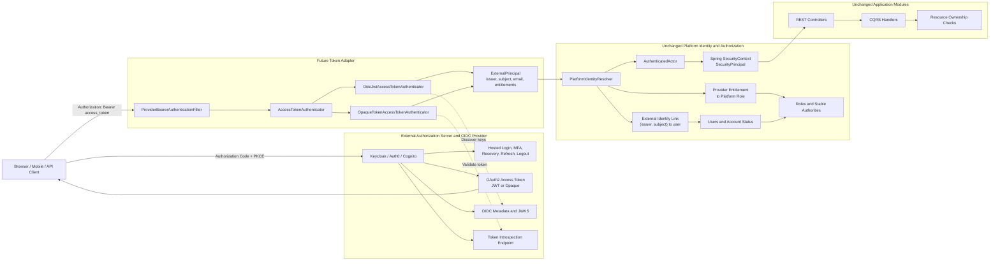
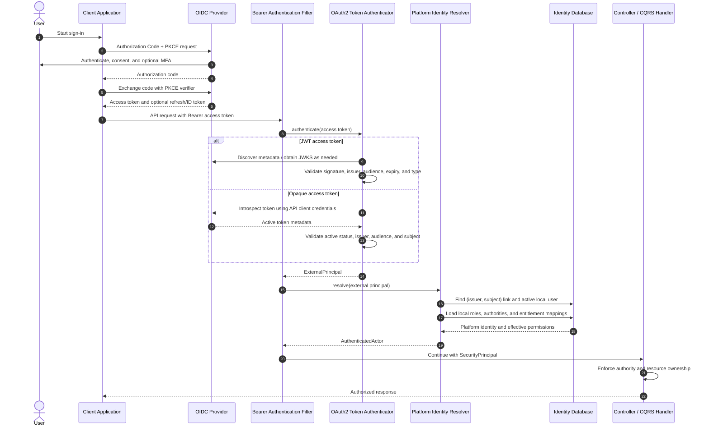

# Authentication and Authorization

## 1. The Problem

**What's not working?**  
The platform needs a trustworthy identity for every protected operation. Passing
actor identity through an unverified `X-Actor-Id` header allows callers to
impersonate users, while coupling application code directly to a particular
token format or identity provider would make a future migration expensive.

**What's at stake?**  
Without verified identities and role-based access control (RBAC), callers can
mutate resources they do not own and invoke seller or administrative operations
without permission. The platform must be secure now while retaining a clear
path from locally issued JWTs to OAuth2/OIDC providers such as Keycloak, Auth0,
or Amazon Cognito without rewriting controllers, CQRS handlers, or ownership
rules.

---

## 2. What We Decided

**The core approach:**  
Use Spring Security with a provider-neutral authentication boundary, keep
platform authorization in the identity bounded context, and initially issue
local JWTs while allowing a future OAuth2/OIDC provider to replace credential
verification and token issuance.

**Key changes:**

- Introduce `AccessTokenAuthenticator`, `ExternalPrincipal`,
  `PlatformIdentityResolver`, and `AuthenticatedActor` as provider-neutral
  framework contracts.
- Authenticate requests through `ProviderBearerAuthenticationFilter`, resolve
  the verified identity into a local platform user, and expose a
  `SecurityPrincipal` through Spring's `SecurityContext`.
- Implement a dedicated identity bounded context for users, account status,
  local credentials, refresh sessions, roles, authorities, external identity
  links, and provider-entitlement mappings.
- Treat the application as an OAuth2 Resource Server when an external provider
  is enabled. The provider authenticates the user and issues access tokens; the
  application validates those tokens and retains control of platform access.

**What stays the same:**  
Controllers and CQRS handlers consume the same `SecurityPrincipal` or
`AuthenticatedActor` regardless of token provider. Local user status, seller
approval, platform roles, authorities, and resource-ownership checks remain the
source of business authorization. Public storefront reads remain accessible
without authentication, and the identity module follows the same CQRS and
per-module datasource conventions as catalog and inventory.

### 2.1. Why the Current Local-JWT Setup

The current implementation provides secure authentication without requiring a
separately deployed identity platform during the initial delivery:

- Email/password registration and login are owned by the identity bounded
  context, with BCrypt password hashing.
- `LocalTokenLifeCycle` issues short-lived RSA-signed access tokens and opaque,
  rotating refresh tokens whose hashes are stored in the identity database.
- `LocalJwtAccessTokenAuthenticator` validates the token signature, issuer,
  audience, expiry, and access-token type before returning an
  `ExternalPrincipal`.
- `IdentityResolverAdapter` reloads the platform user on every authenticated
  request, rejects inactive accounts, and calculates current roles and
  authorities from platform data. A suspended account therefore cannot rely on
  an otherwise valid, unexpired token.

This setup is intentionally an adapter behind framework contracts rather than
an application-wide dependency on JJWT or locally shaped claims. It gives the
platform a working authentication system now and contains the later provider
change to security configuration and adapters.

### 2.2. Future OAuth2/OIDC Extension

OAuth2 provides delegated authorization and access-token usage; OIDC adds the
user authentication and identity layer. For interactive users, clients use the
Authorization Code flow with PKCE against Keycloak, Auth0, or Cognito. The API
accepts the resulting **access token** as a Bearer token; it does not accept an
OIDC ID token as an API credential.

The extension consists of:

1. Add provider configuration such as `issuer-uri`, API `audience`, claim
   mappings, and either a JWKS location or an introspection endpoint.
2. Add an `OidcJwtAccessTokenAuthenticator` backed by Spring Security's
   `JwtDecoder` for JWT access tokens, or an
   `OpaqueTokenAccessTokenAuthenticator` backed by OAuth2 token introspection.
3. Validate signature or token activity, exact issuer, API audience, expiry,
   and provider-specific access-token constraints before normalizing claims to
   `ExternalPrincipal(issuer, subject, email, entitlements)`.
4. Link the stable provider key `(issuer, subject)` to a local user through
   `external_identities`. Email is profile data and must not be used to
   automatically link accounts.
5. Map provider groups, roles, permissions, or scopes to platform roles through
   `external_entitlement_mappings`. Platform role-to-authority mappings remain
   authoritative for endpoint and business permissions.
6. Select the local or external authenticator through configuration. If both
   token issuers must coexist during migration, use a delegating authenticator
   with an explicit issuer allowlist and require the selected authenticator to
   perform full validation.
7. In external-provider mode, move login, MFA, password recovery, token refresh,
   and provider logout to the IdP. Keep only the platform onboarding and
   identity-linking operations needed to create or connect the local user.

### 2.3. Visual Overview

> The diagrams separate the adapter used today from the future provider adapter.
> Both produce the same `ExternalPrincipal`, so identity resolution and
> application authorization remain unchanged.

#### Current Local-JWT Architecture

```mermaid
flowchart LR
    Client["Browser / Mobile / API Client"]

    subgraph localAuth["Current Local Authentication"]
        AuthApi["AuthController<br/>Register / Login / Refresh / Logout"]
        Credentials["Local User Credentials<br/>BCrypt Password Hash"]
        TokenLifeCycle["LocalTokenLifeCycle<br/>RSA JWT + Refresh Rotation"]
        Sessions["Hashed Refresh Sessions"]

        AuthApi --> Credentials
        AuthApi --> TokenLifeCycle
        TokenLifeCycle --> Sessions
    end

    subgraph currentAdapter["Current Token Adapter"]
        Filter["ProviderBearerAuthenticationFilter"]
        AuthPort["AccessTokenAuthenticator"]
        LocalAdapter["LocalJwtAccessTokenAuthenticator"]
        External["ExternalPrincipal<br/>issuer, subject, email, entitlements"]

        Filter --> AuthPort
        AuthPort --> LocalAdapter
        LocalAdapter --> External
    end

    subgraph platformIdentity["Platform Identity and Authorization"]
        Resolver["PlatformIdentityResolver"]
        Users["Users and Account Status"]
        Policy["Roles and Stable Authorities"]
        Actor["AuthenticatedActor"]
        Context["Spring SecurityContext<br/>SecurityPrincipal"]

        Resolver --> Users
        Users --> Policy
        Resolver --> Policy
        Resolver --> Actor
        Actor --> Context
    end

    subgraph application["Application Modules"]
        Controllers["REST Controllers"]
        Handlers["CQRS Handlers"]
        Ownership["Resource Ownership Checks"]
        Controllers --> Handlers
        Handlers --> Ownership
    end

    Client -- "Email + password / refresh token" --> AuthApi
    TokenLifeCycle -- "Local access and refresh tokens" --> Client
    Client -- "Authorization: Bearer access_token" --> Filter
    External --> Resolver
    Context --> Controllers
```

#### Future OAuth2/OIDC Provider Adapter

#### OAuth2/OIDC Authentication and Authorization Flow

---

## 3. Why This Approach

**Primary reasons:**

1. **Provider independence:** Application code receives one stable actor model;
   JJWT, OAuth2/OIDC claims, provider SDKs, and token formats remain inside
   replaceable security adapters.
2. **Separation of authentication and business authorization:** The IdP proves
   who the subject is, while the platform independently decides whether the
   linked user is active and what commerce operations that user may perform.
3. **Incremental delivery:** Local authentication secures the platform now,
   while the existing external identity and entitlement tables make migration
   possible without a large rewrite.
4. **Operational flexibility:** JWT validation through discovery/JWKS avoids a
   provider network call on every request; opaque-token introspection remains
   available when immediate revocation is more important.
5. **Stable ownership:** `(issuer, subject)` maps to a durable platform user ID,
   so seller ownership and audit records do not depend on mutable email
   addresses or provider-specific role names.
6. **Defense in depth:** Token validation, local account-status checks, endpoint
   authorities, and domain ownership checks protect different boundaries.

---

## 4. Trade-offs

| Pros | Cons |
|-------|-------|
| Local JWTs provide an immediately usable authentication path without an external deployment. | The platform temporarily owns password security, signing-key management, refresh rotation, and account recovery concerns. |
| Provider-neutral contracts keep controllers and business logic unchanged during provider migration. | Additional adapters, configuration, claim mapping, and integration tests are required. |
| Local roles and authorities provide consistent business policy across providers. | Provider roles or groups must be explicitly mapped and kept synchronized with platform policy. |
| External OIDC providers add federation, MFA, mature login flows, and managed credential security. | Authentication becomes operationally dependent on the IdP, its configuration, and key or introspection availability. |
| JWT access tokens can be validated locally and scale horizontally. | Permission or token revocation may not take effect until token expiry unless local status checks or introspection are used. |
| Opaque-token introspection supports immediate provider-side revocation. | It adds provider latency and availability risk to authenticated requests. |
| Stable `(issuer, subject)` links prevent unsafe email-based identity matching. | Provisioning and account-linking workflows must be implemented and administered carefully. |

---

## 5. What Needs to Change

**Current components:**

- Provider-neutral security contracts in `framework`.
- Identity domain and infrastructure modules with users, roles, authorities,
  external identity links, entitlement mappings, and refresh sessions.
- Local login, registration, JWT issuance, refresh rotation, logout, bearer
  authentication, and Spring Security authorization rules.
- Controller access to verified identity through `SecurityPrincipal` rather
  than caller-supplied actor headers.

**New components/modules for OAuth2/OIDC integration:**

- Validated provider configuration for mode, issuer, audience, JWKS or
  introspection endpoint, client credentials, clock skew, and claim mappings.
- `OidcJwtAccessTokenAuthenticator` and, if needed,
  `OpaqueTokenAccessTokenAuthenticator` implementations.
- A provider-specific claim mapper that normalizes groups, client roles,
  permissions, or scopes into `ExternalPrincipal.entitlements`.
- Controlled CQRS commands and administrative APIs for linking external
  identities and mapping provider entitlements to platform roles.
- A passwordless external-user creation/onboarding path and an explicit policy
  for pre-provisioning or just-in-time provisioning.

**Changes to existing systems:**

- Select exactly one `AccessTokenAuthenticator` by configuration, or introduce
  a strict delegating authenticator for a time-boxed coexistence period.
- Decouple local-issuer recognition in `IdentityResolverAdapter` from
  `LocalJwtProperties` so configured providers can be handled consistently.
- Disable or clearly scope local `/login`, `/refresh`, and `/logout` endpoints
  when the external provider owns those operations.
- Persist and rotate local signing keys rather than generating process-local
  keys if local tokens remain supported across restarts or multiple instances.
- If browser cookies carry authentication tokens, enable appropriate CSRF
  protection; a stateless API using only the `Authorization` header may retain
  a CSRF-disabled bearer-token policy.

**Team impact:**

- API consumers replace `X-Actor-Id` with `Authorization: Bearer <access-token>`.
- Frontend and mobile clients integrate Authorization Code with PKCE and use
  provider refresh/logout behavior.
- Developers keep authorization checks in terms of stable platform authorities
  and ownership, not provider claim names.
- Operations manages provider clients, redirect URIs, secrets, audiences,
  issuer configuration, JWKS availability, entitlement mappings, and key
  rotation.

---

## 6. Migration Plan

---

## 7. Related Documents

- [Identity Module PRD](../product-requirements/PRD_identity-module.mm.md)
- [Identity Authentication BRD](../business-requirements/BRD_identity-authentication.en.md)
- [Identity Architecture Diagram](DGR_002-Identity_module_architecture.md)
- [Identity Domain Aggregate](DGR_001-Identity_bounded_context_architecture.md)
- [System Architecture as a Modulith](../../system/ADR_001-System_architecture.md)
- [Exception Handling Framework](../../system/ADR_003-Exception_handling_framework_architecture.md)
