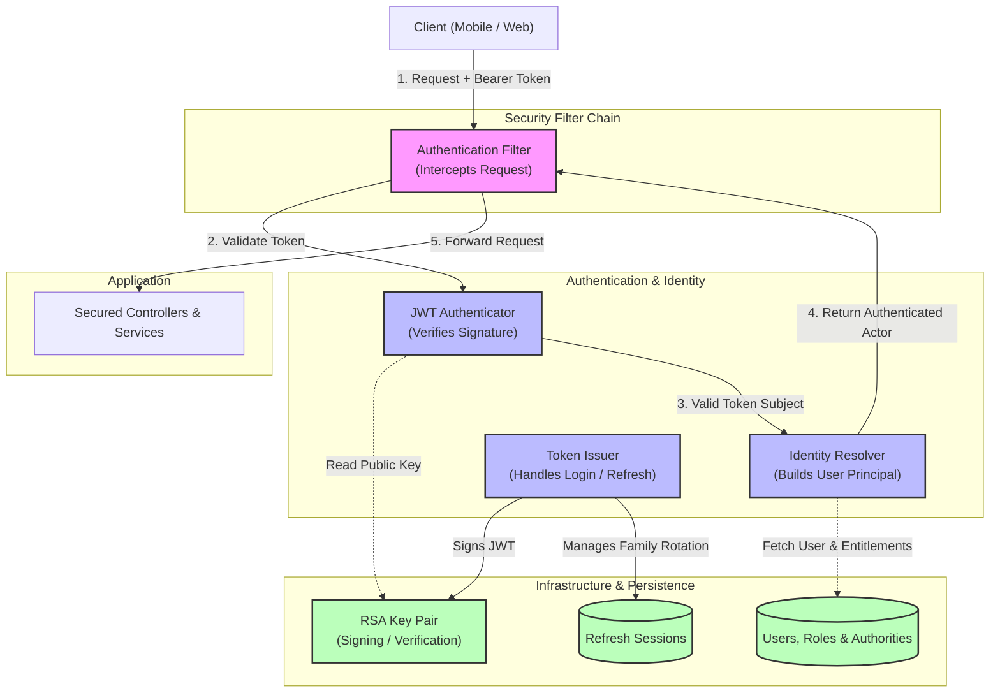
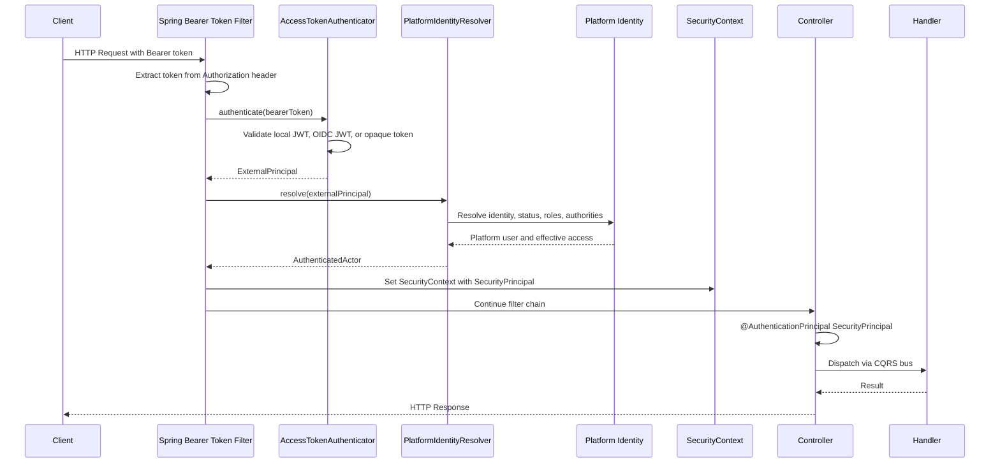
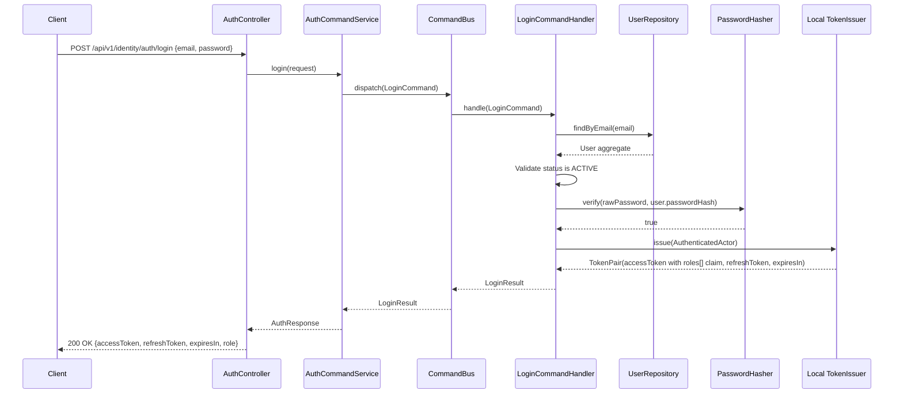
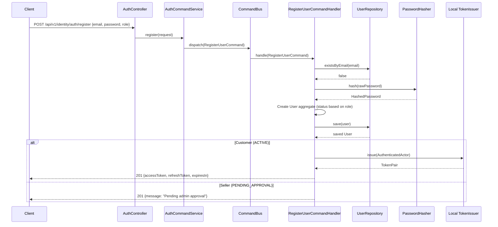
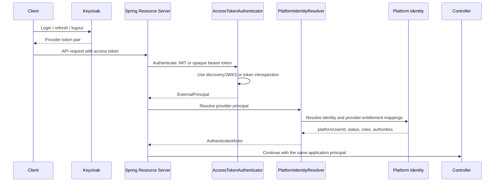
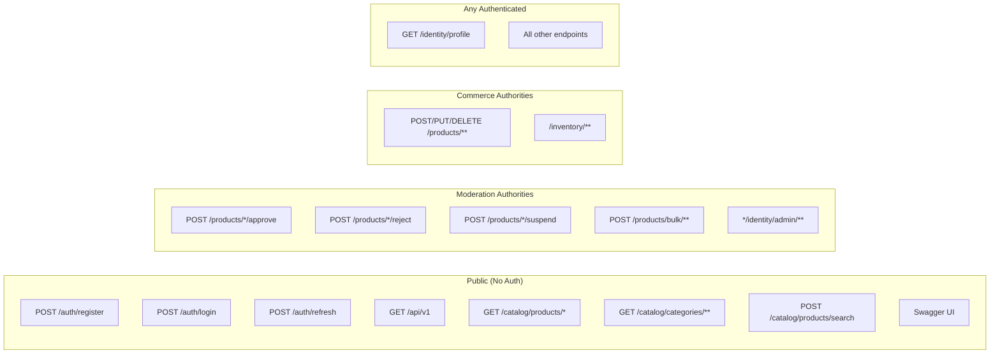
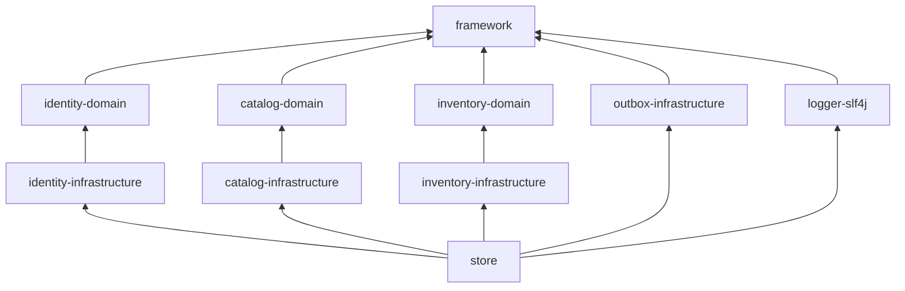

# Identity Security Architecture Diagram

This diagram describes the authentication and authorization architecture for
the platform. It keeps the application contract stable while credential and
token infrastructure changes from self-hosted JWT to an external provider.

## Overview: Provider-Neutral Authentication Architecture

## Authentication Flow

## Login Flow

## Registration Flow

## External Provider Flow (Future)

Keycloak replaces local credential and token endpoints. It does not replace
the platform user, seller approval, local role-to-authority policy, or
resource-ownership checks.

## Authorization: Endpoint Access Matrix

The moderation routes require `PRODUCT_MODERATE` or the corresponding finer
authority. Product mutation requires `PRODUCT_WRITE_OWN` or
`PRODUCT_WRITE_ANY`; inventory mutation requires `INVENTORY_MANAGE_OWN` or
`INVENTORY_MANAGE_ANY`. Identity administration uses authorities such as
`SELLER_APPROVE`, `USER_SUSPEND`, and `ROLE_MANAGE`. Roles receive these
authorities through database mappings. Handlers separately verify that the
authenticated `platformUserId` owns seller-scoped resources.

## Module Dependency After Security

## Notes

- The `AuthenticatedActor` record lives in `framework`, allowing modules to
  consume identity without depending on Spring Security or an IdP SDK.
- `AccessTokenAuthenticator` hides token format and provider SDKs. Its
  implementations validate local JWTs, OIDC JWTs through discovery/JWKS, or
  OAuth2 opaque tokens through introspection.
- Every authenticator returns the same `ExternalPrincipal`; raw JWT claims and
  introspection responses do not enter controllers or handlers.
- The API accepts bearer access tokens only. OIDC ID tokens are not valid API
  access tokens.
- `PlatformIdentityResolver` supports configurable realm-role, client-role,
  group, scope, or introspection-field mappings and hides those formats from
  the application.
- `(issuer, subject)` resolves to a stable local `platformUserId`; email is not
  used as a permanent identity key.
- Local roles and role-to-authority mappings remain the commerce authorization
  source after Keycloak adoption.
- `TokenIssuer` is local identity infrastructure. Keycloak replaces local
  login, issuance, refresh, and logout rather than implementing that port.
- Error responses for 401 and 403 follow the existing RFC 7807 ProblemDetail
  format from `GlobalApiExceptionHandler`.
- Dashed lines represent future external JWT/JWKS or opaque-token
  introspection infrastructure.
