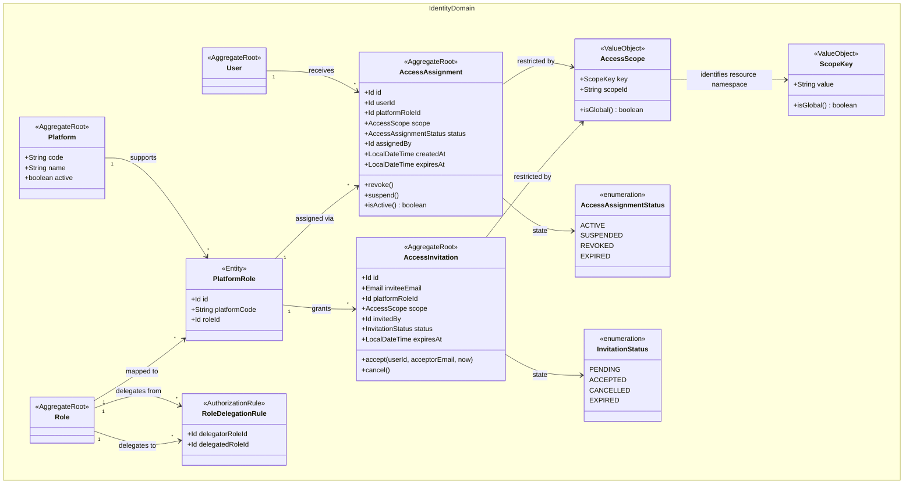
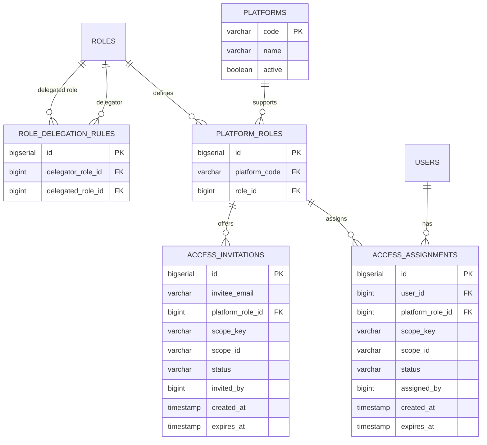
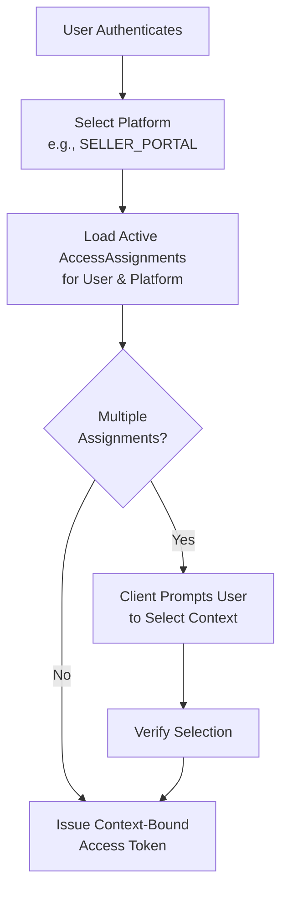

# Platform-Scoped Identity Domain Aggregates

This diagram reflects the extended identity domain model introducing platform-scoped and resource-scoped RBAC, as defined in ADR-003.

## Class Diagram

### Platform Access Aggregate

## Entity Relationship

## Domain Aggregate Descriptions

This section details the primary aggregates and value objects in the Platform-Scoped Identity model and explains their specific responsibilities.

### 1. `Platform`
Represents a distinct logical application boundary within the Grab ecosystem, such as `CUSTOMER_APP`, `SELLER_PORTAL`, or `ADMIN_CONSOLE`. It acts as a gatekeeper to ensure users only access the appropriate application interfaces.

### 2. `PlatformRole` (Mapping Entity)
A critical junction that defines which `Role`s are allowed to be used on which `Platform`. This prevents invalid configurations, such as assigning a `CUSTOMER` role to the `SELLER_PORTAL`.

### 3. `AccessScope` (Value Object)
Defines the specific business boundary that an assignment is limited to. It
consists of a namespaced key (for example `merchant.account`,
`merchant.storefront`, or `inventory.fulfillment-location`) and an ID. The
built-in `global` key uses `*` for its ID. Identity validates the reference
format while the owning bounded context defines the resource's meaning and
relationships.

### 4. `AccessAssignment`
The core aggregate replacing the traditional global "User-to-Role" mapping. It explicitly binds a `User` to a `PlatformRole` within a strict `AccessScope`. When a user logs in, the system loads only the assignments valid for the platform they are accessing.

### 5. `AccessInvitation`
Handles the workflow of onboarding staff. It records an offer for a specific email address to receive an `AccessAssignment` (Platform + Role + Scope). It ensures that pending invites have an expiration and are securely tracked until the user registers or logs in to accept them.

### 6. `RoleDelegationRule`
Defines one explicit active-role relationship that permits a delegator role to
grant or administer a delegated role. Missing relationships deny delegation;
there is no implicit administrator wildcard in domain code.

## Flowcharts

### Context-Bound Token Issuance Flow

This flowchart illustrates how a user's context is resolved into a scoped access token when they log in or switch contexts.

