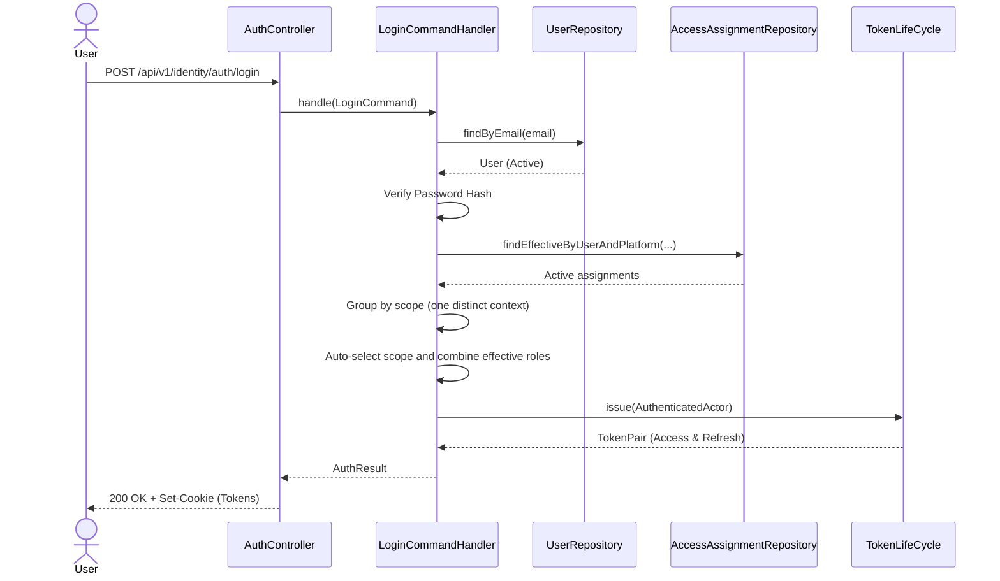
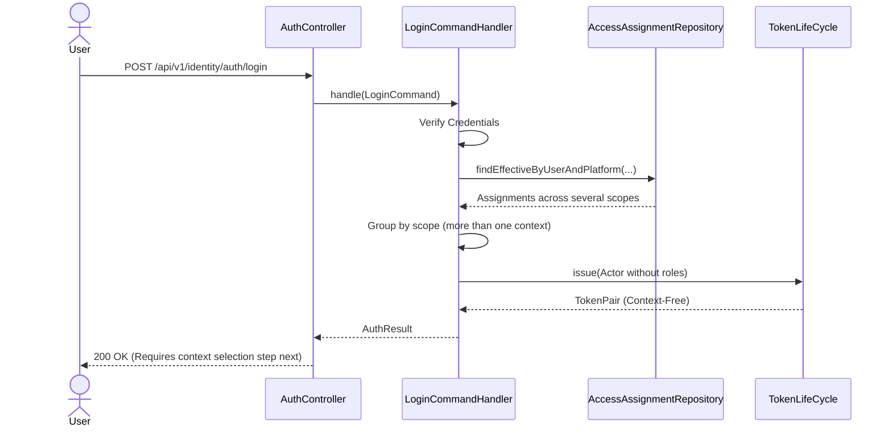
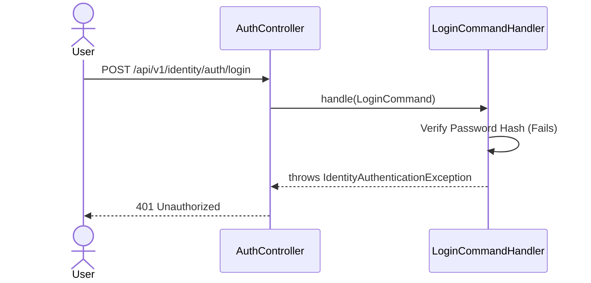
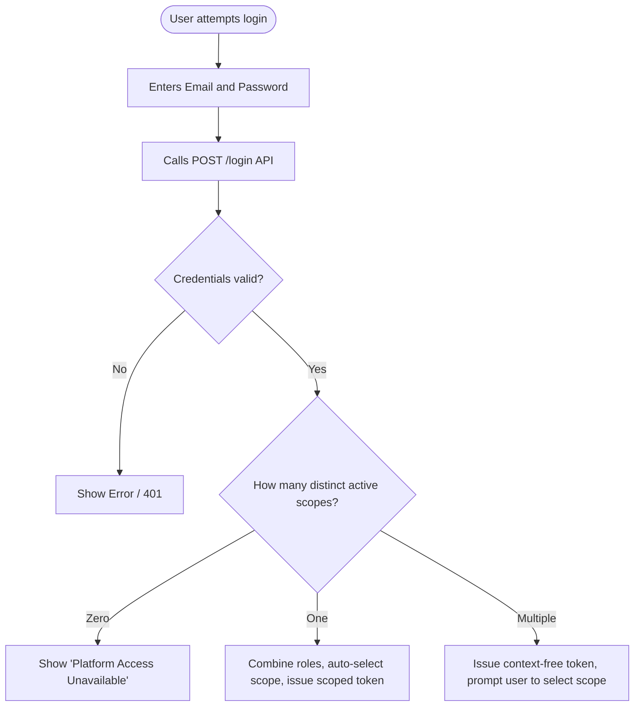
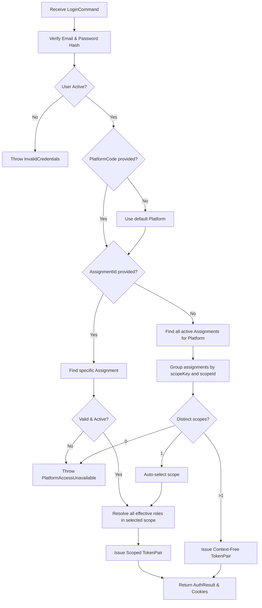

# Feature: User Login

> **Description:** Allows registered users to authenticate via email and password, combines their effective roles within one business scope, handles scope selection when several merchant or storefront contexts exist, and issues secure access and refresh tokens.
> **Actors:** User, System
> **Tags:** `@[identity]` `@[auth]` `@[login]`

---

## 1. Business Rules

| # | Rule | Description |
|---|------|-------------|
| R1 | Valid Credentials | Users must provide a valid email and matching password to authenticate. Failing this returns an `InvalidCredentials` error. |
| R2 | Active Account | The user's account status must be `ACTIVE`. Suspended accounts cannot log in. |
| R3 | Context Identity | A context is identified by `platformCode + scopeKey + scopeId`. Roles do not create separate contexts. |
| R4 | Role Combination | All effective assignments in the selected platform and scope contribute their roles and authorities to the authenticated actor. The user never chooses a role. |
| R5 | Single Context Auto-Selection | If the active assignments resolve to exactly one distinct scope for the requested platform, the system automatically selects it and issues a scoped token containing the combined roles. |
| R6 | Multiple Context Handling | If active assignments resolve to several distinct scopes, the system issues a context-free token. The authenticated user then lists and selects a merchant or storefront context. |
| R7 | Explicit Context Selection | An `assignmentId` may be supplied during login or context selection as an ownership anchor. After validation, all effective roles in that assignment's platform and scope are resolved. |

---

## 2. Acceptance Criteria

- [ ] AC1: Given several active role assignments for one platform and scope, login auto-selects that scope and the token contains every effective role in it.
- [ ] AC2: Given active assignments across several scopes, login without an `assignmentId` returns a context-free token with no roles or scope.
- [ ] AC3: A context-free token can call the authenticated context-list endpoint and select only a context belonging to that user.
- [ ] AC4: Context listing returns one item per distinct scope with a combined `roleCodes` set.
- [ ] AC5: Given a valid `assignmentId`, login resolves the assignment's scope and combines all effective roles in that scope.
- [ ] AC6: Given invalid credentials or a suspended account, the system rejects the login attempt with a `401 Unauthorized`.
- [ ] AC7: Given a login attempt for a platform where the user has no active assignments, the system rejects the attempt with a `PlatformAccessUnavailable` error.

---

## 3. Sequence Diagrams

### 3.1 Happy Path Flow (Single Context or Explicit Assignment)



### 3.2 Happy Path Flow (Multiple Contexts)



### 3.3 Error Flow (Invalid Credentials)



---

## 4. Flow Charts

### 4.1 Workflow



### 4.2 Business Logic Flow



---

## 5. Data Contracts

### 5.1 Request

```json
{
  "email": "user@example.com",
  "password": "securePassword123!",
  "platformCode": "SELLER_PORTAL", 
  "assignmentId": "optional-uuid-to-skip-selection"
}
```

### 5.2 Response (Success)

```json
{
  "accessToken": "eyJhbG...",
  "refreshToken": "eyJhbG...",
  "expiresInMs": 3600000,
  "userId": "123e4567-e89b-12d3-a456-426614174000",
  "email": "user@example.com",
  "roles": ["MERCHANT_OWNER", "STORE_MANAGER"],
  "status": "ACTIVE"
}
```
`roles` contains the combined effective roles for the selected scope. It is empty
when a context-free token is issued because several distinct scopes require a
user selection.

### 5.3 List Available Contexts

`GET /api/v1/identity/access-contexts?platformCode=SELLER_PORTAL` requires the
authenticated token returned by login. Each resource represents one distinct
scope, not one role assignment:

```json
{
  "assignmentId": "anchor-assignment-uuid",
  "platformCode": "SELLER_PORTAL",
  "roleCodes": ["MERCHANT_OWNER", "STORE_MANAGER"],
  "scopeKey": "merchant.account",
  "scopeId": "merchant-uuid",
  "expiresAt": null
}
```

The `assignmentId` is an opaque ownership anchor used by the selection endpoint.
The system validates it and resolves every currently effective role in the same
platform and scope.

### 5.4 Response (Error)

```json
{
  "code": "IDENTITY_INVALID_CREDENTIALS",
  "message": "Invalid email or password",
  "details": {}
}
```

---

## 6. Related Documents

- [Platform-Scoped Identity Architecture](../architecture/ADR_003-Platform_scopes_architecture.md)
- [Platform Scope Domain and Flow Diagrams](../architecture/DGR_003-Platform_scopes_bounded_context_architecture.md)
- [Default User Registration](./FEAT_001-Default_user_registration.md)
