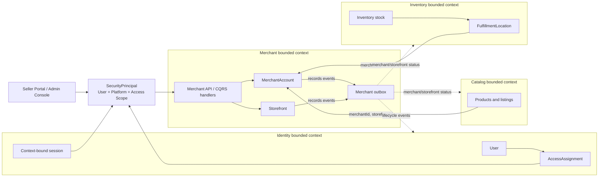

# Merchant Bounded Context Architecture

**Status:** Accepted  
**Date:** 2026-06-28

---

## 1. The Problem

**What's not working?**  
Identity can identify a user and grant merchant-scoped access, but the system
does not yet have an authoritative module for the seller business, its review
lifecycle, or its customer-facing storefronts. Treating a role, user, generic
"store," or physical inventory location as the merchant would mix unrelated
responsibilities and create unclear ownership.

**What's at stake?**  
The authorization model needs a stable `MerchantAccount` ID before it can grant
safe merchant-scoped access. Without a clear boundary, seller registration may
accidentally create business resources, different modules may disagree about a
merchant's status, and one merchant's data may be exposed to another merchant.

---

## 2. What We Decided

**The core approach:**  
Create a separate Merchant bounded context that owns merchant business identity,
merchant lifecycle, and storefront lifecycle while Identity continues to own
users and access grants.

**Key changes:**

- Add `merchant-domain` as the pure domain module and
  `merchant-infrastructure` as its persistence and integration module.
- Add the Merchant application/API package under `store` as the composition
  layer for commands, queries, authorization, and transaction boundaries.
- Define `MerchantAccount` as the seller business record and `Storefront` as an
  optional customer-facing sales presence. They are not synonyms.
- Reference Identity users, Merchant accounts, Storefronts, and Inventory
  locations by stable IDs across module boundaries; do not share aggregates or
  persistence entities.
- Publish merchant lifecycle events through the module-scoped transactional
  outbox so Identity and other modules can react idempotently.
- Derive the acting user and selected merchant scope from the trusted
  `SecurityPrincipal`; request fields are never proof of ownership.
- Keep authentication registration separate from merchant onboarding.

**What stays the same:**  
Identity remains the source of truth for users, credentials, platforms, roles,
access assignments, invitations, and sessions. Catalog owns products and
listings. Inventory owns stock and physical fulfillment locations. The system
remains a modular monolith using in-process CQRS and module-scoped persistence.

### Registration and onboarding rule

Registering or authenticating a user does **not** automatically create a
`MerchantAccount`, `Storefront`, platform, address, or fulfillment location.

1. Identity registration creates or resolves only the `User`.
2. An authenticated user explicitly starts merchant onboarding.
3. Merchant creates one draft `MerchantAccount` and publishes an event that
   allows Identity to grant applicant access to that Merchant ID.
4. Approval allows Identity to replace applicant access with owner access.
5. A `Storefront` is created through a separate, explicit use case.
6. A physical `FulfillmentLocation` is created explicitly in Inventory with a
   real address; it is never guessed or created as a default.

`SELLER_PORTAL` is a shared Identity platform definition. It is configured once
for the system and is not created per merchant.

## 2.1. Visual Overview

> The Merchant module owns business lifecycle. Identity decides who may act;
> each business module still validates the selected resource and its state.

### High-Level Components and Ownership



### Module Structure

```text
merchant-domain
└── aggregates, value objects, domain services, events, repository ports

merchant-infrastructure
└── JPA entities, assemblers, repository adapters, views, outbox integration

store/com/grab/store/merchant
└── controllers, request mappers, CQRS handlers, configuration, event consumers
```

### Data Ownership

| Concept | Source of truth | Meaning |
|---|---|---|
| `User` | Identity | A person or service that can authenticate |
| `Platform` | Identity | A shared application boundary such as `SELLER_PORTAL` |
| `AccessAssignment` | Identity | Permission for a user on a platform and resource scope |
| `merchant.account` scope key | Merchant | Namespaced reference to one MerchantAccount |
| `merchant.storefront` scope key | Merchant | Namespaced reference to one Storefront |
| `MerchantAccount` | Merchant | A seller business participating in commerce |
| `Storefront` | Merchant | A customer-facing sales presence owned by one merchant |
| Registered business address | Merchant | Legal or contact address supplied during onboarding |
| `FulfillmentLocation` | Inventory | A physical place where inventory is held or fulfilled |
| Product and listing | Catalog | What a merchant offers for sale |

---

## 3. Why This Approach

**Primary reasons:**

1. **Clear authorization target:** Identity can safely scope access to an
   authoritative Merchant ID without owning merchant business data.
2. **Separation of lifecycles:** A user can remain an active customer while one
   merchant application is rejected or one merchant is suspended.
3. **Precise language:** Merchant, Storefront, Platform, and
   FulfillmentLocation have separate meanings, preventing a generic `Store`
   model from accumulating unrelated behavior.
4. **Tenant isolation:** APIs combine Identity permission checks with
   Merchant-owned relationship and lifecycle checks.
5. **Independent evolution:** Merchant onboarding and review rules can evolve
   without coupling authentication, Catalog, or Inventory transactions.
6. **Reliable integration:** Outbox events preserve module-local consistency
   and support idempotent downstream updates.

---

## 4. Trade-offs

| Pros | Cons |
|---|---|
| One module is authoritative for merchant and storefront state. | Cross-module flows become eventually consistent. |
| Identity stays focused on authentication and authorization. | Consumers must implement idempotent event handling. |
| Seller registration cannot accidentally create tenant resources. | Merchant onboarding requires an explicit additional flow. |
| Merchant suspension does not disable unrelated customer access. | Effective access depends on both an Identity grant and Merchant state. |
| Storefront and physical inventory location remain unambiguous. | Clients must handle separate creation steps and IDs. |
| The modular boundary can later be extracted as a service. | The initial foundation adds modules, persistence, and outbox wiring. |

---

## 5. What Needs to Change

**New components/modules to build:**

- `merchant-domain` with `MerchantAccount` and `Storefront` aggregate roots,
  value objects, lifecycle events, domain errors, and repository ports.
- `merchant-infrastructure` with module-owned tables, JPA adapters, projections,
  Flyway migrations, and a Merchant outbox.
- Merchant CQRS commands for starting an application, updating and submitting
  details, reviewing, approving, rejecting, suspending, and reactivating.
- Explicit Storefront creation and lifecycle commands.
- Merchant query views for applicant, owner, reviewer, and scoped
  administration use cases.
- Idempotent lifecycle event consumers in Identity and any module that needs a
  merchant-status projection.

**Changes to existing systems:**

- Identity must consume Merchant lifecycle events to create, replace, suspend,
  or revoke merchant-scoped assignments and affected sessions.
- Onboarding must orchestrate Merchant use cases rather than create merchant
  state inside Identity registration.
- Catalog and Inventory must use `merchantId` as an external reference and
  validate that protected resources belong to the principal's active scope.
- API contracts must avoid generic `sellerId` or `storeId` names when the
  intended concept is specifically `merchantId`, `storefrontId`, or
  `fulfillmentLocationId`.
- Sensitive legal, tax, and contact data must not be copied into Identity
  assignments, tokens, or integration events.

---

## 6. Implementation Plan

- **Phase 1 — Domain foundation:** Add Merchant modules, aggregate contracts,
  persistence configuration, migrations, repositories, and domain tests.
- **Phase 2 — Onboarding and review:** Implement explicit application creation,
  profile completion, submission, review, approval, rejection, and Merchant
  lifecycle events.
- **Phase 3 — Authorization integration:** Add idempotent Identity consumers,
  applicant-to-owner grant transitions, session invalidation, and
  cross-merchant denial tests.
- **Phase 4 — Storefront foundation:** Add explicit Storefront provisioning and
  lifecycle APIs, then integrate Catalog and Inventory using stable IDs and
  status projections.

**Rollback strategy:**  
Introduce the Merchant module additively behind application configuration. Keep
existing seller behavior available until Merchant records and Identity access
assignments reconcile. Event consumers must be replay-safe, so they can be
disabled and rebuilt from the Merchant outbox without changing Merchant state.
Do not remove legacy seller fields or authorization paths until onboarding,
approval, suspension, session invalidation, and cross-merchant isolation tests
pass in production.

---

## 7. Related Documents

- [ADR-002: Merchant Domain Aggregate Design](ADR_002-Merchant_bounded_context_architecture.md)
- [Identity ADR-003: Platform-Scoped Identity Access](../../identity/architecture/ADR_003-Platform_scopes_architecture.md)
- [Platform-Scoped Identity PRD](../../identity/product-requirements/PRD-002_Platform-scope.en.md)
- [System ADR-001: Current System Architecture as a Modulith](../../system/ADR-001-system-architecture.md)
- [System ADR-002: Module-Scoped Transactional Outbox](../../system/ADR-002-module-scoped-outbox.md)
- [ADR Writing Guideline](../../ADR_SKILLS.md)
