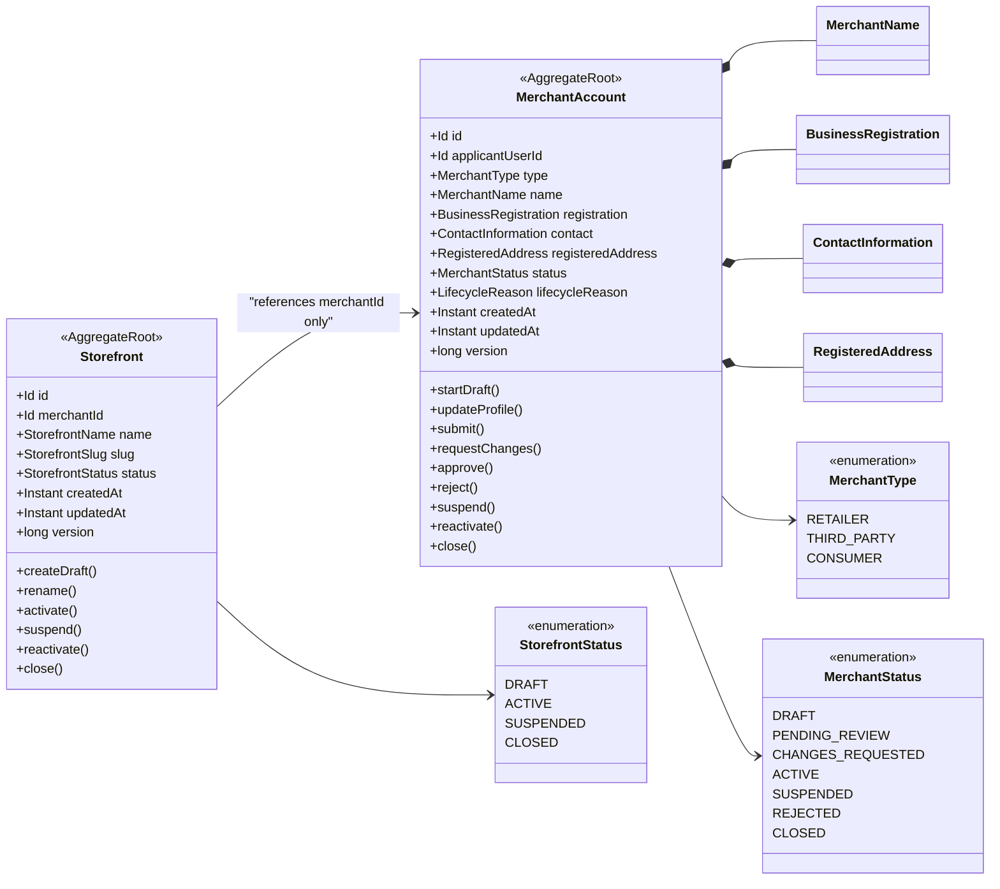
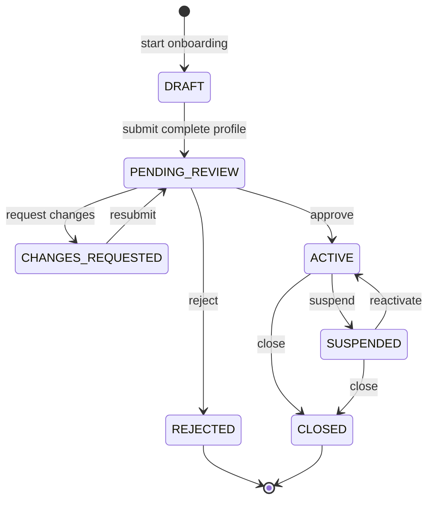
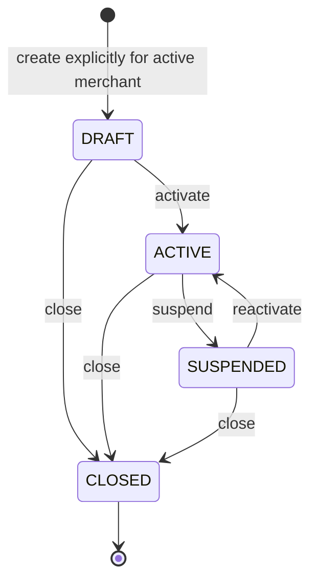
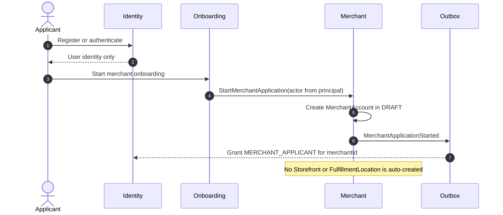

# ADR-002: Merchant Domain Aggregate Design

**Status:** Accepted  
**Date:** 2026-06-28

---

## 1. The Problem

**What's not working?**  
The system needs a minimal domain model that can create and govern a merchant
without turning the Identity user, storefront, or physical location into one
large seller aggregate. The model must also provide stable scope IDs for
authorization while protecting merchant lifecycle invariants.

**What's at stake?**  
An unclear aggregate boundary leads to large transactions, duplicated access
state, invalid lifecycle transitions, and ambiguous ownership. It would also
make it possible to create storefronts or operate merchant resources before the
merchant is approved.

---

## 2. What We Decided

**The core approach:**  
Use `MerchantAccount` and `Storefront` as separate aggregate roots, with
`MerchantAccount` representing the seller business and `Storefront`
representing one optional customer-facing sales presence.

**Key changes:**

- Make `MerchantAccount` the authorization scope and lifecycle authority for a
  merchant business.
- Keep `Storefront` outside the MerchantAccount aggregate and reference its
  parent only by `merchantId`.
- Keep registered address, contact information, business registration, and
  lifecycle reasons as immutable value objects.
- Store only external IDs for Identity users; do not embed a `User`, role,
  assignment, or session in either aggregate.
- Enforce state transitions through named domain methods rather than setters or
  application-handler conditionals.
- Use domain services or policies for rules involving more than one aggregate,
  such as registration uniqueness and Storefront provisioning.
- Record domain events in the aggregate and persist them atomically through the
  Merchant outbox.

**What stays the same:**  
Identity decides whether an actor has permission for a Merchant or Storefront
scope. Merchant decides whether the referenced business resource exists, is
related correctly, and is operational. Inventory remains responsible for
physical locations, and Catalog remains responsible for products and listings.

### Ubiquitous language

| Term | Definition |
|---|---|
| Merchant | A commerce participant represented by a `MerchantAccount` |
| MerchantAccount | The business/profile record, application, and lifecycle used to sell on the platform |
| Storefront | A branded, customer-facing sales presence owned by one MerchantAccount |
| Platform | A shared Identity application boundary; not a merchant resource |
| FulfillmentLocation | A physical Inventory location such as a warehouse or shop |
| Applicant | The authenticated user who explicitly starts merchant onboarding |
| Owner access | An Identity assignment; it is not a child entity of MerchantAccount |

Merchant publishes the namespaced keys `merchant.account` and
`merchant.storefront` as public integration vocabulary. Identity stores these
keys as opaque scope references and does not define their business meaning.

## 2.1. Visual Overview

> Aggregate references cross boundaries by ID. A Storefront is not loaded or
> saved as part of a MerchantAccount transaction.

### Domain Aggregates



### Merchant Lifecycle



### Storefront Lifecycle



### Explicit Creation Flow



---

## 3. Why This Approach

**Primary reasons:**

1. **Small consistency boundaries:** Updating a MerchantAccount does not lock or
   rewrite all of its Storefronts.
2. **Protected invariants:** Aggregate methods own lifecycle decisions, leaving
   command handlers to load, invoke, and save.
3. **Stable authorization scopes:** `merchantId` and `storefrontId` map directly
   to Identity `AccessScope` values without copying business data.
4. **No duplicate access model:** Applicant and owner user IDs in events support
   access provisioning, while Identity remains authoritative for assignments.
5. **Clear physical boundary:** A Storefront can exist without pretending to be
   a warehouse, shop address, or stock location.
6. **Scalable lifecycle updates:** Merchant suspension makes Storefronts
   effectively unavailable without synchronously modifying every child
   aggregate.

### Aggregate responsibilities and invariants

#### `MerchantAccount`

- A draft is created only through an explicit onboarding command for an
  authenticated applicant.
- `applicantUserId` records who started the application; it does not itself
  grant access.
- Submission requires the profile fields applicable to the selected
  `MerchantType`, including a valid contact and registered address.
- Approval and rejection are allowed only from `PENDING_REVIEW`.
- A fixable review outcome uses `CHANGES_REQUESTED`; `REJECTED` is terminal.
- Only an `ACTIVE` merchant is operational for selling.
- Suspension is reversible; closure is terminal.
- Review, suspension, rejection, and closure reasons are recorded as domain
  values for auditability.
- User roles, staff lists, tokens, passwords, tax documents, products, stock,
  and orders are not children of this aggregate.

#### `Storefront`

- Every Storefront references exactly one `merchantId`.
- Storefront creation is explicit and must pass a domain provisioning policy
  confirming that the MerchantAccount is `ACTIVE`.
- Its slug is normalized and unique according to a repository-backed domain
  policy plus a database uniqueness constraint.
- Activation is allowed from `DRAFT`, and reactivation is allowed from
  `SUSPENDED`, only while the parent merchant is operational.
- Closure is terminal.
- An active Storefront under a suspended or closed MerchantAccount is
  **effectively unavailable**, even if its stored status has not been changed.
- Branding, sales-channel presentation, and customer-facing metadata may evolve
  here; physical address and stock behavior do not.

### Cross-aggregate rules

Rules that require repository lookup or another aggregate belong in a named
domain policy/service, not in a command handler:

- `MerchantRegistrationPolicy` checks whether a registration identifier or
  conflicting in-progress application already exists.
- `StorefrontProvisioningService` receives the loaded MerchantAccount and
  creates a Storefront only when the merchant can operate.
- `StorefrontSlugPolicy` checks normalized slug availability.

Application handlers remain orchestrators:

```text
load aggregate(s) -> invoke domain method/service -> save aggregate -> commit outbox
```

Actor permission checks happen before domain invocation using the trusted
Identity principal. Actor IDs passed to domain methods are audit data, not proof
of authorization.

### Domain events

| Event | Trigger | Main consumers |
|---|---|---|
| `MerchantApplicationStarted` | Draft MerchantAccount created | Identity grants applicant scope |
| `MerchantApplicationSubmitted` | Complete draft submitted | Merchant review workflow |
| `MerchantChangesRequested` | Reviewer requests corrections | Onboarding/notifications |
| `MerchantApproved` | Application approved | Identity replaces applicant with owner access |
| `MerchantRejected` | Application rejected | Identity/onboarding/notifications |
| `MerchantSuspended` | Active merchant suspended | Identity sessions, Catalog, Inventory |
| `MerchantReactivated` | Suspended merchant restored | Identity and status projections |
| `MerchantClosed` | Merchant permanently closed | Identity and dependent modules |
| `StorefrontCreated` | Explicit draft Storefront created | Catalog and scoped access workflows |
| `StorefrontStatusChanged` | Storefront activated, suspended, or closed | Catalog and read projections |

Events contain stable IDs, lifecycle state, aggregate version, event ID, and
time. They do not contain credentials, tokens, tax documents, or complete legal
and address data. Consumers process them at least once and must be idempotent.

---

## 4. Trade-offs

| Pros | Cons |
|---|---|
| Aggregate methods keep lifecycle rules out of handlers. | Cross-aggregate operations require explicit policies and repository reads. |
| Storefronts can scale independently from MerchantAccount. | Merchant and Storefront cannot be changed in one aggregate transaction. |
| Stable IDs align naturally with scoped authorization. | Identity grants may briefly lag Merchant events. |
| Merchant suspension avoids bulk Storefront writes. | Consumers must calculate effective availability using Merchant state. |
| Explicit onboarding prevents accidental resource creation. | The user experiences more than one setup step. |
| Value objects make business data and validation precise. | Different merchant types require evolving submission policies. |

---

## 5. What Needs to Change

**New components/modules to build:**

- `MerchantAccount` and `Storefront` aggregate roots with focused domain tests.
- `MerchantStatus`, `StorefrontStatus`, and `MerchantType` enums.
- `MerchantName`, `BusinessRegistration`, `ContactInformation`,
  `RegisteredAddress`, `LifecycleReason`, and Storefront naming value objects.
- Repository ports for both aggregates and read-specific query projections.
- Registration, Storefront provisioning, and slug uniqueness domain policies.
- Merchant domain errors and lifecycle events.
- Optimistic versioning and uniqueness constraints in Merchant persistence.

**Changes to existing systems:**

- Identity access consumers must use Merchant and Storefront IDs as opaque scope
  IDs and never infer lifecycle state from a role.
- Onboarding must call Merchant commands and maintain no duplicate Merchant
  aggregate.
- Catalog and Inventory references must use explicit `merchantId`,
  `storefrontId`, and `fulfillmentLocationId` names.
- APIs must map domain lifecycle conflicts to the existing RFC 7807 error
  contract without exposing protected merchant details.

---

## 6. Implementation Plan

- **Phase 1 — MerchantAccount:** Implement value objects, lifecycle, repository
  port, persistence mapping, migration, outbox events, and transition tests.
- **Phase 2 — Application flow:** Implement applicant commands, review commands,
  principal-derived authorization, query projections, and Identity event
  consumers.
- **Phase 3 — Storefront:** Implement explicit provisioning, lifecycle, slug
  uniqueness, status events, and Catalog integration.
- **Phase 4 — Hardening:** Add optimistic-concurrency, event replay,
  cross-merchant isolation, forbidden transition, and idempotency tests.

**Rollback strategy:**  
Keep the new tables and event consumers additive while legacy seller behavior
remains available. Disable new command routes and consumers if rollback is
required; do not delete Merchant records or outbox history. Rebuild Identity and
dependent projections by replaying events after correction. Schema cleanup and
legacy-field removal happen only after aggregate counts, lifecycle states,
access assignments, and isolation tests reconcile.

---

## 7. Related Documents

- [ADR-001: Merchant Bounded Context Architecture](ADR_001-Merchant_module_architecture.md)
- [Identity ADR-003: Platform-Scoped Identity Access](../../identity/architecture/ADR_003-Platform_scopes_architecture.md)
- [Platform-Scoped Identity Aggregate Diagram](../../identity/architecture/DGR_003-Platform_scopes_bounded_context_architecture.md)
- [System ADR-001: Current System Architecture as a Modulith](../../system/ADR_001-System_architecture.md)
- [System ADR-002: Module-Scoped Transactional Outbox](../../system/ADR_002-Module_scoped_outbox_architecture.md)
- [ADR Writing Guideline](../../../.agent/skills/ADR_SKILLS.md)
