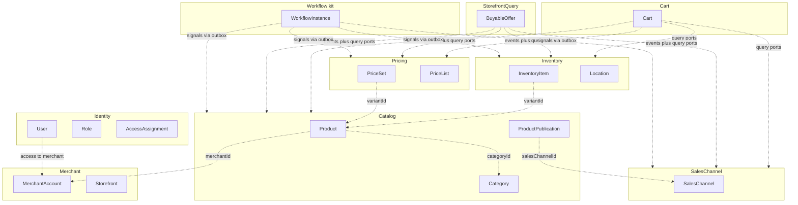
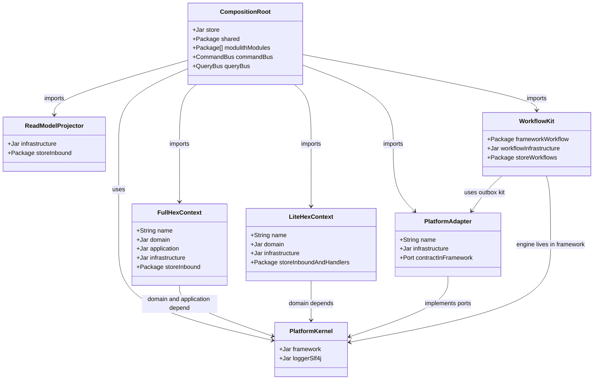
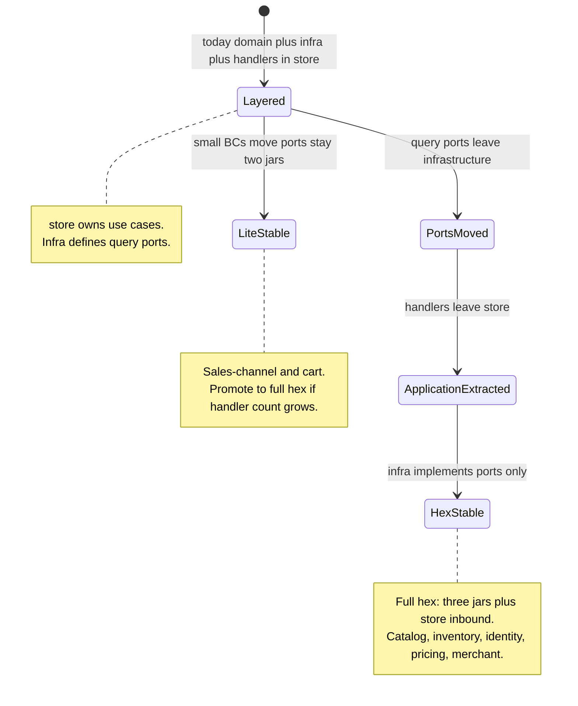
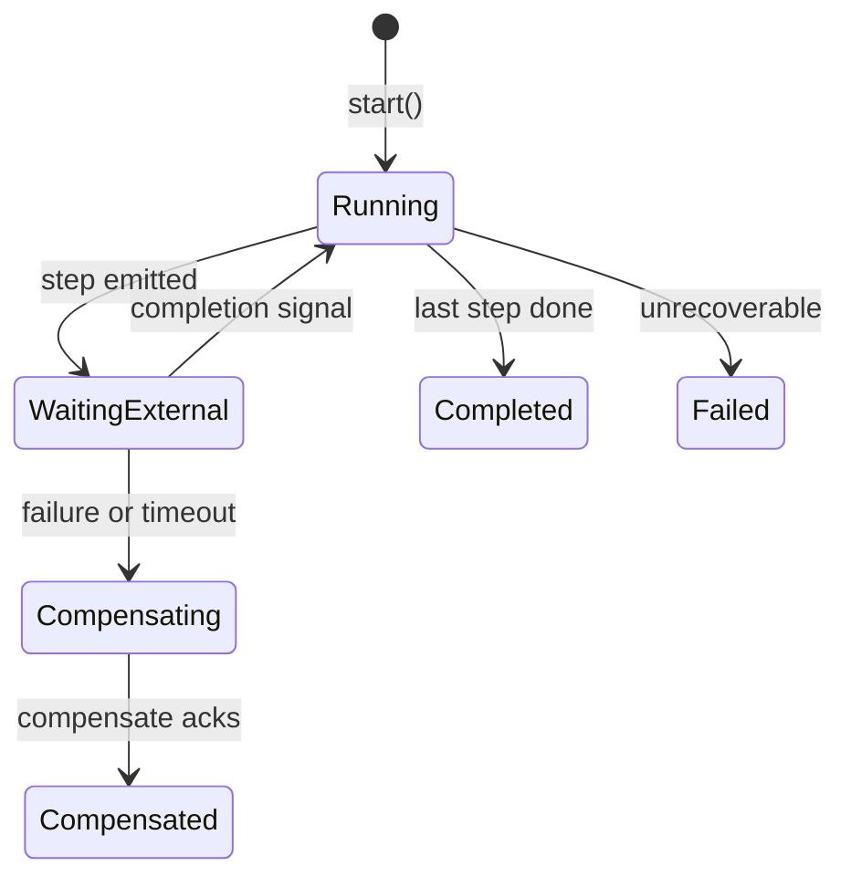
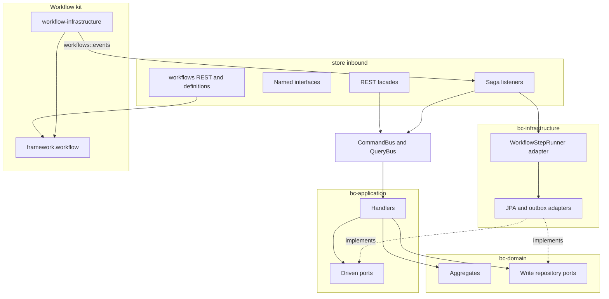
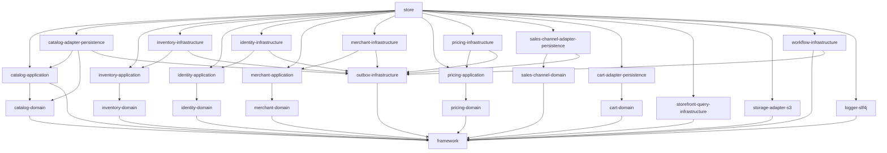
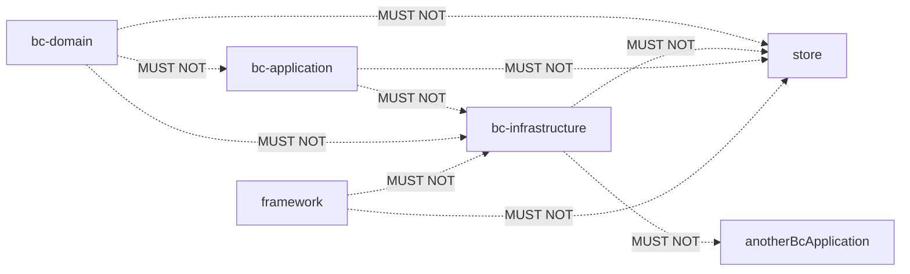
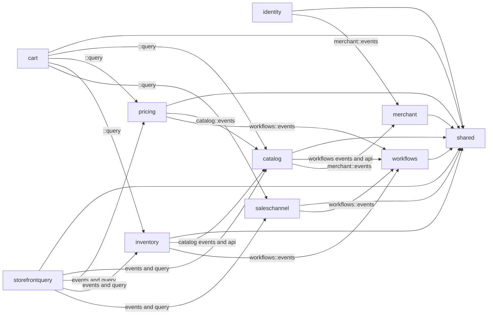
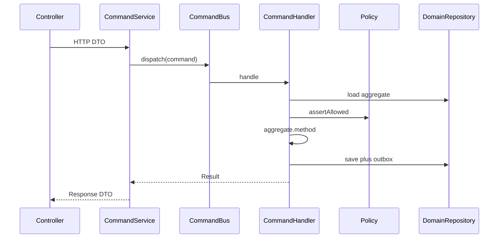
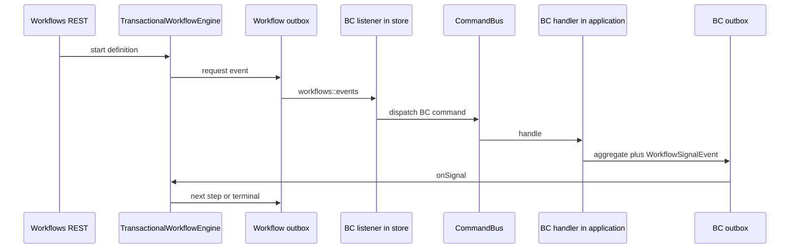

# Hexagonal Module Layout for the Modular Monolith

---

## 1. The Problem

**What's not working?**  
The platform already splits each business area into `{bc}-domain` and `{bc}-infrastructure`, but the **application layer lives inside `store`**, the Spring Boot deployment unit. Query ports are declared in infrastructure. Domain service beans are wired in infrastructure. Workflow, storage, and outbox sit beside those contexts with no single picture of where each Maven module belongs after a hexagonal cut.

**What's at stake?**  
Use cases cannot be compiled or tested without the whole Boot app or JPA. Ports have no home. A contributor cannot answer “where does this type live?” the same way for catalog, inventory, identity, workflow, and storefront-query. If we migrate one context ad hoc, the rest of the monolith diverges.

---

## 2. What We Decided

**The core approach:**  
Keep one modular monolith. Classify **every** Maven module as kernel, full hexagonal bounded context, lite bounded context, platform adapter, read-model projector, or composition root. Add `{bc}-application` only where use-case count justifies it. `store` stays the composition root and the inbound adapter (REST, Modulith named interfaces, saga listeners).

**Key changes:**
- Four layout recipes (full hex, lite hex, platform adapter, projector) applied to the whole tree — not a catalog-only redesign.
- **Driving ports** are `{bc}-application.port.inbound.*UseCase` (`execute` with application Command/Query records). HTTP and sagas still enter through `CommandBus` / `QueryBus`; they do not inject use cases directly.
- **CQRS adapters** are store `CommandHandler` / `QueryHandler` (transaction boundary + routing only; delegate to `*UseCase.execute(...)`). No parallel HTTP `*UseCase` API.
- Driven ports (write repos in `domain.port.outbound`; query/audit ports in application for full hex, or in domain for lite BCs) are never defined in infrastructure.
- REST, HATEOAS, security filters, and Modulith modules stay in `store`.
- Workflow stays a **three-layer platform kit** (`framework.workflow` → `workflow-infrastructure` → `store/workflows`). No `workflow-domain` or `workflow-application`.
- Full-hex persistence Maven modules are **`{bc}-adapter-persistence`** (`com.{bc}.adapter.persistence`, `{Bc}PersistenceConfig`). Platform kits keep `*-infrastructure`. No `*-adapter-rest` jars.

**What stays the same:**  
One `EcommerceApplication`. In-process CQRS buses. Per-module datasources, transaction managers, and outbox. Spring Modulith `allowedDependencies` and named interfaces (`api`, `events`, `query`). Domain aggregates and write-repository interfaces stay in `{bc}-domain`. Cross-context collaboration stays events + named query ports — never aggregate navigation.

---

## 2.1. Visual Overview

> Diagrams and tables so a newcomer can learn the platform domain map and the target module layout at a glance.

### Part 1 — Domain Bounded Context

The “bounded context” of this ADR is the **commerce platform as a modular monolith**: many business contexts plus platform kits, composed in one process. Individual product/inventory/identity models stay in their domain ADRs. This document owns **who owns what, how modules relate, and how they are packaged**.

#### Responsibility & Boundary

**This platform owns:**
- Seller identity, merchant accounts, catalogs, stock, prices, sales channels, and carts as separate bounded contexts
- In-process commands/queries, module-scoped persistence, transactional outbox, object storage, and orchestrated sagas
- HTTP APIs and HATEOAS for the seller/admin store app
- A storefront read model projected from catalog, pricing, inventory, and sales-channel facts

**This platform does not own:**
- A single shared “ecommerce” aggregate that other modules may load
- Microservice extraction, a second deployable, or a gRPC adapter jar
- Payment, order, fee/settlement, or C2C deal aggregates (future BCs; they must follow the same recipes)

**Primary use cases:**
- Register and authenticate actors; assign merchant/platform access
- Onboard a merchant and provision a storefront
- Maintain listings, stock, and prices independently, then sell through a channel
- Orchestrate multi-context seller flows (create/update sellable product, publish to channel) without two-phase commit
- Let cart and storefront read **slices** through published query ports, not write models

#### Ubiquitous Language

| Business term | Domain type / value | Meaning |
|---------------|---------------------|---------|
| Bounded context | Modulith package in `store` plus its Maven jars | One business language and consistency boundary (catalog, inventory, …) |
| Full hex context | `{bc}-domain` + `{bc}-application` + `{bc}-adapter-persistence` | Use cases in application; CQRS + wiring in store |
| Lite hex context | `{bc}-domain` + `{bc}-adapter-persistence` | Handlers stay in store until promoted |
| Driving port | `{bc}-application.port.inbound.*UseCase` | Business operation; wired in store `{Bc}UseCaseConfig` |
| CQRS adapter | Store `CommandHandler` / `QueryHandler` | Bus routing + `@{Bc}Transactional`; delegates to use case |
| Driven port | repository / query port / `FileStoragePort` / `WorkflowStore` | Outbound contract implemented by an adapter |
| Composition root | `store` | Wires adapters, exposes HTTP, hosts Modulith modules |
| Named interface | `::{api,events,query}` | The only types another Modulith module may import |
| Kernel | `framework` | Shared building blocks; no Spring, no JPA, no business BC |
| Platform adapter | storage / outbox / workflow infra | Technical capability used by many BCs |
| Projector | storefront-query | Read model fed by other contexts’ events |
| Saga / workflow | `WorkflowProcess` in `store/workflows` | Cross-BC process manager; does not own catalog/inventory/pricing data |
| Outbox | per-module outbox table | Same transaction as the aggregate write; delivery after commit |

#### Context Map

> Each business context is source of truth for its aggregates. References across roots are ids or published ports only.



#### Aggregate Domain Model

> Module **kinds** on the platform — not a single business aggregate. Each BC’s field-level model stays in its domain ADR.



#### Relationships

| From | To | Kind | Notes |
|------|----|------|-------|
| Identity | Merchant | cross-BC events | Access assignment follows merchant lifecycle; Identity does not own `MerchantAccount` |
| Catalog | Merchant | cross-BC by id | `merchantId` on listings; merchant availability projected for queries |
| Catalog | Sales Channel | cross-BC by id | `ProductPublication.salesChannelId` |
| Inventory / Pricing | Catalog | cross-BC events + ids | Variant/SKU identity owned by catalog |
| Cart | Catalog, Pricing, Inventory, Sales Channel | named query ports | Read slices only |
| Storefront Query | Catalog, Pricing, Inventory, Sales Channel | events + query ports | Projects `BuyableOffer`; not a write BC |
| Workflows | Catalog, Inventory, Pricing, Sales Channel | named events | Orchestrates; never writes those aggregates itself |
| Any write BC | Own outbox | composition | Domain events persisted in the same module transaction |
| Any write BC | Storage | driven port | `FileStoragePort` in framework; S3 adapter in `storage-adapter-s3` |
| `store` | All of the above | composition | HTTP + wiring + Modulith |

#### Why Each Property Exists

> Every property on the module-kind diagram, plus why each Maven module exists.

| Property | Owner type | Type | Business reason |
|----------|------------|------|-----------------|
| `name` | FullHexContext / LiteHexContext | String | Business language of that context (catalog, inventory, …) |
| `domain` | Full / Lite | Jar | Source of truth for aggregates and invariants; no I/O |
| `application` | FullHexContext | Jar | Use cases must compile without HTTP or JPA |
| `infrastructure` | Full / Lite / PlatformAdapter / Projector | Jar | Technical mapping to databases, brokers, S3 |
| `storeInbound` | FullHex / Projector | Package | HTTP and published contracts stay with the deployable |
| `storeInboundAndHandlers` | LiteHexContext | Package | Too little use-case code to justify a third jar |
| `framework` | PlatformKernel | Jar | CQRS, ids, aggregates, outbox/storage/workflow **ports** shared by all |
| `loggerSlf4j` | PlatformKernel | Jar | One logging SPI implementation; kernel stays facade-only |
| `contractInFramework` | PlatformAdapter | Port | Adapters implement kernel ports so BCs do not depend on S3/JPA kits directly |
| `commandBus` / `queryBus` | CompositionRoot | Bus | One in-process door for HTTP and saga listeners |
| `modulithModules` | CompositionRoot | Packages | Runtime + compile fence between business contexts |
| `frameworkWorkflow` | WorkflowKit | Package | Engine must not know catalog or Spring |
| `workflowInfrastructure` | WorkflowKit | Jar | Durable instance store and workflow outbox on the workflows datasource |
| `storeWorkflows` | WorkflowKit | Package | Saga **definitions** and REST start/get belong to the app, not the engine |

| Maven module | Why it exists |
|--------------|----------------|
| `framework` | Shared kernel: CQRS, `AggregateRoot`, `Id`, events, specs, `FileStoragePort`, outbox ports, workflow engine/ports |
| `logger-slf4j` | SLF4J bridge for `framework.logger` |
| `catalog-domain` | Listings, categories, publications |
| `catalog-application` | Catalog commands/queries/handlers and catalog driven ports that are not write repos |
| `catalog-adapter-persistence` | Catalog persistence adapter: JPA (`com.catalog.adapter.persistence`), nested-set, catalog outbox; wired via `CatalogPersistenceConfig` |
| `inventory-domain` | Stock, locations, zones, bins, channel routes |
| `inventory-application` | Inventory use cases and query ports (Phase 2) |
| `inventory-adapter-persistence` | Inventory JPA and outbox (`com.inventory.adapter.persistence`) |
| `identity-domain` | Users, roles, assignments, invitations, platforms |
| `identity-application` | Identity use cases and query ports (Phase 2) |
| `identity-adapter-persistence` | Identity JPA / session store adapters |
| `merchant-domain` | Merchant accounts and storefronts |
| `merchant-application` | Merchant use cases and query ports (Phase 2) |
| `merchant-adapter-persistence` | Merchant JPA and outbox |
| `pricing-domain` | Price sets, lists, preferences |
| `pricing-application` | Pricing use cases and quote ports (Phase 2) |
| `pricing-adapter-persistence` | Pricing JPA and outbox |
| `sales-channel-domain` | Sales channel identity |
| `sales-channel-application` | Sales channel use cases and query ports |
| `sales-channel-adapter-persistence` | Channel JPA and outbox (`com.saleschannel.adapter.persistence`) |
| `cart-domain` | Buyer cart |
| `cart-adapter-persistence` | Cart JPA (lite) |
| `storefront-query-infrastructure` | `BuyableOffer` table |
| `storage-adapter-s3` | S3 adapter for `FileStoragePort` |
| `outbox-infrastructure` | Shared JPA outbox implementation used by BC infra modules |
| `workflow-infrastructure` | Workflow instance/correlation/signal log + workflow outbox |
| `store` | Composition root, REST, Modulith, security, saga definitions |

#### Invariants & Policies

| Rule (business language) | Enforced by | When |
|--------------------------|-------------|------|
| A context does not load another context’s aggregate | Modulith named interfaces; no `internal` imports | Compile / `ModularityTests` |
| Application never depends on infrastructure | Maven: `{bc}-application` has no `{bc}-infrastructure` dependency | Compile |
| Domain never depends on application, infrastructure, or `store` | Maven | Compile |
| Infrastructure never depends on `store` | Maven | Compile |
| HTTP and saga listeners enter use cases only through `CommandBus` / `QueryBus` | Agent rule R2 + code review | Command / query |
| Handlers own the module transaction | `@{Bc}Transactional` / `@{Bc}ReadTransactional` | Handler |
| Domain events and aggregate writes share one module transaction | Module outbox in that BC’s infrastructure | Save |
| Workflow engine does not inject catalog, inventory, or pricing | ADR-007; engine ports only | Runtime |
| Workflow does not share a transaction with a business BC | Workflows datasource + workflow outbox | Runtime |
| Lite BCs must not grow a hidden application layer inside infrastructure | Query ports live in domain until a third jar is added | Design |
| Cart and storefront-query read other BCs only via `::query` / `::events` | Modulith `allowedDependencies` | Compile |

#### Lifecycle

How a **bounded context’s source layout** moves during this migration:



How a **workflow instance** moves (unchanged; engine in framework):



---

### Part 2 — Application Architectural Design

#### Components & Layers

> Same CQRS pipeline everywhere. Only the **jar** of the handler/port changes for full hex contexts.

| Layer | Where it lives | Responsibility | Example types |
|-------|----------------|----------------|---------------|
| Controller | `store/.../{module}/internal/api/rest` | HTTP in/out, HATEOAS | `*Controller` |
| Command / Query Service | `store` REST service | DTO ↔ command/query, `bus.dispatch` | `*CommandService` |
| HTTP Mapper | `store` | Request/response MapStruct | `*RequestMapper` |
| Named interface | `store/{module}/{api,events,query}` | Cross-BC published types | `*QueryPort`, integration events |
| Saga definition / workflow REST | `store/workflows` | Start/get process; declare steps | `CreateSellableProductDefinition` |
| Saga listener | `store/{bc}/internal/event` | On workflow event → `CommandBus` | `*CatalogEventListener` |
| Composition / datasource | `store/{module}/internal/config` | `@Import` jars, TM, Flyway | `*Config`, `*ModuleDataSourceConfig` |
| Shared kernel of the app | `store/shared` | Buses, security filters, SSE, tracing | `CqrsConfiguration` |
| Handler | `store/.../{module}/internal/command/handler` and `query/handler` (full hex) | CQRS adapter: `@{Bc}Transactional`, delegates to `*UseCase` |
| Use case | `{bc}-application` (`port/inbound`, `service/`) | Orchestration; Spring-free except `Page`/`Pageable` |
| Query / extra driven ports | `{bc}-application.port.outbound` (full) or `{bc}-domain.port.outbound` (lite) | Read models; `*QueryPort` |
| Domain | `{bc}-domain` | Aggregates, policies; write ports in `port/outbound` |
| Persistence adapter | `{bc}-adapter-persistence` | JPA, outbox, `*Adapter`, `{Bc}PersistenceConfig` |
| Workflow engine | `framework.workflow` + `workflow-infrastructure` | Durable process manager | `EventDrivenWorkflowEngine` |
| Object storage | `framework.storage` + `storage-adapter-s3` | Presigned upload/download | `S3FileStorageAdapter` |

#### Target tree — `store` (composition root)

`store` is **not** emptied. It keeps inbound adapters and wiring for every Modulith module.

```
store/src/main/java/com/grab/store/
├── EcommerceApplication.java
├── shared/                          # not a business BC
│   ├── config/                      # CqrsConfiguration, OpenAPI, logger
│   ├── security/                    # filters, JWT, ModuleSecurityConfigurer
│   ├── sse/                         # workflow UI stream
│   ├── tracing/
│   └── exception/
├── catalog/                         # Modulith module (inbound + contracts)
├── inventory/
├── identity/
├── merchant/
├── pricing/
├── saleschannel/
├── cart/
├── storefrontquery/
└── workflows/                       # Modulith module for the saga kit
```

Each **business** Modulith package (full hex) after migration:

```
store/.../{module}/
├── {Module}Module.java              # allowedDependencies
├── api/                             # named interface ::api
├── events/                          # named interface ::events
├── query/                           # named interface ::query (if others read it)
└── internal/
    ├── api/rest/                    # controller, HTTP dto, mapper, assembler, *Service
    ├── event/                       # workflow / foreign-event listeners
    ├── exception/
    └── config/                      # *Config @Import, datasource, security configurer
```

Lite BCs keep `internal/command` and `internal/query` (handlers + orchestration) until promoted to full hex.

Full hex BCs **keep** `internal/command/handler` and `internal/query/handler` in `store` as thin CQRS adapters; command/query **records** live in `{bc}-application`.

#### Target tree — full hexagonal BC

Applies to **catalog (done), inventory, identity, pricing, merchant**. Same recipe; `{bc}` and `com.{bc}` change.

```
{bc}-domain/src/main/java/com/{bc}/domain/
├── aggregate/ valueobject/ event/ exception/ policy/ specification/
├── service/                 # domain services + impl/ (no I/O)
└── port/outbound/           # write repositories (identity: SessionStore too)

{bc}-application/src/main/java/com/{bc}/application/
├── command/                 # *Command + *Result; implements Command<R>
├── query/                   # *Query + *Result; implements Query<R>
├── port/inbound/            # *UseCase
├── port/outbound/           # *QueryPort and other driven ports
├── service/                 # *Service implements *UseCase; helpers
└── readmodel/               # views + search criteria
# no config/ in application; no Spring except Page/Pageable on ports

{bc}-adapter-persistence/src/main/java/com/{bc}/adapter/persistence/
├── config/                  # {Bc}PersistenceConfig
├── entity/ mapper/ repository/ specification/ adapter/ outbox/ workflow/
```

**Store (full hex module):**

```
store/.../{module}/internal/
├── command/handler/         # thin CommandHandler -> UseCase.execute
├── query/handler/           # thin QueryHandler -> UseCase.execute
├── config/                  # {Bc}Config @Import {Bc}UseCaseConfig + {Bc}PersistenceConfig
│                            # {Bc}Transactional, {Bc}UseCaseConfig (@Bean use cases)
├── api/rest/ event/ ...
```

`store` REST `*CommandService` / `*QueryService` and saga listeners use **only** `CommandBus` / `QueryBus`.

#### Platform reference — catalog (Phase 1 complete)

Catalog follows the trees above: `catalog-adapter-persistence`, `CatalogUseCaseConfig`, `CatalogPersistenceConfig`, domain `port/outbound`, application `*QueryPort` and `*UseCase`.

#### Target tree — lite hexagonal BC

Applies to **cart** (sales-channel promoted to full hex).

```
{bc}-domain/          # aggregates; port/outbound write (+ query ports for lite)
{bc}-adapter-persistence/  # JPA adapters
store/.../{module}/   # REST + command/query handlers remain here until full hex promotion
```

Promote to full hex when command/query handlers become a cluster (roughly more than a handful of orchestrations).

#### Target tree — kernel and platform adapters

```
framework/src/main/java/com/grab/framework/
├── cqrs/command|query
├── domain/
├── event/
├── id/
├── exception/
├── specification/
├── logger/                  # facade + SPI
├── storage/                 # FileStoragePort
├── outbox/                  # ports and relay abstractions
├── workflow/                # engine, WorkflowStore, WorkflowEngine, definitions
└── security/                # actor types used by identity/store

logger-slf4j/                # LoggerProvider implementation

storage-adapter-s3/
└── com.grab.storage.adapter.s3/
    ├── S3FileStorageAdapter
    └── StorageInfraConfig

outbox-infrastructure/
└── com.grab.outbox.infrastructure/
    ├── JpaOutboxStore
    ├── DualQueueOutboxRelay
    └── AbstractOutboxProcessor

workflow-infrastructure/
└── com.grab.workflow.infrastructure/
    ├── config/WorkflowInfraConfig
    ├── entity/                  # instance, correlation, signal log
    ├── repository/jpa/          # JpaWorkflowStore
    ├── outbox/                  # workflow-scoped outbox
    └── service/                 # TransactionalWorkflowEngine, OutboxWorkflowSignalPublisher
```

#### Target tree — workflow in `store` (where the module lives)

Workflow is **not** a commerce bounded context and **not** a fourth hexagonal jar. It is the application face of the workflow kit:

```
store/.../workflows/
├── WorkflowsModule.java             # allowedDependencies = shared only
├── WorkflowsRootController.java
├── api/                             # ::api  WorkflowApiLinks
├── events/                          # ::events  request/completion signals for other BCs
└── internal/
    ├── config/                      # workflows datasource / TM
    ├── service/                     # inbox, sweeper, terminal lifecycle → SSE
    └── workflows/
        ├── createsellableproduct/   # definition, context, REST
        ├── updatesellableproduct/
        └── updateproductvariant/
```

Other BCs **never** depend on `workflow-infrastructure`. They:

- listen to `workflows::events`
- complete steps through their own outbox (`WorkflowSignalEvent`)
- may use a BC-local `WorkflowStepRunner` adapter in **their** infrastructure

#### Target tree — storefront-query (projector)

```
storefront-query-infrastructure/
└── entity + BuyableOfferJpaRepository

store/.../storefrontquery/
├── StorefrontQueryModule.java       # events+query of catalog, pricing, inventory, saleschannel
├── api/
└── internal/
    ├── api/rest/
    ├── event/                       # BuyableOfferProjectionEventListener
    └── config/
```

No `storefront-query-domain`. The offer row is a read model, not an aggregate other modules may command.

#### Hexagon (full BC) and workflow beside it



#### Maven dependency graph (all modules, target)

Allowed compile dependencies only. `store` is the only jar that may see both application and infrastructure of a BC.



Identity/inventory/pricing/merchant application → framework omitted on some edges for readability; they all depend on `framework` the same way catalog-application does. Lite BCs have **no** application jar; `store` reaches their domain transitively through infrastructure (same as today).

#### Forbidden Maven edges



Cross-**business** Maven dependencies (catalog-application → inventory-domain, and the like) are also forbidden. Cross-BC traffic goes through `store` Modulith named interfaces and events.

#### Spring Modulith graph (inter-BC, unchanged)

Hexagonal jars are **not** Modulith modules. The Modulith module is the `store` package.



`storage-adapter-s3` and `outbox-infrastructure` are not Modulith modules; they are pulled in by composition and BC infra.

#### Data / Command Flow



#### Saga flow (workflow module in the middle)



#### Integration

**Publishes (events / outbox):**
- Each write BC publishes **domain** events through its own outbox, then `store/{bc}/events` integration events for other Modulith modules.
- Workflow publishes **request / compensate** events on `workflows::events` through the **workflow** outbox (separate datasource).

**Consumes:**
- Catalog, inventory, pricing, sales-channel consume `workflows::events` and answer with signals.
- Inventory and pricing consume `catalog::events` (variant lifecycle).
- Identity consumes `merchant::events`.
- Storefront-query consumes catalog, pricing, inventory, sales-channel events to rebuild `BuyableOffer`.

**Named interfaces / API links:**
- Exposes per module: `::{api,events,query}` as declared today.
- Workflows exposes `workflows::api` and `workflows::events`; depends only on `shared`.
- Cart and storefront-query are the main `::query` consumers.

---

## 3. Why This Approach

**Primary reasons:**
1. **One recipe for the whole tree.** Catalog, inventory, identity, pricing, and merchant get the same three jars; small and platform modules are explicit exceptions, not accidents.
2. **Use cases leave the deployable** where they are numerous, so they can be tested without Boot or JPA.
3. **Workflow stays an orchestrator.** Putting sagas in `{bc}-application` would either duplicate the engine or pull catalog/inventory into the workflow jar.
4. **Modulith continues to police business language.** Maven polices layers inside a context; named interfaces police traffic between contexts.
5. **CQRS buses stay the inbound port**, so HTTP and sagas do not grow a second use-case API.

---

## 4. Trade-offs

| Pros | Cons |
|------|------|
| Predictable home for every current Maven module | More jars for five full BCs |
| Compile-time ban on application → JPA | First cut still allows Spring TX / `Page` in application |
| Workflow placement unchanged and documented | Two BC layouts (full vs lite) until cart/sales-channel grow |
| REST and Modulith contracts stay put | Handler moves are mechanical but large per BC |
| Platform kits (storage, outbox, workflow) stay reusable | Does not create a second deployable |

---

## 5. What Needs to Change

**New components/modules to build:**
- `{bc}-application` for inventory, identity, pricing, merchant (catalog and sales-channel done)
- `{bc}-adapter-persistence` renaming from `{bc}-infrastructure` for migrated BCs
- Outbound `*QueryPort` in application; inbound `*UseCase` + `*Service`
- `{Bc}UseCaseConfig` + `{Bc}PersistenceConfig` wired from store `{Bc}Config`

**Changes to existing systems:**
- `store/pom.xml` depends on each `{bc}-application` and `{bc}-adapter-persistence`
- `{bc}-adapter-persistence` depends on `{bc}-application` (full hex) and drops domain `@Bean` factories from persistence config
- Command/query **records** move to `{bc}-application`; orchestration in `*Service`; store keeps thin handlers
- Query ports in cart move into `domain.port.outbound` (lite); sales-channel query ports live in `sales-channel-application`
- Supercede [ADR-001](../dev/system/ADR_001-System_architecture.md) §2 (application-in-store)
- Update `.agent/rules/architecture/layered-cqrs.md` locations
- Do **not** add `workflow-application`, `workflow-domain`, `storefront-query-domain`, or `*-adapter-rest`

**Unchanged by this ADR:**
- Workflow engine design ([ADR-007](../dev/system/ADR_007-Workflow_framework_internal_design.md))
- Module-scoped outbox ([ADR-002](../dev/system/ADR_002-Module_scoped_outbox_architecture.md))
- Field-level catalog/inventory/identity/merchant/pricing aggregates (their domain ADRs)

---

## 6. Implementation Plan

- **Phase 1 — Catalog full hex:** complete (UseCase in application, CQRS in store, `catalog-adapter-persistence`).
- **Phase 2 — Copy the recipe:** inventory → identity → pricing → merchant, one context per milestone.
- **Phase 3 — Lite:** cart `adapter-persistence` + domain ports; handlers stay in store. Sales-channel follows full hex (domain + application + adapter-persistence).

---

## 7. Related Documents

- Platform BRD: [docs/Commerce_Platform.md](../Commerce_Platform.md)
- Current modulith: [docs/dev/system/ADR_001-System_architecture.md](../dev/system/ADR_001-System_architecture.md)
- Outbox: [docs/dev/system/ADR_002-Module_scoped_outbox_architecture.md](../dev/system/ADR_002-Module_scoped_outbox_architecture.md)
- Sagas: [docs/dev/system/ADR_006-Orchestrated_saga_architecture.md](../dev/system/ADR_006-Orchestrated_saga_architecture.md)
- Workflow kit: [docs/dev/system/ADR_007-Workflow_framework_internal_design.md](../dev/system/ADR_007-Workflow_framework_internal_design.md)
- Storage port: [docs/dev/system/ADR_012-Framework_object_storage_abstraction.md](../dev/system/ADR_012-Framework_object_storage_abstraction.md)
- Per-BC domain ADRs: `docs/dev/domain/{catalog,inventory,identity,merchant,pricing}/architecture/`
- Agent CQRS rule: `.agent/rules/architecture/layered-cqrs.md`

**Rollback strategy:**  
Revert one bounded context at a time (application jar removal, handlers back to `store`, ports back to infrastructure). Workflow, storage, and outbox trees do not move in this migration, so they are not in the rollback path. HTTP and Modulith named interfaces stay semantically stable, so rollback does not need API versions.
