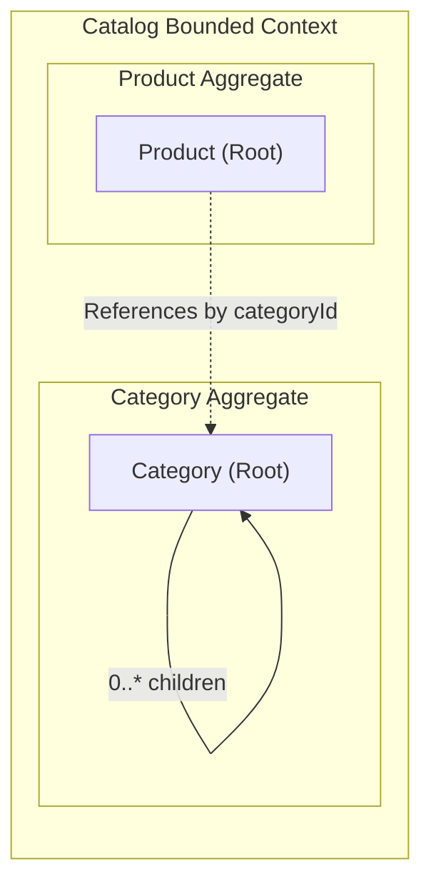
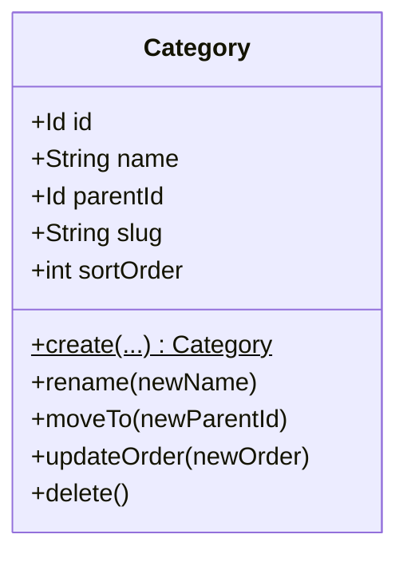
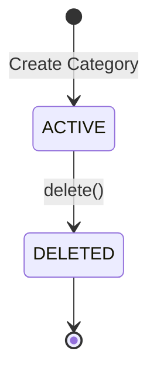

# Domain Specification: Catalog Category

> **Bounded Context:** Catalog  
> **Primary Purpose:** Manages the hierarchical organization and tree structure of product categories.  
> **Module Root:** `catalog-domain` / `catalog-infrastructure` / `store/catalog`  

---

## 1. Boundary & Context Map

### Ownership

- **This aggregate OWNS:** Category nodes, hierarchical tree rules (parent-child relationships), ordering, and subtree invariants.
- **This aggregate DOES NOT OWN:** Products. Products are completely separate aggregates that refer to Categories.

### Context Map

---

## 2. Ubiquitous Language

| Business Term | Domain Concept | Business Definition |
| :--- | :--- | :--- |
| **Category** | `Category` (Aggregate Root) | A node in the product classification tree used for browsing and filtering. |
| **Parent Category** | `parentId` | The immediate ancestor of a category. Root categories have no parent. |
| **Child Category** | `children` | The immediate descendants of a category. |

---

## 3. Domain Aggregate Model

### Model Diagram

### Property & Attribute Rationale

| Property | Type | Belongs To | Business Rationale |
| :--- | :--- | :--- | :--- |
| `id` | `Id` | Root | Unique aggregate identity across the platform. |
| `name` | `String` | Root | Display name for the category in the storefront and admin tools. |
| `parentId` | `Id` | Root | Establishes the hierarchical tree structure (null if root). |
| `slug` | `String` | Root | SEO-friendly URL identifier for category browsing. |
| `sortOrder` | `int` | Root | Allows merchants to manually control the display sequence of sibling categories. |

---

## 4. Business Invariants & Rules

| Rule ID | Invariant Rule | Violation Outcome | Enforced By |
| :--- | :--- | :--- | :--- |
| **INV-01** | A category cannot be its own parent (no self-referencing loops). | Hierarchy update rejected. | `Category.moveTo()` / Tree Policy |
| **INV-02** | A category cannot be moved under one of its own descendants (no cyclic trees). | Hierarchy update rejected. | `Category.moveTo()` / Tree Policy |
| **INV-03** | Category slug must be unique across the catalog. | Creation/rename rejected. | `UniqueCategorySlugSpec` |

---

## 5. State Lifecycle & Transitions

### State Machine

### Transition Matrix

| Current State | Trigger / Event | Next State | Guard Condition / Prerequisite |
| :--- | :--- | :--- | :--- |
| `Non-existent` | `create()` | `ACTIVE` | Slug must be unique; parent must exist (if provided). |
| `ACTIVE` | `delete()` | `DELETED` | Category must not have active child categories. |

---

## 6. Domain Events

### Emitted Events (What Happened)

| Event Name | Trigger | Key Attributes | Target Consumers |
| :--- | :--- | :--- | :--- |
| `CategoryCreatedEvent` | Initial creation | `categoryId`, `parentId` | Search Indexers |
| `CategoryMovedEvent` | Parent changed | `categoryId`, `oldParentId`, `newParentId` | Hierarchy Projections, Search Indexers |
| `CategoryDeletedEvent` | Category deleted | `categoryId` | Cleanup jobs |
